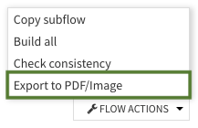

Exporting the Flow to PDF or images
###################################

.. contents::
	:local:

The Flow can be exported to PDF or image (PNG, JPG) files in order to share a snapshot of Flow details within your organization more easily.

Setup
======

The graphics export feature must be setup before the Flow graph can be exported.

Follow :doc:`/installation/custom/graphics-export` to enable the export feature on your DSS instance.

Manual usage
=============

In project Flow view, open Flow Actions menu and select Export to PDF/Image.

Settings
===========

Files generated are fully customizable. The following parameters are available:

- File type, to select the type of files to generate (PDF, PNG or JPEG).
- Export format, to determine image dimensions.

	- If a standard format (A4 or US Letter) is chosen, image dimensions will be calculated based on the size of your Flow and the chosen orientation (Landscape or Portrait). On the contrary, Custom format allows you to configure a custom width and height.
