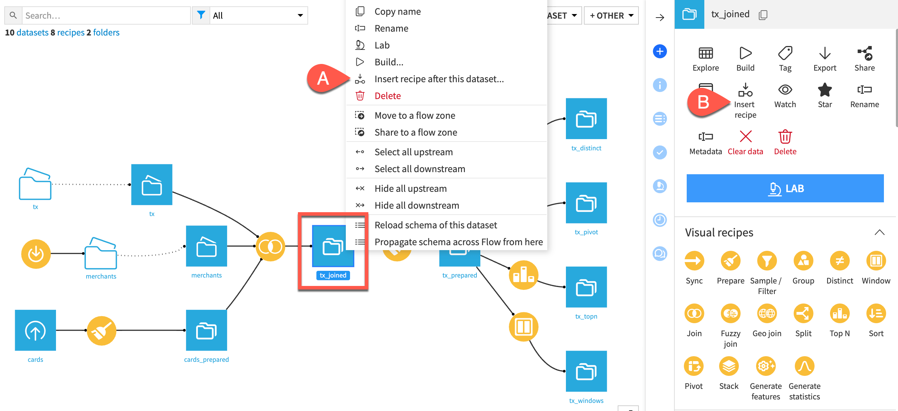
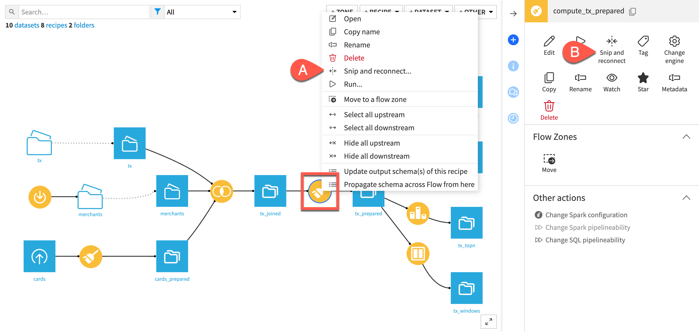

Inserting and deleting recipes
################################

It is often useful to insert recipes in the middle of the Flow, or to delete parts of the Flow while keeping the connections

Inserting a recipe
===================

There are two ways to insert a recipe between items in a branch of your Flow:

* Right-click on the dataset that will be the input of the new recipe and select Insert recipe after this dataset.
* Select the dataset that will be the input of the new recipe and click More Actions > Insert recipe in the right panel.

You can then:

* Select the type of recipe you want to insert.
* Choose which recipes will receive the new output dataset as its input.
* Click Next and then proceed to create the recipe

Removing a recipe
=================

If you want to remove a recipe from the middle of your Flow, you can delete the recipe and reconnect its input dataset(s) to subsequent recipes.

There are two ways to do so:

* Right-click on the recipe and select "Delete and reconnect".
* Select the recipe and click "Delete and reconnect" in the right panel.

Delete and reconnect is available with the following conditions:

* The recipe to delete must not be at the end of the Flow
* The recipe to delete must have only one input dataset
* All outputs of the recipe must be datasets
* Both input and outputs of the recipe must be of the same type
* The input and output datasets cannot be partitioned with different partitioning dimensions
