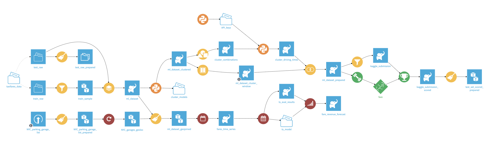
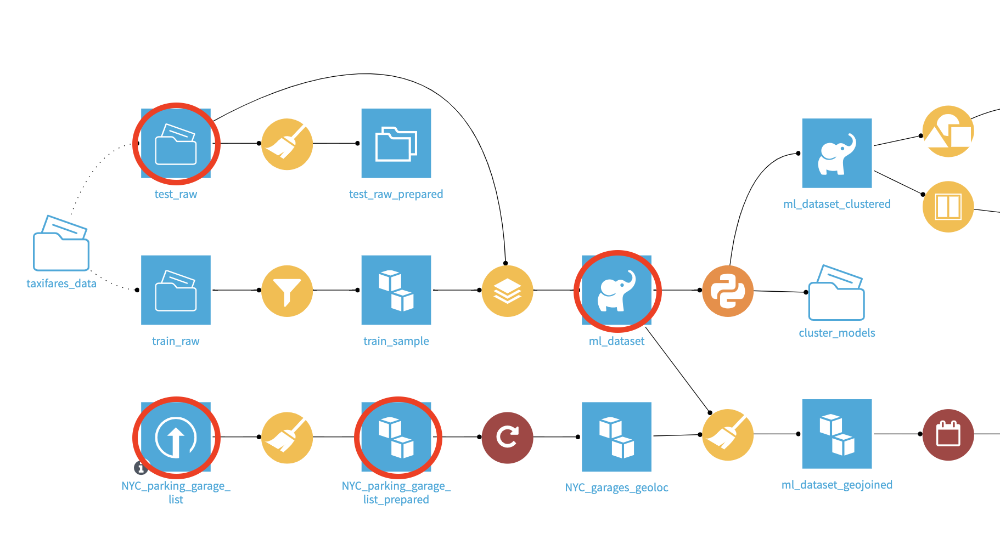
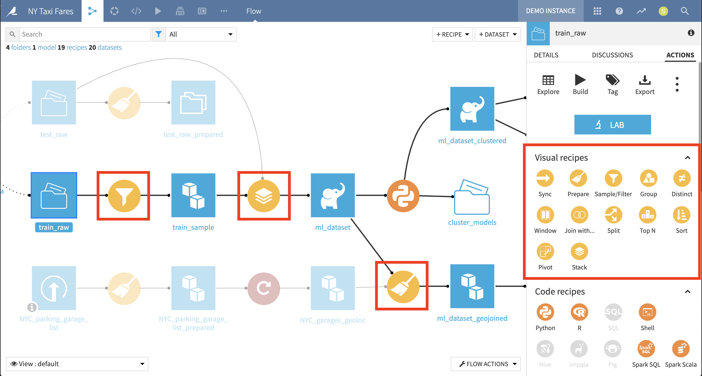
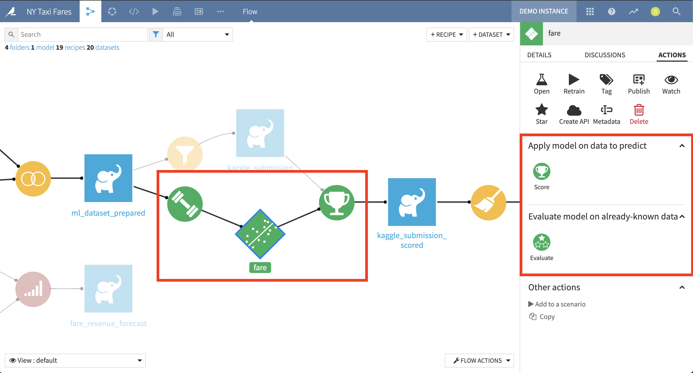
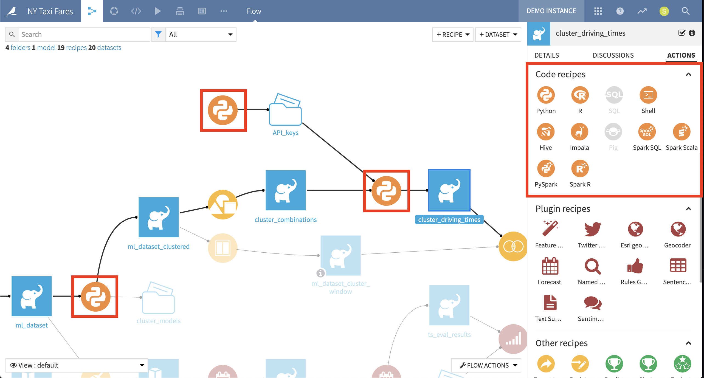
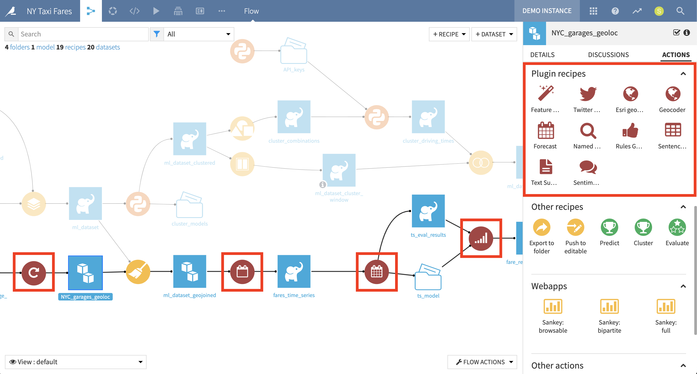

Visual Grammar
#################

.. contents::
	:local:

Here's an example of a complete project Flow in DSS:

Datasets
================

**Datasets** in DSS appear as **blue squares**. The icon in the center of each square represents the type of dataset. For example, an upward pointing arrow indicates that the dataset was uploaded; two cubes represent Amazon S3; and an elephant represents HDFS.

See :doc:`/connecting/index` for more information on the types of data that you can connect to in DSS.

The visual grammar for datasets can also acknowledge datasets that have been shared:

- Any dataset shared to another DSS project is marked with a curved arrow in the top right corner of the dataset square.
- Any dataset originating from another DSS project is marked with a black rather than a blue square.

See :doc:`/security/shared-objects` for more information on exposing objects between projects.

Visual Recipes
================

**Visual recipes** in DSS appear as **yellow circles**. The icon inside of the visual recipe indicates the type of recipe. For example, the broom icon represents a Prepare recipe; a funnel represents a Filter recipe; and a pile of squares represents a Stack recipe.

See :doc:`/preparation/index` for an explanation of visual recipes and the transformations that they can accomplish.

Machine Learning
=================

Processes related to **machine learning** are shown in **green**. Here, a barbell represents a model training event; a scatter plot represents model scoring; and the trophy shows an application of the model to a new dataset.

See :doc:`/machine-learning/index` for more information about the machine learning capabilities of DSS.

Code Recipes
===================

DSS allows users to execute pieces of user-defined code inside the Flow. These user-defined scripts (in languages such as Python, R, SQL, Hive, ...) are called code recipes.

**Code recipes** are represented by **orange circles**. The icon inside the circle indicates the programming language of the recipe. For example, the "two snakes" logo represents a Python recipe, and the honeycomb icon represents a Hive recipe.

See :doc:`/code_recipes/index` for more information on capturing user-defined code in R, Python, SQL, Hive  recipes.

Plugin Recipes
===================

The visual capabilities of DSS can be extended through the Plugins system. Code recipes can be made into reusable components with a visual interface by creating plugin recipes. **Plugin recipes** are represented by **red circles**.

See :doc:`/plugins/index` for more information on extending the features of DSS with plugins.