Agent Connect
##############

.. contents::
   :local:
   :depth: 2

Overview
--------
Agent Connect serves as the central hub for managing interactions with instances of Dataiku Answers and Agents within a Dataiku instance. This allows users to interact with multiple Dataiku resources in a single interface.

**Key Features**

-  | **Simple and Scalable**

Getting Access
--------------
Agent Connect Plugin is available on demand through the dataiku plugin store. Once installed it gives you access to a fully built Visual Webapp which can be used within your choice of Dataiku Projects.

|NewAgentConnectWebapp|

Configuration
-------------

Introduction
~~~~~~~~~~~~

This guide details the setup of the Agent Connect,

Requirements
~~~~~~~~~~~~

Dataiku DSS version
^^^^^^^^^^^^^^^^^^^

-  Dataiku 13.4.0 and above. The Last Dataiku version is always the best choice to leverage the latest plugin capabilities fully.
-  Available for Self-Managed
- **Cloud support**: Available starting from version 1.4.0 by enabling the following settings:
  
  - ``Do not check end-user permissions``
  - ``Disable SSL verification``

  See the settings documentation for more details.

**Agent Connect and DSS compatibility matrix**

.. The emoji checkmarks (✅ and ❌) count as wide Unicode characters and reST is not parsing them the same way as regular characters
  to ensure columns alignment, start from a top column separator '+' and press `arrow down`:
  the values separator should all the time be positioned on the same side of the cursor until you reach the end of the column.

+--------------------------+--------------+--------------+
|                          | DSS ≥ 14.0   | DSS ≥ 13.4.0 |
+==========================+==============+==============+
| Agent connect >= 1.6.1   | ✅           | ❌           |
+--------------------------+--------------+--------------+
| Agent connect >= 1.0.0   | ❌           | ✅           |
+--------------------------+--------------+--------------+

Infrastructure
^^^^^^^^^^^^^^^

**Web Application Backend Settings:**
  - The number of Processes must always be set to 0
  - Container: None - Use backend to execute

**SQL Datasets:**
All datasets used by Agent Connect must be SQL datasets for compatibility with the plugin’s storage mechanisms.

  - **PostgreSQL**
  - **Snowflake**
  - **MS SQL Server**
  - **BigQuery**
  - **Databricks**
  - **Oracle** (>= 12.2.0)

.. warning::

   **About Oracle**: The chat history data to log requires the  use of the Oracle ``TO_CLOB`` function. Oracle  >= 12.2 allows for 32k bytes per call of ``TO_CLOB`` but older versions only supports up to 4k which might be too low. It is then recommended ensure your Oracle version is 12.2.0 or later.

Mandatory Settings
~~~~~~~~~~~~~~~~~~

|MandatoryConfig|

Conversation History Dataset
^^^^^^^^^^^^^^^^^^^^^^^^^^^^
   
Create a new or select an existing SQL dataset for logging queries, responses, and associated metadata (LLM used, Knowledge Bank, feedback, filters, etc.).

User Profile Dataset
^^^^^^^^^^^^^^^^^^^^

This allows you to configure a list of settings, excluding language, that users can fill out within the web app. You must set up an SQL user profile dataset (mandatory even if no settings are configured).

.. note::
   All the users profiles are initialized with default settings. The user profiles are only saved after users edit and save them directly (*e.g: Editing the language*) or indirectly (*e.g: requesting for an image generation*).
   It is then possible that your user profile dataset is empty despite the fact several people are using your application.

LLM
^^^

Connect each instance of Agent Connect to your choice of LLM, powered by Dataiku’s LLM Mesh. Select from the LLMs configured in Dataiku DSS Connections.

Answers and Agents Configuration
^^^^^^^^^^^^^^^^^^^^^^^^^^^^^^^^

|AgentsConfig| 

Agent Connect can interract with the following LLM-Mesh components: 
- **Dataiku Answers** web applications.
- **LLM Mesh Agents**.
- **LLM Mesh Augmented-LLMs** ( >= 1.7.0).

For this, you must:

1. Select the projects that host your 'Agents' and/or 'Answers' and/or 'Augmented-LLMs' .
2. Choose the specific 'Agents' / 'Answers' / 'Augmented-LLMs' you want to make available in Agent Connect.

Additional settings for the connected components can be found in the **Agents Advanced Configuration** section, available as of version **1.2.1**.

.. note::
   Important:
   Agent Connect needs descriptions to understand when it needs to use your connected LLM-Mesh components: 
      
      - For each 'Dataiku Answers web application', the description must be provided directly inside the webapps, in the 'Answers API Configuration' section.
      - For each 'Agent' and 'Augmented-LLM', you must provide the detailed description within the Agent Connect UI.

Other settings
~~~~~~~~~~~~~~

Conversations Store Configuration
~~~~~~~~~~~~~~~~~~~~~~~~~~~~~~~~~

Agent Connect allows you to store all conversations for oversight and usage analysis. Flexible options allow you to define storage approach and mechanism.

Index the chat history dataset
^^^^^^^^^^^^^^^^^^^^^^^^^^^^^^

Addition of an index to the conversation history dataset to optimize the performance of the plugin. 

.. note::
   Indexing is only beneficial for specific database types. It is recommended to consult the database documentation for more information and only change if you are certain it will improve performance.

Conversation Deletion
^^^^^^^^^^^^^^^^^^^^^
   
Toggle ‘Permanent Delete’ to permanently delete conversations or keep them marked as deleted, maintaining a recoverable archive.

Feedback Choices
^^^^^^^^^^^^^^^^
   
Configure positive and negative feedback options, enabling end-users to interact and rate their experience.

Document Folder
^^^^^^^^^^^^^^^^
   
Choose a folder to store user-uploaded documents and LLM generated images.

Allow User Feedback (>= 1.1.0)
^^^^^^^^^^^^^^^^^^^^^^^^^^^^^^^^^

As you roll out chat applications in your organization, you can include a feedback option to improve understanding of feedback, enablement needs, and enhancements.

General Feedback Dataset (>= 1.1.0)
""""""""""""""""""""""""""""""""""""""
    
In addition to conversation-specific feedback, configure a dataset to capture general feedback from users. This dataset can provide valuable insights into the overall user experience with the plugin.

LLM Configuration
~~~~~~~~~~~~~~~~~

Configure your 'Main' LLM
^^^^^^^^^^^^^^^^^^^^^^^^^

Tailor the prompt that will guide the behavior of the underlying LLM. For example the prompt could instruct the LLM to structure the responses in a clear and chronological order, with bullet points for clarity where possible. 

Show advanced 'Main LLM' settings
^^^^^^^^^^^^^^^^^^^^^^^^^^^^^^^^^

Enable this option to see advanced settings for the main model, which include:

Configure your Conversation system prompt
"""""""""""""""""""""""""""""""""""""""""

For more advanced configuration of the LLM System prompt, you can provide a custom system prompt or override the prompt in charge of guiding the LLM. You need to enable the advanced settings 

Force Streaming Mode (>= 1.6.1)
"""""""""""""""""""""""""""""""

When enabled the selected model is treated as being capable of streaming. This is particularly beneficial when working with custom models whose capabilities Dataiku Answers cannot automatically detect.\

.. note::
   Enabling this setting on a model that does not support streaming will result in errors.

Force Multi Modal Mode (>= 1.6.1)
"""""""""""""""""""""""""""""""""

When enabled the selected model is treated as being able to accept multi-modal queries. This is particularly beneficial when working with custom models whose capabilities Dataiku Answers cannot automatically detect.\

.. note::
   Enabling this setting on a model that does not support multi-modal queries will result in errors.

Maximum Number of LLM Output Tokens
"""""""""""""""""""""""""""""""""""
Set the maximum number of output tokens that the LLM can generate for each query. To set this value correctly, you should consult the documentation of you LLM provider.

.. caution::
   - Setting this value too low can mean answers are not completed correctly.
   - For paid LLM services, higher token usage increases running costs.

LLM Temperature (>= 1.2.0)
"""""""""""""""""""""""""""""
Set the temperature of the LLM to control the randomness and creativity of the responses when multiple agents or no agents are called. A lower value makes answers more straightforward, while a higher value encourages more creativity. (recommended) For best accuracy, use a value as close to 0 as possible.

.. caution::
   - Setting the temperature of the decisions LLM to anything other than 0.0 is not recommended as it can lead to inconsistent decision results.
   - Set a negative value (e.g. -1)  to use your LLM-mesh default temperature.
   - Set a positive value only if your LLM-mesh doesn’t support 0.0.
   - Setting temperature is not supported by all models and temperature ranges can vary between models.

LLM For Title Generation (>= 1.2.0)
^^^^^^^^^^^^^^^^^^^^^^^^^^^^^^^^^^^^^^
Set alternative LLM to generate the title for each conversation. Leaving it as None will default to using the main LLM. As this task is less demanding, you can use a smaller model to generate the titles.

LLM For Decisions Generation (>= 1.2.0)
^^^^^^^^^^^^^^^^^^^^^^^^^^^^^^^^^^^^^^^^^^
Set alternative LLM to use to generate decision objects. As this task is more suited to models that are good at generating structured data, you can choose a model specialized for the task. Leaving as None will default to use the main LLM.

.. note::
   It is recommended to use a higher performance model for decisions generation.

When you set an alternative LLM, you’ll be able to access advanced settings to configure the LLM temperature and the maximum number of output tokens, similar to what can be done for the ‘Main’ LLM.

Enable Image Generation for Users
^^^^^^^^^^^^^^^^^^^^^^^^^^^^^^^^^^
This checkbox allows you to activate the image generation feature for users. Once enabled, additional settings will become available. \

.. note::
   Important Requirements:\
      - An upload folder is necessary for this feature to function, as generated images will be stored there.

**Users can adjust the following settings through the UI**
   - Image Height
   - Image Width
   - Image Quality
   - Number of Images to Generate

The user settings will be passed to the image generation model. If the selected model does not support certain settings, the image generation will fail. Any error messages generated by the model will be forwarded to the user in English, as we do not translate the model's responses.

Image Generation Model
""""""""""""""""""""""
The model to use for image generation. This is mandatory when the image generation feature is enabled.\

.. note::
   Image generation is available with image generation models supported in Dataiku LLM Mesh; this includes:\
      1. OpenAI (DALL-E 3)
      2. Azure OpenAI (DALL-E 3)
      3. Google Vertex (Imagen 1 and Imagen 2)
      4. Stability AI (Stable Image Core, Stable Diffusion 3.0, Stable Diffusion 3.0 Turbo)
      5. Bedrock Titan Image Generator
      6. Bedrock Stable Diffusion XL 1

Configure the Query Builder Prompt for Image Generation
"""""""""""""""""""""""""""""""""""""""""""""""""""""""

Image generation begins by the main chat model creating an image generation query based on the user's input and history. You can include a prompt for guidelines and instructions on building this query. Only modify this if you fully understand the process.

Weekly Image Generation Limit Per User
""""""""""""""""""""""""""""""""""""""
Set the number of images that each user can generate per week.

Document Upload
^^^^^^^^^^^^^^^

You can upload multiple files of different types, enabling you to ask questions about each using the Agent Connect interface.
Uploading a file with no question will create a summary of each document uploaded with some example questions. Alternatively, if you ask a question when uploading the LLM will use the document to answer the question.\

Agent Connect can process the following types of documents: 

- Images: ``.png``, ``.jpeg``, ``.webp``, ``.gif``.
- Other files: ``.pdf``, ``.docx``, ``.json``, ``.py``, ``.html``, ``.js``, ``.md`` and ``.pptx`` ( >= 1.6.0 for ``.pptx``).

The two main methods that LLMs can use to understand the documents are:

   1. **Viewing** as an image (multi-modal).
   2. **Reading** the extracted text (no images).

Method 1 is only available for multi-modal LLMs such as OpenAI Vision or Gemini Pro. It can be used for image files or PDFs. Method 2 is supported on all LLMs and files containing plain text. Consideration needs to be taken with both methods to avoid exceeding the context window of the LLM you are using. The following parameters will help you manage this.

.. note::
   Important Requirements:\
      - Dataiku >= 13.0.2 required for method 1 support of anthropic models.
      - Dataiku >= 12.5.0 required for method 1 support of all other supported models.
      - PPTX handling require Agent Connect >= 1.6.0 .

|DocUploadConfig|

**Maximum upload file size in MB**

Allows you to set the file size limit for each uploaded file. The default value is 15 MB; however, some service providers may have lower limits.

**Maximum number of files that can be uploaded at once**

This parameter controls the number of documents that the LLM can interact with simultaneously using both methods.

**Send PDF pages as images instead of extracting text**

This parameter allows the LLM to view each page using Method 1. It is most useful when the pages contain visual information such as charts, images, tables, diagrams, etc. This will increase the quality of the answers that the LLM can provide but may lead to higher latency and cost.

**Maximum number of PDF pages or PPTX slides to send as images**

This parameter sets the threshold number of pages to be sent as images. The default value is 5. For example, if 5 concurrent files are allowed and each has a maximum of 5 pages sent as images, then 25 images are sent to the LLM (5 files x 5 pages each = 25 images). If any document exceeds this threshold, the default behavior is to use text extraction alone for that document. Understandably, this increases the cost of each query but can be necessary when asking questions about visual information.

**Scale to resize PDF screenshots (>= 1.6.0)** 

The default PDF images size is (540, 720). This parameter controls the scale of the images to pass to the LLM that will be (540 x scale, 720 x scale)
A lower scale leads to a faster LLM response, but with less visual details are provided to the LLM. 
A higher scale provides more visual details to the LLM but increases the response time.

**Scale to resize PPTX screenshots(>= 1.6.0)**
The default PPTX images size is (720, 405). This parameter controls the scale of the images to pass to the LLM that will be (720 x scale, 405 x scale)
A lower scale leads to a faster LLM response, but with less visual details are provided to the LLM. 
A higher scale provides more visual details to the LLM but increases the response time.

Agents advanced configuration (>= 1.2.1)
~~~~~~~~~~~~~~~~~~~~~~~~~~~~~~~~~~~~~~~~~~~

**Forward user query to the configured agent (>= 1.4.0)**
Streamline processing by skipping the decision chain when only one 'Agent' / 'Answer' / 'Augmented-LLM' is configured in Agent Connect. In this case, all user queries and history will be sent directly to the configured agent.

.. note::

   If multiple agents are configured, this setting will be ignored.  
   Agent descriptions must still be provided in the *Answers & Agents configuration* section.

**Do not check end user permissions (>= 1.4.0)**
When enabled, Agent Connect will evaluate access based on the permissions of the user running the backend, rather than filtering agents by the end user's Dataiku permissions.

.. note::

   This removes the requirement to run the backend as an ``Admin``.  
   If enabled, it is your responsibility to ensure that end users are authorized and have access to the agents configured in the web application.  
   This setting also resolves issues when running the application on the Cloud due a difference in the Admin permissions on the Cloud.

**Customize each agent (>= 1.4.0)**
Gain more control over agent behavior. Enable this setting to add custom instructions per agent and disable file upload for agents that do not support document processing.

To get started:

- Click on ``ADD AN OBJECT``
- Select the agent you want to customize
- Fill in the instructions and/or disable file upload

**Display Agents Answers** 
You can control whether each agent’s response is visible in the Sources section for end users. By enabling this, users can see the responses from agents when multiple agents have been called in Agent Connect. This helps to better understand the information Agent Connect used to produce the final response. It is disabled by default

**Display Source Chunks**
You can show or hide text chunks or extracts from the sources used by agents in the Sources section. This provides users with more insights into the source material referenced by agents. It is Enabled by default.

**Display SQL Queries Generated by Agents** 
This setting gives the admin the ability to show or hide SQL queries generated by agents in the Sources section when they are generating queries. Enabling this can be useful for users who need to see the SQL queries for debugging or analysis purposes. It is disabled by default.

|AdvancedAgentsConfig|

End User Interface Configuration
~~~~~~~~~~~~~~~~~~~~~~~~~~~~~~~~

Adjust the web application to your business objectives and accelerate user value.

Titles and Headings
^^^^^^^^^^^^^^^^^^^

Set the title and subheading for clarity and context in the web application.

Displayed Placeholder Text in the 'Question Input' Field
^^^^^^^^^^^^^^^^^^^^^^^^^^^^^^^^^^^^^^^^^^^^^^^^^^^^^^^^

Enter a question prompt in the input field to guide users.

Example Questions
^^^^^^^^^^^^^^^^^

Provide example questions to illustrate the type of inquiries the chatbot can handle. You can add as many questions as you want

Disclaimer Displayed to the End User in the Footer of the Web Application
^^^^^^^^^^^^^^^^^^^^^^^^^^^^^^^^^^^^^^^^^^^^^^^^^^^^^^^^^^^^^^^^^^^^^^^^^

This option allows you to present a detailed rich text disclaimer to the end user, which will be prominently displayed in the footer of the web application. The disclaimer can include hyperlinks, such as those directing users to the company’s internal policy on responsible AI use.

Enable Custom Rebranding
^^^^^^^^^^^^^^^^^^^^^^^^

If checked, the web application will apply your custom styling based on the theme name and different image files you specify in your setup. For more details, check the   `UI Rebranding capability <#ui-rebranding-capability>`__ section.

 -  **Theme name**:
    The theme name you want to apply. Css, images and fonts will be fetched from the folder ``agent-connect/YOUR_THEME``

 -  **Logo file name**:
    The file name of your logo that you added to ``agent-connect/YOUR_THEME/images/image_name.extension_name`` and you want to choose as the logo in the web application.

 -  **Icon file name**:
    Same as for the logo file name.

User Profile Settings
~~~~~~~~~~~~~~~~~~~~~

|UserProfileConfig|

User profile Languages
^^^^^^^^^^^^^^^^^^^^^^

- The language setting will be available by default for all users, initially set to the web application’s chosen language.
- The language selected by the user will determine the language in which the LLM responses are provided.
- You can define the settings using a list, where each setting consists of a key (the name of the setting) and a description (a brief explanation of the setting).

Default User Language (>= 1.1.0)
^^^^^^^^^^^^^^^^^^^^^^^^^^^^^^^^^^^
Set the default language for all users to use for LLM interaction. The default language will be used for all users who have not set their language preference. By default, the language is set to English.

User Profile Settings
^^^^^^^^^^^^^^^^^^^^^

- Once the user has configured their settings, these will be included in the LLM prompt to provide more personalized responses.
- All settings will be in the form of strings for the time being.

Add Profile Information to LLM Context
^^^^^^^^^^^^^^^^^^^^^^^^^^^^^^^^^^^^^^

User profile information can now be included in the query that the LLM receives. This can mean that the LLM can provide more personalized responses based on the user's settings.

.. note::
   All the users profiles are initialized with default settings. The user profiles are only saved after users edit and save them directly (*e.g: Editing the language*) or indirectly (*e.g: requesting for an image generation*).
   It is then possible that your user profile dataset is empty despite the fact several people are using your application.

WebApplication Configuration
~~~~~~~~~~~~~~~~~~~~~~~~~~~~

Language
^^^^^^^^

You can choose the default language for the web application from the available options (English, French, Spanish, German, Japanese and Korean).

HTTP Headers
^^^^^^^^^^^^

Define HTTP headers for the application’s HTTP responses to ensure compatibility and security.

Disable SSL verification (>= 1.4.0)
^^^^^^^^^^^^^^^^^^^^^^^^^^^^^^^^^^^

Allows you to disable SSL verification when calling agents of type *Answers web application*.  
This setting addresses specific connectivity issues encountered in Cloud environments.
 
UI Rebranding capability
~~~~~~~~~~~~~~~~~~~~~~~~

You can rebrand the web application by applying a custom style without changing the code by following these steps:

-  Navigate to **᎒᎒᎒ > Global Shared Code > Static Web Resources**, create a folder named ``agent-connect``, and within this folder, create a subfolder corresponding to the theme that the web application settings will reference: This subfolder will be named ``YOUR_THEME_NAME`` as an example. The structure should be as follows:

.. code-block:: asc

    agent-connect
       └── YOUR_THEME_NAME
           ├── custom.css
           ├── fonts
           │   └── fonts.css
           └── images
               ├── answer-icon.png
               └── logo.png

CSS Changes
^^^^^^^^^^^

   Add a ``custom.css`` file inside the ``YOUR_THEME_NAME`` folder; you can find an example below:

   .. code-block:: css

      :root {
         /* Colors */
         --brand: #e8c280; /* Primary color for elements other than action buttons */
         --bg-examples-brand: rgba(255, 173, 9, 0.1); /* Examples background color (visible on landing page/new chat) */
         --bg-examples-brand-hover: rgba(255, 173, 9, 0.4); /* Examples background color on hover */
         --bg-examples-borders: #e8a323; /* Examples border color */
         --examples-question-marks: rgb(179, 124, 15); /* Color of question marks in the examples */
         --examples-text: #422a09; /* Color of the text in the examples */
         --text-brand: #57380c; /* Text color for the question card */
         --bg-query: rgba(245, 245, 245, 0.7); /* Background color for the question card */
         --bg-query-avatar: #F28C37; /* Background color for the question card avatar */
      }

      .logo-container .logo-img {
         height: 70%;
         width: 70%;
      }      

Fonts Customization
^^^^^^^^^^^^^^^^^^^

   -  First, create the ``fonts`` subfolder inside the folder ``YOUR_THEME_NAME``.

   -  Second, add ``fonts.css`` and define your font like below depending on the format you can provide *(we support base64 or external URL)*:

      .. code-block:: css

         @font-face {
            font-family: "YourFontName";
            src: url(data:application/octet-stream;base64,your_font_base64);
         }

         @font-face {
            font-family: "YourFontName";
            src: url("yourFontPublicUrl") format("yourFontFormat");
         }

   -  Finally, declare the font in your ``custom.css`` file:

      .. code-block:: css

         body,
         div {
            font-family: "YourFontName" !important;
         }

Images customization
^^^^^^^^^^^^^^^^^^^^

Create an ``images`` folder where you can import ``logo.*`` file to change the logo image inside the landing page, and ``answer-icon.*`` to change the icon of the AI answer.

Examples of Current Customizations
^^^^^^^^^^^^^^^^^^^^^^^^^^^^^^^^^^

|CustomizationExample1|

|CustomizationExample2|

Final Steps
~~~~~~~~~~~~~~~~~~~~~~~~

After configuring the settings, thoroughly review them to ensure they match your operational requirements. Conduct tests to verify that the chat solution operates as intended, documenting any issues or FAQs that arise during this phase.

**Mobile Compatibility** 

The web application is designed to be responsive and fully compatible with mobile devices. To target mobile users effectively, configure the application as a Dataiku public web application and distribute the link to the intended users.

Security and permissions
------------------------

About DSS permissions
~~~~~~~~~~~~~~~~~~~~~

DSS :doc:`project permissions</security/permissions>` are handled as follows:

* DSS uses a groups-based model to allow users to perform actions through it.

* The basic principle is that users are added to groups, and groups have permissions on each project.

On top of that, it is possible to:

* Define per-user permissions on projects.

* Share webapps into :doc:`workspaces</workspaces/index>` that have their own set of user/group permissions.

Agent Connect permissions
~~~~~~~~~~~~~~~~~~~~~~~~~

Agent Connect leverages the Dataiku DSS permissions foundations:

* Both :doc:`Answers instances</generative-ai/chat-ui/answers>`, :doc:`Agents</agents/index>`, and Augmented LLMs are components of the projects where they are created.

* When interacting with Agent Connect, users can only access the project or :doc:`workspaces</workspaces/index>` resources they have permissions on.

.. warning:: 
   While it is not mandatory to be an instance administrator to create and configure an Agent Connect application, **checking the users’ permissions before processing their requests requires running the webapp backends as an instance administrator user**.
   A new setting introduced in version 1.4.0 allows you to remove this constraint.  
   See the **Do not check end-user permissions** setting description for more details.
   
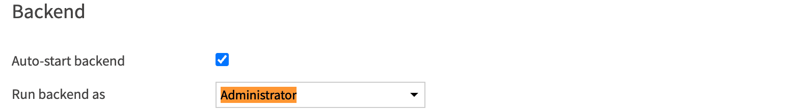

Document-level security in Agent Connect (>= 1.3.0)
~~~~~~~~~~~~~~~~~~~~~~~~~~~~~~~~~~~~~~~~~~~~~~~~~~~

Before Agent Connect
^^^^^^^^^^^^^^^^^^^^

To control access to content indexed into Knowledge Banks, Agent Connect can leverage the :doc:`Knowledge Bank search document-level security</agents/tools/knowledge-bank-search>` defined in Knowledge Bank Search tools and Augmented LLMs. To enable this feature, follow these steps:

* In the Advanced section of the Knowledge Bank embedding recipe, specify a ``security tokens column`` (This column must contain the list of security groups allowed to access each document).
* Document level security is implemented for both 'Agents' and 'Augmented LLMs'.
   * To use it with an Agent: In an Agent's  **Knowledge Bank Search tool settings **, enable the ``Enforce document-level security`` parameter.
   * To use it with an Augmented LLM: In the **Augmented-LLM settings**, enable the ``Enforce document-level security`` parameter.

.. warning::
   Document-level security is not currently supported for Dataiku Answers instances through Agent Connect.

Agent Connect Document-level security process
^^^^^^^^^^^^^^^^^^^^^^^^^^^^^^^^^^^^^^^^^^^^^

The following images highlight how Agent Connect handles the document-level security. 

On the left a user that belongs to the groups ``["group_A", "group_B"]`` sends a query. 
On the right, some documents ``Doc 1``, ``Doc 2``, ``Doc 3`` were embedded in a Knowledge Bank using security tokens:

- The security tokens for ``Doc 1`` are ``[“group_A”]``.

- The security tokens for ``Doc 2`` are ``[“group_B”]``.

- The security tokens for ``Doc 3`` are ``[“group_C”]``.

The Knowledge Bank is used by either  an Agent or an Augmented-LLM that is plugged to Agent Connect.

When the user sends a request, it is handled by Agent Connect first.

Agent Connect crafts some security tokens access information according to the user characteristics: in this example, the user groups *(More details on this process will be shared in the next section)*

The Agent or Augmented-LLM then leverages the security tokens access information to filter the content that the user is not allowed to access.

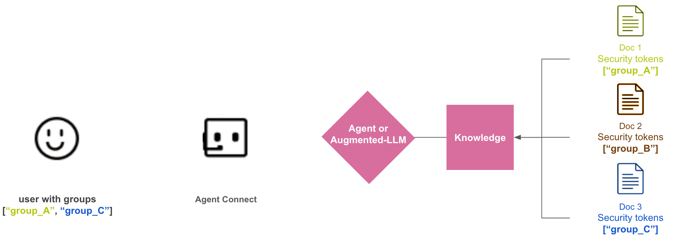
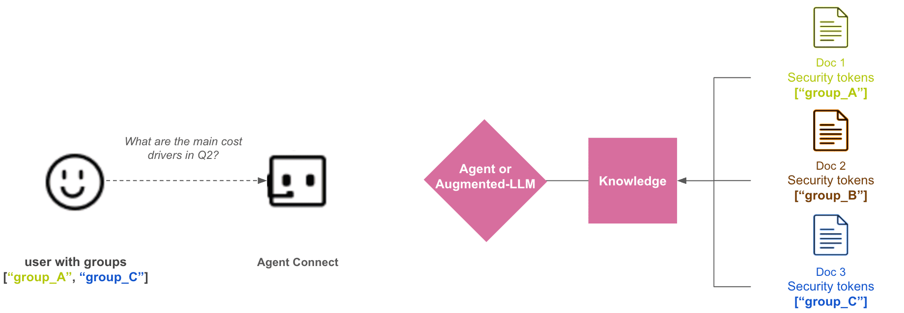
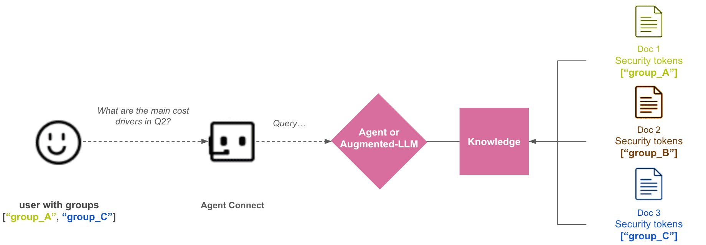
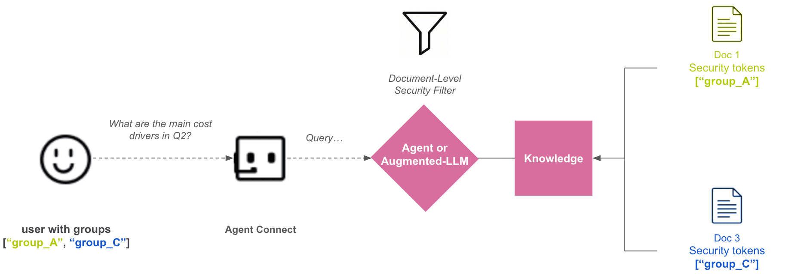

Agent Connect security tokens access information
^^^^^^^^^^^^^^^^^^^^^^^^^^^^^^^^^^^^^^^^^^^^^^^^

In the Document-level security process, Agent Connect will simply pass security tokens access information to the Agent/Augmented-LLM completions. 
The following code sample highlights what happens on Agent Connect Backend *(Document-level security was first implemented in 1.3.0 and the information passed to the completion context changed over time)*:

   .. code-block:: python

      # Agent Connect >= 1.7.0:
      completion.with_context(
                {
                    "callerSecurityTokens": user_groups + [f"dss_group:{group}" for group in user_groups] + user_info, # user_info = [f"dss_user_login:{user}"]
                    "dku_user_email": email,
                    "dku_user_login": user,
                    "dku_user_display_name": display_name,
                    "dku_conversation_id": conversation_id
                }
            )
      
      # Agent Connect in [1.5.0; 1.7.0[:
      completion.with_context(
                {
                    "callerSecurityTokens": user_groups + [f"dss_group:{group}" for group in user_groups] + user_info, # user_info = [f"dss_user_login:{user}", "dss_user_emailaddress:{email}"]
                }
            )
      
      # Agent Connect in [1.3.0; 1.5.0[:
      completion.with_context(
                {
                    "callerSecurityTokens": user_groups
                }
            )

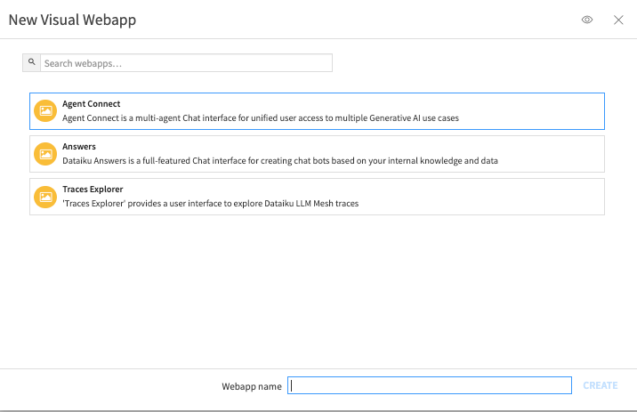
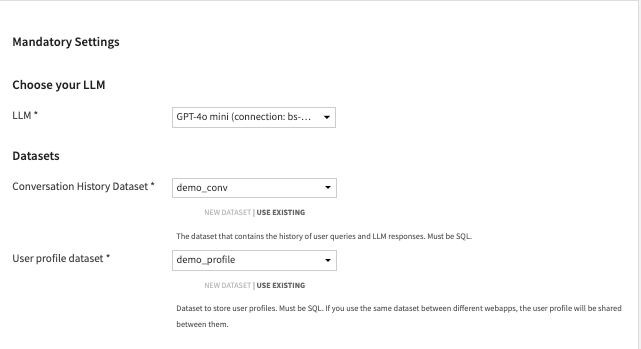
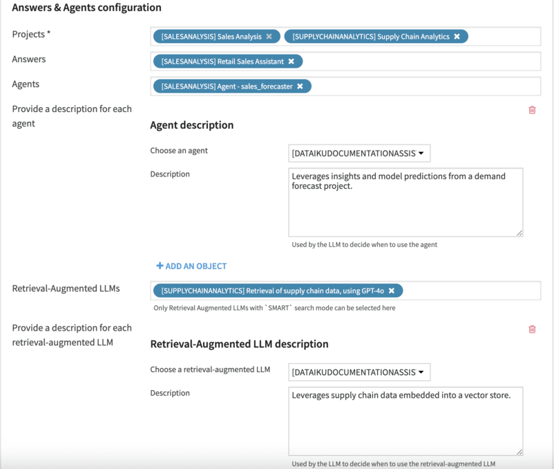
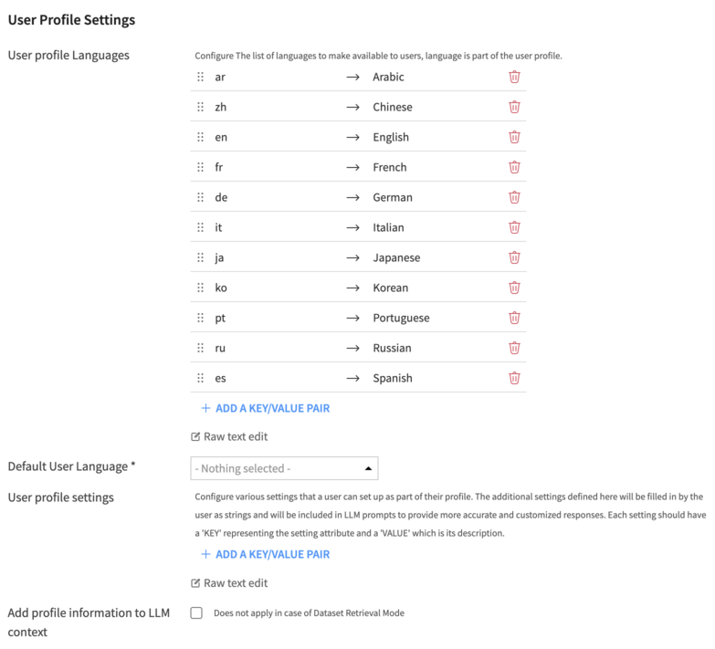
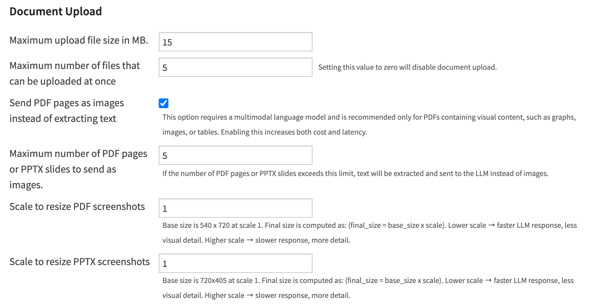
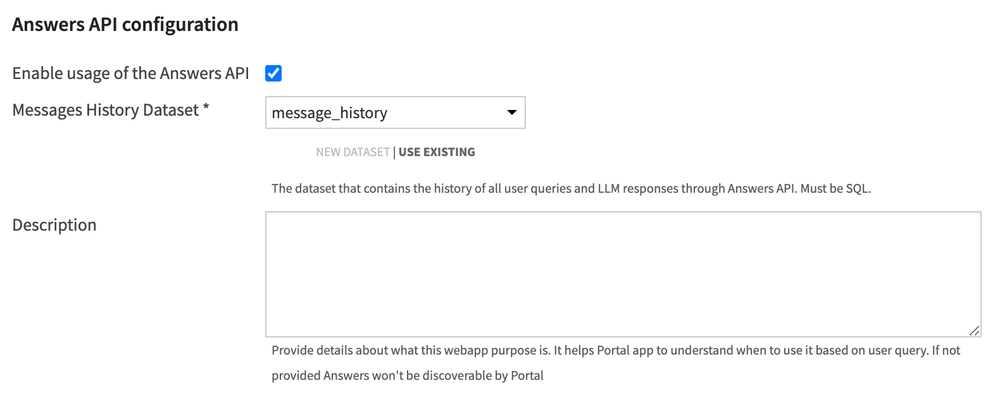
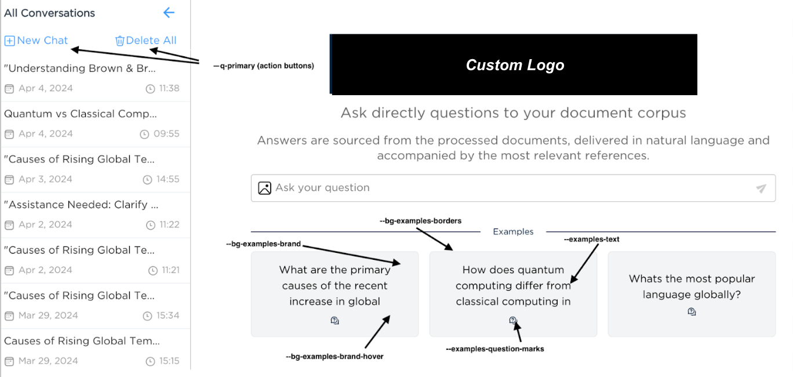
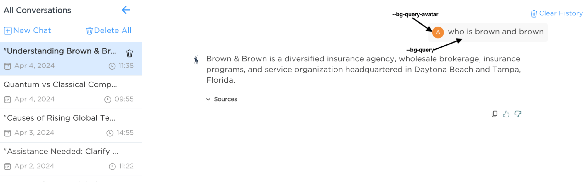
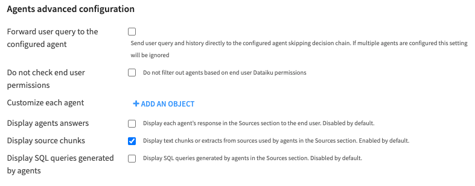
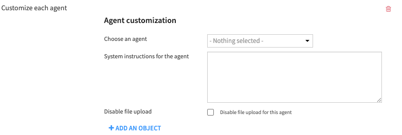