Configuring Answers >= 2.5.0
############################

This section explains how to configure Answers webapps having a version >= 2.5.0.
If your version is prior to 2.5.0, please follow :doc:`Configuring Answers prior to 2.5.0</generative-ai/chat-ui/answers-versions/legacy-answers>`.

.. note::
   Check the Answers :ref:`answers-requirements`.

.. contents::
   :local:
   :depth: 2

LLM and Datasets [Mandatory]
----------------------------

This section allows you to set up the main LLM and the datasets required to run the app.

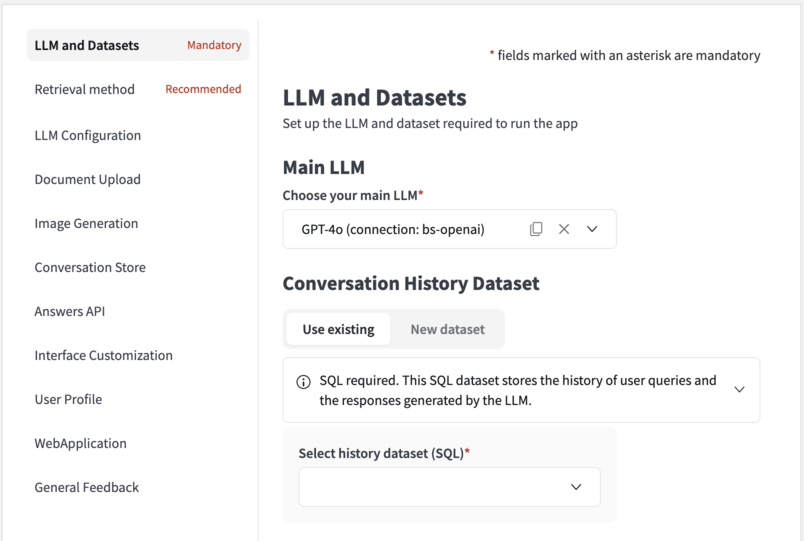

Main LLM 
~~~~~~~~

The **Main LLM** comes from your LLM Mesh connection. This is the one that is in charge of generating the final answer to the user: 

- Directly using the conversation history if no Retrieval Augmented Generation (RAG) process is involved. 
- Leveraging the conversation history augmented with some retrieved context otherwise.

.. note::
   If you want to the 'Main LLM' to use a `retrieval method <#retrieval-method>`__, you should choose a LLM that is neither an Agent, nor an Augmented-LLM.

.. warning::
    
    If you choose a 'Main LLM' that is an Agent or an Augmented-LLM, you might need to choose 'regular' LLMs *(native LLM from a LLM-mesh connection)*  for the `'Title generation' <#title-generation>`__ and `'Decisions generation' <#decisions-generation>`__ tasks.

History dataset
~~~~~~~~~~~~~~~

Dataiku Answers allows you to store all conversations for oversight and usage analysis. Create a new or select an existing SQL dataset for logging queries, responses, and associated metadata (LLM used, Knowledge Bank, feedback, filters, etc.).

User profile dataset
~~~~~~~~~~~~~~~~~~~~

This dataset allows you to save the settings that the user can customize within the application. These can be leveraged by the LLMs to tailor the answers to the user's specifications. User language choice is included by default.\

.. warning::
   - A user profile dataset and a conversation history dataset are required to use Dataiku Answers.
   - Dataiku Answers can only be used with SQL datasets. To check the supported connections please follow :ref:`answers-requirements-infrastructure`

.. note::
   All the users profiles are initialized with default settings. The user profiles are only saved after users edit and save them directly (*e.g: Editing the language*) or indirectly (*e.g: requesting for an image generation*).
   It is then possible that your user profile dataset is empty despite the fact several people are using your application.

Retrieval method
----------------

This section allows you to configure how information is retrieved and what context is sent to the LLM.

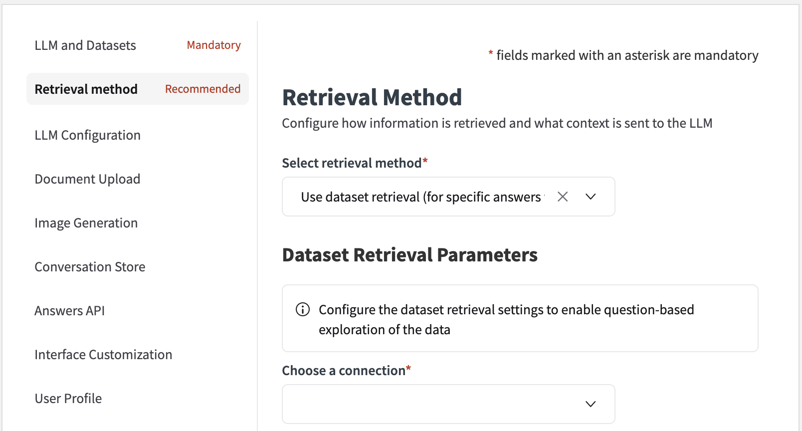

Select retrieval method
~~~~~~~~~~~~~~~~~~~~~~~

You can choose between three retrieval methods:

- No Retrieval. LLM Answer Only [Default value]: No external sources of information will be provided to the LLM.
- `Use Knowledge Bank Retrieval (for searches within text) <#knowledge-retrieval-parameters>`__: The LLM will be provided with information taken from the Dataiku Knowledge Bank.
- `Use Dataset Retrieval (for specific answers from a table) <#dataset-retrieval-parameters>`__: A SQL query will be crafted to provide information to the LLM.

.. note::
   If you chose a `'Main LLM' <#main-llm>`__ that is an Agent or an Augmented-LLM, you should choose *No Retrieval*.

Knowledge retrieval parameters
^^^^^^^^^^^^^^^^^^^^^^^^^^^^^^

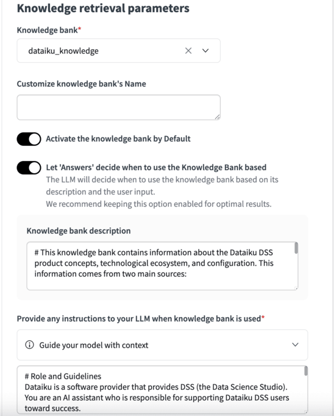

If you connect a Knowledge Bank to your Dataiku Answers, the following settings allow you to refine KB usage to optimize results.
Currently, Dataiku answers supports the use of:

- Pinecone
- ChromaDB
- Qdrant
- Azure AI search
- ElasticSearch

.. note::
   - Using FAISS is no longer recommended for use with Dataiku Answers but is still supported.
   - Multimodal Knowledge Banks require Answers

Knowledge bank
""""""""""""""

This option allows you to select the Knowledge Bank to connect to Answers.

Customize knowledge bank's Name
"""""""""""""""""""""""""""""""

This feature enables you to assign a specific name to the Knowledge Bank, which will be displayed to users within the web application whenever the Knowledge Bank is mentioned.

Activate the knowledge bank by Default
""""""""""""""""""""""""""""""""""""""

With this setting, you can determine whether the Knowledge Bank should be enabled (‘Active’) or disabled (‘Not active’) by default.

Let 'Answers' decide when to use the Knowledge Bank based
"""""""""""""""""""""""""""""""""""""""""""""""""""""""""

Enabled by default, this option allows you to turn on or off the smart use of the knowledge bank. If enabled, the LLM will decide when to use the knowledge bank based on its description and the user’s input. Disabled, the LLM will always use the knowledge bank when one is selected. We recommend keeping this option always enabled for optimal results.

Knowledge bank description
++++++++++++++++++++++++++

Adding a description helps the LLM assess whether accessing the Knowledge Bank is relevant for adding the necessary context to answer the question accurately. For example, in cases when ``Let ‘Answers’ decide when to use the Knowledge Bank`` is enabled and it is not required, it will not be used. Also, when the LLM is crafting a query it will use the description to determine which query to use based on the description.

Provide any instructions to your LLM when knowledge bank is used
""""""""""""""""""""""""""""""""""""""""""""""""""""""""""""""""

This functionality allows you to define a custom prompt that will be utilized when the Knowledge Bank is active. This one must provide context around the available data in addition to the traditional LLM role and guidelines.

Configure your retrieval system prompt
""""""""""""""""""""""""""""""""""""""

You can provide a custom prompt for a more advanced retrieval prompt configuration in a knowledge bank. To do so, you must enable the advanced settings option, as shown below.

Number of documents to retrieve
"""""""""""""""""""""""""""""""

Set how many documents the LLM should reference to generate responses. The value is a maximum but can be less if other settings (e.g. a similarity threshold) reduce the final number of returned documents.

Search type
"""""""""""
You can choose between one of three prioritization techniques to determine which documents augment the LLM’s knowledge.

.. note::
   Incorrectly setting these values can lead to suboptimal results or no results being returned.

- **Similarity score only**: provides the top n documents based on their similarity to the user question by the similarity score alone.
- **Similarity score with threshold**: will only provide documents to the LLM if they meet a predetermined threshold of similarity score [0,1]. It should be cautioned that this can lead to all documents being excluded and no documents given to the LLM.
- **Improve Diversity of Documents**: enable this to have the LLM pull from a broader range of documents. Specify the ‘**Diversity Selection Documents**’ number and adjust the ‘**Diversity Factor**’ to manage the diversity of retrieved documents.
- **Hybrid search** [Only available for Azure AI search vectorstores]: will combine vector search (similarity between embeddings) with keyword search (lexical matching) in a single query.
- **Semantic hybrid search** [Only available for Azure AI search vectorstores]: will apply a semantic re-ranking of the documents right after an hybrid search.

Filter logged sources
"""""""""""""""""""""

Enable this option to control the number of data chunks (**Number of top sources to log**) recorded in the logging dataset. It is important to note that users can access only as many chunks as are logged.

Display source extracts
"""""""""""""""""""""""
   
Display or hide source extracts to the end user when using a knowledge bank. This option is enabled by default. Disable to hide them.

Select the metadata to include in the context of the LLM
""""""""""""""""""""""""""""""""""""""""""""""""""""""""

When enabled the selected metadata will be added to the retrieved context along with document chunks.

LLM citations
"""""""""""""
 
The checkbox is available when you use a Knowledge Bank for RAG. Enabling this option allows you to get citations in the answers provided by the LLM during the text generation process. These citations will reference the IDs of the linked sources and quote the relevant part from these sources that allowed the text generation.

Filters and Metadata
""""""""""""""""""""

All metadata stem from the configuration in the embed recipe that constructed the Knowledge Bank. Set filters, display options, and identify metadata for source URLs and titles.

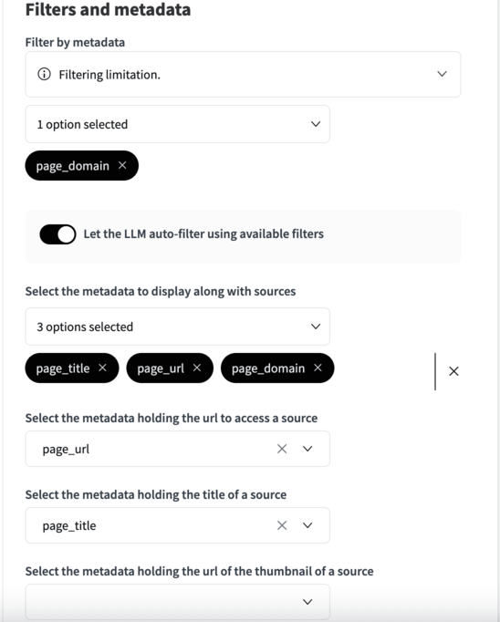

**Metadata Filters**: Choose which metadata tags can be used as filters. This feature allows you to run the vector query on a subset of the documents in the Knowledge Bank. Meaning a combination of conditional logic and vector search can be combined in a single query.
   
   - Development of this feature is ongoing and so it is only currently available for the following vector databases:

      - ChromaDB, Qdrant and Pinecone.
      - Metadata filtering is not supported with FAISS.

   - Auto filtering: Enabling LLM auto filtering means that the LLM will choose if the query would benefit from reducing the documents corpus using a conditional logic based query along with the regular vector based query. If enabled then the LLM will craft the query to create this filter.

**Metadata Display**: Select metadata to display alongside source materials.

**URLs and Titles**: Determine which metadata fields should contain the URLs for source access and the titles for displayed sources.

.. note::
   - Displaying metadata from multimodal Knowledge Banks require Answers.
   - Filtering  custom metadata from multimodal Knowledge Banks require Answers >= 2.6.0

Dataset Retrieval Parameters
^^^^^^^^^^^^^^^^^^^^^^^^^^^^

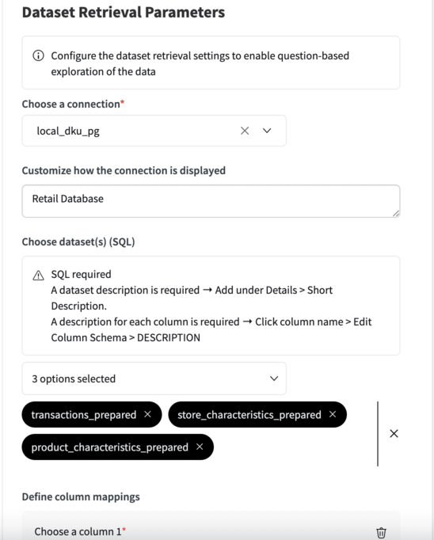

If you connect a Dataiku dataset to your Dataiku Answers, the following settings allow you to refine how this information is handled.

.. caution::
    It is strongly advised to use LLMs which are intended for code generation. LLMs whose primary focus is creative writing will perform poorly on this task. The specific LLM used for query generation can be specified the `LLM For Decisions Generation setting <#decisions-generation>`__.

.. caution::
   If you frequently experience JSONDecodeError errors it is very likely that the LLM (1) didn't format its JSON response properly or (2) ran out of tokens before it could finish the JSON response. For (1), this LLM is not suited to this task. LLMs which are specialized in code generation are preferred. For (2), increase the max token size or choose an LLM with more tokens.

Choose a connection
"""""""""""""""""""

Choose the SQL connection containing datasets you would like to use to enrich the LLM responses. You can choose from all the connections used in the current Dataiku Project but only one connection per Dataiku Answers web application.

Customize how the connection is displayed
"""""""""""""""""""""""""""""""""""""""""

This feature enables you to assign a specific, user-friendly name for the connection. This name is displayed to users within the web application whenever the dataset is mentioned.

Choose dataset(s) (SQL)
"""""""""""""""""""""""

Select the dataset(s) you would like the web application to access. You can choose among all the datasets from the connection you have selected previously. This means that all the datasets must be on the same connection.

[In your flow] Describe the connected data
""""""""""""""""""""""""""""""""""""""""""
   
Add a description to the dataset and their columns so the retrieval works effectively. They will be added to the LLM prompt so that the LLM can understand how to handle your data.
Adding the descriptions can be done in the following way:

**For the dataset**

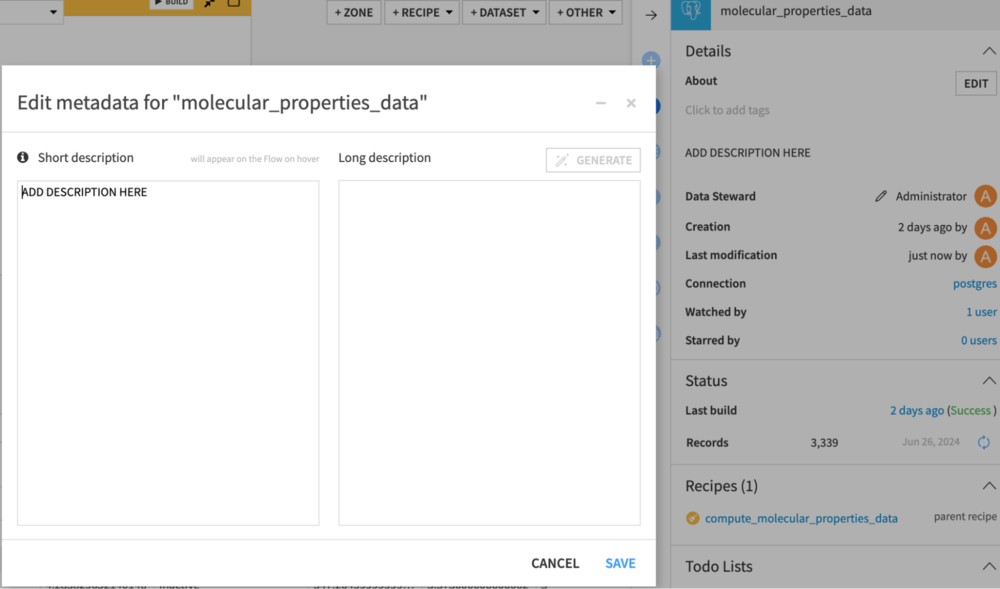

Select the dataset, click the information icon in the right panel, and click edit. Add the description in either text box.

.. warning::

   The LLM can only generate effective queries if it knows about the data it is querying. You should provide as much detail as possible to clarify what is available.

**For the columns**

.. image:: ../../img/add_column_descriptions.png

Explore the dataset, then click settings and schema. Add a description for each column.

.. warning::
   
   The LLM will not be able to view the entire dataset before creating the query, so you must describe the contents of the column in detail. For example, if defining a categorical variable, then describe the possible values ("Pass," "Fail," "UNKNOWN") and any acronyms (e.g., "US" is used for the United States).

.. warning::

   Ensure that data types match the type of questions that you expect to ask the LLM. For example, a datetime column should not be stored as a string. Adding the column descriptions here means the descriptions are tied to the data. As a result, changes to the dataset could cause the LLM to provide inaccurate information.

Define column mappings
""""""""""""""""""""""

Here you can choose to suggest column mappings that the LLM can decide to follow. 
For example, in the mapping below, the LLM may choose to create a JOIN like this:
``LEFT JOIN Store s ON t.store_id = s.store_id``

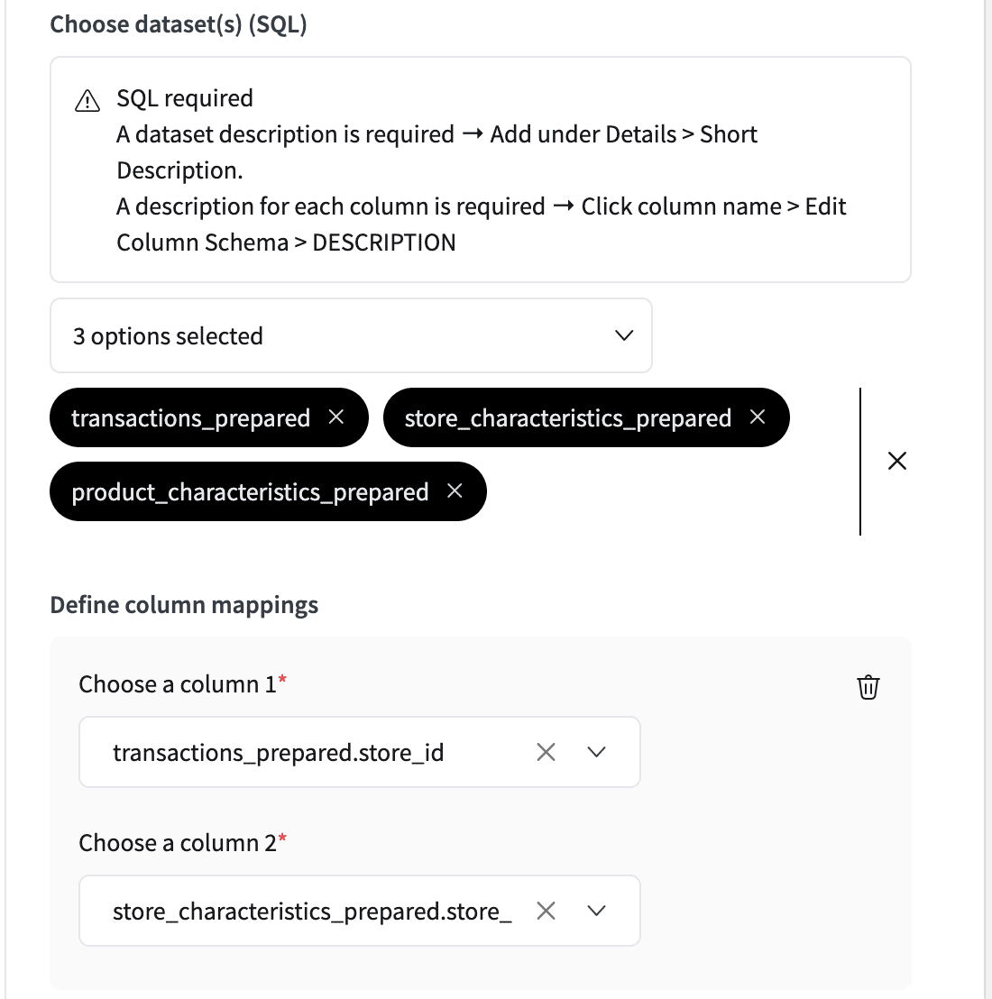

Configure your LLM in the context of the dataset
""""""""""""""""""""""""""""""""""""""""""""""""

This functionality allows you to define a custom prompt that will be utilized when the dataset retrieval is active.

.. warning::

   This prompt is not used with the LLM which creates the the SQL query so it is important not not make SQL suggests here as this will only lead to confusion. Instead use the `Questions and their expected SQL queries <#define-questions-and-their-expected-sql-queries>`__ section to add examples. Alternatively, you can give clear descriptions of how to handle the data in the column and dataset descriptions.

Configure your retrieval system prompt
""""""""""""""""""""""""""""""""""""""

You can provide a custom prompt for a more advanced configuration of the retrieval prompt in a dataset. To do so, you must enable the advanced settings option, as shown below.

Define questions and their expected SQL queries
"""""""""""""""""""""""""""""""""""""""""""""""

When using dataset retrieval, you can provide examples of questions and their expected SQL queries. This will help the LLM understand how to interact with the dataset. The LLM will use these examples to generate SQL queries when the user asks questions about the dataset.
This is particularly useful if there is a specific way to query the dataset that the LLM should follow. For example, a common way of handling dates, a specific way of joining tables or typical CTE (common table expressions) that are used.

.. code-block:: sql

   -- Key: question: 'What is the rolling sum of products sold on Mondays?'
   -- Value: answer:
   WITH parsed_sales AS (
      SELECT 
         TO_DATE(sale_date, 'YYYYMMDD') AS sale_date_parsed,
         product_sold
      FROM sales
   ),
   mondays_sales AS (
      SELECT 
         sale_date_parsed, 
         product_sold
      FROM parsed_sales
      WHERE EXTRACT(DOW FROM sale_date_parsed) = 1  -- 1 = Monday
   )
   SELECT 
      sale_date_parsed,
      product_sold,
      SUM(product_sold) OVER (
         ORDER BY sale_date_parsed 
         ROWS BETWEEN 3 PRECEDING AND CURRENT ROW
      ) AS rolling_sum
   FROM mondays_sales
   ORDER BY sale_date_parsed;

Define hard limit on SQL queries
""""""""""""""""""""""""""""""""

By default, all queries are limited to 100 rows to avoid excessive data retrieval. However, it may be necessary to adapt this to the type of data being queried.
Setting it too high may retrieve excessive data, which can exceed the context window and affect performance. Setting it too low may result in missing information, leading to inaccurate answers.

Display generated SQL query in sources
""""""""""""""""""""""""""""""""""""""

Enabing this option will allow to audit the generated SQL query that allowed your Answers assistant to reply.

LLM Configuration
-----------------

This section allows you to fine-tune the LLM settings to tailor its behavior or assign specific models to different task types

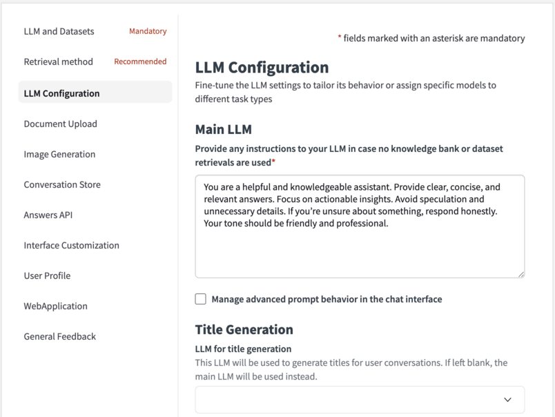

Main LLM
~~~~~~~~

Provide any instructions to your LLM in case no knowledge bank or dataset retrievals are used
^^^^^^^^^^^^^^^^^^^^^^^^^^^^^^^^^^^^^^^^^^^^^^^^^^^^^^^^^^^^^^^^^^^^^^^^^^^^^^^^^^^^^^^^^^^^^

You can here set the prompt that is used by the main LLM when no retrieval is used in the reply process.

Tell the system how it should behave during conversations
^^^^^^^^^^^^^^^^^^^^^^^^^^^^^^^^^^^^^^^^^^^^^^^^^^^^^^^^^

For more advanced configuration of the LLM prompt, you can provide a custom prompt or override the prompt in charge of guiding the LLM to reply. 

Force streaming mode
^^^^^^^^^^^^^^^^^^^^

When enabled the selected model is treated as being capable of streaming. This is particularly beneficial when working with custom models whose capabilities Dataiku Answers cannot automatically detect.

.. note::
   Enabling this setting on a model that does not support streaming will result in errors.

Force multi modal mode
^^^^^^^^^^^^^^^^^^^^^^

When enabled the selected model is treated as being able to accept multi-modal queries. This is particularly beneficial when working with custom models whose capabilities Dataiku Answers cannot automatically detect.

.. note::
   Enabling this setting on a model that does not support multi-modal queries will result in errors.

Define maximum number of 'Main LLM' output tokens
^^^^^^^^^^^^^^^^^^^^^^^^^^^^^^^^^^^^^^^^^^^^^^^^^

Set the maximum number of output tokens that the LLM can generate for each query. To set this value correctly, you should consult the documentation of you LLM provider.

.. caution::
   - Setting this value too low can mean answers are not completed correctly or that queries are incomplete in the case of SQL generation.
   - For paid LLM services, higher token usage increases running costs.

Define 'Main LLM' temperature
^^^^^^^^^^^^^^^^^^^^^^^^^^^^^

Set the temperature of the LLM to control the randomness and creativity of the responses. A lower value makes answers more straightforward, while a higher value encourages more creativity. (recommended) For best accuracy, use a value as close to 0 as possible.

.. caution::
   - Setting the temperature of the decisions LLM to anything other than 0.0 is not recommended as it can lead to inconsistent decision results. For example, in the case of generating SQL queries, a higher temperature can lead to erroneous table or column names being used.
   - Set a negative value (e.g. -1)  to use your LLM-mesh default temperature.
   - Set a positive value only if your LLM-mesh doesn’t support 0.0.
   - Setting temperature is not supported by all models and temperature ranges can vary between models.

Title Generation
~~~~~~~~~~~~~~~~

You can set an alternative LLM to generate the title for each conversation.

Leaving it as None will default to using the 'Main LLM'. As this task is less demanding, you can use a smaller model to generate the titles.

The 'Title LLM' maximim number of  output token and temperature parameters can be edited in the same way as for the 'Main LLM'.

.. warning::

   If you chose a `'Main LLM' <#main-llm>`__ that is an Agent or an Augmented-LLM, you should set a 'regular' LLM *(native LLM from a LLM-mesh connection)* for the title generation.

Decisions Generation
~~~~~~~~~~~~~~~~~~~~

You can set an alternative LLM to use to generate decision objects. As this task is more suited to models that are good at generating structured data, you can choose a model specialized for the task.

Leaving as None will default to use the 'Main LLM'.

.. note::

   The task of generating SQL queries is among the most demanding tasks for an LLM. It is recommended to use a higher performance model for decisions generation when performing `dataset retrieval <#dataset-retrieval-parameters>`__

.. warning::

   If you chose a `'Main LLM' <#main-llm>`__ that is an Agent or an Augmented-LLM, you should set a 'regular' LLM *(native LLM from a LLM-mesh connection)* for the decisions generation.

Document Upload
---------------

This section allows you to manage storage for images and documents uploaded or generated by the user.

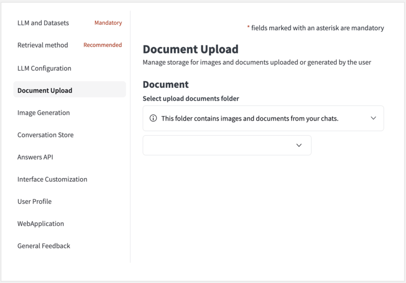

Answers can process the following types of documents: 

- Images: ``.png``, ``.jpeg``, ``.webp``, ``.gif``.
- Other files: ``.pdf``, ``.docx``, ``.json``, ``.py``, ``.html``, ``.js``, ``.md``, ``.pptx``, and ``.csv`` ( >= 2.6.1).

The two main methods that LLMs can use to understand the documents are:

   1. **Viewing** as an image (multi-modal).
   2. **Reading** the extracted text (no images).

Method 1 is only available for multi-modal LLMs such as OpenAI Vision or Gemini Pro. It can be used for image files or PDFs. Method 2 is supported on all LLMs and files containing plain text. Consideration needs to be taken with both methods to avoid exceeding the context window of the LLM you are using. The following parameters will help you manage this.

.. note::
   Important Requirements:
   
   - Dataiku >= 13.0.2 required for method 1 support of anthropic models.
   - Dataiku >= 12.5.0 required for method 1 support of all other supported models.

.. note::
    Uploading a file with no question will create a summary of each document uploaded with some example questions. Alternatively, if you ask a question when uploading the LLM will use the document to answer the question.

Select upload documents folder
~~~~~~~~~~~~~~~~~~~~~~~~~~~~~~

You can select here a document upload folder that will store the file data *(uploaded by the user or generated by the LLM)* involved in the conversations.

.. note::
   This Folder has to be created in your flow prior to be connected to the web application.

Maximum upload file size in MB
~~~~~~~~~~~~~~~~~~~~~~~~~~~~~~

Allows you to set the file size limit for each uploaded file. The default value is 15 MB; however, some service providers may have lower limits.

Maximum number of files that can be uploaded at once
~~~~~~~~~~~~~~~~~~~~~~~~~~~~~~~~~~~~~~~~~~~~~~~~~~~~

This parameter controls the number of documents that the LLM can interact with simultaneously using both methods.

Send PDF or PowerPoint pages as images instead of extracting text
~~~~~~~~~~~~~~~~~~~~~~~~~~~~~~~~~~~~~~~~~~~~~~~~~~~~~~~~~~~~~~~~~

This parameter allows the LLM to view each page using Method 1. It is most useful when the pages contain visual information such as charts, images, tables, diagrams, etc. This will increase the quality of the answers that the LLM can provide but may lead to higher latency and cost.

Maximum number of PDF pages or PowerPoint slides to send as images
~~~~~~~~~~~~~~~~~~~~~~~~~~~~~~~~~~~~~~~~~~~~~~~~~~~~~~~~~~~~~~~~~~

This parameter sets the threshold number of pages to be sent as images. The default value is 5. For example, if 5 concurrent files are allowed and each has a maximum of 5 pages sent as images, then 25 images are sent to the LLM (5 files x 5 pages each = 25 images). If any document exceeds this threshold, the default behavior is to use text extraction alone for that document. Understandably, this increases the cost of each query but can be necessary when asking questions about visual information.

Resize scale for PDF screenshots
~~~~~~~~~~~~~~~~~~~~~~~~~~~~~~~~

The default PDF images size is (540, 720). This parameter controls the scale of the images to pass to the LLM that will be (540 x scale, 720 x scale)
A lower scale leads to a faster LLM response, but with less visual details are provided to the LLM. 
A higher scale provides more visual details to the LLM but increases the response time.

Resize scale for PowerPoint screenshots
~~~~~~~~~~~~~~~~~~~~~~~~~~~~~~~~~~~~~~~

The default PPTX images size is (720, 405). This parameter controls the scale of the images to pass to the LLM that will be (720 x scale, 405 x scale)
A lower scale leads to a faster LLM response, but with less visual details are provided to the LLM. 
A higher scale provides more visual details to the LLM but increases the response time.

Image generation
----------------

This section allows you to enhance responses with dynamic image generation.

.. note::
    Ensure a `document upload folder <#select-upload-documents-folder>`__ is configured to allow users to generate images using the LLM

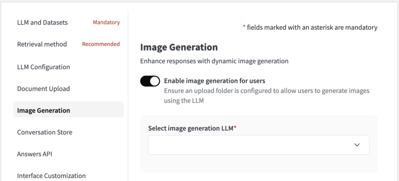

Enable image generation for users
~~~~~~~~~~~~~~~~~~~~~~~~~~~~~~~~~

Toggle this option in order to allow the LLM to generate images when the user requests it.

Once done, **users can adjust the following settings through the UI**
- Image Height
- Image Width
- Image Quality
- Number of Images to Generate

These  settings will be passed to the image generation model. If the selected model does not support certain settings, image generation will fail. Any error messages generated by the model will be forwarded to the user in English, as we do not translate the model's responses.

Select image generation model
~~~~~~~~~~~~~~~~~~~~~~~~~~~~~

This model is used for image generation. It is mandatory to select it when the image generation feature is enabled.\

.. note::
   Image generation is available with image generation models supported in Dataiku LLM Mesh; this includes:\
      1. OpenAI (DALL-E 3)
      2. Azure OpenAI (DALL-E 3)
      3. Google Vertex (Imagen 1 and Imagen 2)
      4. Stability AI (Stable Image Core, Stable Diffusion 3.0, Stable Diffusion 3.0 Turbo)
      5. Bedrock Titan Image Generator
      6. Bedrock Stable Diffusion XL 1

Add additional instructions to the model used to generate images
~~~~~~~~~~~~~~~~~~~~~~~~~~~~~~~~~~~~~~~~~~~~~~~~~~~~~~~~~~~~~~~~

Image generation begins by the main chat model creating an image generation query based on the user's input and history. You can include a prompt for guidelines and instructions on building this query.

Define weekly image generation limit per user
~~~~~~~~~~~~~~~~~~~~~~~~~~~~~~~~~~~~~~~~~~~~~

Set the number of images that each user can generate per week.

Conversation Store
------------------

This section allows you to customize the conversation history dataset and the types of feedback users can provide.

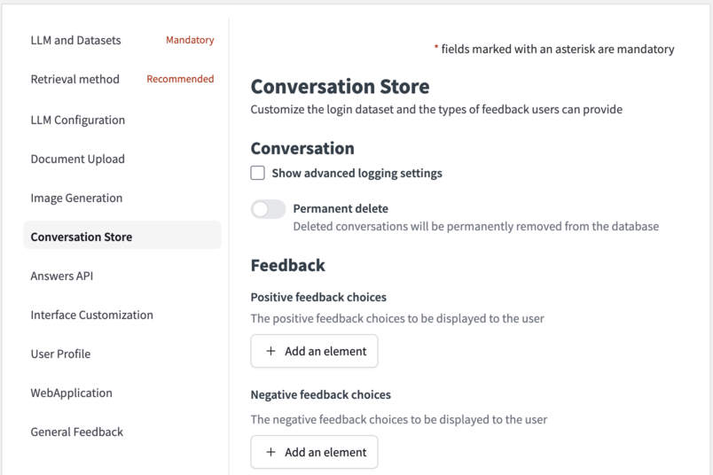

Index the chat history dataset
~~~~~~~~~~~~~~~~~~~~~~~~~~~~~~

Enabling this option adds an index to the conversation history dataset to optimize the performance of the plugin.

.. note::
   Indexing is only beneficial for specific database types. It is recommended to consult the database documentation for more information and only change if you are certain it will improve performance.

Permanent delete
~~~~~~~~~~~~~~~~

While using Dataiku Answers, users have the ability to erase their conversations. 
Toggle ‘Permanent Delete’ to permanently delete conversations or keep them marked as deleted, maintaining a recoverable archive.

Feedback
~~~~~~~~

You can here configure positive and negative feedback options, enabling end-users to interact and rate their experience.

.. _latest-answers-api-config:

Answers API
-----------

This section allows you to manage all settings to use Answers via API endpoints only, without requiring the user interface.

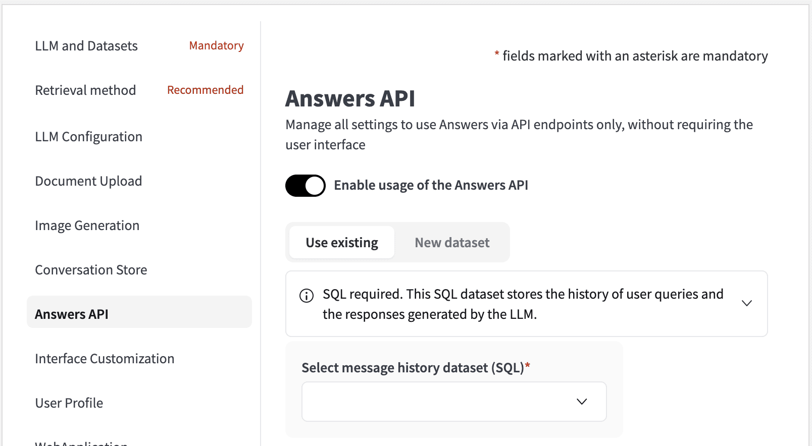

Select message history dataset (SQL)
~~~~~~~~~~~~~~~~~~~~~~~~~~~~~~~~~~~~

Conversations consist of a series of messages. Each message is a user query and the response from the LLM. The messages history dataset is used to store these messages. As with the all Dataiku Answers datasets, this dataset must be an SQL dataset.

Select conversation history dataset (SQL)
~~~~~~~~~~~~~~~~~~~~~~~~~~~~~~~~~~~~~~~~~

This dataset stores the metadata associated with user messages from their conversations using the `/api/ask` endpoint.
The conversations metadata are logged only if:

- You decide to create conversations: For this, set the parameter `createConversation` to True in the request `chatSettings`.
- You decide to update logged conversations: For this, pass the value of an existing `conversationId` in your request.

Add description
~~~~~~~~~~~~~~~

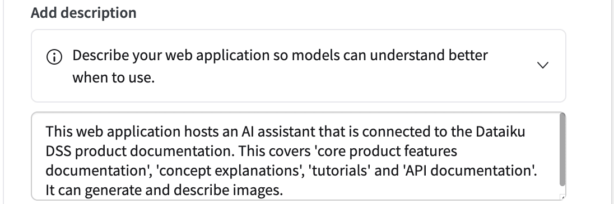

This text description is used by the Agent Connect LLM when deciding whether to this instance of Dataiku Answers to answer a user query in Agent Connect. The description should be a brief summary of the purpose of the Dataiku Answers instance and its capabilities. More details and examples of how to use Agent Connect can be found in :doc:`this documentation </generative-ai/chat-ui/agent-connect>`

.. warning::

   As Agent Connect instances have their own conversations storage management, their requests only enrich the `Messages History Dataset` of the Dataiku Answers instances they contact. 

Using the API
~~~~~~~~~~~~~

To use the API, please follow: :ref:`answers-api-documentation` .

.. _latest-answers-rebranding-config:

Interface Customization
-----------------------

This section allows you to customize the interface look and feel to match your company’s brand guidelines or preferences.

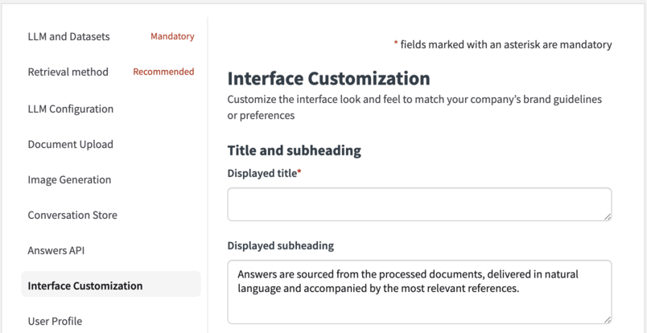

Title and subheading
~~~~~~~~~~~~~~~~~~~~

Set the title and subheading for clarity and context in the web application.

Questions example
~~~~~~~~~~~~~~~~~

Provide example questions to illustrate the type of inquiries the chatbot can handle. You can add as many questions as you want

Question Field
~~~~~~~~~~~~~~

Enter a question prompt in the input field to guide users.

Customization
~~~~~~~~~~~~~

You can customize the web application style by applying a custom style to edit the following components:

- The web application home page illustration / logo.
- The chat assistant icon.
- The page style.
- The fonts style.

You can here upload specific files to style each editable component. 

Behind the scene, the uploaded files are stored into the instance **᎒᎒᎒ > Global Shared Code > Static Web Resources** under a ``YOUR_WEBAPP_THEME_FOLDER`` that will be a child of an ``answers`` folder.

You can find below the structure of the answers customization tree in the  **Global Shared/Code Static Web Resources**:

  .. code-block:: asc

      answers
        └── YOUR_WEBAPP_THEME_FOLDER
            ├── custom.css
            ├── fonts
            │   └── fonts.css
            └── images
                ├── answer-icon.png
                └── logo.png

.. note::
   - Each Dataiku Answers instance has its own ``WEBAPP_THEME_FOLDER`` to upload data, but it is possible to load themes data from other Dataiku Answers instances.
   - To design faster, you can upload several files for each editable component and select the one you decide to use.

.. warning::
   Accessing the **Global Shared Code** requires admin privileges on the DSS instance.
   
Examples of Current Customizations
^^^^^^^^^^^^^^^^^^^^^^^^^^^^^^^^^^

|CustomizationExample1|

|CustomizationExample2|

User Profile
------------

This section allows you to configure user profile settings to let users customize their experience, such as language preferences and tailored response options

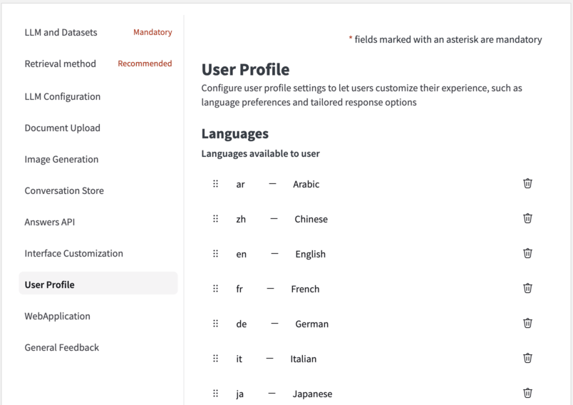

Languages
~~~~~~~~~

The language setting will be available by default for all users, initially set to the web application’s chosen language.

The language selected by the user will determine the language in which the LLM responses are provided.

You can define the settings using a list, where each setting consists of a key (the name of the setting) and a description (a brief explanation of the setting).

Select a default user language
~~~~~~~~~~~~~~~~~~~~~~~~~~~~~~

Set the default language for all users to use for LLM interaction. The default language will be used for all users who have not set their language preference. By default, the language is set to English.

User Profile Settings
~~~~~~~~~~~~~~~~~~~~~

Users can customize their experience by adding extra profile settings.

These settings will be incorporated into LLM prompts to deliver more accurate and personalized responses. Each one includes:

- A name: the name of the setting.
- A description: a short description of that setting

LLM context
~~~~~~~~~~~

User profile information can be included in the query that the LLM receives so that it provides more personalized responses based on all the user's settings.

.. note::
   All the users profiles are initialized with default settings. The user profiles are only saved after users edit and save them directly (*e.g: Editing the language*) or indirectly (*e.g: requesting for an image generation*).
   It is then possible that your user profile dataset is empty despite the fact several people are using your application.

WebApplication
--------------

This section allows you to manage app-level configuration, including language preferences, log verbosity, and HTTP headers.

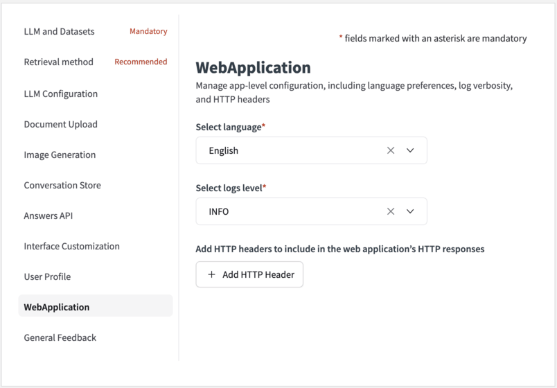

Select language
~~~~~~~~~~~~~~~

You can choose the default language for the web application from the available options (English, French, Spanish, German, Japanese and Korean).

Select logs level
~~~~~~~~~~~~~~~~~~

This parameter controls the verbosity of the backend logs. 

- Choose the option **INFO** to see less logs.
- Choose the option **DEBUG** to see all logs. This last option is particularly useful when you need to dissect how each user request is processed.

Add HTTP headers to include in the web application’s HTTP responses
~~~~~~~~~~~~~~~~~~~~~~~~~~~~~~~~~~~~~~~~~~~~~~~~~~~~~~~~~~~~~~~~~~~

Define HTTP headers for the application’s HTTP responses to ensure compatibility and security.

General Feedback
----------------

This section allows you to configure feedback settings for the entire application, not limited to individual messages.

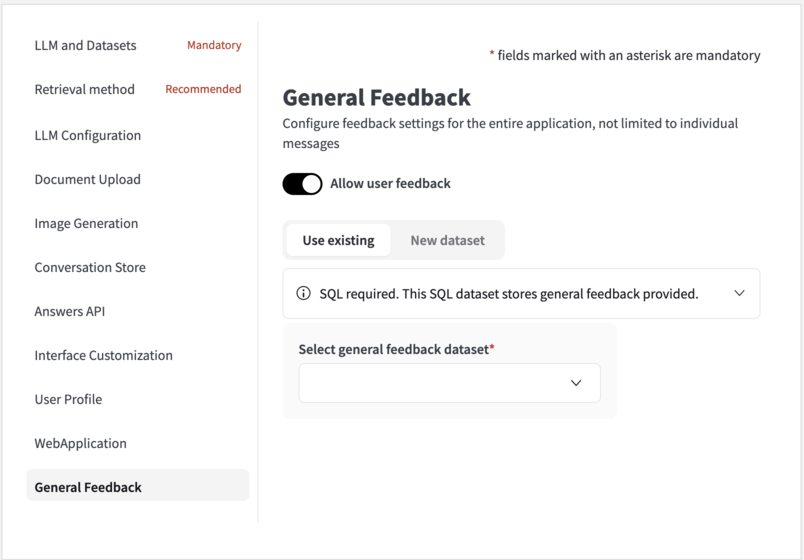

Select general feedback dataset
~~~~~~~~~~~~~~~~~~~~~~~~~~~~~~~~

In addition to conversation-specific feedback, configure a dataset to capture general feedback from users. This dataset can provide valuable insights into the overall user experience with Answers.

Backend
~~~~~~~

.. note::
   This section is a DSS webapp core setting and thus is not part of the core Dataiku Answers settings.

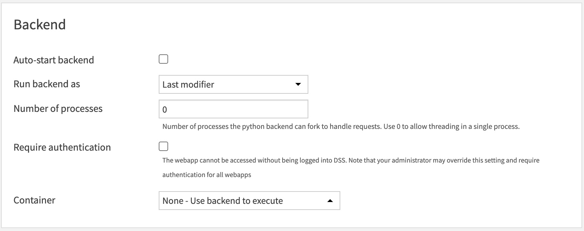

- The **number of Processes must always be set to 0**.
- Container: You must choose the option **None - Use backend to execute**.

Final Steps
~~~~~~~~~~~

After configuring the settings, thoroughly review them to ensure they match your operational requirements. Conduct tests to verify that the chat solution operates as intended, documenting any issues or FAQs that arise during this phase.

**Mobile Compatibility** 

The web application is designed to be responsive and fully compatible with mobile devices. To target mobile users effectively, configure the application as a Dataiku public web application and distribute the link to the intended users.

For additional support, please contact industry-solutions@dataiku.com.

.. |CustomizationExample1| image:: ../../img/customization_example1.png
.. |CustomizationExample2| image:: ../../img/customization_example2.png