Configuring Answers < 2.5.0
###########################

This section explains how to configure Answers webapps having a version < 2.5.0.
If your version is 2.5.0 or later, please follow :doc:`Configuring Answers 2.5.0 and later</generative-ai/chat-ui/answers-versions/latest-answers>`.

.. note::
   Check the Answers :ref:`answers-requirements`.

.. contents::
   :local:
   :depth: 2

Mandatory Settings
~~~~~~~~~~~~~~~~~~

|MandatoryConfig|

Choose your LLM
^^^^^^^^^^^^^^^
**Main LLM:** Connect each instance of Dataiku Answers to your choice of LLM, powered by Dataiku’s LLM Mesh. Select from the LLMs configured in Dataiku DSS Connections.

Datasets
^^^^^^^^
**Conversation History Dataset:** Dataiku Answers allows you to store all conversations for oversight and usage analysis. Create a new or select an existing SQL dataset for logging queries, responses, and associated metadata (LLM used, Knowledge Bank, feedback, filters, etc.).

**User Profile Dataset (>= 1.3.0):** This dataset allows you to save the settings that the user can customize within the application. These can be leveraged by the LLMs to tailor the answers to the user's specifications. User language choice is included by default.\

.. warning::
   - A user profile dataset and a conversation history dataset are required to use Dataiku Answers.
   - Dataiku Answers can only be used with SQL datasets.

.. note::
   All the users profiles are initialized with default settings. The user profiles are only saved after users edit and save them directly (*e.g: Editing the language*) or indirectly (*e.g: requesting for an image generation*).
   It is then possible that your user profile dataset is empty despite the fact several people are using your application.

Other Settings
~~~~~~~~~~~~~~

Conversations Store Configuration
^^^^^^^^^^^^^^^^^^^^^^^^^^^^^^^^^

Flexible options allow you to define storage approach and mechanism.

|ConversationStoreConfig|

Index the chat history dataset
^^^^^^^^^^^^^^^^^^^^^^^^^^^^^^

Addition of an index to the conversation history dataset to optimize the performance of the plugin.

.. note::
   Indexing is only beneficial for specific database types. It is recommended to consult the database documentation for more information and only change if you are certain it will improve performance.

Conversation Deletion
^^^^^^^^^^^^^^^^^^^^^
   
While using Dataiku Answers, users have the ability to erase their conversations. Toggle ‘Permanent Delete’ to permanently delete conversations or keep them marked as deleted, maintaining a recoverable archive.

Feedback Choices
^^^^^^^^^^^^^^^^
   
Configure positive and negative feedback options, enabling end-users to interact and rate their experience.

Document Folder
^^^^^^^^^^^^^^^^
   
Choose a folder to store user-uploaded documents and LLM generated media.

Allow User Feedback
^^^^^^^^^^^^^^^^^^^

As you roll out chat applications in your organization, you can include a feedback option to improve understanding of feedback, enablement needs, and enhancements.

General Feedback Dataset
^^^^^^^^^^^^^^^^^^^^^^^^

In addition to conversation-specific feedback, configure a dataset to capture general feedback from users. This dataset can provide valuable insights into the overall user experience with the plugin.

LLM Configuration
~~~~~~~~~~~~~~~~~

|LlmConfig|

Configure your LLM when no knowledge bank or table retrieval is required
^^^^^^^^^^^^^^^^^^^^^^^^^^^^^^^^^^^^^^^^^^^^^^^^^^^^^^^^^^^^^^^^^^^^^^^^
Tailor the prompt that will guide the behavior of the underlying LLM. For example, if the LLM is to function as a life sciences analyst, the prompt could instruct it not to use external knowledge and to structure the responses in a clear and chronological order, with bullet points for clarity where possible. **This prompt is only used when no retrieval is performed**.

LLM For Title Generation (>= 1.5.0)
"""""""""""""""""""""""""""""""""""
Set alternative LLM to generate the title for each conversation. Leaving it as None will default to using the main LLM. As this task is less demanding, you can use a smaller model to generate the titles.

Advanced LLM Setting
^^^^^^^^^^^^^^^^^^^^

Configure your Conversation system prompt
"""""""""""""""""""""""""""""""""""""""""
For more advanced configuration of the LLM prompt, you can provide a custom system prompt or override the prompt in charge of guiding the LLM when generating code. You need to enable the advanced settings option as shown below. 

Force Streaming Mode (>= 1.5.0)
"""""""""""""""""""""""""""""""
When enabled the selected model is treated as being capable of streaming. This is particularly beneficial when working with custom models whose capabilities Dataiku Answers cannot automatically detect.\

.. note::
   Enabling this setting on a model that does not support streaming will result in errors.

Force Multi Modal Mode (>= 1.5.0)
"""""""""""""""""""""""""""""""""
When enabled the selected model is treated as being able to accept multi-modal queries. This is particularly beneficial when working with custom models whose capabilities Dataiku Answers cannot automatically detect.\

.. note::
   Enabling this setting on a model that does not support multi-modal queries will result in errors.

Maximum Number of LLM Output Tokens (>= 2.1.0)
""""""""""""""""""""""""""""""""""""""""""""""

Set the maximum number of output tokens that the LLM can generate for each query. To set this value correctly, you should consult the documentation of you LLM provider.

.. caution::
   - Setting this value too low can mean answers are not completed correctly or that queries are incomplete in the case of SQL generation.
   - For paid LLM services, higher token usage increases running costs.

LLM Temperature (>= 2.1.0)
""""""""""""""""""""""""""
Set the temperature of the LLM to control the randomness and creativity of the responses. A lower value makes answers more straightforward, while a higher value encourages more creativity. (recommended) For best accuracy, use a value as close to 0 as possible.

.. caution::
   - Setting the temperature of the decisions LLM to anything other than 0.0 is not recommended as it can lead to inconsistent decision results. For example, in the case of generating SQL queries, a higher temperature can lead to erroneous table or column names being used.
   - Set a negative value (e.g. -1)  to use your LLM-mesh default temperature.
   - Set a positive value only if your LLM-mesh doesn’t support 0.0.
   - Setting temperature is not supported by all models and temperature ranges can vary between models.

LLM For Decisions Generation (>= 1.5.0)
"""""""""""""""""""""""""""""""""""""""
Set alternative LLM to use to generate decision objects. As this task is more suited to models that are good at generating structured data, you can choose a model specialized for the task. Leaving as None will default to use the main LLM.

.. note::
   The task of generating SQL queries is among the most demanding tasks for an LLM. It is recommended to use a higher performance model for decisions generation when performing `dataset retrieval <#dataset-retrieval-parameters>`__

Enable Image Generation for Users (>= 1.4.0)
""""""""""""""""""""""""""""""""""""""""""""

|ImageGenerationConfig|

This checkbox allows you to activate the image generation feature for users. Once enabled, additional settings will become available. \

.. note::
   Important Requirements:

   - An upload folder is necessary for this feature to function, as generated images will be stored there. This folder has to be created in the flow of the project hosting Answers prior to enabling this feature.\
   - This feature works only with DSS version >= 13.0.0

**Users can adjust the following settings through the UI**
   - Image Height
   - Image Width
   - Image Quality
   - Number of Images to Generate

The user settings will be passed to the image generation model. If the selected model does not support certain settings, image generation will fail. Any error messages generated by the model will be forwarded to the user in English, as we do not translate the model's responses.

Image Generation Model (>= 1.4.0)
"""""""""""""""""""""""""""""""""
The model used for image generation. This is mandatory when the image generation feature is enabled.\

.. note::
   Image generation is available with image generation models supported in Dataiku LLM Mesh; this includes:\
      1. OpenAI (DALL-E 3)
      2. Azure OpenAI (DALL-E 3)
      3. Google Vertex (Imagen 1 and Imagen 2)
      4. Stability AI (Stable Image Core, Stable Diffusion 3.0, Stable Diffusion 3.0 Turbo)
      5. Bedrock Titan Image Generator
      6. Bedrock Stable Diffusion XL 1

Configure the Query Builder Prompt for Image Generation
"""""""""""""""""""""""""""""""""""""""""""""""""""""""

Image generation begins by the main chat model creating an image generation query based on the user's input and history. You can include a prompt for guidelines and instructions on building this query.

.. caution::
  Only modify this if you fully understand the process.

Weekly Image Generation Limit Per User (>= 1.4.1)
"""""""""""""""""""""""""""""""""""""""""""""""""
Set the number of images that each user can generate per week.

Document Upload (>= 1.4.0)
^^^^^^^^^^^^^^^^^^^^^^^^^^

You can upload multiple files of different types, enabling you to ask questions about each using the answers interface.
Uploading a file with no question will create a summary of each document uploaded with some example questions. Alternatively, if you ask a question when uploading the LLM will use the document to answer the question.\

|DocumentUploadUi|

Answers can process the following types of documents: 

- Images: ``.png``, ``.jpeg``, ``.webp``, ``.gif``.
- Other files: ``.pdf``, ``.docx``, ``.json``, ``.py``, ``.html``, ``.js``, ``.md`` and ``.pptx`` ( >= 2.4.0).

The two main methods that LLMs can use to understand the documents are:

   1. **Viewing** as an image (multi-modal).
   2. **Reading** the extracted text (no images).

Method 1 is only available for multi-modal LLMs such as OpenAI Vision or Gemini Pro. It can be used for image files or PDFs. Method 2 is supported on all LLMs and files containing plain text. Consideration needs to be taken with both methods to avoid exceeding the context window of the LLM you are using. The following parameters will help you manage this.

.. note::
   Important Requirements:\
      - Dataiku >= 13.0.2 required for method 1 support of anthropic models.
      - Dataiku >= 12.5.0 required for method 1 support of all other supported models.
      - PDF handling requires Answers >= 1.4.0
      - PPTX handling require Answers >= 2.4.0

|DocUploadConfig|

**Maximum upload file size in MB** (>= 1.4.0)

Allows you to set the file size limit for each uploaded file. The default value is 15 MB; however, some service providers may have lower limits.

**Maximum number of files that can be uploaded at once** (>= 1.4.0)

This parameter controls the number of documents that the LLM can interact with simultaneously using both methods.

**Send PDF pages as images instead of extracting text** (>= 1.4.0)

This parameter allows the LLM to view each page using Method 1. It is most useful when the pages contain visual information such as charts, images, tables, diagrams, etc. This will increase the quality of the answers that the LLM can provide but may lead to higher latency and cost.

**Maximum number of PDF pages or PPTX slides to send as images** (>= 1.4.0)

This parameter sets the threshold number of pages to be sent as images. The default value is 5. For example, if 5 concurrent files are allowed and each has a maximum of 5 pages sent as images, then 25 images are sent to the LLM (5 files x 5 pages each = 25 images). If any document exceeds this threshold, the default behavior is to use text extraction alone for that document. Understandably, this increases the cost of each query but can be necessary when asking questions about visual information.

**Scale to resize PDF screenshots (>= 2.4.0)** 

The default PDF images size is (540, 720). This parameter controls the scale of the images to pass to the LLM that will be (540 x scale, 720 x scale)
A lower scale leads to a faster LLM response, but with less visual details are provided to the LLM. 
A higher scale provides more visual details to the LLM but increases the response time.

**Scale to resize PPTX screenshots(>= 2.4.0)**
The default PPTX images size is (720, 405). This parameter controls the scale of the images to pass to the LLM that will be (720 x scale, 405 x scale)
A lower scale leads to a faster LLM response, but with less visual details are provided to the LLM. 
A higher scale provides more visual details to the LLM but increases the response time.

Retrieval Method
~~~~~~~~~~~~~~~~

|RetrievalMethodSelection|

In this section, you can decide how you will augment the LLM's current knowledge with your external sources of information.

**No Retrieval. LLM Answer Only**: No external sources of information will be provided to the LLM. **(Default value).**

`Use Knowledge Bank Retrieval (for searches within text) <#knowledge-bank-configuration>`__: The LLM will be provided with information taken from the Dataiku Knowledge Bank.

`Use Dataset Retrieval (for specific answers from a table) <#dataset-retrieval-parameters>`__: A SQL query will be crafted to provide information to the LLM.

Knowledge Bank Configuration
^^^^^^^^^^^^^^^^^^^^^^^^^^^^

If you connect a Knowledge Bank to your Dataiku Answers, the following settings allow you to refine KB usage to optimize results.
Currently, Dataiku answers supports the use of

  - Pinecone
  - ChromaDB
  - Qdrant
  - Azure AI search
  - ElasticSearch

.. note::
   - Using FAISS is no longer recommended for use with Dataiku Answers but is still supported.
   - Multimodal Knowledge Banks require Answers >= 2.0.0

|KBRetrievalConfig|

Customize Knowledge Bank’s Name
"""""""""""""""""""""""""""""""

This feature enables you to assign a specific name to the Knowledge Bank, which will be displayed to users within the web application whenever the Knowledge Bank is mentioned.

Activate the Knowledge Bank By Default
""""""""""""""""""""""""""""""""""""""

With this setting, you can determine whether the Knowledge Bank should be enabled (‘Active’) or disabled (‘Not active’) by default.

Let ‘Answers’ Decide When to use the Knowledge Bank-based (>= 1.2.4)
""""""""""""""""""""""""""""""""""""""""""""""""""""""""""""""""""""
   
Enabled by default, this option allows you to turn on or off the smart use of the knowledge bank. If enabled, the LLM will decide when to use the knowledge bank based on its description and the user’s input. Disabled, the LLM will always use the knowledge bank when one is selected. We recommend keeping this option always enabled for optimal results.

Knowledge Bank Description
""""""""""""""""""""""""""

Adding a description helps the LLM assess whether accessing the Knowledge Bank is relevant for adding the necessary context to answer the question accurately. For example, in cases when ``Let ‘Answers’ decide when to use the Knowledge Bank`` is enabled and it is not required, it will not be used. Also, when the LLM is crafting a query it will use the description to determine which query to use based on the description.

Configure your LLM in the Context of a Knowledge Bank
"""""""""""""""""""""""""""""""""""""""""""""""""""""
   
This functionality allows you to define a custom prompt that will be utilized when the Knowledge Bank is active.

Configure your Retrieval System Prompt
""""""""""""""""""""""""""""""""""""""

You can provide a custom system prompt for a more advanced retrieval prompt configuration in a knowledge bank. To do so, you must enable the advanced settings option, as shown below.

Number of Documents to Retrieve
"""""""""""""""""""""""""""""""

Set how many documents the LLM should reference to generate responses. The value is a maximum but can be less if other settings (e.g. a similarity threshold) reduce the final number of returned documents.

Search Type
"""""""""""

You can choose between one of three prioritization techniques to determine which documents augment the LLM’s knowledge.

.. note::
   Incorrectly setting these values can lead to suboptimal results or no results being returned.

- **Similarity score only**: provides the top n documents based on their similarity to the user question by the similarity score alone.
- **Similarity score with threshold**: will only provide documents to the LLM if they meet a predetermined threshold of similarity score [0,1]. It should be cautioned that this can lead to all documents being excluded and no documents given to the LLM.
- **Improve Diversity of Documents**: enable this to have the LLM pull from a broader range of documents. Specify the ‘**Diversity Selection Documents**’ number and adjust the ‘**Diversity Factor**’ to manage the diversity of retrieved documents.
- **Hybrid search (>= 2.4.1)** [Only available for Azure AI search vectorstores]: will combine vector search (similarity between embeddings) with keyword search (lexical matching) in a single query.
- **Semantic hybrid search (>= 2.4.1)** [Only available for Azure AI search vectorstores]: will apply a semantic re-ranking of the documents right after an hybrid search.

Filter Logged Sources
"""""""""""""""""""""
   
Enable this option to control the number of data chunks recorded in the logging dataset. It is important to note that users can access only as many chunks as are logged.

Display Source Extracts
"""""""""""""""""""""""
   
Display or hide source extracts to the end user when using a knowledge bank. This option is enabled by default. Disable to hide them.

Select Metadata to Include in the Context (>= 1.2.3)
""""""""""""""""""""""""""""""""""""""""""""""""""""

When enabled the selected metadata will be added to the retrieved context along with document chunks.

Enable LLM citations (>= 1.2.0)
"""""""""""""""""""""""""""""""
 
The checkbox is available when you use a Knowledge Bank for RAG. Enabling this option allows you to get citations in the answers provided by the LLM during the text generation process. These citations will reference the IDs of the linked sources and quote the relevant part from these sources that allowed the text generation.

Filters and Metadata Parameters
"""""""""""""""""""""""""""""""

All metadata stem from the configuration in the embed recipe that constructed the Knowledge Bank. Set filters, display options, and identify metadata for source URLs and titles.

|FilterAndMetadataConfig|

**Metadata Filters**: Choose which metadata tags can be used as filters. This feature allows you to run the vector query on a subset of the documents in the Knowledge Bank. Meaning a combination of conditional logic and vector search can be combined in a single query.
   
   - Development of this feature is ongoing and so it is only currently available for the following vector databases:

      - ChromaDB, Qdrant and Pinecone.
      - Metadata filtering is not supported with FAISS.

   - Auto filtering (>= 1.2.2): Enabling LLM auto filtering means that the LLM will choose if the query would benefit from reducing the documents corpus using a conditional logic based query along with the regular vector based query. If enabled then the LLM will craft the query to create this filter.

**Metadata Display**: Select metadata to display alongside source materials.

**URLs and Titles**: Determine which metadata fields should contain the URLs for source access and the titles for displayed sources.

.. note::
   - Displaying metadata from multimodal Knowledge Banks require Answers >= 2.2.0
   - Filtering  custom metadata from multimodal Knowledge Banks require Answers >= 2.6.0 (see :doc:`Configuring Answers 2.5.0 and later</generative-ai/chat-ui/answers-versions/latest-answers>`).

Dataset Retrieval Parameters (>= 1.2.5)
^^^^^^^^^^^^^^^^^^^^^^^^^^^^^^^^^^^^^^^

|DBRetrievalConfig|

If you connect a Dataiku dataset to your Dataiku Answers, the following settings allow you to refine how this information is handled.

.. caution::
    It is strongly advised to use LLMs which are intended for code generation. LLMs whose primary focus is creative writing will perform poorly on this task. The specific LLM used for query generation can be specified the `LLM For Decisions Generation setting <#llm-for-decisions-generation>`__.

.. caution::
   If you frequently experience JSONDecodeError errors it is very likely that the LLM (1) didn't format its JSON response properly or (2) ran out of tokens before it could finish the JSON response. For (1), this LLM is not suited to this task. LLMs which are specialized in code generation are preferred. For (2), increase the max token size or choose an LLM with more tokens.

Choose Connection
"""""""""""""""""

Choose the SQL connection containing datasets you would like to use to enrich the LLM responses. You can choose from all the connections used in the current Dataiku Project but only one connection per Dataiku Answers web application.

Customize How the Connection is Displayed
"""""""""""""""""""""""""""""""""""""""""
   
This feature enables you to assign a specific, user-friendly name for the connection. This name is displayed to users within the web application whenever the dataset is mentioned.

Choose Dataset(s)
"""""""""""""""""

Select the datasets you would like the web application to access. You can choose among all the datasets from the connection you have selected previously. This means that all the datasets must be on the same connection.

[In your flow] Describe the connected data
""""""""""""""""""""""""""""""""""""""""""

Add a description to the dataset and the columns so the retrieval works effectively.
This can be done in the following way:

**For the dataset**

Select the dataset, click the information icon in the right panel, and click edit. Add the description in either text box.

.. warning::

   The LLM can only generate effective queries if it knows about the data it is querying. You should provide as much detail as possible to clarify what is available.

|AddDatasetDescription|

**For the columns**

Explore the dataset, then click settings and schema. Add a description for each column.

.. warning::
   
   The LLM will not be able to view the entire dataset before creating the query, so you must describe the contents of the column in detail. For example, if defining a categorical variable, then describe the possible values ("Pass," "Fail," "UNKNOWN") and any acronyms (e.g., "US" is used for the United States).

.. warning::

   Ensure that data types match the type of questions that you expect to ask the LLM. For example, a datetime column should not be stored as a string. Adding the column descriptions here means the descriptions are tied to the data. As a result, changes to the dataset could cause the LLM to provide inaccurate information.

|AddColumnDescriptions|

Define Column Mappings
""""""""""""""""""""""
   
Here you can choose to suggest column mappings that the LLM can decide to follow. 
For example, in the mapping below, the LLM may choose to create a JOIN like this:
``LEFT JOIN Orders o ON o.EmployeeID = e.EmployeeID``

|DefineColumnMappings|

Configure your LLM in the context of the dataset
""""""""""""""""""""""""""""""""""""""""""""""""

This functionality allows you to define a custom prompt that will be utilized when the dataset retrieval is active.

.. warning::

   This prompt is not used with the LLM which creates the the SQL query so it is important not not make SQL suggests here as this will only lead to confusion. Instead use the `Questions and their expected SQL queries <#questions-and-their-expected-sql-queries>`__ section to add examples. Alternatively, you can give clear descriptions of how to handle the data in the column and dataset descriptions.

|ConfigureLLMWithDataset|

Configure your Retrieval System Prompt
""""""""""""""""""""""""""""""""""""""

You can provide a custom system prompt for a more advanced configuration of the retrieval prompt in a dataset. To do so, you must enable the advanced settings option, as shown below.

Questions and their Expected SQL Queries (>= 1.4.1)
"""""""""""""""""""""""""""""""""""""""""""""""""""

When using dataset retrieval, you can provide examples of questions and their expected SQL queries. This will help the LLM understand how to interact with the dataset. The LLM will use these examples to generate SQL queries when the user asks questions about the dataset.
This is particularly useful if there is a specific way to query the dataset that the LLM should follow. For example, a common way of handling dates, a specific way of joining tables or typical CTE (common table expressions) that are used.

.. code-block:: sql

   -- Key: question: 'What is the rolling sum of products sold on Mondays?'
   -- Value: answer:
   WITH parsed_sales AS (
      SELECT 
         TO_DATE(sale_date, 'YYYYMMDD') AS sale_date_parsed,
         product_sold
      FROM sales
   ),
   mondays_sales AS (
      SELECT 
         sale_date_parsed, 
         product_sold
      FROM parsed_sales
      WHERE EXTRACT(DOW FROM sale_date_parsed) = 1  -- 1 = Monday
   )
   SELECT 
      sale_date_parsed,
      product_sold,
      SUM(product_sold) OVER (
         ORDER BY sale_date_parsed 
         ROWS BETWEEN 3 PRECEDING AND CURRENT ROW
      ) AS rolling_sum
   FROM mondays_sales
   ORDER BY sale_date_parsed;

Hard Limit on SQL Queries
"""""""""""""""""""""""""
 
By default, all queries are limited to 100 rows to avoid excessive data retrieval. However, it may be necessary to adapt this to the type of data being queried.

Display SQL in Sources
""""""""""""""""""""""

Selecting this checkbox will add the SQL query to the source information displayed below the LLM’s answers.

.. _legacy-answers-api-config:

Answers API Configuration
^^^^^^^^^^^^^^^^^^^^^^^^^

The Dataiku Answers API allows instance of Agent Connect and other sources to make requests to a Dataiku Answers web application without using the Dataiku Answers UI. More information about how to to make requests to the Dataiku Answers API can be found in the `dataiku answers API <#dataiku-answers-api>`__ section of this documentation.

|AnswersApiConfig|

Messages History Dataset (>= 2.0.0)
^^^^^^^^^^^^^^^^^^^^^^^^^^^^^^^^^^^

Conversations consist of a series of messages. Each message is a user query and the response from the LLM. The messages history dataset is used to store these messages. As with the all Dataiku Answers datasets, this dataset must be an SQL dataset.

Conversation Dataset (>= 2.3.0)
^^^^^^^^^^^^^^^^^^^^^^^^^^^^^^^

This dataset stores the metadata associated with user messages from their conversations using the `/api/ask` endpoint.
The conversations metadata are logged only if:

- You decide to create conversations: For this, set the parameter `createConversation` to True in the request `chatSettings`.
- You decide to update logged conversations: For this, pass the value of an existing `conversationId` in your request.

Description
^^^^^^^^^^^

This text description is used by the Agent Connect LLM when deciding whether to this instance of Dataiku Answers to answer a user query in Agent Connect. The description should be a brief summary of the purpose of the Dataiku Answers instance and its capabilities. More details and examples of how to use Agent Connect can be found in :doc:`this documentation </generative-ai/chat-ui/agent-connect>`

.. warning::

   As Agent Connect instances have their own conversations storage management, their requests only enrich the `Messages History Dataset` of the Dataiku Answers instances they contact. 

Using the API
^^^^^^^^^^^^^

To use the API, please follow: :ref:`answers-api-documentation` .

End User Interface Configuration
~~~~~~~~~~~~~~~~~~~~~~~~~~~~~~~~

Adjust the web app to your business objectives and accelerate user value.

|EndUserConfig|

Titles and Headings
^^^^^^^^^^^^^^^^^^^

Set the title and subheading for clarity and context in the web application.

Displayed Placeholder Text in the 'Question Input' Field
^^^^^^^^^^^^^^^^^^^^^^^^^^^^^^^^^^^^^^^^^^^^^^^^^^^^^^^^

Enter a question prompt in the input field to guide users.

Example Questions
^^^^^^^^^^^^^^^^^

Provide example questions to illustrate the type of inquiries the chatbot can handle. You can add as many questions as you want

Disclaimer Displayed to the End User in the Footer of the Web Application
^^^^^^^^^^^^^^^^^^^^^^^^^^^^^^^^^^^^^^^^^^^^^^^^^^^^^^^^^^^^^^^^^^^^^^^^^

This option allows you to present a detailed rich text disclaimer to the end user, which will be prominently displayed in the footer of the web application. The disclaimer can include hyperlinks, such as those directing users to the company’s internal policy on responsible AI use.

Enable Custom Rebranding (>= 1.2.3)
^^^^^^^^^^^^^^^^^^^^^^^^^^^^^^^^^^^

If checked, the web application will apply your custom styling based on the theme name and different image files you specify in your setup. For more details, check the  `UI Rebranding capability <#ui-rebranding-capability>`__ section.

 -  **Theme name**:
    The theme name you want to apply. Css, images and fonts will be fetched from the folder ``answers/YOUR_THEME``

 -  **Logo file name**:
    The file name of your logo that you added to ``answers/YOUR_THEME/images/image_name.extension_name`` and you want to choose as the logo in the web application.

 -  **Icon file name**:
    Same as for the logo file name.

User Profile Settings (>= 1.3.0)
~~~~~~~~~~~~~~~~~~~~~~~~~~~~~~~~

|UserProfileConfig|

User profile Languages
^^^^^^^^^^^^^^^^^^^^^^

- The language setting will be available by default for all users, initially set to the web application’s chosen language.
- The language selected by the user will determine the language in which the LLM responses are provided.
- You can define the settings using a list, where each setting consists of a key (the name of the setting) and a description (a brief explanation of the setting).

Default User Language
^^^^^^^^^^^^^^^^^^^^^
Set the default language for all users to use for LLM interaction. The default language will be used for all users who have not set their language preference. By default, the language is set to English.

User Profile Settings
^^^^^^^^^^^^^^^^^^^^^

- Once the user has configured their settings, these will be included in the LLM prompt to provide more personalized responses.
- All settings will be in the form of strings for the time being.

Add Profile Information to LLM Context
^^^^^^^^^^^^^^^^^^^^^^^^^^^^^^^^^^^^^^

User profile information can now be included in the query that the LLM receives. This can mean that the LLM can provide more personalized responses based on the user's settings.

.. note::
   All the users profiles are initialized with default settings. The user profiles are only saved after users edit and save them directly (*e.g: Editing the language*) or indirectly (*e.g: requesting for an image generation*).
   It is then possible that your user profile dataset is empty despite the fact several people are using your application.

Web Application Configuration
~~~~~~~~~~~~~~~~~~~~~~~~~~~~~

|WebApplicationConfig|

Language
^^^^^^^^

You can choose the default language for the web application from the available options (English, French, Spanish, German, Japanese and Korean).

HTTP Headers
^^^^^^^^^^^^

Define HTTP headers for the application’s HTTP responses to ensure compatibility and security.

.. _legacy-answers-rebranding-config:

UI Rebranding capability
~~~~~~~~~~~~~~~~~~~~~~~~

You can rebrand the web application by applying a custom style without changing the code by following these steps:

1. Navigate to **᎒᎒᎒ > Global Shared Code > Static Web Resources**
2. Create a folder named ``answers``
3. Within the ``answers`` folder, create a subfolder corresponding to the theme that the web application settings will reference: This subfolder will be named ``YOUR_THEME_NAME`` as an example. The structure should be as follows:

  .. code-block:: asc

      answers
        └── YOUR_THEME_NAME
            ├── custom.css
            ├── fonts
            │   └── fonts.css
            └── images
                ├── answer-icon.png
                └── logo.png

.. warning::
   Accessing the **Global Shared Code** requires admin privileges on the DSS instance.

CSS Changes
^^^^^^^^^^^

Add a ``custom.css`` file inside the ``YOUR_THEME_NAME`` folder; you can find an example below:

.. code-block:: css

  :root {
      /* Colors */
      --brand: #e8c280; /* Primary color for elements other than action buttons */
      --bg-examples-brand: rgba(255, 173, 9, 0.1); /* Examples background color (visible on landing page/new chat) */
      --bg-examples-brand-hover: rgba(255, 173, 9, 0.4); /* Examples background color on hover */
      --bg-examples-borders: #e8a323; /* Examples border color */
      --examples-question-marks: rgb(179, 124, 15); /* Color of question marks in the examples */
      --examples-text: #422a09; /* Color of the text in the examples */
      --text-brand: #57380c; /* Text color for the question card */
      --bg-query: rgba(245, 245, 245, 0.7); /* Background color for the question card */
      --bg-query-avatar: #F28C37; /* Background color for the question card avatar */
  }

  .logo-container .logo-img {
      height: 70%;
      width: 70%;
  }

Fonts Customization
^^^^^^^^^^^^^^^^^^^

-  First, create the ``fonts`` subfolder inside the folder ``YOUR_THEME_NAME``.

-  Second, add ``fonts.css`` and define your font like below depending on the format you can provide *(we support base64 or external URL)*:

  .. code-block:: css

      @font-face {
        font-family: "YourFontName";
        src: url(data:application/octet-stream;base64,your_font_base64);
      }

      @font-face {
        font-family: "YourFontName";
        src: url("yourFontPublicUrl") format("yourFontFormat");
      }

-  Finally, declare the font in your ``custom.css`` file:

  .. code-block:: css

      body,
      div {
        font-family: "YourFontName" !important;
      }

Images customization
^^^^^^^^^^^^^^^^^^^^

Create an ``images`` folder where you can import ``logo.*`` file to change the logo image inside the landing page, and ``answer-icon.*`` to change the icon of the AI answer.

Examples of Current Customizations
^^^^^^^^^^^^^^^^^^^^^^^^^^^^^^^^^^

|CustomizationExample1|

|CustomizationExample2|

Final Steps
~~~~~~~~~~~

After configuring the settings, thoroughly review them to ensure they match your operational requirements. Conduct tests to verify that the chat solution operates as intended, documenting any issues or FAQs that arise during this phase.

**Mobile Compatibility** 

The web application is designed to be responsive and fully compatible with mobile devices. To target mobile users effectively, configure the application as a Dataiku public web application and distribute the link to the intended users.

For additional support, please contact industry-solutions@dataiku.com.

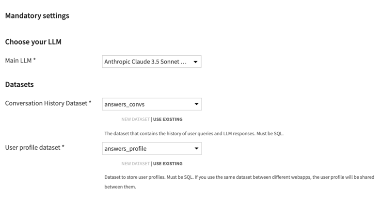
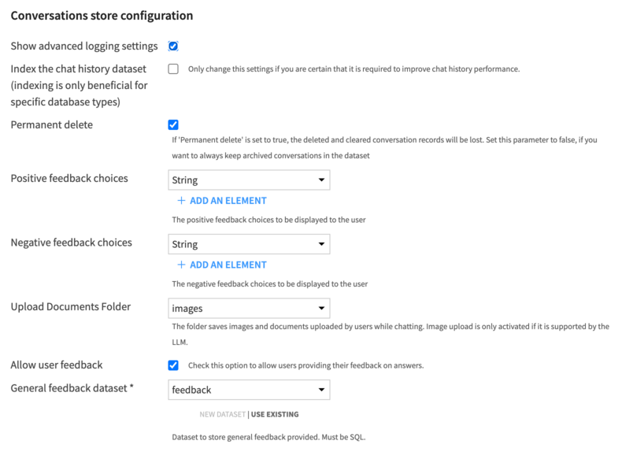
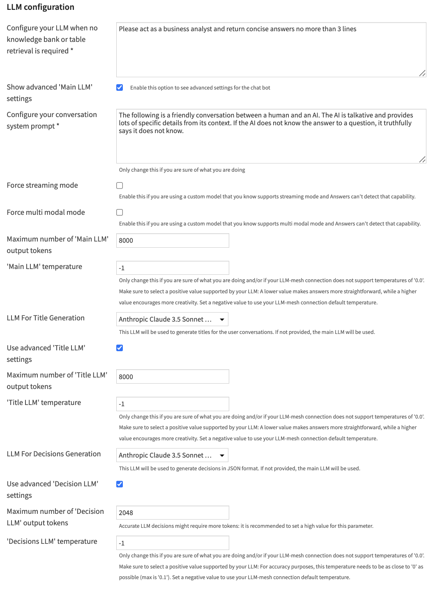
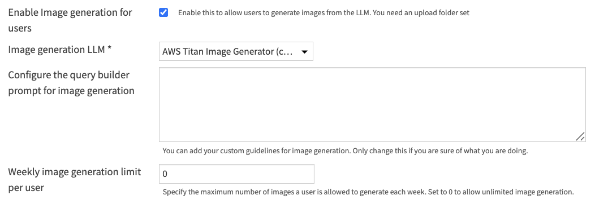
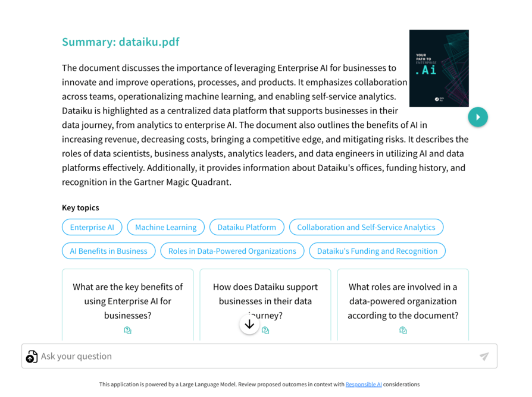
.. |DocUploadConfig| image:: ../../img/doc_upload_config.png
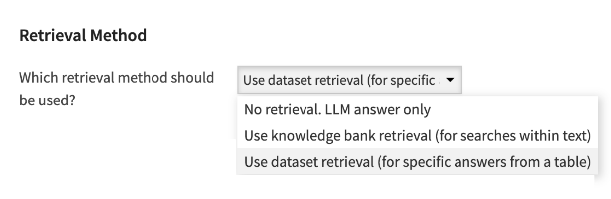
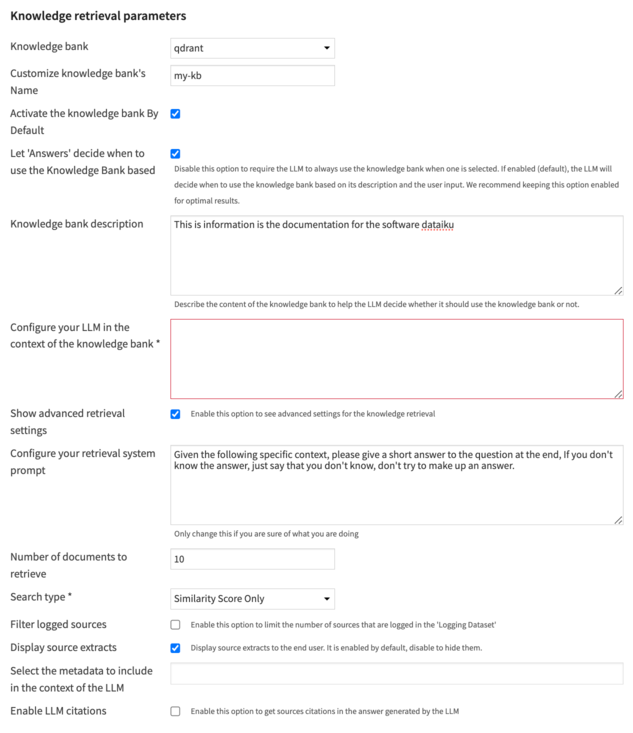
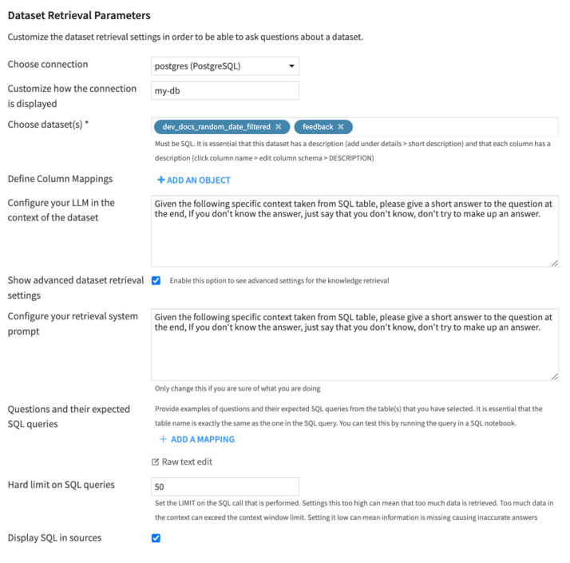
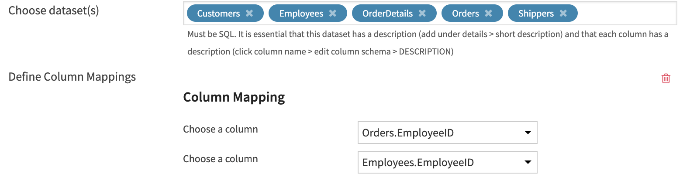
.. |AddDatasetDescription| image:: ../../img/add_dataset_description.png
.. |AddColumnDescriptions| image:: ../../img/add_column_descriptions.png
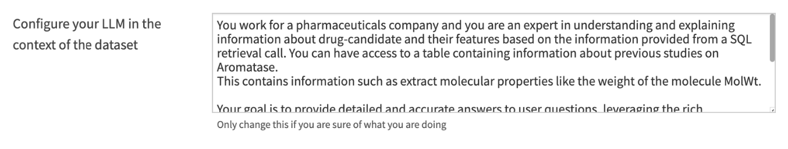
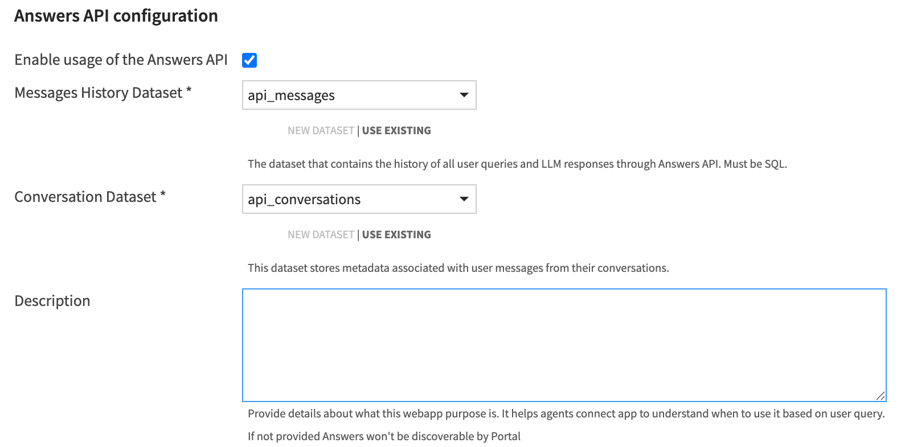
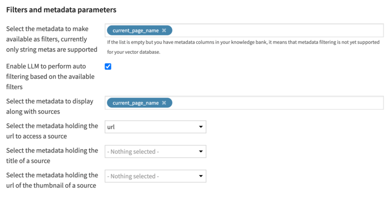
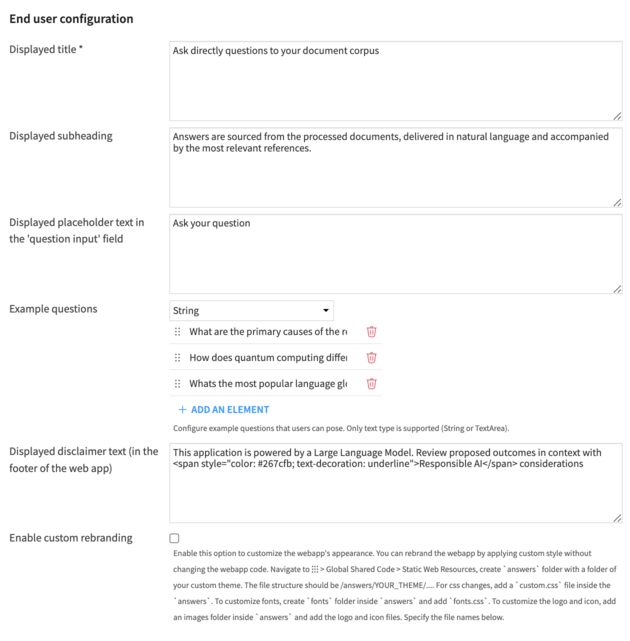
.. |UserProfileConfig| image:: ../../img/user_profile_config.png
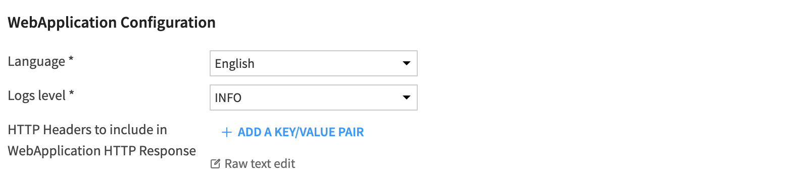
.. |CustomizationExample1| image:: ../../img/customization_example1.png
.. |CustomizationExample2| image:: ../../img/customization_example2.png