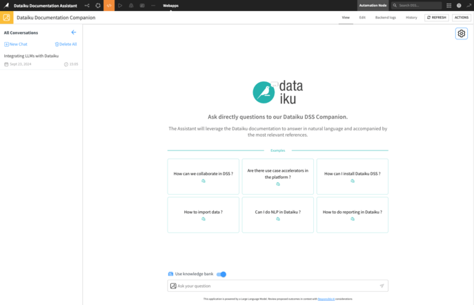
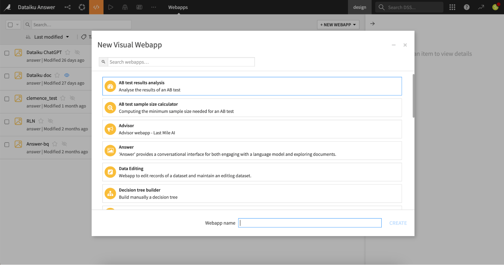
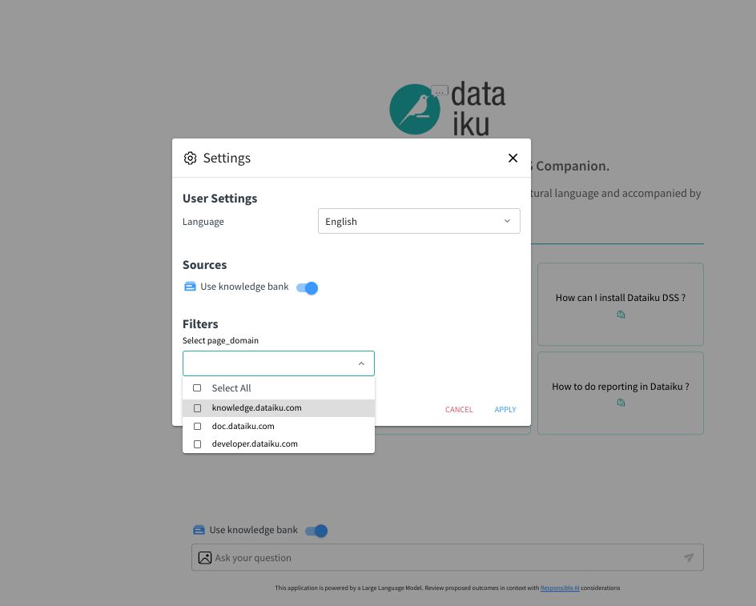
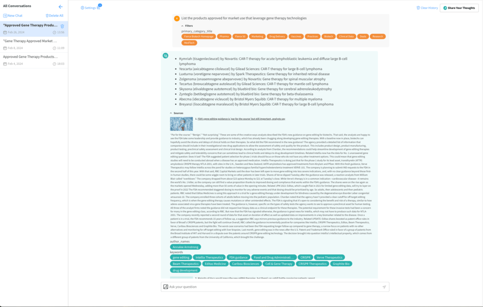

Answers
#######

.. contents::
   :local:
   :depth: 3

Overview
--------

Dataiku Answers is a packaged, scalable web application that enables enterprise-ready Large Language Model (LLM) chat and Retrieval Augmented Generation (RAG) to be deployed at scale across business processes and teams.

|Homepage|

**Key Features**

-  | **Simple and Scalable**
   | Connect Dataiku Answers to your choice of LLM, Knowledge Bank, or Dataset in a few clicks, and start sharing.
-  | **Customizable**
   | Set parameters and filters specific to your needs. Additionally, you can customize the visual web application.
-  | **Governed**
   | Monitor conversations and user feedback to control and optimize LLM impact in your organization.
-  **Mobile-Responsive**
   The visual web application is fully responsive, ensuring optimal usability on mobile devices. For seamless operation, it must be :doc:`directly accessed </webapps/direct-access>`

Whether you need to develop an Enterprise LLM Chat in minutes or deploy RAG at scale, Dataiku Answers is a powerful value accelerator with broad customization options to embed LLM chat usage fully across business processes.

Getting access
--------------

Dataiku Answers plugin is available on demand through the dataiku plugin store. Once installed it gives you access to a fully built Visual Webapp which can be used within your chosen Dataiku Projects. Dataiku Answers versions prior to 2.0.0 can be provided by your Dataiku counterparts (please contact your Dataiku Customer Success Manager or Sales Engineer).

|VisualWebapp|

.. _answers-requirements:

Requirements
------------

Dataiku DSS version
~~~~~~~~~~~~~~~~~~~

- Dataiku Answers is available for both Dataiku Cloud and Self-Managed.
- The latest Dataiku version is always the best choice to fully leverage the latest plugin capabilities.

**Dataiku Answers and DSS compatibility matrix**

.. The emoji checkmarks (✅ and ❌) count as wide Unicode characters and reST is not parsing them the same way as regular characters
  to ensure columns alignment, start from a top column separator '+' and press `arrow down`:
  the values separator should all the time be positioned on the same side of the cursor until you reach the end of the column.

+--------------------------+--------------+--------------+-----------------------+-------------------+-------------------+------------------------------------+
|                          | DSS ≥ 14.2   | DSS ≥ 13.5.5 | DSS ≥ 13.5.3 < 13.5.5 | DSS 13.5.0–13.5.2 | DSS 13.4.0–13.4.x | DSS 12.4.1–13.3.x (min. rec. 12.5) |
+==========================+==============+==============+=======================+===================+===================+====================================+
| Answers ≥ 2.6.1          | ✅           | ❌           | ❌                    | ❌                | ❌                | ❌                                 |
+--------------------------+--------------+--------------+-----------------------+-------------------+-------------------+------------------------------------+
| Answers ≥ 2.4.4          | ❌           | ✅           | ❌                    | ❌                | ❌                | ❌                                 |
+--------------------------+--------------+--------------+-----------------------+-------------------+-------------------+------------------------------------+
| Answers >= 2.4.1 < 2.4.4 | ❌           | ❌           | ✅                    | ❌                | ❌                | ❌                                 |
+--------------------------+--------------+--------------+-----------------------+-------------------+-------------------+------------------------------------+
| Answers 2.2.0–2.4.0      | ❌           | ❌           | ❌                    | ✅                | ✅                | ❌                                 |
+--------------------------+--------------+--------------+-----------------------+-------------------+-------------------+------------------------------------+
| Answers 2.0.0–2.1.x      | ❌           | ❌           | ❌                    | ❌                | ✅                | ❌                                 |
+--------------------------+--------------+--------------+-----------------------+-------------------+-------------------+------------------------------------+
| Answers < 2.0.0          | ❌           | ❌           | ❌                    | ❌                | ❌                | ✅                                 |
+--------------------------+--------------+--------------+-----------------------+-------------------+-------------------+------------------------------------+

.. _answers-requirements-infrastructure:

Infrastructure
~~~~~~~~~~~~~~

**Web Application Backend Settings:**
  - The number of Processes must always be set to 0
  - Container: None - Use backend to execute

**SQL Datasets:**
All datasets used by Dataiku Answers must be SQL datasets for compatibility with the plugin’s storage mechanisms.

  - **PostgreSQL**
  - **Snowflake**
  - **MS SQL Server**
  - **BigQuery**
  - **Databricks**
  - **Oracle** (>= 12.2.0)

.. warning::

   **About Oracle**: The chat history data to log requires the  use of the Oracle ``TO_CLOB`` function. Oracle  >= 12.2 allows for 32k bytes per call of ``TO_CLOB`` but older versions only supports up to 4k which might be too low. It is then recommended ensure your Oracle version is 12.2.0 or later.

**Knowledge Bank Configuration:**
If a Knowledge Bank is used, the web application must run locally on Dataiku DSS. This does not affect scalability despite the shift from a containerized environment.

**Streaming:**
The plugin seamlessly enables responses to be streamed when supported by the configured LLM, requiring only a DSS version of 12.5.0 or higher with no additional setup (currently supports ``openai GPT``, ``bedrock Anthropic Claude`` and ``Amazon Titan`` families of models).

Configuration
-------------

Answers 2.5.0 changed significantly the configuration UI so please find below the right documentation according to your version:

.. toctree::
    :titlesonly:

    answers-versions/latest-answers
    answers-versions/legacy-answers

.. _answers-api-documentation:

Dataiku Answers API (>= 2.0.0)
------------------------------

The Dataiku Answers API allows you to query a Dataiku Answers web application without using the Dataiku Answers UI. 
This is allowed by actvivating the use of the answers API in the configuration:

- :ref:`Answers API configuration (>=2.5.0)<latest-answers-api-config>`.
- :ref:`Answers API configuration (\< 2.5.0)<legacy-answers-api-config>`.

Dataiku Answers endpoints can be accessed using the Dataiku python API (``get_backend_client``) as shown in the example below. They can also be accessed using the URL as follows:

``<INSTANCE_URI>/web-apps-backends/<PROJECT_KEY>/<WEBAPP_ID>/api/``

**Authorization**: used to authenticate the requests. The value should be the Dataiku API token (only needed when not using dataiku api).

- ``Bearer <DATAIKU_API_TOKEN>``

Endpoints
~~~~~~~~~
POST /api/ask (>= 2.0.0)
^^^^^^^^^^^^^^^^^^^^^^^^

Processes a user query and returns an AI-generated response.

Headers
"""""""
**Content-Type Header**: used to specify the media type of the request body.

**Accept Header**: used to specify the media type of the response body.

- ``application/json``: (default) Returns a JSON response.
- ``text/event-stream`` : Enables streaming response using Server-Sent Events (SSE)

A basic one off query without streaming.

   .. code-block:: python

      import dataiku
      import json
      from datetime import datetime

      PROJECT_KEY = "<YOUR_PROJECT_KEY>"
      WEBAPP_ID = "YOUR_WEBAPP_ID"

      client = dataiku.api_client()
      project = client.get_project(PROJECT_KEY)
      webapp = project.get_webapp(WEBAPP_ID)
      backend = webapp.get_backend_client()

      context = {
         "applicationType": "webapp",
         "applicationId": "<YOUR_APP_ID>" + "-" + WEBAPP_ID,
         "timestamp": datetime.now().timestamp(),
      }
      user_preferences = {
            "language": {"value": "en", "description": "User's language"},
      }
      chat_settings = {
            "createConversation": False, # Set True if you want to create a conversation indexing several messages
            "withTitle": False, # Set True if you want a LLM to compute a conversation title
            "requestedResponseFormat": "markdown"
      }
      query = {
         "user": "admin",
         "query": "What's the weather like in Japan in February?",
         "context": context,
         "userPreferences": user_preferences,
         "chatSettings": chat_settings,
         "conversationId": "" # Set an existing conversation ID to index messages with their conversation
      }
      headers={
         "Content-Type": "application/json",
         "Accept": "application/json",
      }
      with backend.session.post(
         backend.url_for_path("/api/ask"),
         json.dumps(query),
         headers=headers
      ) as ret:
         if ret.text:
            try:
                  response = json.loads(ret.text)
                  answer = response["data"]["answer"]
                  print("Answer: ", answer)
            except json.JSONDecodeError:
                  print("Unable to parse json")
         else:
            print("Response does not contain 'text'")

A basic one off query with streaming.

   .. code-block:: python

    import dataiku
    import json
    from datetime import datetime
    from dataikuapi.dss.llm import _SSEClient

    PROJECT_KEY = "<YOUR_PROJECT_KEY>"
    WEBAPP_ID = "YOUR_WEBAPP_ID"

    client = dataiku.api_client()
    project = client.get_project(PROJECT_KEY)
    webapp = project.get_webapp(WEBAPP_ID)
    backend = webapp.get_backend_client()

    context = {
        "applicationType": "webapp",
        "applicationId": "<YOUR_APP_ID>" + "-" + WEBAPP_ID,
        "timestamp": datetime.now().timestamp(),
    }
    user_preferences = {
        "language": {"value": "en", "description": "User's language"},
    }
    chat_settings = {
            "createConversation": False, # Set True if you want to create a conversation indexing several messages
            "withTitle": False, # Set True if you want a LLM to compute a conversation title
            "requestedResponseFormat": "markdown"
    }
    query = {
        "user": "admin",
        "query": "What's the weather like in Japan in February?",
        "context": context,
        "userPreferences": user_preferences,
        "chatSettings": chat_settings,
        "conversationId": "" # Set an existing conversation ID to index messages with their conversation
    }
    headers={
        "Content-Type": "application/json",
        "Accept": "text/event-stream",
    }
    complete_answer = ""
    with backend.session.post(
        backend.url_for_path("/api/ask"),
        json.dumps(query),
        headers=headers
    ) as ret:
        if not ret.ok:
            raise Exception("Error streaming answers")
        client = _SSEClient(ret)
        for event in client.iterevents():
            data = json.loads(event.data)
            if api_error := data.get("error"):
                raise Exception(f"Streamed response failed with status {api_error}")
            if event.event == "completion-chunk":
                text = data.get("text", "")
                print(text)
                complete_answer+=text
            elif event.event == "completion-end":
                print("Streaming ended")
        print("Complete Answer: ", complete_answer)

Conversations endpoints (>= 2.3.0)
^^^^^^^^^^^^^^^^^^^^^^^^^^^^^^^^^^

**Query Parameters**

- ``applicationId`` (required): The identifier of the application.
- ``user`` (required): The user identifier.

**Accept Header**: used to specify the media type of the response body.

- ``application/json``: Returns a JSON response.

GET /api/conversations
""""""""""""""""""""""

Retrieves conversation metadata associated with a specific `applicationId` and `user`.

**Response example**:

.. code-block:: python

    {
    "status": "ok",
    "data": {
        "user": "admin",
        "context": {"applicationId": "hello-world-ask"},
        "conversations": [
            {
                "id": "4d02e44f-32a9-410c-94c2-59632bc96a6c",
                "title": {
                    "original": "Weather in Japan in February: A Guide ",
                    "edited": "",
                    "createdAt": "2025-05-15 17:38:39",
                },
                "createdAt": "2025-05-15 17:38:39",
                "lastMessageAt": "2025-05-15 17:38:39",
                "state": "present",
                  }
            ],
         },
      }

GET /api/conversations/{conversation_id}
""""""""""""""""""""""""""""""""""""""""

Retrieves the messages for a specific conversation associated with a given `applicationId` and `user`.

**Response example**:

   .. code-block:: python

    {
    "status": "ok",
    "data": {
        "id": "4d02e44f-32a9-410c-94c2-59632bc96a6c",
        "title": {
            "original": "Weather in Japan in February: A Guide ",
            "edited": "",
            "createdAt": "2025-05-15 17:38:39",
        },
        "createdAt": "2025-05-15 17:38:39",
        "lastMessageAt": "2025-05-15 17:38:39",
        "state": "present",
        "user": "admin",
        "context": {"applicationId": "hello-world-ask"},
        "messages": [
            {
                "id": "2fc5eb14-72e6-45c5-a03b-660a0d840bd0",
                "createdAt": "2025-05-15 17:38:39",
                "query": "What's the weather like in Japan in February?",
                "answer": "I don't have real-time data access, but I can provide you with some general information...",
                "usedRetrieval": {
                    "name": "",
                    "type": "",
                    "alias": "",
                    "filters": {},
                    "sources": [],
                    "generatedSqlQuery": "",
                    "usedTables": [],
                },
                "feedback": {"value": "", "choice": "[]", "message": ""},
                "files": [],
                "generatedMedia": [],
               }
            ],
         },
      }

DELETE /api/conversations
"""""""""""""""""""""""""

Deletes all the data associated with a specific `applicationId` and `user`, in the conversation and message datasets.

**Response example**:

.. code-block:: python

    {'status': 'ok', 'message': 'Conversations deleted successfully'}

DELETE /api/conversations/{conversation_id}
"""""""""""""""""""""""""""""""""""""""""""

Deletes the data of a single conversation associated with a specific `applicationId` and `user`, in the conversation and message datasets.

**Response example**:

.. code-block:: python

    {'status': 'ok', 'message': 'Conversation deleted successfully'}

The following is a code sample shows how to request the conversations endpoints

   .. code-block:: python

    import dataiku

    PROJECT_KEY = "<YOUR_PROJECT_KEY>"
    WEBAPP_ID = "<YOUR_WEBAPP_ID>"
    APPLICATION_ID = "<YOUR_APP_ID>"
    USER_ID = "<YOUR_USER_ID>"
    CONVERSATION_ID = "<YOUR_CONVERSATION_ID>"
    
    # Connection to the webapp:
    client = dataiku.api_client()
    project = client.get_project(PROJECT_KEY)
    webapp = project.get_webapp(WEBAPP_ID)
    backend = webapp.get_backend_client()
    
    # Retrieve all the conversations: 
    json_response = backend.session.get(backend.url_for_path(f'/api/conversations/?applicationId={APPLICATION_ID}&user={USER_ID}')).json()
    print(json_response)
    
    # Retrieve one conversation based on its ID:
    json_response = backend.session.get(backend.url_for_path(f'/api/conversations/{CONVERSATION_ID}?applicationId={APPLICATION_ID}&user={USER_ID}')).json()
    print(json_response)
    
    # Delete one conversation based on its ID:
    json_response = backend.session.delete(backend.url_for_path(f'/api/conversations/{CONVERSATION_ID}?applicationId={APPLICATION_ID}&user={USER_ID}')).json()
    print(json_response)
    
    # Delete all the conversations: 
    json_response = backend.session.delete(backend.url_for_path(f'/api/conversations/?applicationId={APPLICATION_ID}&user={USER_ID}')).json()
    print(json_response)

Dataiku Answers rebranding 
--------------------------

Answers allows you to customize the interface look and feel to match your company’s brand guidelines or preferences.

- :ref:`Answers rebranding configuration (>=2.5.0)<latest-answers-rebranding-config>`.
- :ref:`Answers rebranding configuration (\< 2.5.0)<legacy-answers-rebranding-config>`.

.. image:: ../img/customization_example1.png
.. image:: ../img/customization_example2.png

Dataiku Answers user guide
--------------------------

Introduction
~~~~~~~~~~~~

Dataiku Answers provides a powerful interface for querying a Large Language Model (LLM) capable of serving a wide array of domains and specialties. Tailored to your needs, it can deliver insights and answers by leveraging a configured Knowledge Bank for context-driven responses or directly accessing the LLM’s extensive knowledge base.

The application supports multi-modal queries if configured with compatible LLMs.

Home page functionality
~~~~~~~~~~~~~~~~~~~~~~~

Query Input: The home page is centered around the query input box. Enter your question here, and the system will either:

-  Perform a semantic search within an active Knowledge Bank to provide the LLM with contextual data related to your query, enhancing the relevance and precision of the answer. Remember that queries need to be as precise as possible to maximize the quality of answers. Don’t hesitate to demand access to query guiding principles to support.

-  Send your question directly to the LLM if no Knowledge Bank is configured or activated, relying on the model’s inbuilt knowledge to provide an answer.

Setting context with filters
~~~~~~~~~~~~~~~~~~~~~~~~~~~~

Setting filters can provide a more efficient and relevant search experience in a knowledge base, maximizing the focus and relevance of the query. This is particularly relevant for knowledge bases with large or diverse content types.

Metadata filter configuration
^^^^^^^^^^^^^^^^^^^^^^^^^^^^^

If metadata filters have been enabled, select your criteria from the available options. These filters pre-define the context, enabling more efficient retrieval from the Knowledge Bank, resulting in answers more aligned with your specific domain or area of interest. Currently metadata filters are only available for ChromaDB, Qdrant and Pinecone.

|MetadataFilterConfiguration|

Conducting conversations
~~~~~~~~~~~~~~~~~~~~~~~~

Engaging with the LLM
^^^^^^^^^^^^^^^^^^^^^^

To start a conversation with the LLM

- Set any desired filters first to establish the context for your query.

- Enter your question in the query box.

- Review the provided information from the contextual data retrieved by the Knowledge Bank or the LLM.

Remember, when a Knowledge Bank is activated and configured with your filters, it will enrich the LLM’s response with specific context, making your results more targeted and relevant. If part of the configuration, Dataiku Answers will allow you to see all sources and metadata for each response item, maximizing trust and understanding. This will include:

-  A thumbnail image.

-  A link to the original source.

-  A title for context.

-  An excerpt from the Knowledge Bank.

-  A list of associated metadata tags as set in the settings.

-  Interact with LLM to refine the answer, translate, summarize, or more.

Interaction with filters and metadata
^^^^^^^^^^^^^^^^^^^^^^^^^^^^^^^^^^^^^

-  Filters in Action

   If you’ve set filters before starting the conversation, they’ll be displayed alongside your question. This helps to preserve the context in the LLM’s response.

-  Filter Indicators

   A visual cue next to the ‘Settings’ icon indicates the presence and number of active filters, allowing you to keep track of the context parameters currently influencing the search results.
   |FilterIndicators|

Providing feedback
^^^^^^^^^^^^^^^^^^

We encourage users to contribute their experiences:

-  Feedback Button: Visible if general feedback collection is enabled; this feature allows you to express your thoughts on the plugin’s functionality and the quality of interactions. Feedback will be collected in a General Feedback Dataset and analyzed by your Answer set-up team.
   |GeneralFeedbackButton|

Conclusion
----------

Dataiku Answers is designed to be user-centric, providing a seamless experience whether you’re seeking detailed responses with the help of a curated Knowledge Bank or Dataset or directly interfacing with the LLM. For additional support, please contact industry-solutions@dataiku.com.

.. |GeneralFeedbackButton| image:: ../img/general_feedback_button.png