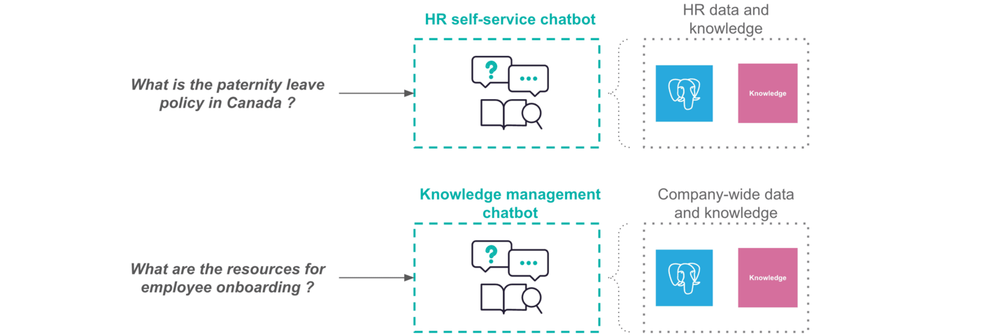
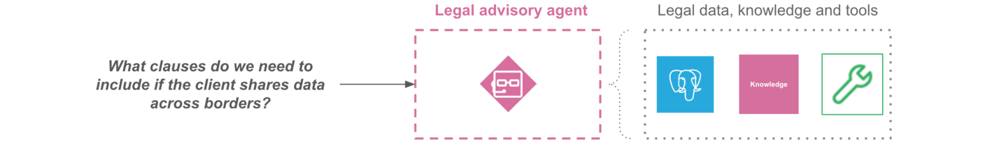
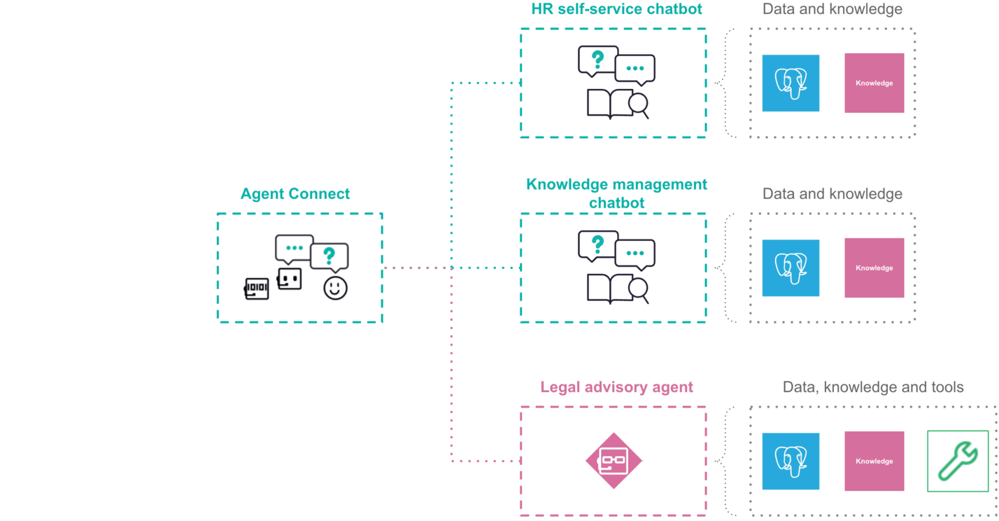
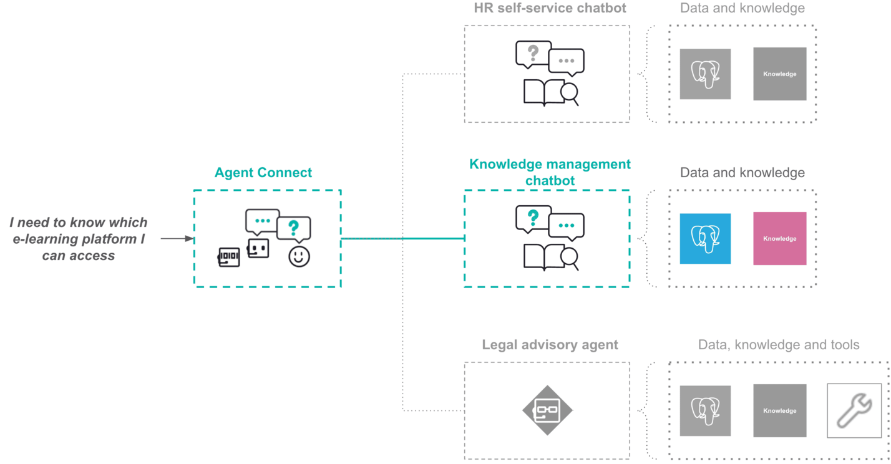
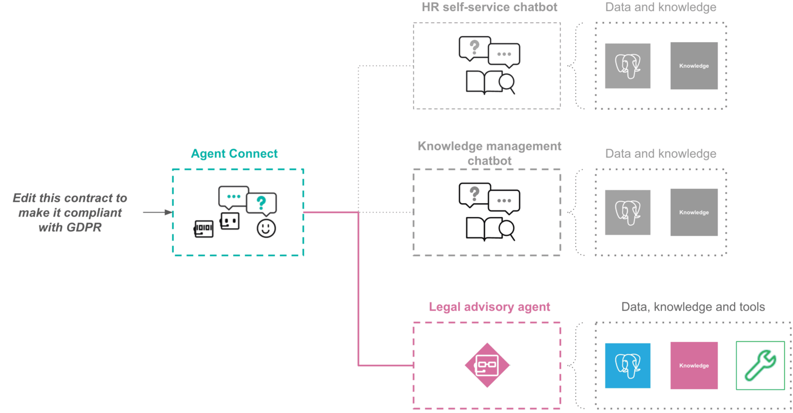

Chat UIs: A Case Study
######################

Whether adopted by a single department or rolled out across multiple teams, companies can have diverse needs regarding the integration of AI-driven chat experiences into their workflows, such as:

* Use case n°1: The human resources department struggles to keep up with repeated questions about vacation policies, benefits enrollment, and payroll.

* Use case n°2: The company has a wealth of internal   documents, process guidelines, and best practices scattered across multiple places. All the employees waste time searching for the right information.

* Use case n°3: In a fast-changing data privacy regulation environment, the legal department needs AI assistance to help them work with complex compliance requirements and draft updated agreements.

The type of requests and end users can be heterogeneous from one use case to another, so a good practice would be to create dedicated AI services for each of them to increase the generated answers accuracy and relevance.

The following sections explain how :doc:`Answers</generative-ai/chat-ui/answers>` and :doc:`Agent Connect</generative-ai/chat-ui/agent-connect>` can be used together to solve these problems.

.. contents::
   :local:
   :depth: 2

Leveraging Answers
------------------

:doc:`Answers</generative-ai/chat-ui/answers>` is an excellent candidate for  use cases '1' and '2' previously introduced, as it will allow the simple leveraging of the company’s data.

The following diagram outlines the creation of :doc:`Answers</generative-ai/chat-ui/answers>` services to cover them, with examples of questions they could process.

Leveraging the LLM Mesh to create an agent
------------------------------------------

With the need of multi-step reasoning and adaptation to specific tasks, the use case '3' would require to leverage the :doc:`LLM Mesh</generative-ai/introduction>` to :doc:`build an Agent</agents/index>`.

The following diagram outlines the type of interactions users could have with such type of agentic-AI.

Leveraging Agent Connect
------------------------

Some employees might need to access several of these AI services. Finding the right entry point to consume them will become more and more complex as their number grows and sometimes the right answer requires to combine some of them.

:doc:`Agent Connect</generative-ai/chat-ui/agent-connect>` solves these problems by providing a single place to interact with any of the :doc:`Answers</generative-ai/chat-ui/answers>` instances and agents.

.. note::
   'Agent Connect' follows the security rules set on the projects hosting :doc:`Answers</generative-ai/chat-ui/answers>` or :doc:`Agent Connect</generative-ai/chat-ui/agent-connect>`. To go further, please :doc:`check the Agent Connect documentation </generative-ai/chat-ui/agent-connect>`.

Once connected to your :doc:`Answers</generative-ai/chat-ui/answers>` and/or :doc:`Agents</agents/index>`, the :doc:`Agent Connect</generative-ai/chat-ui/agent-connect>` service is able to smartly route user queries to the right set of generative AI services:

* When multiple services are selected to fulfill the initial request, the requests are sent concurrently via a pool of threads. 
    
   * Finally, the responses from each selected AI service are presented to the Agent Connect LLM that combines them to answer the user.

* When only one service is selected, its answer is forwarded as is to the user.

* When no service is selected, the Agent Connect LLM answers the user according to their conversation history.

The following diagrams illustrate how Agent Connect would behave and process user requests once connected to the 3 AI services.

Request example 1
^^^^^^^^^^^^^^^^^

Request example 2
^^^^^^^^^^^^^^^^^

.. image:: ../img/agent-connect-case-study-2.png

Request example 3
^^^^^^^^^^^^^^^^^

