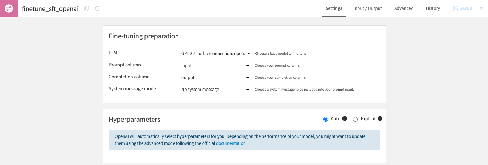
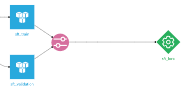
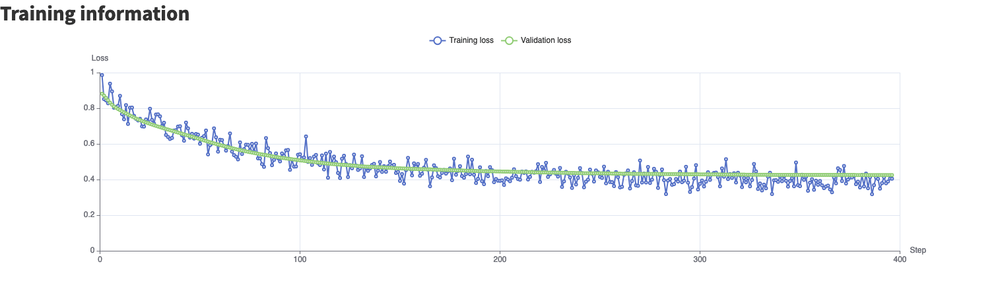
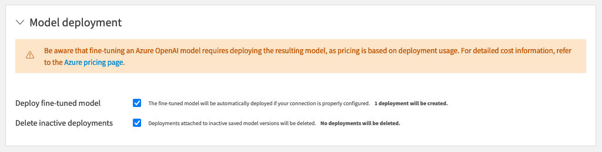
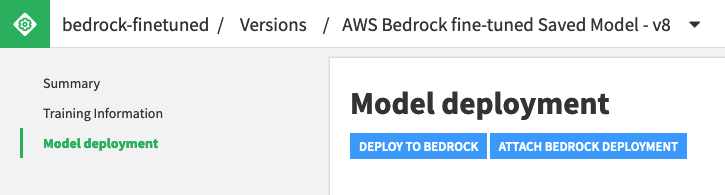

Fine-tuning
############

Fine-tuning in the LLM Mesh specializes a pre-trained model to perform better on a specific task or domain. It requires annotated data: prompts and their expected completions.
Fine-tuning can be resource-intensive, so evaluate your needs carefully.

Before resorting to fine-tuning, the :doc:`Prompt Studio <prompt-studio>` can be used to craft well-designed prompts to significantly improve the model's output without additional techniques.

Another option is to use :doc:`RAG <knowledge/index>`. RAG combines the LLM with a retrieval model that pulls in external knowledge.

Fine-tuning is really helpful for:

- domain-specific tasks: to improve the model's understanding of a particular domain.
- specialized outputs: when the required output format is more specialized.
- sensitive data: to ensure compliant and secure outputs for sensitive information.
- low-resource domains: if data for your use case is limited.

Fine-tuning is supported for OpenAI, Azure OpenAI, AWS Bedrock and Local HuggingFace models.

Setup
=====

You either need full outgoing Internet connectivity for downloading the models or preload them in the DSS model cache in air-gapped setups.

Your admin must create a :doc:`LLM connection </generative-ai/llm-connections>` with fine-tuning enabled. 

Azure OpenAI fine-tuning and deployment requires an AzureML connection. AWS Bedrock fine-tuning and deployment requires an S3 connection.

Using the Fine-tuning recipe
============================

.. note::

    The LLM fine-tuning recipe is available to customers with the *Advanced LLM Mesh* add-on

Standard usage
--------------

Import a dataset with two required columns : a prompt column (the input of the model) and a completion column (the ideal output). These columns must not contain missing values.

Optionally, the input dataset can include a system message column used to explain the task for a specific row. This column can contain missing values.

Run the recipe to obtain a fine-tuned model, ready for use in your LLM Mesh.

Advanced usage
--------------

The fine-tuning recipe also supports a validation dataset as input.

When present, the loss graph in the model summary will show the evolution of the loss evaluated against the validation dataset during the fine-tuning.

Deployments
-----------

Azure OpenAI and AWS Bedrock require fine-tuned models to be deployed before being used for inference.

.. warning::

    Deployments are billed regardless of usage and can be very costly. Refer to the `Azure OpenAI pricing page <https://azure.microsoft.com/en-us/pricing/details/cognitive-services/openai-service/>`_
    and the `AWS Bedrock pricing page <https://aws.amazon.com/bedrock/pricing/>`_ to learn more.

Model deployment lifecycle can be managed by DSS: when a new fine-tuned model version is produced or made active, it can be automatically deployed and any existing deployment deleted.

Deployments can also be managed manually from the dedicated "Model deployment" tab of the saved model version page. Any pre-existing deployment can be attached to a DSS model version.

Once deployed and active, Azure OpenAI and AWS Bedrock fine-tuned models can be used in the LLM Mesh like any other LLM.

Additional remarks
------------------

When fine-tuning a Local Huggingface model, the recipe will use the code environment defined at the connection level. Its container configuration can be set in the recipe settings. It is strongly advised to use a GPU to fine-tune HuggingFace models.

In all cases, the fine-tune recipe will **not** apply the guardrails defined in the connection (See :doc:`guardrails/index`)

Using Python code
=================

To have full control over the fine-tuning process, instead of the visual fine-tuning recipe presented above, you can also
:ref:`fine-tune a LLM using Python code<devguide:concept-and-examples-llm-mesh-fine-tuning>`.

A fine-tuning Python recipe can use one of the built-in fine-tuning code snippets or fully custom code. The only requirement is to produce a model using the safetensors format in a provided directory. The resulting fine-tuned model can be used as any other fine-tuned model within DSS.
