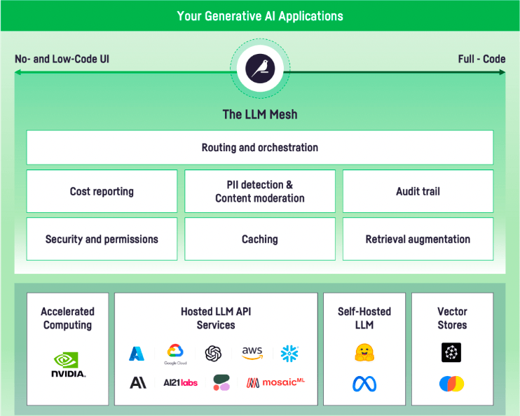

Introduction
#############

With the recent advances in Generative AI and particularly large language models, new kind of applications are ready to be built, leveraging their power to structure natural language, generate new content, and provide powerful question answering capabilities.

However, there is a lack of oversight, governance, and centralization, which hinders deployment of LLM-based applications.

The LLM Mesh is the common backbone for Enterprise Generative AI Applications.

Dataiku Generative AI Capabilities
===================================

The unified secure LLM Gateway
------------------------------

The LLM Mesh provides

* Connectivity to a large number of Large Language Models, both as APIs or locally hosted
* Full permissioning of access to these LLMs, through new kinds of connections
* Full support for locally-hosted HuggingFace models running on GPU
* Audit and tracing for all queries
* Cost monitoring and blocking to manage your Generative AI budget
* Advanced Guardrails to secure your usage of Generative AI, including PII detection, Toxicity Detection, and much more
* Governance of Generative AI Use cases
* Caching

Knowledge management
---------------------

The LLM Mesh also provides a unified interface to Knowledge Banks and Vector Stores to build Retrieval Augmented Generation (RAG) use cases.

The embedding recipes let you build Knowledge Banks from datasets or documents (such as PDF, DOC, PPT, ...) easily. These Knowledge Banks can then be queried in a secure fashion to provide contextual answers.

For more details, see :doc:`knowledge/index`.

Prompt Engineering and Execution
---------------------------------

On top of the LLM Mesh, Dataiku includes a full-featured development environment for Prompt Engineering, the *Prompt Studio*. In the Prompt Studio, you can test and iterate on your prompts, compare prompts, compare various LLMs (either APIs or locally hosted), and, when satisfied, deploy your prompts as Prompt Recipes for large-scale batch generation.

For more details, see :doc:`prompt-studio`.

Chatbot UI
----------

Dataiku includes two fully-featured Chatbot user interfaces, allowing you to expose rich chatbots to your users. They handle security, tracing, user preferences, history, and are customizable.

* Answers is a full-featured Chat interface for creating chat bots based on your internal knowledge and data
* Agent Connect is a more advanced multi-agent Chat interface for unified user access to multiple Generative AI use cases

For more details, see :doc:`chat-ui/index`

Agent builder
---------------

Dataiku contains a complete environment for building advanced agents, either visually or through code

Dataiku provides a complete system for managing Tools, one of the foundational building blocks of Agents.

Pervasive tracing, together with a visual traces explorer, simplify the development of advanced Generative AI applications.

For more details, see :doc:`/agents/index`

Fine Tuning
------------

Some specific use cases require adapting generic LLM models to your particular use case. Dataiku provides facilities for fine tuning LLMs, both visually or via code.

For more details, see :doc:`fine-tuning`.

Evaluation
----------

Evaluating the quality of the outputs of a LLM on a given use case is not a trivial task. Dataiku provides helpers and building blocks for this.

For more details, see :doc:`evaluation`

Using the LLM Mesh
===================

In addition to the mentioned capabilities (Prompt Studio, Prompt Recipe, Answers, Agent Connect), the LLM Mesh is fully available via :doc:`api`.

In addition, Dataiku includes two recipes that make it very easy to perform two common LLM-powered tasks:

* `Classifying text <https://knowledge.dataiku.com/latest/ml-analytics/gen-ai/concept-classification.html>`_ (either using classes that have been trained into the model, or classes that are provided by the user)
* `Summarizing text <https://knowledge.dataiku.com/latest/ml-analytics/gen-ai/concept-summarization.html>`_

