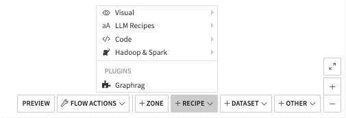
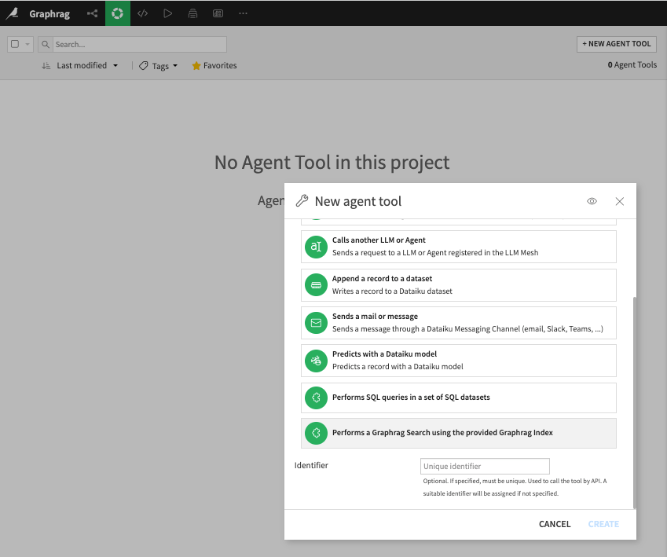

GraphRAG
#########

.. note::

    This capability is provided by the "GraphRAG" plugin, which you need to install. Please see :doc:`/plugins/installing`.

    This plugin is :doc:`Not supported </troubleshooting/support-tiers>`

Overview
--------

The **Dataiku GraphRAG Plugin** provides a seamless way to build and query a knowledge graph from your project data within Dataiku.

This plugin bundles two core components:

1. **GraphRAG Recipe**  
   A *Visual Recipe* that reads from a dataset, extracts relevant text and metadata, and builds a knowledge graph plus an associated "graph index" inside a **local managed folder** in Dataiku.  

2. **GraphRAG Search Tool**  
   An *Agent Tool* that enables you to perform searches against the generated GraphRAG index. It can be used within a **Visual Agent** to answer user queries, returning relevant text snippets and associated metadata from the knowledge graph.

Installation
------------

**Install the plugin**: From the *Plugins* section in Dataiku, import or add the GraphRAG plugin.

Once installed, the plugin components (“GraphRAG Recipe” and “GraphRAG Search Tool”) become available for use.

GraphRAG Recipe
---------------

The **GraphRAG Index** recipe is a standard Visual Recipe that reads from a single input dataset and writes its indexed output to a local managed folder of your choice. This output folder contains the knowledge graph files and the “graph index” used by subsequent queries.

1. **Create the Recipe**
    Click **+ Recipe** and choose **GraphRAG** from the plugin recipes list.
    |GraphRAGRecipe|

2. **Configure Settings**
    **LLMs Settings**  
       * **Chat Completion LLM**: Select the LLM used in various knowledge graph related taks (entities extraction, summarization,..
       * **Embedding LLM**: Select the LLM used to generate embeddings of the text
    **Metadata Settingss**  
       * **Text Column**:  Select which column in your dataset contains the primary textual data.
       * **Attribute Columns**: (Optional) Add any metadata columns you want to include in the knowledge graph.
    **Chunking**: 
       * Adjust the *Chunk Size* (in characters) and the *Overlap size* to control how large text blocks become for indexing and how much overlap in text is retained between blocks.
    **Graph Embedding Settings**: 
       * If enabled, the recipe can perform random walks on the knowledge graph to generate additional embeddings (helpful for advanced search features).
    **Entities Extraction**: 
       * Control the *types of entities* to extract (e.g. `organization`, `person`, `event`, etc.) and how many extraction iterations to run.

    **Prompts**
      In this section, you will find a series of prompt templates used in the recipe. When modifying these prompts, be sure to maintain the template variables and data format. Proceed with caution:  
        * Entities Extraction Prompt
        * Summarization Prompt
        * Community Reports Prompt 
        * Claim Extraction Prompt  

      Each prompt can be customized to fine-tune how the LLM processes and structures your data.

3. **Run the Recipe**
    After configuring all settings, **Run** the recipe.
    The plugin reads your dataset, applies chunking & entity extraction, and stores the resulting knowledge graph plus indexing structures into your chosen managed folder.

GraphRAG Search - Agent Tool
----------------------------

Once your knowledge graph has been built, you can query it using the **GraphRAG Search** tool. This tool is designed to be used within Dataiku’s *Visual Agent* interface.

1. **Create the tool**

   In Agent Tools section of you project, click **+ NEW AGENT TOOL** and choose the GraphRAG tool from the list.
   
   |GraphRAGTool|
     
2. **Parameters**
   
    **Managed Folder Containing the Index**  
       * Provide the local managed folder where you wrote the GraphRAG index (the same one you used as the recipe output).  
    **Search Type**  
       * *Local Search*: Focuses on more in-depth, narrower community-based queries in your dataset.  
       * *Global Search*: Searches across broader contexts, ignoring local community boundaries.  
    **Response Type**  
      * You can choose how you want the tool to structure its answer, e.g., *“multiple paragraphs”*, *“single paragraph”*, etc.
    **Default Community Level**  
      * When using local search, set how specific the search is in terms of community boundaries. Higher numbers yield more narrow results.
    **Description of the Available Content**  
      * (Optional) Provide a short text describing what is in your knowledge graph. This helps the Agent decision when to leverate the tool.

3. **Invoke the Tool**

    Once the tool is part of your Agent, you can use it in Agent Connect conversations, Prompt Recipe or using Dataiku API.
    
    The tool returns a final textual answer plus a list of “source items” (text snippets that were relevant for the answer).

