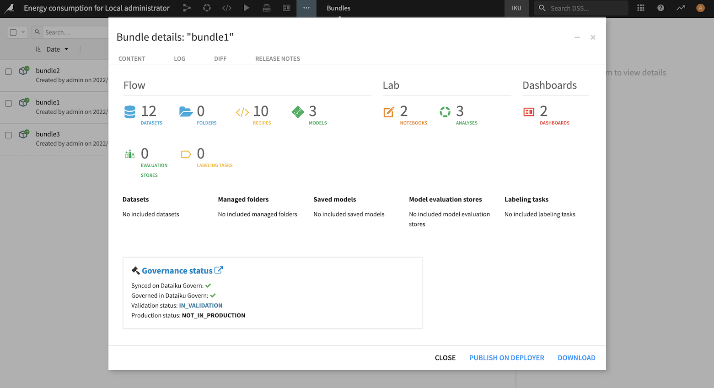

Governance Process Features
###########################

.. contents::
	:local:
	:depth: 2

.. _governance.actions:

Governance actions
==================

The **two key governance actions** for governable synced items, **Govern or Hide**, are automated or guided by policies configured on the :ref:`Governance settings page <governance.policy>`.

Hide - Exclude items from the Governance cycle
----------------------------------------------

**Hide action** means that **no governance action** is necessary. This will hide the item from Dataiku Govern user interface.

Governance **rules** are applied **based on the hierarchical structure of Dataiku items**. Below are the rules that you must know:

- If a parent is hidden then the children will be automatically hidden. For example, if a saved model is hidden then all the related saved model versions will be hidden.
- The hidden state is not a deletion. This state will not affect the visibility in other nodes and the user can still decide to put the item in a "governable" or "governed" state.

Govern - Apply a Governance layer
---------------------------------

Applying a **governance layer** enables governance qualification by applying a structured process with a Workflow and a review process with a Sign-off.

**A Standard template** is available for **each item type**. It is also possible to define specific templates according to the governance need. More specifically, you can customize the Govern item content by defining fields, views, the :ref:`Workflow <custom.workflow>`, and the :ref:`Sign-off  <custom.sign-off>` definition by using the :doc:`blueprint-designer/index`. 

**Governance rules** are applied **based on the hierarchical structure of Dataiku items**. Below are the rules that you must know:

- An item can be governed only if its parents are governed. For example, a saved model version can only be governed if the associated model and project are governed.
- By default, upcoming items inherit rules from the instance Governance settings page.

.. seealso:: 
	More information is available in `Concept | Adding a governance layer to Dataiku items <https://knowledge.dataiku.com/latest/mlops-o16n/govern/concept-adding-governance.html>`_.

Notifications
=============

Notifications in Dataiku Govern are **configured around sign-offs**. If a user is included in a sign-off, Dataiku Govern will notify them when an important status change occurs.

Email notifications
-------------------

Emails notifications can be sent to users who:

* Were automatically subscribed.
* Have explicitly subscribed an item and its children if applicable.

Email are sent to users when:

* Feedback or Final approval is submitted.
* Feedback or Final approval is edited. Notifications are only sent for status changes and not for edits to comments.
* A sign-off is abandoned. 
* A sign-off is canceled. 
* A sign-off is reset. 
* A sign-off reset is scheduled (Advanced license feature).

Emails can be sent to **specific users** when:

* Delegating Feedback or Final approval.

Notification subscriptions
--------------------------

Users are automatically subscribed when they: 

* Create/govern, edit, or save a Govern item.
  
  .. note::
    If you govern a project by attaching it to an *existing* Govern project, Dataiku will automatically subscribe the user to the existing Govern project even though it is not an item creation.

* Submit Feedback or a Final approval.
* Edit Feedback or a Final  approval. 
* Abandon a sign-off.
* Cancel a sign-off.
* Reset a sign-off.
* Schedule a sign-off (Advanced license feature).

Users can find the option to **unsubscribe** from the header of the item page or from the footer of a notification email. 

.. note::
	
	Email notifications must be configured by your administrator first. See :ref:`governance.email` for more details.

.. seealso:: 
		To learn more, see `How-to | Subscribe to email notifications <https://knowledge.dataiku.com/latest/mlops-o16n/govern/how-to-subscribe-emails.html>`_.

Governance across Dataiku nodes
================================

While the Govern node syncs metadata from Dataiku nodes, Dataiku nodes also sync information from the Govern node.

For example, a **Governance status** section is visible on the Design node for each model version of saved models in its summary page, letting you know at which stage of the Governance workflow process your model is.

Similarly, in the bundle summary, there is a governance status section: 

.. contents::
		:local:
		:depth: 1
		:backlinks: top