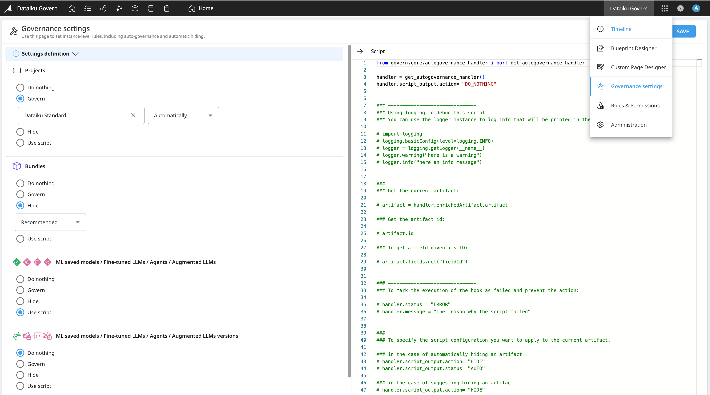

Instance Governance policies
############################

.. _governance.policy:

From the :ref:`Application Menu <application.menu>`, the **Governance settings page** allows administrator to define governance rules for the entire instance.

There are different ways to define the :ref:`Governance action <governance.actions>` to apply on items:

- **Automated**: Automatically apply the governance action without any manual user intervention as soon as items are synced or updated.
- **Recommended**: Suggests the most suitable governance decision to make from the governance modal.
- **Do Nothing**: Manually choose the governance action to apply from the governance modal.

Rules coming from this settings will be identified by an ``Instance rules`` tag. Instance rules can be overridden on "parent items", which will then be tagged with:

- ``Custom rules`` for projects.
- ``Project rules`` for bundles and models.
- ``Model rules`` for model versions.

.. warning::
	Auto-governance will be applied only if the parents are governed.

With the **Advanced license**, it is also possible to **script the governance policies**, allowing for the creation of specific rules based on underlying asset metadata, such as *tags* or *AI Types*. Furthermore, governance policies can be extended to related items, including the versions of a model.

.. seealso:: 
	Refer to the Developer Guide for `examples of Governance settings scripts <https://developer.dataiku.com/latest/concepts-and-examples/govern/govern-advanced/index.html>`_.