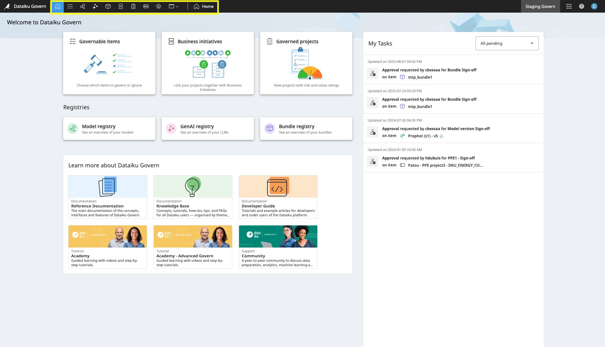
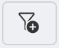
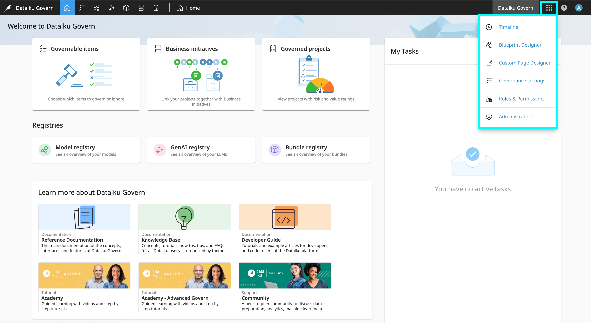

Navigation in Dataiku Govern
############################

Dataiku Govern's interface is organized into two main navigation areas: the **main navigation menu** and the **Application menu**.

.. contents::
	:local:

Pages from the top navigation bar
=================================

Pages from the top navigation bar are the main working spaces where all **synced and governed items are organized**.
All of these pages feature a table that can display items as a **flat list, grouped by type, or with hierarchical relationships**.

Standard Dataiku Govern pages
-----------------------------

0. The **Home** page is the main landing page, offering a quick overview of your review tasks and access to essential resources like the Reference Documentation, Knowledge Base, Developer Guide and Academy.

1. The **Governable items** page acts as an inbox for all synced items that have not been governed yet, highlighting what needs your attention.

2. The **Model registry** page is a central repository for a hierarchical, project-based view of your models. Here, you can review model status, performance, and deployment metrics, track input drift, and see whether a model is governed and its current state (e.g., in production, waiting for approval, etc.).
	
3. The **GenAI registry** page is a central repository for a hierarchical, project-based view of your generative AI assets. This includes fine-tuned LLMs, Agents, and Augmented LLMs, each with their respective versions.
	
4. The **Bundle registry** page is a central repository that provides a hierarchical, project-based view of your bundles. Here you can easily review their status, track whether a bundle is governed and its current state (e.g., in production, waiting for approval), and drill down for more detailed information. 

5. The **Business initiatives** page provides a comprehensive list of your organization’s business initiatives. In addition to the **Matrix** view, it also offers **Kanban** view for flexible visualization, management, and monitoring.
	
6. The **Governed projects** page is a list of all projects that have been officially brought under governance. For flexible visualization and monitoring, the page can be displayed in both a **Matrix** and a **Kanban** view.

Views of pages
--------------

**Filters**

	
Tables can be filtered with the page header. In addition to the pre-defined filters that you can use, there is an option |CustomfilterIcon| to refine your results further. Using the filter button, you can define logical operations and conditions to meet your requirements. The conditions you create can filter field values, workflow steps, sign-off statuses, and more.

**Access to additional metadata**

A right-hand panel on every page shows both synced and governance metadata. Depending on the item selected in the table or card you will be able to see the metadata linked to the item.

.. _application.menu:

Pages from the waffle menu
==========================

The waffle menu provides access to history, design and core administrative functions.

**Access your Govern instance history**

- The **Timeline** page is a centralized hub for viewing a history of all item-related events, including creations, updates, and deletions.

**Customize your governance processes**

- The **Blueprint Designer** page allows you to create custom governance templates.
- The **Custom Pages Designer** page allows you to create custom pages for the instance.

**Security and governance policies configurations**

- The **Governance Settings** page allows you to configure your instance's specific governance policies.
- The **Roles and Permissions** page allows you to define and manage user access rights for specific items.
- The **Administration** page helps you to manage core system functions. This includes security, logs, user setup, authentication, and notifications.

