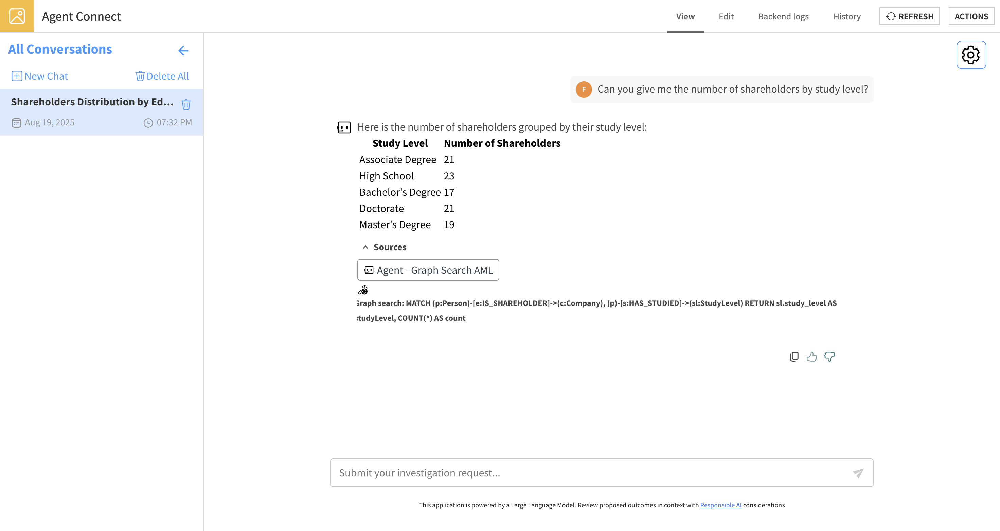

Graph Search Agent Tool
#######################

Once you have published a graph configuration from the :doc:`Editor <./editor>` webapp, the resulting graph can be leveraged as a dynamic knowledge base for Retrieval-Augmented Generation (RAG) applications using the **Graph Search** Agent Tool.

This tool integrates with Dataiku's agent framework, enabling an LLM to translate natural language questions into Cypher queries.
The queries are executed against your graph, and the results are returned to the agent to provide contextually accurate answers.

Settings
-------------
- **LLM Connection**: Select the language model that will handle the natural language-to-Cypher conversion.
- **Folder containing the graph database**: Choose the Dataiku Folder containing your published graph database.
- **Cypher query timeout (seconds)**: Set a maximum execution time for queries. This acts as a crucial guardrail to prevent long-running queries from impacting performance.
- **Tool instructions**: Provide a concise, high-level description of the graph's content and purpose. This text gives the LLM additional context to improve query generation. You do not need to describe the schema itself, as it is automatically included in the context.