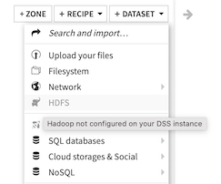
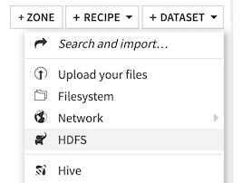

Setting up Hadoop integration
###############################

.. contents::
	:local:

DSS is able to connect to a Hadoop cluster and to:

* Read and write HDFS datasets
* Run Hive queries and scripts
* Run Impala queries
* Run preparation recipes on Hadoop

In addition, if you :doc:`setup Spark integration </spark/installation>`, you can:

* Run most visual recipes on Spark
* Run SparkSQL queries
* Run PySpark, SparkR and Spark Scala scripts
* Train & use Spark MLLib models
* Run machine learning scoring recipes on Spark

Prerequisites
=============

Supported distributions
------------------------

DSS supports the following Hadoop distributions:

* Cloudera's CDP (see :doc:`CDP-specific notes <distributions/cdp>`)

Check each distribution-specific page for supported versions, special installation steps or restrictions.

Non supported distributions
---------------------------------------

DSS does not provide support for custom-built or other Hadoop distributions.

Software install
-----------------

The host running DSS should have client access to the cluster (it can, but it does not need to host any cluster role like a datanode).

Getting client access to the cluster normally involves installing:

- the Hadoop client libraries (Java jars) matching the Hadoop distribution running on the cluster.
- the Hadoop configuration files so that client processes (including DSS) can find and connect to the cluster.

Both of the above operations are typically best done through your cluster manager interface, by adding the DSS machine
to the set of hosts managed by the cluster manager, and configuring "client" or "gateway" roles for it (also sometimes called "edge node").

If not possible, installing the client libraries usually consists in installing software packages from your Hadoop distribution,
and the configuration files can be typically be downloaded from the cluster manager interface, or simply copied from another server
connected to the cluster. See the documentation of your cluster distribution.

The above should be done at least for the HDFS and Yarn/MapReduce subsystems, and optionally for Hive if you plan to use these
with DSS.

.. warning::

	Dataiku highly recommends "edge node" managed setup. 

	Manually installing libraries, binaries and configuration on another machine
	can be a challenging setup, for which your Hadoop distribution will usually not provide support. Dataiku cannot provide support for this either as this is highly dependent on your setup. Dataiku will require that all of the components are fully functional on your machine before a Dataiku setup can be performed.

HDFS
-----

You may also need to setup a writable HDFS home directory for DSS (typically "/user/dataiku") if you plan to store DSS datasets in HDFS,

Hive
-----

You need to have access to one or several writable Hive metastore database (default "dataiku") so that DSS can create Hive table definitions for the datasets
it creates on HDFS.

You must have a running Hiveserver2 server.

Several Hive security modes are supported. See :doc:`/hadoop/hive` for more information.

Testing Hadoop connnectivity prior to installation
====================================================

First, test that the machine running DSS has proper Hadoop connectivity.

A prerequisite is to have the "hadoop" binary in your PATH.
To test it, simply run:

.. code-block:: bash

	hadoop version

It should display version information for your Hadoop distribution.

You can check HDFS connectivity by running the following command from the DSS account:

.. code-block:: bash

	hdfs dfs -ls /
	# Or the following alternate form for older installations, and MapR distributions
	hadoop fs -ls /

hive binary
-------------

If you want to run Hive recipes using "Hive CLI" mode, you need a properly configured "hive" command line client for the DSS user account (available in the PATH).

You can check Hive connectivity by running the following command from the DSS account:

.. code-block:: bash

	hive -e "show databases"

If it succeeds, and lists the databases declared in your global Hive metastore, your Hive installation is correctly set up for DSS to use it.

This is only required if you intend on using the "Hive CLI" mode of Hive recipes. For more information on Hive recipe modes, see :ref:`hadoop.hive.execution-engines`

.. _hadoop.integration:

Setting up DSS Hadoop integration
==================================

.. warning::

	If your Hadoop cluster has Kerberos security enabled, please don't follow these instructions. Head over to :doc:`secure-clusters`.

If your Hadoop cluster does not have security (Kerberos) enabled, DSS automatically checks for Hadoop connectivity at installation time, and automatically configures Hadoop integration if possible. You don't need to perform the ``dsadmin install-hadoop-integration`` step. You still need to perform Hive and Impala configuration, though.

You can configure or reconfigure DSS Hadoop integration at any further time:

* Go to the DSS data directory

.. code-block:: bash

	cd DATADIR

* Stop DSS:

.. code-block:: bash

	./bin/dss stop

* Run the setup script

.. code-block:: bash

	./bin/dssadmin install-hadoop-integration

* Restart DSS

.. code-block:: bash

	./bin/dss start

.. warning ::
	You should reconfigure Hadoop integration using the above procedure whenever your cluster installation changes, such as after
	an upgrade of your cluster software.

.. _hadoop.installation.test-hdfs-connection:

Test HDFS connection
---------------------

To test HDFS connectivity, try to create an HDFS dataset:

   With Hadoop integration disabled

   With Hadoop integration enabled

.. note::

	If the Hadoop HDFS button does not appear, Data Science Studio has not properly detected your Hadoop installation.

You can then select the "hdfs_root" connection (which gives access to the whole HDFS hierarchy) and click the Browse button and verify that you can see your HDFS data.

Upon first setup of DSS Hadoop integration, two HDFS connections are defined: "hdfs_root" for read-only access to the entire HDFS filesystem, "hdfs_managed" to store DSS-generated datasets. You can edit these default connections, in particular their HDFS root path and default Hive database name, to match your installation. You can delete them or define additional ones as needed.

For more information, see :doc:`hadoop-fs-connections`

.. _hadoop.installation.standalone:

Standalone Hadoop integration
-----------------------------

If you do not have a Hadoop cluster but want to set up a standalone hadoop integration, you can download the provided ``dataiku-dss-hadoop-standalone-libs-generic-hadoop3`` binary from your usual Dataiku DSS download site. You can then run the standalone hadoop integration:

.. code-block:: bash

    cd DATADIR
    ./bin/dss stop
    ./bin/dssadmin install-hadoop-integration -standalone generic-hadoop3 -standaloneArchive /PATH/TO/dataiku-dss-hadoop3-standalone-libs-generic...tar.gz
    ./bin/dss start

.. _hadoop.installation.configure-hive-connectivity:

Configure Hive connectivity
-----------------------------

For DSS to be able to read and write Hive table definitions, you must setup the host of your HiveServer2.

Go to Administration > Settings > Hive, enter the host name of your HiveServer2, and save settings.

For more information, see :doc:`hive`

If you want to run Hive recipes using "Hive CLI" mode, you also need a properly configured "hive" command line client for the DSS user account.

Configure Impala connectivity
------------------------------

If your Hadoop cluster has Impala, you need to configure the impalad hosts.

Go to Administration > Settings > Impala, enable Impala, enter the list of Impala servers (if none is set, then the localhost will be used), and save settings.

For more information, see :doc:`impala`.

Secure Hadoop connectivity
==========================

Connecting to secure Hadoop clusters requires additional configuration steps described in :doc:`secure-clusters`.
