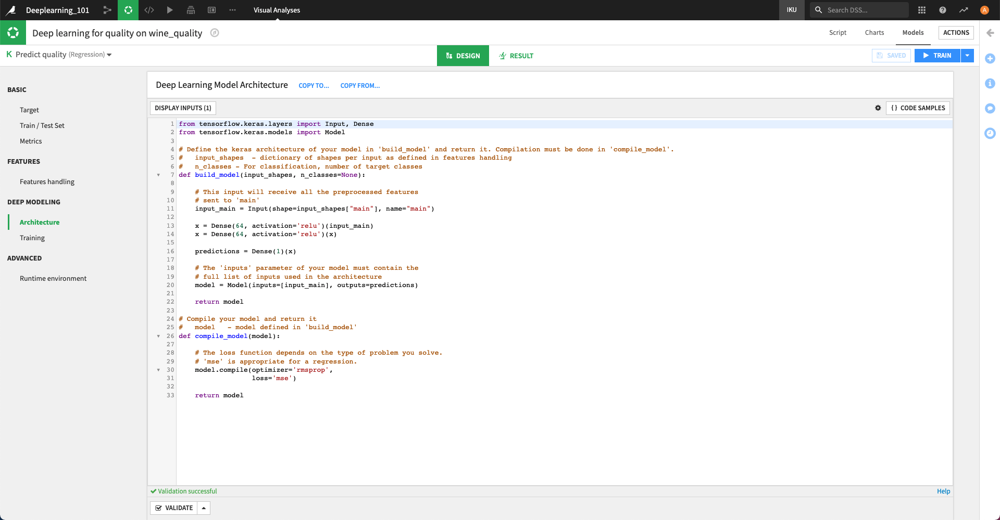

Model architecture
####################

When creating a Deep Learning model, you need to write the Architecture of the Neural Network. To do so, you must fill two Python functions defined in the "Architecture" tab of the settings.

Build Keras model
==================

The ``build_model`` function needs to return an instance of the `Model <https://www.tensorflow.org/api_docs/python/tf/keras/Model>`_ class.

This function takes two parameters:

* ``input_shapes`` - a dictionary of the shapes of the input tensors
* ``n_classes`` - the number of classes to predict (for classification models only)

input_shapes
-------------

Advanced models can have multiple inputs (see :doc:`inputs` for more information). Each input has a name.

The ``input_shapes`` variable is a dictionary indexed by input name. In most cases, the shape of the inputs is unknown prior to preprocessing, which will create a variable number of columns (e.g. dummification, vectorization ...). Thus, they are provided to you to assist when building your model.
If you haven't used multi-input features, you only have a ``main`` input. Thus, to know the shape of your input tensor, simply use ``input_shapes["main"]``

For example,

.. code-block:: python

	input_main = Input(shape=input_shapes["main"])
	x = Dense(64, activation="relu")(input_main)
	...

n_classes
----------

``n_classes`` - the number of target classes when performing multiclass classification

Layer dimensions
-----------------

You need to be careful with the dimensions of the last layer of your network:

* For regression, the last layer needs to have a dimension equal to 1, and it should generally not have any activation.
* For binary classification, the last layer should be either: dimension equal to 1 and sigmoid activation, or dimension equal to 2 and softmax activation.
* For multiclass classification, the last layer should have a dimension equal to the number of target classes, and a softmax activation.

If this is not respected, training will either fail (mismatch in dimension) or give inconsistent results (when using an incorrect activation the result may not be a probability distribution).

Compile the model
=================

The ``compile_model`` function takes the previously created model as input and calls its `compile <https://www.tensorflow.org/api_docs/python/tf/keras/Model#compile>`_ method. It is separated from the ``build_model`` function, as DSS may need to manipulate the model between creation and compilation, in particular for multi-GPU training.

The ``compile`` function also optionally accepts a list of metrics to track during training. DSS also always computes some metrics (see :doc:`advanced` for the list) that will be available in TensorBoard afterwards.

The two arguments that need to be carefully provided are:

* `optimizer <https://www.tensorflow.org/api_docs/python/tf/keras/optimizers>`_, which is the method used to optimize the model
* `loss <https://www.tensorflow.org/api_docs/python/tf/keras/losses>`_ function, which is the function optimized during training. Loss functions are specific to the prediction type (Regression/Classification). By default DSS selects a suitable one based on the prediction type guessed in the analysis.
