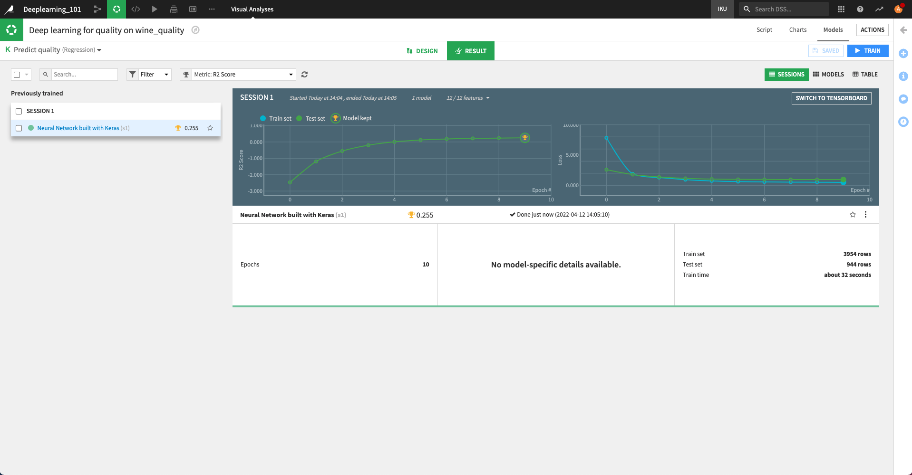

Your first deep learning model
###############################

Here is how you can quickly build a Deep Learning model and train it on CPU.

.. contents::
    :local:

Create a code environment with the required packages
======================================================

First, you need the appropriate packages to be able to run the model. To do so, you need to:

* Create a new :doc:`code environment </code-envs/index>`. Supported Python versions are 3.8 to 3.13.
* Go to the "Packages to install" tab of this code-env and click "Add sets of packages"
* Select "Visual Deep Learning: Tensorflow" and click "Add"
* Update your code-env.

You are now ready to build your Deep Learning model (See :doc:`runtime-gpu` for more information on how code environments are used for Deep Learning).

Create a Deep Learning analysis to solve a Prediction problem
==============================================================

Select a dataset for which you have a **target** column that you want to predict depending on the values of the other columns of the dataset. Then:

* Select the Lab
* Select Quick model then Prediction
* Choose your target variable (one of the columns) and Expert Mode
* Choose Deep Learning and click Create

Review the architecture of you Deep Learning model
==================================================

DSS then creates a Multi Layer Perceptron architecture that you can modify to any Deep Learning architecture. It is written in the `build_model` function of the "Architecture" tab and should look like:

.. code-block:: python

    def build_model(input_shapes, n_classes=None):

        # This input will receive all the preprocessed features
        # sent to 'main'
        input_main = Input(shape=input_shapes["main"], name="main")

        x = Dense(64, activation='relu')(input_main)
        x = Dense(64, activation='relu')(x)

        predictions = Dense(1)(x)

        # The 'inputs' parameter of your model must contain the
        # full list of inputs used in the architecture
        model = Model(inputs=[input_main], outputs=predictions)

        return model

The precise architecture may vary if you have a dataset with particular data types, such as text, because DSS adapts the default architecture depending on data types.

The model is written using the Keras API, and defines an `Input`, that will receive the preprocessed features from your dataset, then three fully connected `Dense` layers.

Click on Train.

Monitor the performance of your model during the training
=========================================================

You will then see charts that track the performance of the model and the progress in the training.

Once the training is completed, you can assess its performance, then deploy it, score it, retrain it like any other Visual Machine Learning model in DSS.

For a more detailed walkthrough, see an `Introduction to Deep Learning with Code <https://knowledge.dataiku.com/latest/ml-analytics/deep-learning/code-within-visual-ml/tutorial-index.html>`_.
