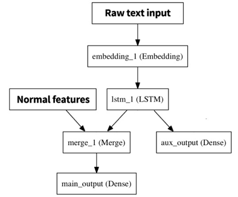
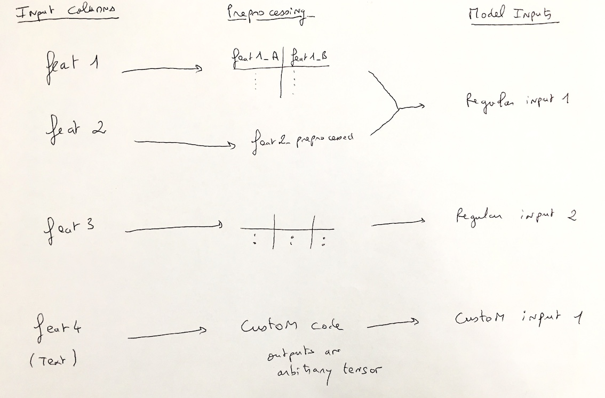

Multiple inputs
#################

It is possible for a deep learning model architecture to have more than one input.

For example, when working with Tweets, you may want to analyse the text of the tweet, but also its metadata (when was the tweet emitted, how many retweets did it generate, how many followers its author has, ...). However, it is not possible to directly compare text and numerical data. Therefore you need to first "transform" the text into numerical data with a recurrent network, then "connect" it to the metadata. The architecture may look like:

DSS can handle these architectures, and you can define which preprocessed feature goes to which deep learning input.

By default, all the input features of your model are preprocessed, which gives a numerical array.  This numerical array is sent to a `main` deep learning input.

You can add two kinds of deep learning model inputs:

* "Regular multi-feature inputs" which receive the preprocessed numerical array from the "regular" preprocessing of one or multiple input features.

* "Custom-processed single-feature inputs" where a custom preprocessor creates a tensor from a single input feature. The tensor may have arbitrary shape.

To create a new input, go in the *Model inputs* section of the "Architecture" tab (accessible by clicking on "Display Inputs" button on the top left).

Each input has a name, and you then configure your features to send data to inputs.

In the architecture code, you receive all inputs as a dictionary. There is a helper to insert inputs in the right way in the Input section.

Regular multi-feature inputs
=============================

Most preprocessing done in the DSS :doc:`../features-handling/index` pipeline conceptually takes one column from the input dataset and converts it into one or more columns in the resulting data frame.

Multiple input features, once preprocessed, thus generate a wider data frame which can then become a 2-dimensional tensor ``(batch_size, number_of_preprocessed_output_columns)``

To create a new deep learning regular multi-feature input, go in the *Model inputs* section of the "Architecture" tab (accessible by clicking on "Display Inputs" button on the top left).

Then, to populate it, go to the "Feature handling" tab, where you can select which deep learning input you want to send each input. To be faster, you can use the mass action functionality.

To use this input in your architecture, you use:

.. code-block:: python

	input_main = Input(shape=input_shapes["main"], name="main")

For this kind of input, the input_shape is provided by DSS (as part of the ``input_shapes`` dict), because the user does not know a priori how many columns were generated through the preprocessing (with dummification, vectorization...).

Custom-processed single-feature inputs
========================================

Most preprocessings take one column and convert it into one or more columns. It is then simple to concatenate all the resulting columns to build an array that will be sent to the model. However, for deep learning, some preprocessings might return exotic shapes. In particular, for text and images, the output of the preprocessing might have 3 or more dimensions. Thus, they cannot be processed using regular preprocessing.

These cases are handled through custom-processed single-feature inputs. These deep learning inputs are automatically created by DSS and not editable when you select "Custom processing" for a text or image feature.

Custom-processed single-feature inputs hold the output of a single preprocessing for which we consider that it is special, i.e. that can be an array of any shape. For the time being, preprocessings that create this kind of inputs are:

* Custom processing for Text feature
* Custom processing for Image feature

When using these preprocessing, the output is sent to a newly created ``featureName_preprocessed`` deep learning input. You cannot modify this behaviour.

Besides, to prevent from using too much memory, custom text preprocessings are only fitted before running the model, not transformed. This means that DSS does not know the actual shape of the output of the preprocessing, and it is up to the user to fill the input_shape of the corresponding input in the model.

Note that there is no ``fit`` capability for custom image preprocessing.

See :doc:`images` and :doc:`text` for more information and examples of custom-processed single-feature inputs.
