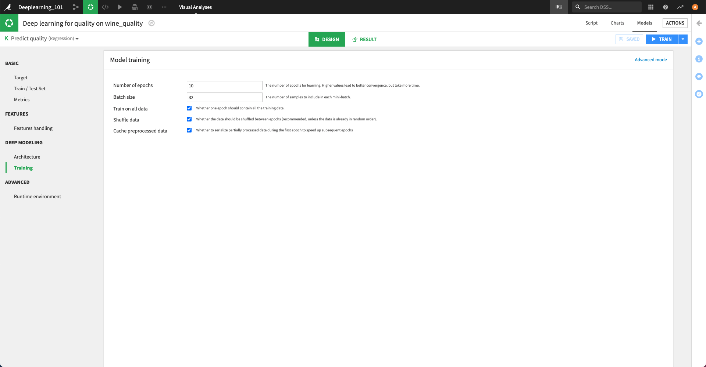

Training
########

The Training tab of the settings contains a set of parameters which indicates how the model will be trained.

To further customize the training of the model, you can switch to :doc:`Advanced training mode <advanced>`
