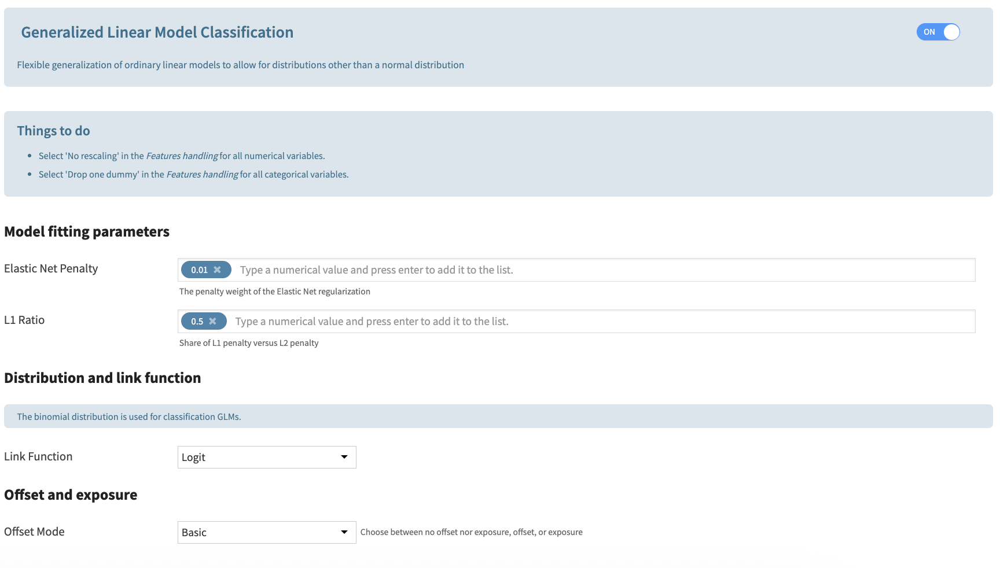

Binary Classification
#######################

When the user selects binary classification, the Generalized Linear Model is also added. It contains the same parametrization as the regression. The only choice for GLM Binary Classification Distribution is the Binomial distribution. When combined with the logit function, it is called logistic regression.

* Elastic Net Penalty: constant that multiplies the elastic net penalty terms. For unregularized fitting, set the value to 0.
* L1 ratio: specify what ratio to assign to an L1 vs L2 penalty.
* Distribution: For binary classification, the only available distribution is Binomial.
* Link Function: The function linking the linear regression to the response. The available functions depend on the distribution choice. Some of these functions require additional parametrization that will appear on the screen if needed.
* Mode: The user can either choose not to add offsets or exposures, or to add some. To add exposures columns, the link function must be the log function.
* Training Dataset: When selecting to add offsets or exposures, the user must input the training dataset, which should be associated with the analysis.
* Offset Columns: The names of the offset columns. The offset variables are added to the linear regression (which consists of adding variables with fixed coefficients with value 1).
* Exposure Columns: The names of the exposure columns. The exposure variables are treated exactly like the offset variables but the log function is applied. This is only available when selecting a log function.

.. note::
	By default, categorical variables are Dummy encoded and no Dummy is dropped. To avoid collinearity between variables, the user should select **Drop Dummy > Drop one Dummy**.

	By default, standard rescaling is applied to numerical variables. To make sure variables are not modified in the preprocessing, the user should select **Rescaling > No rescaling**. This is particularly important when using variables as offsets or exposures (in the case of exposure, as the log of variable is computed, an error may be raised because of negative values).