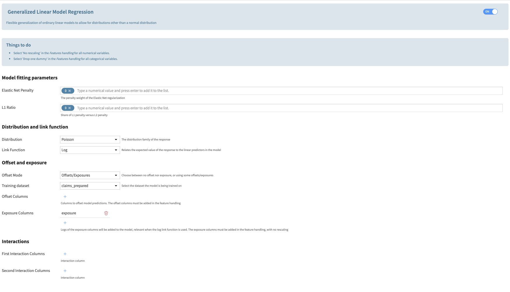

Regression
############

In the visual ML, when selecting a Prediction type, Generalized Linear Models become available in algorithms. The user needs to activate the algorithm and then configure it by inputting the parameters:

* Elastic Net Penalty: constant that multiplies the elastic net penalty terms. For unregularized fitting, set the value to 0.
* L1 ratio: specify what ratio to assign to an L1 vs L2 penalty.
* Distribution: The distribution of the response variable, to be chosen from the list of available distributions (Binomial, Gamma, Gaussian, Inverse Gaussian, Poisson, Negative Binomial, Tweedie). Some of these distributions require additional parametrization that will appear on the screen if needed.
* Link Function: The function linking the linear regression to the response. The available functions depend on the distribution choice. Some of these functions require additional parametrization that will appear on the screen if needed.
* Mode: The user can either choose not to add offsets or exposures, or to add some. To add exposures columns, the link function must be the log function.
* Training Dataset: When selecting to add offsets or exposures, the user must input the training dataset, which should be associated with the analysis.
* Offset Columns: The names of the offset columns. The offset variables are added to the linear regression (which consists of adding variables with fixed coefficients with value 1).
* Exposure Columns: The names of the exposure columns. The exposure variables are treated exactly like the offset variables but the log function is applied. This is only available when selecting a log function.

Interactions: The user can choose to add interactions between variables. The interaction terms are added to the linear regression. The user can define interactions between two variables. Each variable can be either numerical or categorical. The interaction between two categorical variables is implemented as a one-hot encoding of the cross-product of the two variables. The interaction between a numerical and a categorical variable is implemented as a multiplication of the numerical variable by the one-hot encoding of the categorical variable. The interaction between two numerical variables is implemented as a multiplication of the two variables.

.. note::
	By default, categorical variables are Dummy encoded and no Dummy is dropped. To avoid collinearity between variables, the user should select **Drop Dummy > Drop one Dummy**.

	By default, standard rescaling is applied to numerical variables. To make sure variables are not modified in the preprocessing, the user should select **Rescaling > No rescaling**. This is particularly important when using variables as offsets or exposures (in the case of exposure, as the log of variable is computed, an error may be raised because of negative values).
