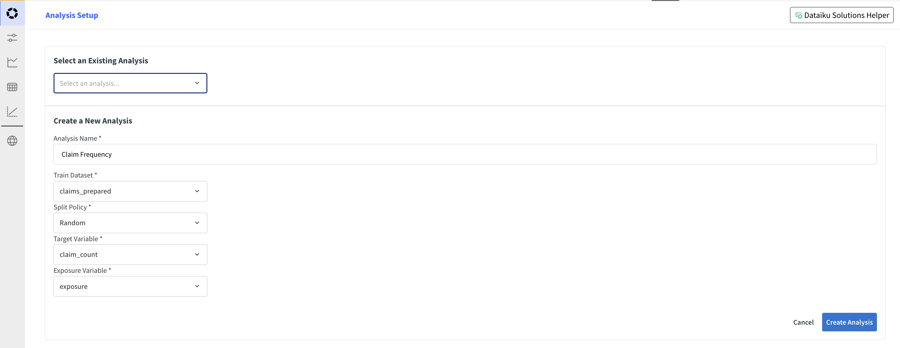
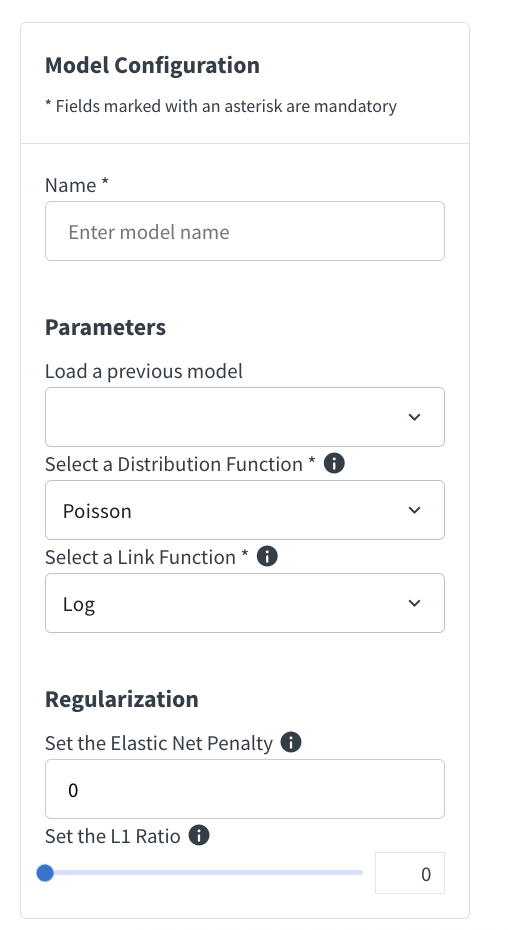
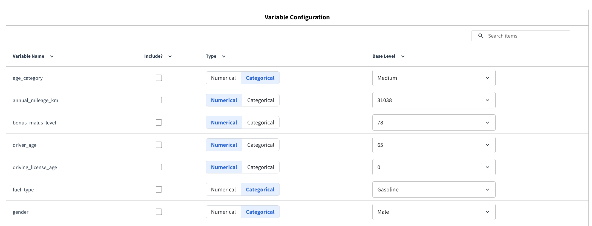
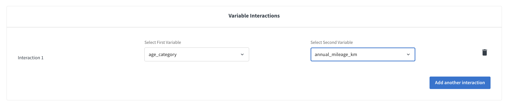
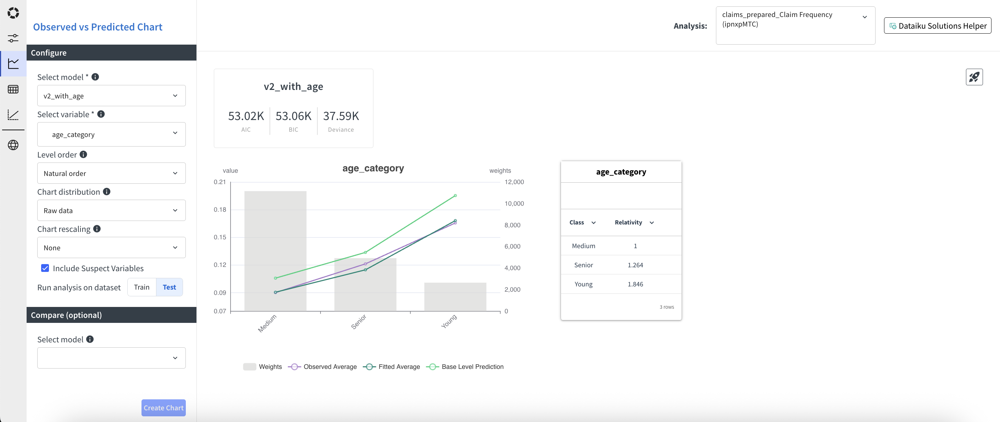
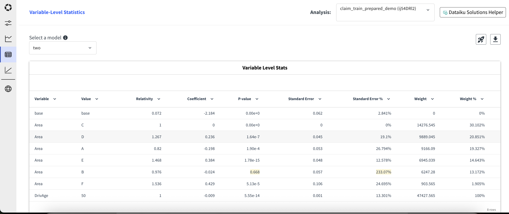
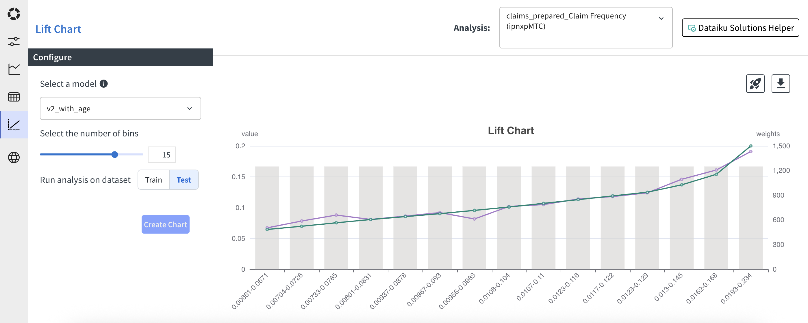
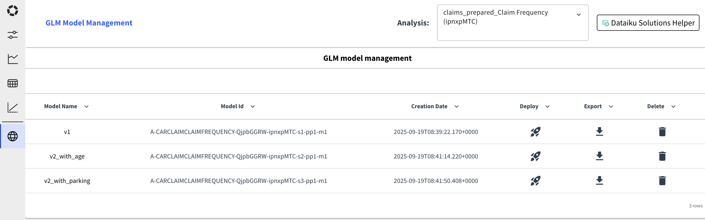

Visual GLM
############

The Visual GLM (Generalized Linear Model) is an interface that allows users to build and visualize GLM models easily. It provides a user-friendly way to configure analyses, then define model parameters, select variables, visualize the results, and deploy models.

.. contents:: :depth: 1
    :local:

.. _visual-glm-webapp-setup:

Visual GLM: Webapp Setup
===========================

Once the GLM plugin is installed, a new webapp named **Visual GLM** is available in the list of Visual Webapps. To use it, the user must create a new webapp instance, name it and start it. No additional configuration is needed at this stage.

.. _visual-glm-analysis-setup:

Visual GLM: Analysis Setup
===========================

**Get started** by following this `tutorial <https://knowledge.dataiku.com/latest/ml-analytics/glm/tutorial-glm.html>`_.

In the Analysis Setup screen, select an existing analysis or create a new one specifying the needed parameters.

The created analysis can also be found in the list of visual analyses in the project. Only analyses that are Visual GLM compatible are shown in the list.

.. _visual-glm-model-variable-configuration:

Visual GLM: Model Variable Configuration
=========================================

Once the analysis is selected, navigate to the **Model/Variable Configuration** tab to configure the model parameters and select the variables to include in the model.

In the model configuration screen, you can setup your model and name it for training.

The variable configuration section allows you to select the variables to include in the model, and how to preprocess them.

Interactions can be defined between pairs of variables that are included in the model. Interactions can be between:

* Two categorical variables. the interaction is implemented as a one-hot encoding of the cross-product of the two variables.
* A numerical and a categorical variable. the interaction is implemented as a multiplication of the numerical variable by the one-hot encoding of the categorical variable.
* Two numerical variables. the interaction is implemented as a multiplication of the two variables.

Select interaction pairs through the dropdowns and click on **Add Interaction** to add additional interactions.

Once all the configurations are set, you can train the model by clicking on the **Train Model** button. This will trigger a model training session in the analysis session.

.. _visual-glm-predicted-vs-observed:

Visual GLM: Observed vs. Predicted
===================================

Trained models can be evaluated in the **Observed vs. Predicted** tab. In this tab, you can analyze for each model and variable how the predicted values compare to the observed values. For variables that are included in the model, you can also check relativities. In addition, a few global fit metrics are provided.

**Get started** by following this `tutorial <https://knowledge.dataiku.com/latest/ml-analytics/glm/tutorial-glm.html>`_.

Chart Setup
--------------------------------

Aside from selecting the model and the variable, some more options are available to customize the chart:

* Level order (Natural order, Ascending predicted, Descending predicted, Ascending observed, Descending observed)
* Chart distribution (Raw data, Binning). Works for both numerical and categorical variables. For numerical variables, the bins are uniformly distributed. For categorical variables, the top categories in terms of exposure are kept and the others are regrouped in an other category.
* Number of bins (only when binning is selected).
* Chart rescaling (None, Base Level, Ratio). Base level rescaling means that the values are rescaled so that the base level has value 1. Ratio rescaling means that the predicted values are divided by the observed values.

Then you have the option to display only variables included in the model or also suspect variables. Finally, you select if you want to display the chart for the training set or for the test set.

You also can select a second model to be compared with the first one. This will show the goodness of fit metrics, the predicted and base prediction lines in the chart and the relativities (if included) for both models.

In the top right corner you can press the Deploy button to deploy the main selected model.

Metrics
---------

The following metrics are provided for each model:

* AIC: Akaike Information Criterion, a measure of the relative quality of a statistical model for a given set of data.
* BIC: Bayesian Information Criterion, a criterion for model selection among a finite set of models
* Deviance: A measure of goodness of fit of a model. It is a generalization of the residual sum of squares in linear regression.

Observed vs. Predicted chart
--------------------------------------

The main chart shows the predicted and observed values for each level of the selected variable. If a second model is selected, the predicted values for this model are also shown.

Three colors are used in the chart:

* Purple: observed values, weighted by exposure.
* Dark green: predicted values, weighted by exposure.
* Light green: base prediction values, weighted by exposure. The base prediction is the prediction obtained by setting all other variables to their base level.

When a second model is selected, the predicted and base prediction values for this model are shown in dashed lines.
The background grey bars represent the sum of exposure per level.

The left y-axis is used for the predicted and observed values, while the right y-axis is used for the exposure. Lines can be removed from the chart by clicking on the corresponding label in the legend.

Relativities
--------------------------------------

A table on the right of the chart shows the relativities for the selected variable, if it is included in the model. The relativities are computed as the ratio between the predicted value for each level and the predicted value for the base level.

When a second model is selected, the relativities for this model are also shown in a second column.

.. _visual-glm-variable-level-statistics:

Visual GLM: Variable Level Statistics
============================================

This tab provides detailed statistics for each variable included in the model. First select a model, then for each variable, you can see:

* The variable: base indicates the intercept. For categorical variables, the variable is repeated for each level.
* The value: for categorical variables, this is the category level. For numerical variables, the base level is indicated.
* The relativity: computed as the ratio between the predicted value for each level and the predicted value for the base level.
* The coefficient: the coefficient of the variable in the linear predictor.
* The p-value: the p-value associated with the coefficient. It is highlighted in yellow when above 0.05.
* The standard error: the standard error of the coefficient.
* The standard error %: the standard error divided by the absolute value of the coefficient, expressed in percentage. It is highlighted in yellow when above 100%.
* The weight: the sum of exposure for each level.
* The weight %: the weight for each level divided by the total weight, expressed in percentage.

On the top right corner, you can export the table as a CSV file. You can also deploy the model by clicking on the Deploy button.

.. _visual-glm-lift-chart:

Visual GLM: Lift Chart
========================

The lift chart shows the weighted predicted values against the weighted observed values, sorted by predicted values.

In the left side menu, select the model to evaluate, the number of bins to use, and whether to display the chart for the training or test set. Then create the chart using the **Create Chart** button.

In the chart, the purple line represents the observed values, weighted by exposure. The green line represents the predicted values, weighted by exposure. The predicted values are always going to be ascending, as the chart is built by sorting the data by predicted values. This chart allows to check if the observed values follow the same trend as the predicted values and if there are ranges of predicted values where the model is not performing well.
The background grey bars represent the sum of exposure per bin.

On the top right corner, you can export the data as a CSV file. You can also deploy the model by clicking on the Deploy button.

.. _visual-glm-model-management:

Visual GLM: Model Management
============================

This tab provides a way to manage the models in the analysis. For each model, you can find:

* The model name. Which is also a link to the model in the Dataiku Visual Analysis interface.
* The model id.
* The creation date.
* A button to deploy the model in the flow.
* A button to export the model in a csv format.
* A button to delete the model from the analysis.