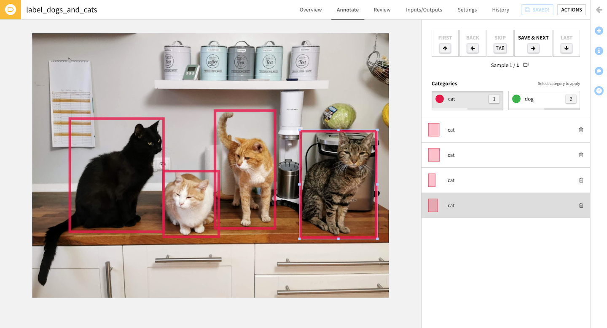
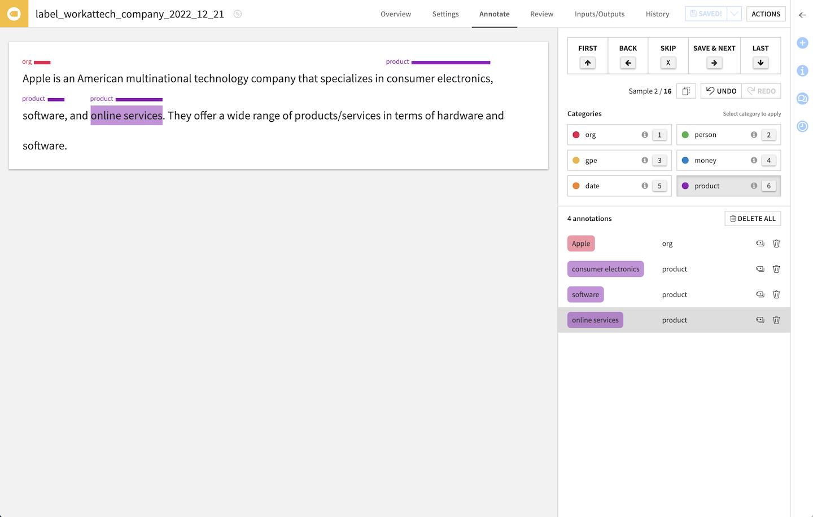
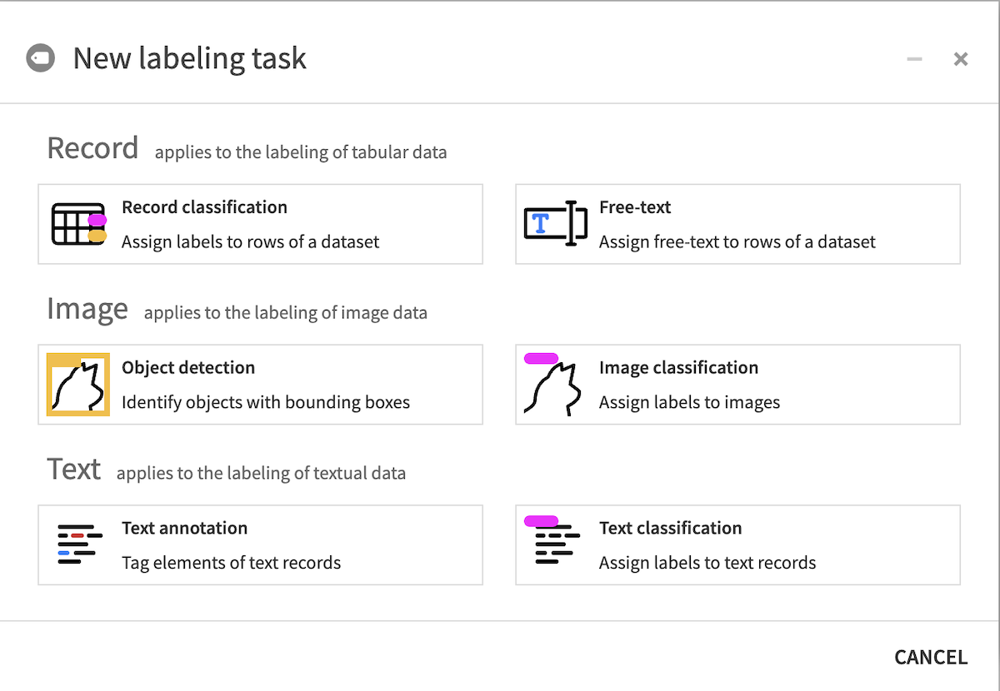
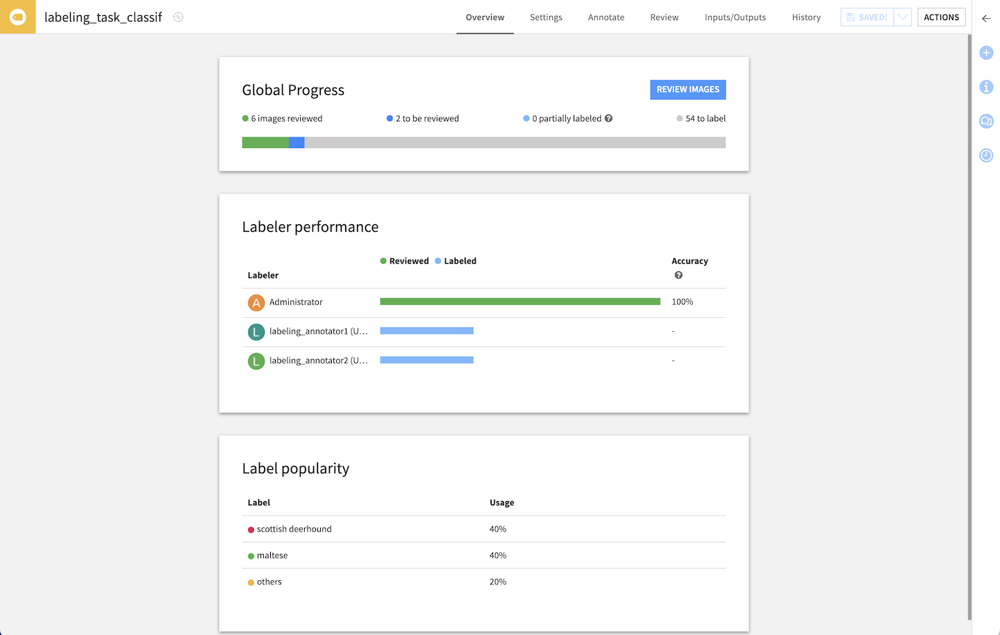

Labeling
##############

The idea of labeling is for one or more humans to specify the ground truth associated with a given entry such as an image, a text or a row from a dataset. |br|
The annotated dataset is then typically used to train a supervised machine learning model, but labeling can also be used for humans reviews in other situations, e.g. of a model’s predictions.

.. contents::
  :local:

Use cases
=========

Dataiku DSS supports several collaborative labeling use cases:

Record labeling
***************

Also known as tabular data labeling, the input is a dataset with arbitrary columns. Record labeling supports 2 modes:

  * Free-text (one free-form text per row, the annotator can write anything)
  * Text classification (one class per row, the annotator must choose among a given set of classes)

.. image:: ./img/ml-labeling-annotate-tab-record.png

Image labeling
**************
The expected input is a dataset with a column of image paths, i.e. for each row, this column contains the path to an image file in the associated managed folder.

Image labeling supports two modes:

  * Image classification (one class per image)
  * Object detection (multiple bounding boxes per image, each with a class)

Image labeling can be used to then :doc:`train a supervised computer vision model </machine-learning/computer-vision/index>`.

Text labeling
**************
The expected input is a dataset with a text column. Text labeling supports two modes:

  * Text classification (one class per text)
  * Text annotations (multiple selections per text, each with a class)

Usage
=====
To label your data you need to create a Labeling Visual Recipe.  |br|
From the Flow, select the dataset to annotate then pick Labeling in the right-side panel's “Other recipes” section, and choose the type of labeling task.

Setting up a Labeling Task
**************************

The first thing to do is for the labeling project manager to:
* specify the input data to be labeled,
* define the classes/characteristics to be identified,
* add general instructions to help annotators,
* and manage profiles & permissions.

All of this is done in the Settings tab.

Annotating images/records/text
******************************

The interface varies depending on the labeling type, but it always features:
* the item (image/text/record) currently being labeled
* the classes to choose from
* the actual annotations
* the comment area (if enabled)

Reviewing annotations
*********************

Multiple users (Annotators) can work on the same Labeling task and annotate data. To limit errors in annotations, you can ask for a minimum number of annotators to label the same image.
During the review process, a Reviewer can validate that the annotations are correct and arbitrate on conflicting annotations.

Conflicts happen when several Annotators label the same record differently. For instance:

* in a classification task, two Annotators selected different classes for the same record
* in object detection, two bounding boxes from two Annotators don't overlap enough, or don't have the same class
* in text annotation, annotators did not assign the same class to a span of text
* in text annotation, the spans of text annotated with a given label are not the same length

To solve a conflict, the reviewer can pick one correct annotation (discarding the others), or discard all and provide an authoritative annotation directly (which is then considered as already validated).

To speed up the review process, a Reviewer can "Auto Validate" all the records with enough annotations and that don't have any conflict.

Status & Performance overview
*****************************

For all labeling types, the Overview tab allows you to follow the progress with simple indicators

Output: Labels Dataset
**********************

The Labels Dataset is the output of a Labeling Task. You can choose between two modes:

* only validated annotations (default): the dataset only shows the annotations that have been verified by a reviewer
* all annotations: the dataset shows all annotations

This Dataset is a view of the annotations, it does not need to be (re)built.

Advanced
========

Permissions
***********

There are different access levels on a Labeling Task:

* View: a user or group can access the basic information in the labeling task
* Annotate: View + can annotate data
* Review: Annotate + can review annotations
* Read configuration: View + read all the information in the labeling task
* Manage: Read + Review + can edit the settings of the labeling task

Users and groups with ``Write project content`` access to a Project are implicitly granted Manage access on all labeling tasks in that project. Likewise, users and groups with ``Read project content`` access to a project are implicitly granted Read configuration access on all labeling tasks in that project.
Ownership of the task confers Manage access.

Additional Annotate or Review permissions can be granted on each specific task (in its Settings > Permissions tab). Note that users will need to be granted at least ``Read dashboards`` permission on the parent Project to be able to access the Labeling task (e.g. as Annotator or Reviewer).

Contextual columns
******************

In the labeling task's Settings, select columns from the input to be used as contextual information to help annotate & review documents. These columns then appear in a foldable section at the top of the Annotate & Review screens.

Import existing labels
**********************

If you already have pre-existing labels, e.g. from a previous labeling effort or a model, in your input data, specify in the settings the column (of the input dataset) with those labels. They will directly appear in the Annotate view, and annotators can manipulate them like any other annotations.

Comments
******************

Because a label or annotations may not be enough, enable comments in the settings to allow annotators to also leave comments on each annotated record. Example uses include leaving a message for reviewers, raising a suggestion, writing an alternative label, explaining an annotation, adding useful information for downstream tasks…  |br|
In the Review tab, all comments for the same item are concatenated by default (and shown in the output dataset), but reviewers can keep only one or overwrite with their own.
