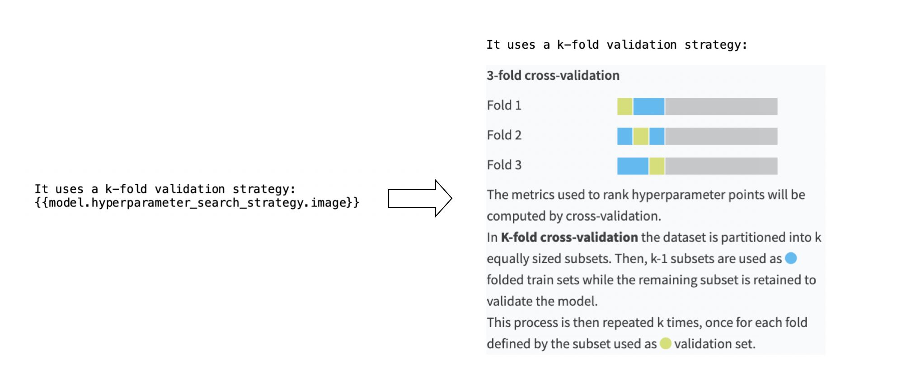
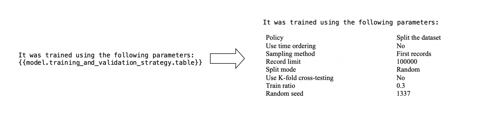
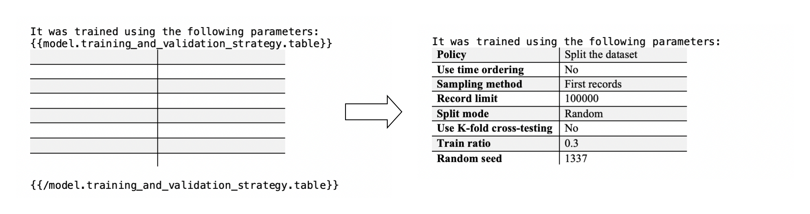

Model Document Generator
##########################

You can use the Model Document Generator to create documentation associated with any trained model. It will generate a Microsoft Word™ `.docx` file that provide information regarding:

* What the model does
* How the model was built (algorithms, features, processing, ...)
* How the model was tuned
* What are the model's performances

It allows you to prove that you followed industry best practices to build your model.

Generate a model document
===============================

.. note::

    To use this feature, the `graphical export library <https://doc.dataiku.com/dss/latest/installation/custom/graphics-export.html>`_ must be activated on your DSS instance.  Please check with your administrator.

Once a model has been trained, you can generate a document from it with the following steps:

* Go to the trained model you wish to document (either a model trained in a Visual Analysis of the Lab or a version of a saved model deployed in the Flow)
* Click the ``Actions`` button on the top-right corner
* Select ``Export model documentation``
* On the modal dialog, select the default template or upload your own template, and click ``Export`` to generate the document
* After the document is generated, you will be able to download your generated model document using the ``Download`` link

.. warning::

    Any placeholders starting with the keyword ``design`` will be linked to the current status of your visual analysis. If you change parameters in your model, DSS will consider that placeholder values are outdated and will replace these placeholders with blanks in the generated documentation.
    If you delete your visual analysis and then generate a document from a saved model, any placeholders starting with the keyword ``design`` will not provide any result.

Custom templates
================

If you want the document generator to use your own template, you need to use Microsoft Word™ to create a ``.docx`` file.

You can create your base document as you would create a normal Word document, and add placeholders when you want to retrieve information from your model.

Sample templates
------------------

Instead of starting from scratch, you can modify the default templates:

- :download:`Download the default template for regression here<template/regression.docx>`
- :download:`Download the default template for binary classification here<template/binary_classification.docx>`
- :download:`Download the default template for multiclass classification here<template/multiclass_classification.docx>`
- :download:`Download the default template for clustering here<template/clustering.docx>`
- :download:`Download the default template for time series forecasting here<template/timeseries_forecast.docx>`

Placeholders
--------------

A placeholder is defined by a placeholder name inside two brackets, like ``{{design.prediction_type.name}}``. The generator will read the placeholder and replace it with the value retrieved from the model.

There are multiples types of placeholders, which can produce text, an image, or a table.

You can format the style of a table placeholder by using a block placeholder and placing an empty table inside it.

Conditional placeholders
--------------------------

If you want to build a single template able to handle several kinds of models, you may need to display information only when they are relevant. For example, you may want to describe what is a binary classification, but this description should only appear on your binary classification models. This can be achieved with a conditional placeholder.

A conditional placeholder contains three elements, each of them needs to be on a separate line:

* a condition
* a text to display if the condition is valid
* a closing element

Example:

.. code-block:: c

  {{if design.prediction_type.name == Binary classification}}

  The model {{design.prediction_type.name}} is a binary classification.

  {{endif design.prediction_type.name}}

.. code-block:: c

  {{if design.prediction_type.name != Binary classification}}

  The model {{design.prediction_type.name}} is a not binary classification.

  {{endif design.prediction_type.name}}

The condition itself is composed of three parts:

* a text placeholder
* an operator (``==`` or  ``!=``)
* a reference value

Example:

.. code-block:: c

    {{if my.placeholder == myReferenceValue }}

During document generation, the placeholder is replaced by its value and compared to the reference value. If the condition is correct, the text is displayed, otherwise nothing will appear on the final document.

Parametrized result placeholders
--------------------------------
In some advanced situations, you might want to include only certain parts of a component visible in the trained model report.
To do so, you can use the format ``{{result.your_component.plot/your_variable}}`` to select part of a component based on a specific dropdown. Make sure that ``your_variable`` is spelled correctly and matches an item from the dropdown.

For example, to export the feature dependence chart for a chosen feature, you can provide the placeholder ``{{result.feature_dependence.plot/Embarked}}``, which will export the chart for the feature "Embarked".

If a placeholder expects a parameter, it is specified in the “Description” column in the tables below.

.. warning::
    Special characters (e.g. * # $ / \ ") are accepted in the parameter name.
    However, **curly brackets** may interfere with the closing placeholder markers ``}}`` if it:

    * contains two or more consecutive closing brackets, like ``your}}variable``
    * contains two or more consecutive opening brackets, like ``{{your_variable``
    * contains one or more trailing closing brackets, like ``your_variable}``

    Therefore, please rename your columns in these cases.

List of placeholders
---------------------

Placeholders related to the dataset:

============================  ==============  =============
Name                          Compatibility   Description
============================  ==============  =============
dataset.prepare_steps.table   All             Preparation steps used on the dataset
dataset.prepare_steps.status  All             Tell if preparation steps are used on the dataset
============================  ==============  =============

Placeholders related to the design phase of a model:

======================================================  =====================================   =============
Name                                                    Compatibility                           Description
======================================================  =====================================   =============
design.mltask.name					All	       	      			Name of the modeling task
design.visual_analysis.name				All					Name of the visual analysis
design.algorithm.name					All					Name of the algorithm used to compute the model
design.target.name					Prediction				Name of the target variable
design.features_count.value				All					Number of columns in the train set
design.model_type.name					All					Type of model (Prediction or Clustering)
design.prediction_type.name				Prediction				Type of prediction (Regression, Binary classification or Multi-class classification)
design.target_proportion.plot				Classification				Proportions of classes in the guess sample
design.training_and_testing_strategy.table		Prediction				Strategy used to train and test the model
design.training_and_testing_strategy.policy.value	Prediction				Name of the policy used to train and test the model
design.sampling_method.value				Prediction				Sampling method named used to train and test the model
design.k_fold_cross_testing.value			Prediction				Tell if the K-fold strategy was used to train and test the model
design.sampling_and_splitting.image			Prediction				Sampling and splitting strategy used to train and test the model
design.sampling.image                                   Time series forecasting                               Sampling strategy used to train and test the model
design.splitting.image                                  Time series forecasting                               Splitting strategy used to train and test the model
design.train_set.image					Prediction				Explicit train set strategy
design.test_set.image					Prediction				Explicit test set strategy
design.test_metrics.name				Prediction				Metric used to optimize model hyperparameters
design.input_feature.table				All					Summary of input features
design.feature_generation_pairwise_linear.value		Prediction				Display if pairwise linear combinations are used in the feature generation
design.feature_generation_pairwise_polynomial.value	Prediction				Display if pairwise polynomial combinations are used in the feature generation
design.feature_generation_explicit_pairwise.status 	Prediction				Display if the model contains explicit pairwise interactions used in the feature generation
design.feature_generation_explicit_pairwise.table	Prediction				Display explicit pairwise interactions used in the feature generation
design.feature_reduction.image				Prediction				Reduction method applied to the model
design.feature_reduction.name 				Prediction				Name of the feature reduction applied to the model
design.chosen_algorithm_search_strategy.table		All					List the parameters used to configure the chosen algorithm
design.chosen_algorithm_search_strategy.text		All					Description of the chosen algorithm
design.other_algorithms_search_strategy.table		All					Parameters and description of the other computed algorithms
design.hyperparameter_search_strategy.image		Prediction				Hyperparameter search strategy used to compute the model
design.hyperparameter_search_strategy.table		Prediction				Summary of the hyperparameter search strategy
design.cross_validation_strategy.value			Prediction				Name of cross-validation strategy used on hyperparameters
design.dimensionality_reduction.table			Clustering				Dimensionality reduction used to compute the model
design.dimensionality_reduction.status			Clustering				Tell if a dimensionality reduction was used to compute the model
design.outliers_detection.table				Clustering				Outliers detection strategy used to compute the model
design.outliers_detection.status			Clustering				Tell if an outliers detection strategy was used to compute the model
design.weighting_strategy.method.name			Prediction				Name of the weighting strategy
design.weighting_strategy.variable.name			Prediction				Name of the weighting strategy associated variable
design.weighting_strategy.text				Prediction				Description of a weighting strategy
design.calibration_strategy.name			Classification				Name of the probability calibration method
design.calibration_strategy.text			Classification				Description of a probability calibration strategy
design.backend.name					All					Name of the backend engine
design.partitioned_model.status				All					Tell if the current model is a partitioned model
design.time_variable.name                               Time series forecasting                 Name of the time variable
design.num_timeseries.value                             Time series forecasting                 Number of time series to forecast
design.timeseries_identifiers.value                     Time series forecasting                 List of columns containing time series identifier values
design.has_multiple_timeseries.value                    Time series forecasting                 Whether the model has multiple time series
design.time_step.value                                  Time series forecasting                 Time step including its unit
design.forecast_horizon.in_units.value                  Time series forecasting                 Forecast horizon including its unit
design.forecast_horizon.time_steps.value                Time series forecasting                 Number of time steps in one forecast horizon
design.timeseries_num_external_features.value           Time series forecasting                 Number of external features provided to the model
design.timeseries_external_features.value               Time series forecasting                 List of external features columns
design.timeseries_scoring_data_length.value             Time series forecasting                 How much past data must be provided for scoring
design.timeseries_algorithm_can_score_new_series.value  Time series forecasting                 Whether the current model can score time series unseen during training
design.timeseries_general_settings.table                Time series forecasting                 List the general time series specific settings used to configure the model
design.timeseries_forecasting.table                     Time series forecasting                 List the settings used to configure the forecast horizon
design.forecasting_parameters.image                     Time series forecasting                 Forecasting parameters shown visually in a diagram
======================================================  =====================================   =============

Placeholders related to the result of a model computation:

==============================================================  ==========================================  =============
Name                                                            Compatibility                               Description
==============================================================  ==========================================  =============
result.chosen_algorithm.name		        		All					    Name of the algorithm selected for the mode used in the current document generation
result.train_set.sample_rows_count.value		        All				            Number of rows in the train set
result.test_metrics.value		        		Prediction				    Value of the test metrics
result.target_value.positive_class.value		        Binary classification			    Name of the target value representing the positive class
result.target_value.negative_class.value		        Binary classification		            Name of the target value representing the negative class
result.threshold_metric.name		        		Binary classification		            Name of the threshold (cut off) metric
result.classification_threshold.current.value		        Binary classification		            Current value of the threshold metric
result.classification_threshold.optimal.value		        Binary classification		            Optimal value of the threshold metric
result.chosen_algorithm_details.image                           All but partitioned models                  Summary of the prediction computation
result.chosen_algorithm_details.table                           All but partitioned models                  Summary of the current model selected hyperparameters
result.cluster_summary.image		        		Clustering			            Summary of the clustering computation
result.cluster_description.image		        	Clustering			            Description of each category of the clustering
result.partitioned.summary.image		        	Prediction			            Summary of the partitioned model execution
result.decision_trees.image		        		Prediction			            Random forest decision tree visualisation
result.decision_trees.status		        		All				            Tell if the model is compatible with a decision tree visualisation
result.regression_coefficients.image		        	Regression and binary classification        Regression coefficient chart
result.regression_coefficients.status		        	All	       	      		            Tell if the model has a regression coefficient chart
result.feature_importance.plot		        		Prediction	       	      		    Feature importance chart
result.feature_importance.status		        	All	       	      		            Does the model have feature importance charts
result.absolute_importance.plot                                 Prediction                                  Absolute importance chart
result.absolute_importance.status                               All                                         Does the model have an absolute importance chart
result.feature_effects.plot		        		Prediction                                  Feature effects chart
result.feature_dependence.plot/your_feature		        		Prediction                                  Parametrized placeholder. Feature dependence chart for your selected feature.
result.individual_explanations.image		        	Prediction			            Individual explanation chart
result.individual_explanations.text		        	Prediction			            Description of the individual explanation chart
result.individual_explanations.status		        	All				            Tell if the model contains an individual explanation chart
result.hyperparameter_search.plot 	        		Prediction                                  Hyperparameter search results as a chart
result.hyperparameter_search.table		        	Prediction		                    Displays data associated to the hyperparameter search as an table
result.hyperparameter_search.status		        	All		                            Tell if the model had a hyperparameter search results chart
result.confusion_matrix.image		        		Classification			            Confusion matrix results as a table
result.confusion_matrix_table.text		        	Binary classification		            Description of the confusion matrix
result.confusion_matrix_metrics.plot		        	Classification			            Metrics associated to the confusion matrix
result.confusion_matrix_metrics.text		        	Classification			            Description of the different metrics
result.cost_matrix.image		        		Binary classification		            Cost matrix as a table
result.cost_matrix.image		        		Binary classification		            Cost matrix as a table
result.cost_matrix.text 	        			Binary classification		            Description of the cost matrix
result.decision_chart.plot		        		Binary classification		            Decision chart
result.decision_chart.text		        		Binary classification		            Description of the decision chart
result.lift_curve.plot		        			Binary classification		            Lift curve charts
result.lift_curve.text		        			Binary classification		            Description of the lift curve charts
result.calibration.plot 	        			Classification			            Calibration curve chart
result.calibration.text 	        			Classification			            Description of the calibration curve chart
result.roc_curve.plot		        			Classification			            ROC curve chart
result.roc_curve.text		        			Classification			            Description of the ROC curve chart
result.pr_curve.plot		        			Classification			            PR curve chart
result.pr_curve.text		        			Classification			            Description of the PR curve chart
result.density_chart.plot		        		Classification			            Density chart
result.density_chart.text		        		Classification			            Description of the density chart
result.hierarchy.plot		        			Clustering			            Hierarchy of the interactive clustering model
result.anomalies.plot		        			Clustering			            Anomalies detected displayed as a heatmap
result.cluster_heat_map.plot		        		Clustering			            Features heatmap
result.scatter.plot		        			Regression and clustering	            Scatter plot chart
result.error_distribution.table 	        		Regression     			            Error distribution as a table
result.error_distribution.plot		        		Regression			            Error distribution as a chart
result.error_distribution.text		        		Regression			            Description of the error distribution
result.detailed_metrics.table		        		All				            Detailed summary of the model computation
result.ml_assertions.table		        		Prediction			            Assertions definitions and metrics
result.ml_overrides.definition.table                            Prediction	                            Model overrides definitions
result.ml_overrides.metrics.table                               Prediction                                  Model overrides metrics
result.timings.table		        			All				            Time of the different execution steps
result.diagnostics.table		        		All					    All Diagnostics for the current model
result.diagnostics.table.dataset_sanity_checks		        All	        		            Diagnostics of type dataset sanity checks for the current model
result.diagnostics.table.modeling_parameters		        All			                    Diagnostics of type modeling parameters for the current model
result.diagnostics.table.runtime		        	All	    				    Diagnostics of type runtime that check the model training speed
result.diagnostics.table.training_overfit		        All					    Diagnostics of type training overfit for the current model
result.diagnostics.table.leakage_detection		        All					    Diagnostics of type leakage detection for the current model
result.diagnostics.table.model_check		        	All					    Diagnostics of type model check for the current model
result.diagnostics.table.reproduciblity                         All                                         Diagnostics of type training reproducibility for the current model
result.diagnostics.table.ml_assertions                          All                                         Diagnostics of type ML assertions for the current model
result.diagnostics.table.abnormal_predictions_detection                         All                                         Diagnostics of type abnormal predictions detection for the current model
result.diagnostics.table.timeseries_resampling_checks           Time series forecasting                      Diagnostics of type resampling checks for the current model
result.full_log.link		        			All				            URL to download the model's logs
result.training_date.name		        		All				            Date of the training
result.leaderboard.image		        		All				            Image of the default leaderboard of the computed models
result.leaderboard.accuracy.image 	        		Classification			            Image of the leaderboard of the computed models for the metric accuracy
result.leaderboard.precision.image		        	Classification			            Image of the leaderboard of the computed models for the metric precision
result.leaderboard.recall.image		        		Classification			            Image of the leaderboard of the computed models for the metric recall
result.leaderboard.f1.image		        		Classification			            Image of the leaderboard of the computed models for the metric F1 score
result.leaderboard.cost_matrix.image		        	Classification			            Image of the leaderboard of the computed models for the metric cost matrix gain
result.leaderboard.log_loss.image 	        		Classification			            Image of the leaderboard of the computed models for the metric log loss
result.leaderboard.roc_auc.image		        	Classification			            Image of the leaderboard of the computed models for the metric ROC AUC
result.leaderboard.average_precision.image		        Classification				    Image of the leaderboard of the computed models for the metric Average Precision score
result.leaderboard.calibration_loss.image 	        	Binary classification		            Image of the leaderboard of the computed models for the metric calibration loss
result.leaderboard.lift.image		        		Binary classification		            Image of the leaderboard of the computed models for the metric lift
result.leaderboard.evs.image		        		Regression			            Image of the leaderboard of the computed models for the metric EVS
result.leaderboard.mape.image		        		Regression and time series forecasting      Image of the leaderboard of the computed models for the metric MAPE
result.leaderboard.mae.image		        		Regression and time series forecasting      Image of the leaderboard of the computed models for the metric MAE
result.leaderboard.mse.image		        		Regression and time series forecasting      Image of the leaderboard of the computed models for the metric MSE
result.leaderboard.rmse.image		        		Regression and time series forecasting      Image of the leaderboard of the computed models for the metric RMSE
result.leaderboard.rmsle.image		        		Regression			            Image of the leaderboard of the computed models for the metric RMSLE
result.leaderboard.r2.image		        		Regression			            Image of the leaderboard of the computed models for the metric R2 score
result.leaderboard.correlation.image		        	Regression			            Image of the leaderboard of the computed models for the metric correlation
result.leaderboard.mase.image                                   Time series forecasting                     Image of the leaderboard of the computed models for the metric MASE
result.leaderboard.smape.image                                  Time series forecasting                     Image of the leaderboard of the computed models for the metric SMAPE
result.leaderboard.mean_absolute_quantile_loss.image            Time series forecasting                     Image of the leaderboard of the computed models for the metric Mean absolute quantile loss
result.leaderboard.mean_weighted_quantile_loss.image            Time series forecasting                     Image of the leaderboard of the computed models for the metric Mean weighted quantile loss
result.leaderboard.msis.image                                   Time series forecasting                     Image of the leaderboard of the computed models for the metric MSIS
result.leaderboard.nd.image                                     Time series forecasting                     Image of the leaderboard of the computed models for the metric ND
result.leaderboard.silhouette.image		        	Clustering			            Image of the leaderboard of the computed models for the metric silhouette
result.leaderboard.inertia.image		        	Clustering			            Image of the leaderboard of the computed models for the metric inertia
result.leaderboard.clusters.image		        	Clustering		                    Image of the leaderboard of the computed models for the metric clusters number
result.has_multiple_timeseries.value                            Time series forecasting                     Whether the model has multiple time series
result.is_statistical_timeseries_model.value                    Time series forecasting                     Whether the model uses a statistical algorithm (e.g. AutoARIMA)
result.timeseries_resampling.table                              Time series forecasting                     Parameters defining how the time series is resampled
result.per_timeseries_metrics.table                             Time series forecasting                     For a multi time series model, the metrics for each time series
result.autoarima_orders_single.table                            Time series forecasting                     For a single time series model trained with the AutoARIMA algorithm, the ARIMA orders
result.autoarima_orders_multi.table                             Time series forecasting                     For a multi time series model trained with the AutoARIMA algorithm, the ARIMA orders for each time series
result.timeseries_coefficients_single.table                     Time series forecasting                     For a single time series statistical model, the values of model coefficients
result.timeseries_coefficients_multi.table                      Time series forecasting                     For a multi time series statistical model, the values of model coefficients for each time series
result.information_criteria_single.table                        Time series forecasting                     For a single time series AutoARIMA or STL model, the values of information criteria
result.information_criteria_multi.table                         Time series forecasting                     For a multi time series AutoARIMA or STL model, the values of information criteria for each time series
result.timeseries_single_forecast.plot                          Time series forecasting                     For a single time series model, the forecast chart
result.timeseries_multi_forecast.plot                           Time series forecasting                     For a multi time series model, the first five forecast charts
==============================================================  ==========================================  =============

Placeholders related to the DSS configuration:

======================================================  =====================================   =============
Name                                                    Compatibility                           Description
======================================================  =====================================   =============
config.author.name					All					Name of the user that launched the generation
config.author.email					All					E-mail of the user that launched the generation
config.environment.name					All					Name of the DSS environment
config.dss.version					All					Current version of DSS
config.is_saved_model.value				All					Yes when documenting a model exported into the Flow, No otherwise
config.generation_date.name				All					Generation date of the output document
config.project.link					All					URL to access the project
config.output_file.name 				All					Name of the generated file
======================================================  =====================================   =============

List of conditional placeholders
--------------------------------

Placeholders that can be used as conditional placeholders:

* dataset.prepare_steps.status
* design.mltask.name
* design.visual_analysis.name
* design.algorithm.name
* design.target.name
* design.features_count.value
* design.model_type.name
* design.prediction_type.name
* design.training_and_validation_strategy.policy.value
* design.sampling_method.value
* design.k_fold_cross_testing.value
* design.feature_generation_pairwise_linear.value
* design.feature_generation_pairwise_polynomial.value
* design.feature_generation_explicit_pairwise.status
* design.feature_reduction.name
* design.chosen_algorithm_search_strategy.text
* design.cross_validation_strategy.value
* design.dimensionality_reduction.status
* design.outliers_detection.status
* design.weighting_strategy.method.name
* design.weighting_strategy.variable.name
* design.calibration_strategy.name
* design.backend.name
* design.partitioned_model.status
* design.has_multiple_timeseries.value
* design.timeseries_algorithm_can_score_new_series.value
* result.chosen_algorithm.name
* result.train_set.sample_rows_count.value
* result.target_value.positive_class.value
* result.target_value.negative_class.value
* result.threshold_metric.name
* result.classification_threshold.current.value
* result.classification_threshold.optimal.value
* result.decision_trees.status
* result.regression_coefficients.status
* result.feature_importance.status
* result.individual_explanations.status
* result.hyperparameter_search.status
* result.training_date.name
* config.author.name
* config.author.email
* config.environment.name
* config.dss.version
* config.is_saved_model.value
* config.generation_date.name
* config.output_file.name

Deprecated placeholders
-----------------------

===================================================  =================  =========================================================================  ==============================
Name                                                 Compatibility      Description                                                                Replaced by
===================================================  =================  =========================================================================  ==============================
result.detailed_metrics.image                           All              Detailed summary of the model computation                                   result.detailed_metrics.table
design.other_algorithms_search_strategy.image           All              Image of the parameters and description of the other computed algorithms    design.other_algorithms_search_strategy.table
design.chosen_algorithm_search_strategy.image           All              Image of the parameters used to configure the chosen algorithm              design.chosen_algorithm_search_strategy.table
===================================================  =================  =========================================================================  ==============================

Limitations
===========
* You need to upgrade the table of contents manually after a document generation
* The Model Document Generator is currently not compatible with ensemble models
* The Model Document Generator is currently not compatible with Keras nor computer vision models
* The Model Document Generator is currently not compatible with models imported from MLflow
* The Model Document Generator is not compatible with plugin algorithms
* When generating a document from a visual analysis, the model document generator will not display outdated design information. To fix this issue, you can either run a new analysis or revert the design to match the analysis
* When generating a document from a saved model version, some information may be extracted from the original Visual Analysis Design settings. As a result, any placeholders starting with ``design`` will be empty when the Visual Analysis was modified or erased
* Each part of a conditional placeholder must necessarily be in a new line
* Table and conditional placeholders are not supported on headers and footers
