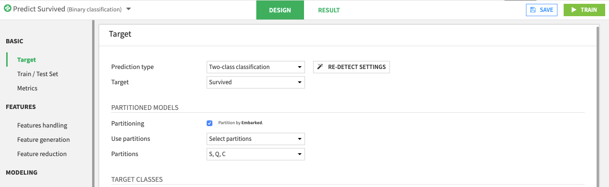
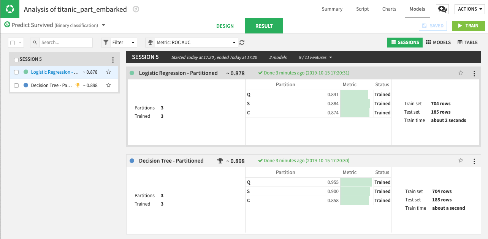

Partitioned Models
##################

When working with a partitioned dataset (that is, different subgroups of your data which share the same schema), you may be interested in training a specific type of prediction model on each data partition. Doing this creates a partitioned model (or *stratified model*).

Partitioned models can sometimes lead to better predictions when relevant predictors for a target variable are different across subgroups (or partitions) of the dataset. For example, customers in different data subgroups may have different purchasing patterns that contribute to how much they spend.

For more on partitioning datasets, see :doc:`/partitions/index`.

.. contents::
	:local:

Usage
=====

Training
--------

When you create a visual machine learning (prediction) model on a partitioned dataset, you have the option to create partitioned models.

- Navigate to the **Design** page of the modeling analysis session
- In the **Target** panel, enable the **Partitioning** option
- Select which partitions of the dataset to use when training in the Analysis. For example, the following screenshot shows three selected partitions.

- **Train** the models. The following results show partitioned models:

Note that when you select algorithms to use for training, Dataiku DSS trains a partitioned model for each algorithm. Each partitioned model consists of one sub model (or model partition) per data partition.
For example, the previous screenshot shows two partitioned models (**Logistic Regression - Partitioned** and **Decision Tree - Partitioned**). Each of these models has three model partitions, one for each partition that was trained.

Parameters and Settings
***********************

For all model partitions in a partitioned model, settings such as: algorithms, feature handling, … are the same. However, some parameters have different values. These parameters include:

* Trained model parameters (for example, the coefficients of a linear regression model)
* Hyperparameters (for example, the depth or number of trees for a Random Forest model). If grid search is implemented to find hyperparameter values, then each model partition searches for, and selects the best hyperparameter values for its partition.
* Probability threshold (cut-off) for binary classification models
* Probability calibration of trained parameters, when applicable

Training Summary and Results
****************************

Opening a partitioned model displays a **Summary** page where you can compare results for the **Partitions** with the **Overall** results. Some overall details (aggregated or common to all partitions) are also available.

.. image:: img/partitioned-summary.png

.. note::
  Metrics for the **Overall** model are aggregated. When an exact computation is not possible, then DSS determines the value as a weighted average, where the weights are determined by the size of each partition (using sample weights, if applicable).

Details about the model summary for **All partitions** and the sub models (or model partitions) are visible when you expand the rows. You can further explore model partitions by clicking the name of the partition, or by switching to the **Partitions** tab and selecting the partition of interest.

Deploying and Redeploying to the Flow
-------------------------------------

You can **Deploy** a partitioned model to the flow (see :doc:`models-lifecycle`), where it appears as a saved model. The icon for a partitioned model is layered (similar to a partitioned dataset), to differentiate it from an unpartitioned model.

From the flow, you can train additional model partitions. You can also re-train an existing partitioned model by specifying which partition(s) to train. This is similar to the process of rebuilding a partitioned dataset.

You can also update a saved partitioned model and training recipe by redeploying the partitioned model to the flow. The updated model version uses only the model partitions that were trained in the modeling analysis.

Scoring and Evaluating
----------------------

There are two ways to score a dataset using a partitioned model:

1. **Partitioned**: This applies if the output of the scoring recipe is a partitioned dataset, and the partition dependency is such that a single model partition can be used to score each output partition. For example, if the input dataset, the output dataset, and the partitioned model for the recipe all share the same partitioning scheme, with the partition dependencies set to "equal"; in this case, the input dataset has no particular constraint (besides the schema expected by the model).

2. **Partition dispatch**: This applies if the output of the scoring recipe is an unpartitioned dataset, or if the output is a partitioned dataset, but the partition dependency requires the use of multiple model partitions to build a single output partition. *Partition dispatch* typically applies when scoring an unpartitioned dataset. Here, the input dataset to the scoring recipe must include the partitioning columns in the data, so that the model can select the right model partition to use on each row.

The same guidelines apply for the evaluation recipe.

.. warning::
  The SQL engine does not support the *Partition dispatch* mode.

API Node
--------

You can deploy a version of a saved partitioned model to the API node. The process is the same as for any saved model. See :doc:`/apinode/endpoint-std` for more information.

When scoring new records, you must pass the partitioning columns as features, so that the model can select the correct model partition to use.

Limitations
============
Use of partitioned models has the following limitations:

* Only Visual Machine Learning with Python backend is supported. Deep Learning and computer vision models are not supported.
* Only prediction models are supported. Clustering models are not supported.
* All partitions must have enough data samples to properly train a model. For example, in the case of a multiclass classification problem, all target classes must be represented in each partition.
* A saved model cannot have a mix of partitioned and unpartitioned versions.
* The SQL engine does not support the *Partition dispatch* mode of the scoring recipe.
* Only top-level (overall model) metrics and checks are available.

The following options are not supported for partitioned models:

* Custom threshold for binary classification
* Train/test split policies other than "Split the dataset"
* The calibration loss metric
* Models ensembling
* PMML export

Advanced
========

Partitioned source version
--------------------------

The training recipe of a saved partitioned model has a *Partitioned source version* setting. Here, you can select the "Version" of the saved model to use for training new partitions and/or re-training existing partitions.

For example, if you have a saved partitioned model that has two existing versions:

- *Version 1*: The *Active version*, consisting of partitions ``A`` and ``B``
- *Version 2*: A newer but not active version, and has added partition ``C`` over *Version 1*.

Say you train partitions ``A`` and ``D`` of your dataset to create a new version (*Version 3*) of the partitioned model, the outcome of this version would depend on the "source version" as follows:

.. csv-table::
   :header: "Source version", "Will train from", "*Version 3* has partitions"
   :widths: 18, 22, 60

   "Active", "Version 1", "Re-trained ``A``, Re-used ``B``, Newly-trained ``D``"
   "Latest", "Version 2", "Re-trained ``A``, Re-used ``B``, Re-used ``C``, Newly-trained ``D``"
   "Explicit", "Manually specified", "Re-trained ``A``, Re-used source partition(s), Newly-trained ``D``"
   "None", "None", "Newly-trained ``A``, Newly-trained ``D``"

.. warning::
  Retraining from a version with different design parameters (algorithm, feature handling,…) is not supported nor recommended, and may lead to unexpected behavior.

