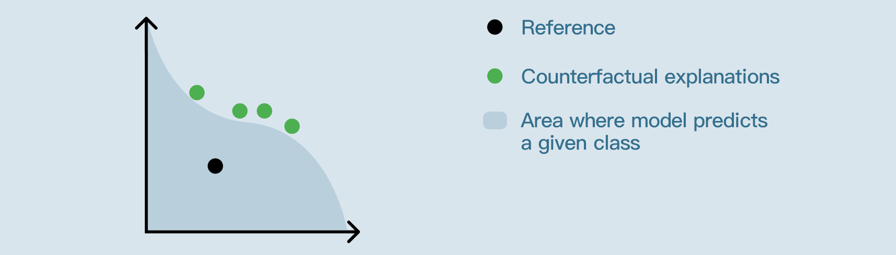
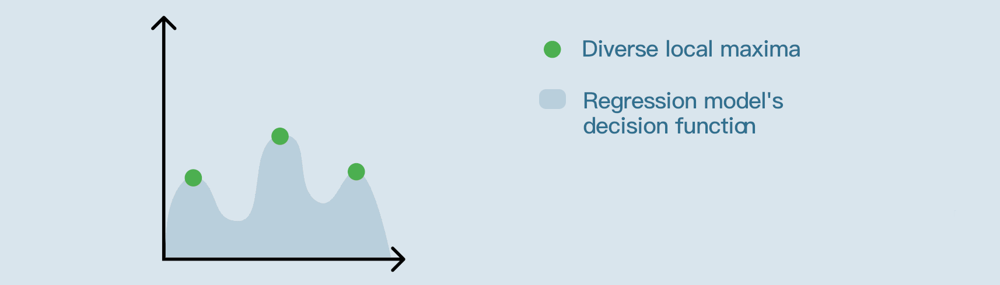

Model exploration
##################

Model exploration intelligently generates samples in the feature space which yield interesting predictions.

Exploring the model's decision function may serve different purposes:

* Having a better grasp of the model's decision making
* **Building confidence** in the model's robustness
* Finding the inputs necessary to **obtain better outcomes**

From the "What-If?" page (*aka. Interactive scoring*), users can select a reference example and start the exploration by clicking on the blue button in the top right corner.

.. contents:: :depth: 3
	:local:

Counterfactual explanations (for classifiers)
=============================================

Introduction
-------------

The starting record / “what-if” values at the start of the exploration, are visualised as the reference example.

Counterfactual explanations are synthetic records **similar to the reference example**, that would result in a **different predicted class**.

These findings can be helpful in explaining what would need to change, for an alternate outcome.

For implementation details, see :download:`this document <model-exploration-implementation.pdf>`.

What makes good counterfactual explanations?
---------------------------------------------

To evaluate counterfactual explanations, three criteria emerge:

* **Proximity**: "*How close are the counterfactual examples to the reference?*"

  .. image:: img/model-exploration-classification-proximity.png

* **Plausibility**: "*How* :ref:`ordinary <plausibility>` *are the counterfactual examples compared to the points of the train set?*"

  .. image:: img/model-exploration-classification-plausibility.png

* **Diversity**: "*How different are the counterfactual explanations from each other?*"

  .. image:: img/model-exploration-classification-diversity.png

Setting a target
-----------------

The "reference" is the point that was selected on the main "What if?" page.

.. note::

  If the model almost always predicts the same class for plausible inputs, searching for counterfactual explanation will usually not yield any result.

Binary classification
^^^^^^^^^^^^^^^^^^^^^

For binary classifiers, the target is always the opposing class to the one predicted for the reference example.

Multiclass classification
^^^^^^^^^^^^^^^^^^^^^^^^^

For multiclass classifiers, the target can either be:

* **Any class but reference's.**
  In which case, any point is a counterfactual explanation as long as its predicted class is not the reference prediction.

* **A specific class.**
  In which case, all the counterfactual explanations returned by the algorithm will be points for which the model predicts the specified class.

.. admonition:: Example

  On the following screenshot, the "reference prediction" is '**robin**':

  .. image:: img/model-exploration-classification-reference-prediction.png

  * The target cannot be set to '**robin**' because it is the reference prediction already.
  * If the target is set to '**dove**', the counterfactual explanations will necessarily be points for which the prediction is '**dove**'.
  * If the target is set to "Any class except '**robin**'", the counterfactual explanations will either predict '**partridge**' or '**dove**'.

  .. image:: img/model-exploration-classification-target-selection.png

Outcome optimization (for regression models)
=============================================

Introduction
-------------

For regression models, the outcome optimization algorithm generates **diverse** synthetic records, striving to match the **training dataset distribution**, that would result in either a **minimal**, **maximal**, or **specific** prediction.

For implementation details, see :download:`this document <model-exploration-implementation.pdf>`.

Setting a target
-----------------

When performing outcome optimization, there are three options:

* **Maximize**: the algorithm will be looking for **plausible** feature values for which the model's predictions are as **high** as possible.
* **Minimize**: the algorithm will be looking for **plausible** feature values for which the model's predictions are as **low** as possible.
* **Specific value**: the algorithm will be looking for **plausible** feature values for which the model's predictions are **nearest** to the specified value.

.. admonition:: Example

  On the following screenshot, we're trying to find plausible inputs for which the model would predict approximately '**162**'.

  .. image:: img/model-exploration-regression-target-selection.png

Setting constraints
====================

There are three ways to constrain the exploration:

* For categorical features, some **categories can be excluded** from the search space.

  In which case, the results will not contain any of the excluded categories.

* For numerical features, a **range can be set** to limit the search space.

  In which case, the results will not contain any value outside of the range.

* Freezing either a numerical or a categorical feature **completely prevents the algorithm from trying different values** for this feature.

  In other words, if a given feature is frozen, the corresponding column in the results will be filled with this feature's reference value. (i.e. the value that was selected on the main "What If?" page)

.. admonition:: Example

  On the following screenshot:

  * The results should not have ``Supplier == Charlie``.
  * The results should not have ``Temperature < 8`` or ``Temperature > 11``.
  * Two features are frozen; All results should have ``Volume == 5.1`` and ``pH == 3.2``.

  .. image:: img/model-exploration-regression-constraints.png

Interpreting results
=====================

The interesting points found by the algorithm are displayed and can be exported to a dataset.

.. admonition:: Example

  In this production quality prediction example, we are trying to find the inputs for which the model's prediction will be maximum.

  On the following screenshot:

  * The reference values are:

    - ``Temperature == 10.4``
    - ``Workers_nb == 3``
    - ``Supplier == 'Bob'``
    - ``Volume == 5.1``
    - ``pH = 3.2``

  * The model's prediction for the reference point is '**144**'.

  * To maximize the model's prediction:

    - the ideal number of workers seems to be '**5**'
    - the ideal supplier seems to be '**Alice**' or '**David**'
    - the ideal temperature seems to be around '**9.7**'

  * Despite leading to slightly inferior predictions, results which have ``Supplier == 'Bob'`` seem to be very plausible.

  .. image:: img/model-exploration-regression-results.png

.. _plausibility:

Plausibility
-------------

**Plausibility is a measure of how ordinary points are.**
It ranges between 0% and 100%.

For a given dataset and a given point in the dataset space:

* A point with a low plausibility is extraordinary in regards to the distribution of the train set.
* A point with a high plausibility looks like it could belong in the train set.

*For instance, if the plausibility score of a given point is 30%, it means that 30% of the points of the train set are more likely to be outliers than this point.*

For implementation details, see :download:`this document <model-exploration-implementation.pdf>`.

Limitations
============

Model exploration is not available:

* for models trained before DSS 10
* for Keras or computer vision models
* for ensemble models
* for timeseries
* for partitioned models (although it is available on an individual partition)
* if "Skip expensive reports" was selected before training the model (*Design > Advanced > Runtime environment > Performance tuning*).
* if "Apply preparation script" is enabled (*Report > What If?*).
