Prediction Results
###################

When a model finishes training, click on the model to see the results.

Decision tree analysis
-----------------------

For tree-based scikit-learn models, Dataiku can display the decision trees underlying the model. This can be useful to inspect a tree-based model and better understand how its predictions are computed.

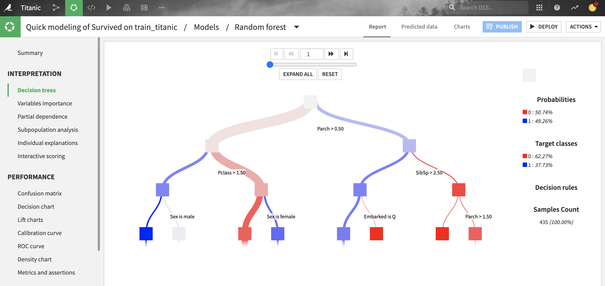

For classification trees, the "target classes proportions" describe the raw distribution of classes at each node of the decision tree, whereas the "probability" represents what would be predicted if the node were a leaf. There will be a difference when the "class weights" weighting strategy is chosen (which is the case by default): the classifier will predict the *weighted* proportion of classes, so "probabilities" with class weights are always based on a balanced reweighting of the data. Whereas “target classes proportions” are simply the raw proportion of classes and will be just as unbalanced as the training data.

For gradient boosted trees, note that the decision trees are inherently hard to interpret, especially for classifications:

- by construction, each tree is built as to correct the sum of the trees built before, and is thus hard to interpret in isolation

- classification models are actually composed of *regression trees*, over the gradient of the loss of a *binary* classification (even for multiclass where one vs. all strategy is used)

- for classifications, each tree prediction is homogenous to a log-odds and *not a probability* and thus can take arbitrary numerical values outside of the (0, 1) range.

All parameters displayed in this screen are computed from the data collected during the training of the decision trees, so they are entirely based on the *train set*.

Feature importance
------------------

.. _shapley-feature-importance-ref:

Shapley feature importance
==========================

Shapley feature importance is a universal method to compute individual explanations of features for a model. It is based on approximated Shapley values that can be computed on every type of model.

For models trained using the Python backend (e.g. :doc:`Visual Machine Learning</machine-learning/auto-ml>`, :doc:`MLFlow</mlops/mlflow-models/index>` or :doc:`custom models</machine-learning/custom-models>`), Dataiku can compute and display Shapley feature importance. These plots help to explain the impact of features on the predictions of the model.

For most models, they are automatically computed during training. This is sometimes :ref:`skipped by default<shapley-feature-importance-limitations>` and can be manually skipped by checking "Skip expensive reports" before training the model (*Design > Advanced > Runtime environment > Performance tuning*).

The bar chart ranks the features by their absolute importance for model predictions, showing those that overall weigh more heavily or more often in the model's prediction.

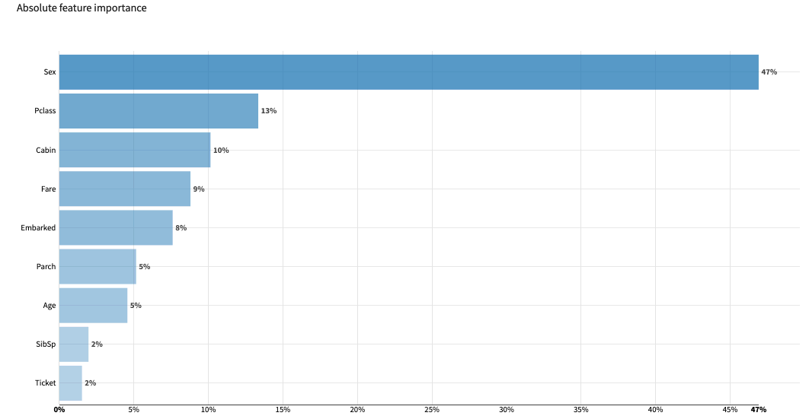

The feature effects chart displays importances computed for individual samples drawn from the test set, showing in more details the distribution of contributions for each feature.

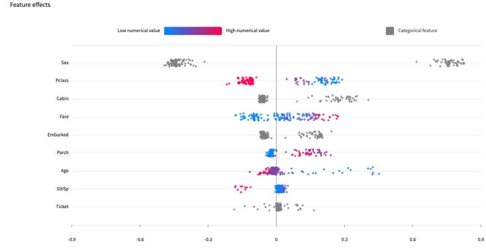

The feature dependence chart drills further into one feature, plotting the impact of its different values on the prediction. It gives a sample-level perspective on :ref:`Partial dependence<prediction_results_PDP_label>`

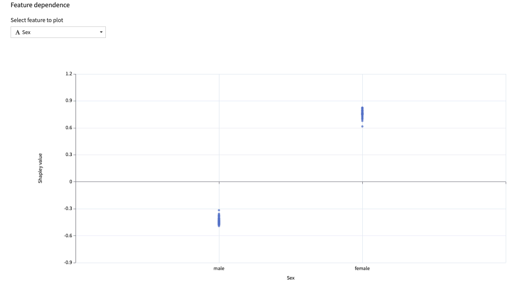

.. _shapley-feature-importance-limitations:

Limitations
^^^^^^^^^^^

.. important::
    Shapley values are not supported for :doc:`Visual Deep Learning</machine-learning/deep-learning/introduction>` models using the Tensorflow/Keras backend.

The Shapley feature importance is computed automatically for models where the computation is expected to have reasonable computational cost / speed. This cost is presumed high for example in the following cases:
  - one of the input feature uses :ref:`text embedding <Text embedding>`.
  - the model algorithm is kNN or Support Vector Machine (computationally intensive inference)
  - there are over 50 features and DSS is not able to infer the top 20 automatically

In these cases, Shapley feature importance remains available as a post-train computation but may be very slow.

Gini feature importance
=======================

For tree-based scikit-learn, LightGBM and XGBoost models, Gini feature importances are computed as the (normalized) total reduction of the splitting criterion brought by that feature.

Gini feature importance is an intrinsic measure of how much each feature weighs in the trained model and thus is always positive and always sums up to one, regardless of the accuracy of the model. Importance reflects both how often the feature is selected for splitting, and how much the prediction changes when the feature does. Note that such a definition of feature importance tends to *overemphasize numerical features* with many different values.

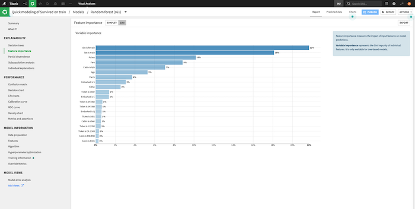

Regression coefficients
-----------------------

For linear models, Dataiku provides the coefficient of each feature. 

Note that for numerical features, it is recommended to consider the coefficients of *rescaled variables* (i.e. preprocessed features with null mean and unit variance) before comparing these coefficients with each other.

All parameters displayed in these screens are computed from the data collected during the training, so they are entirely based on the *train set*.

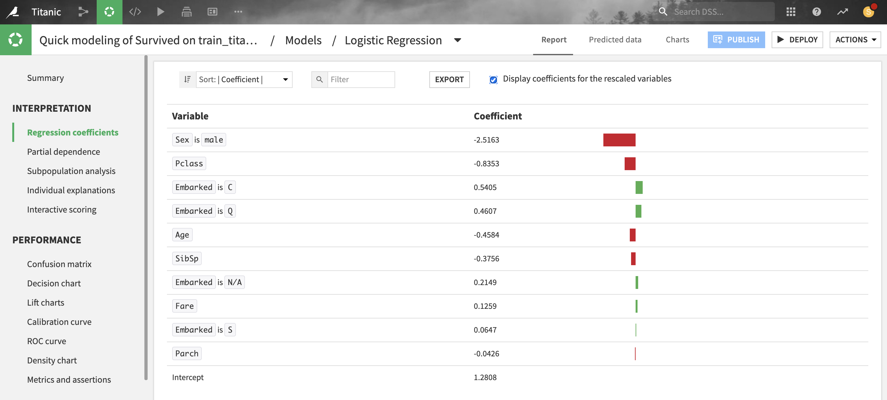

.. _prediction_results_PDP_label:

Partial dependence
-------------------

For all models trained in Python (e.g., scikit-learn, keras, custom models), Dataiku can compute and display partial dependence plots.  These plots can help you to understand the relationship between a feature and the target.

Partial dependence plots are a post-hoc analysis that can be computed after a model is built. Since they can be expensive to produce when there are many features, you need to explicitly request these plots on the **Partial dependence** page of the output.

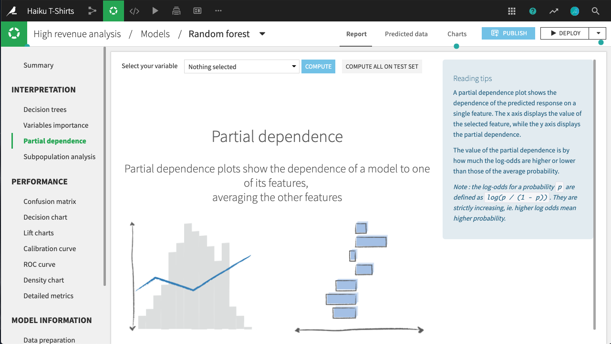

Partial dependence is defined as the average predicted value obtained by fixing the considered feature at a given value and maintaining all other features values unchanged in the data, minus the average predicted value. The plot shows the dependence of the target on a single selected feature. The x axis represents the value of the feature, while the y axis displays the partial dependence.

A positive (respectively negative) partial dependence means that forcing the data to take the given value on this feature while leaving all others as is will yield to a predicted value that is above (respectively below) the average prediction.  Another way to interpret partial dependence plots for numerical variables is to consider the local monotonicity of the relationship: when the plot is locally increasing (respectively decreasing), the predicted values tend to increase (respectively decrease) on average with the value of the considered feature.

For example, in the figure below, all else held equal, *age_first_order* under 40 will yield predictions below the average prediction.  The relationship appears to be roughly parabolic with a minimum somewhere between ages 25 and 30. After age 40, the relationship is slowly increasing, until a precipitous dropoff in late age.

Note that for classifications, the predictions used to plot partial dependence are not the *predicted probabilities* of the class, but their *log-odds* defined as :code:`log(p / (1 - p))`.

The plot also displays the distribution of the feature, so that you can determine whether there is sufficient data to interpret the relationship between the feature and target.

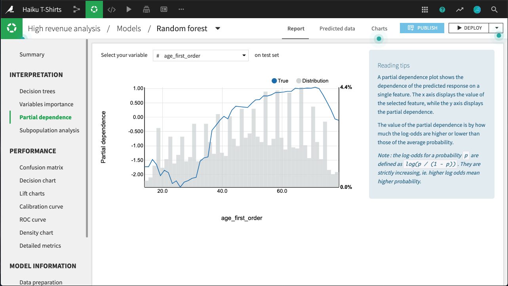

.. _prediction_results_subpopulation_label:

Subpopulation analysis
-----------------------

For regression and binary classification models trained in Python (e.g., scikit-learn, keras, custom models), Dataiku can compute and display subpopulation analyses.  These can help you to assess if your model behaves identically across subpopulations; for example, for a bias or fairness study.

Subpopulation analyses are a post-hoc analysis that can be computed after a model is built.  Since they can be expensive to produce when there are many features, you need to explicitly request these plots on the **Subpopulation analysis** page of the output.

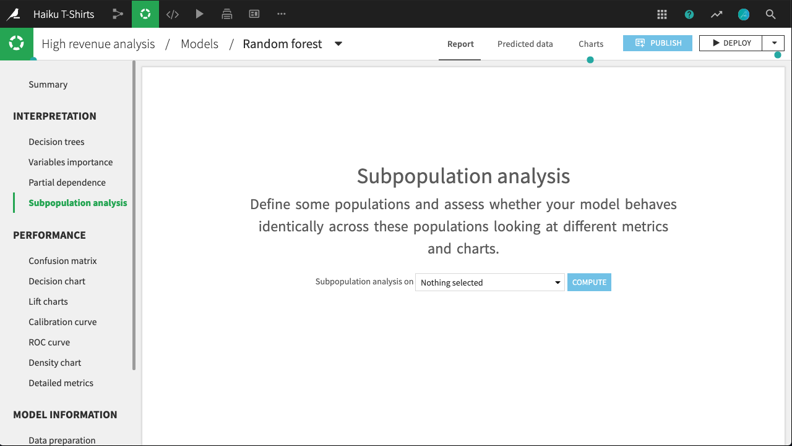

The primary analysis is a table of various statistics that you can compare across subpopulations, as defined by the values of the selected column.  You need to establish, for your use case, what constitutes "fair".

For example, the table below shows a subpopulation analysis for the column *gender*.  The model-predicted probabilities for male and female are close, but not quite identical.  Depending upon the use case, we may decide that this difference is not significant enough to warrant further investigation.

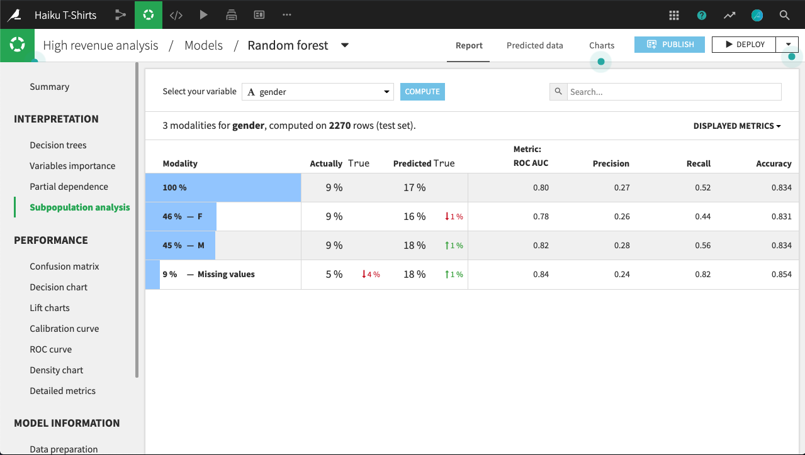

By clicking on a row in the table, we can display more detailed statistics related to the subpopulation represented by that row.

For example, the figure below shows the expanded display for rows whose value of *gender* is missing.  The number of rows that are **Actually True** is lower for this subpopulation than for males or females.  By comparing the **% of actual classes** view for this subpopulation versus the overall population, it looks like the model does a significantly better job of predicting actually true rows with missing *gender* than otherwise.

The density chart suggests this may be because the **class True** density curve for missing *gender* has a single mode around 0.75 probability.  By contrast, the density curve for the overall population has a second mode just below 0.5 probability.

What's not clear, and would require further investigation, is whether this is a "real" difference, or an artifact of the relatively small subpopulation of missing *gender*.

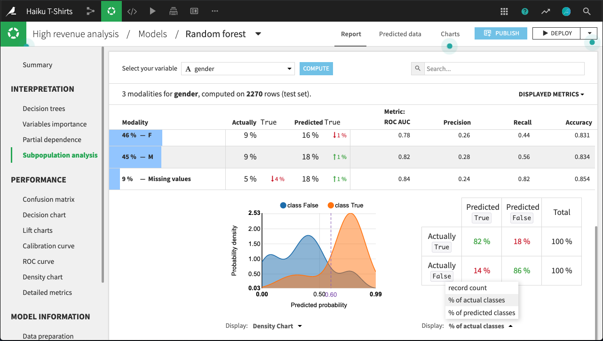

Individual explanations of predictions
--------------------------------------

Please see :doc:`explanations`.

Metrics and assertions
----------------------

Learning Curves
===============

Learning Curves allow you to see how varying the size of the training dataset impacts the train and test performances of your model.

This analysis helps you understand if your model has reached a plateau, requires more data for improved performance, is overfitting or underfitting, and if similar performance can be achieved with less data, potentially leading to gains in training time.

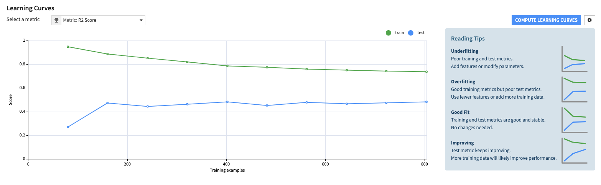

For each metric, Learning Curves show the train and test performance curves for multiple training dataset sizes.

All models are trained using the hyperparameters of the initial model; no hyperparameter search is performed.

Metrics on the curves are computed with overrides and weighted strategies, considering any defined configurations from the initial training.

Assertions
==========

Please see :doc:`ml-assertions`.