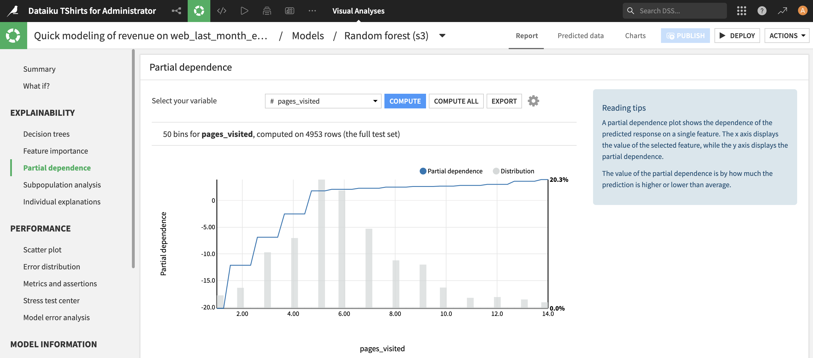

Prediction settings
####################

The "Settings" tab allows you to fully customize all aspects of your prediction.

.. contents::
	:local:

Target settings
===========================

Prediction type
---------------------

Dataiku DSS supports three different types of prediction for three different types of targets.

- **Regression** is used when the target is numeric (e.g. price of the apartment).
- **Two-class classification** is used when the target can be one of two categories (e.g. presence or absence of a doorman).
- **Multi-class classification** is used when targets can be one of many categories (e.g. neighborhood of the apartment).

DSS can build predictive models for each of these kinds of learning tasks. Available options, algorithms and result screens will vary depending on the kind of learning task.

Multiclass classification
---------------------------

DSS cannot handle large number of classes. We recommend that you do not try to use machine learning with more than about 50 classes.

You must ensure that all classes are detected while creating the machine learning task. Detection of possible classes is done on the analysis's script sample. Make sure that this sample includes at least one row for each possible class. If some classes are not detected on this sample but found when fitting the algorithm, training will fail.

Furthermore, you need to ensure that all classes are present both in the train and the test set. You might need to adjust the split settings for that assertion to hold true.

Note that these constraints are more complex to handle with large number of classes and very rare classes.

.. _settings-partitioned-models:

Partitioned Models
------------------

Enabling this setting allows you to train partitioned prediction models on partitioned datasets. When training with this setting, DSS creates one sub model (or model partition) per partition of your dataset.

For more information, see :doc:`../partitioned`

.. _settings-train-test:

Settings: Train / Test set
=============================

When training a model, it is important to test the performance of the model on a "test set". During the training phase, DSS "holds out" on the test set, and the model is only trained on the train set.

Once the model is trained, DSS evaluates its performance on the test set. This ensures that the evaluation is done on data that the model has "never seen before".

DSS provides two main strategies for conducting this separation between a training and test set: splitting the dataset and explicit extracts.

Splitting the dataset
------------------------

By default, DSS randomly splits the input dataset into a training and a test set. The default ratio is 80% for training and 20% for testing. 80% is a standard fraction of data to use for training.

.. _settings-subsampling:

Subsampling
%%%%%%%%%%%%

:doc:`Depending on the engine <../algorithms/index>` DSS can perform the split, random or sorted, from a subsample of the dataset. This is especially important for in-memory engines, like  scikit-learn. DSS defaults to using the first 100,000 rows of the dataset, but other options are available, namely "Random sampling (fixed number of records)", "Random sampling (approximate ratio)", "Column values subset", "Class rebalancing (approximate number of records)" and "Class rebalancing (approximate ratio)", for more details, see the documentation on :doc:`../../explore/sampling`.

.. note::
  For classification tasks, the "Class rebalancing" subsampling options can be effective strategies to handle imbalances in the target class. However, be aware that imbalance issues can also be addressed by the "Class weights" :ref:`weighting strategy<settings-weights>`, which is recommended for smaller datasets and selected by default. "Class rebalancing" is recommended for larger datasets, i.e. when preprocessed data don't fit in memory.

Splitting
%%%%%%%%%%%%%%%%%%%%%%%

DSS allows the user to specify a split based on a time variable or on a K-fold cross-test.

.. _settings-time-ordering:

Time ordering
~~~~~~~~~~~~~~~~~~

DSS can split the dataset based on a time variable (or any variable with an absolute order). By enabling the "Time ordering" option you will ensure that this split is done according to the order induced by a variable to specify, instead of randomly.

.. _settings-train-test-k-fold:

K-fold cross-test
~~~~~~~~~~~~~~~~~~~~

DSS allows the user to specify a K-fold cross-test instead of the default simple train/test split.

With K-fold cross-test, the dataset is split into **K** equally sized portions, known as folds. Each fold is independently used as a separate testing set, with the remaining **K-1** folds used as a training set. This method strongly increases training time (roughly speaking, it multiplies it by **K**). However, it allows for two interesting features:

 * It provides a more accurate estimation of model performance, by averaging over K estimations (one per split) and by providing "error margins" on the performance metrics, computed as twice the standard deviation over the K estimations. When K-fold cross-test is enabled, all performance metrics will have tolerance information. Folds with undefined metrics (NaNs) are ignored in the metrics aggregation.

 * Once the scores have been computed on each fold, DSS can retrain the model on 100% of the dataset's data. This is useful if you don't have much training data.

As with cross-validation, a K-fold cross-test can be also be grouped and/or stratified. For more details, see :ref:`cross-validation<stratified-grouped-k-fold>`.

Explicit extracts
-------------------

DSS also allows the user to specify explicitly which data to use as the training and testing set. If your data has a known structure, such as apartment prices from two different cities, it may be beneficial to use this structure to specify training and testing sets.

The explicit extracts can either come from a single dataset or from two different datasets. Each extract can be defined using:

* Filtering rules
* Sampling rules

Using explicit extracts also allows you to use the output of a :doc:`Split recipe </other_recipes/split>`. The split recipe provides much more control and power on how you can split compared to the builtin random splitting of the Machine Learning component

*In general, use an explicit extract of your dataset if your data is heterogeneous, or if you want to precisely control the train/test split for a forecast*.

.. note::

	In "Explicit extracts" mode, since you are providing pre-existing train and test sets, it is not possible to use K-fold cross-test

.. _settings-metrics:

Settings: Metrics
=============================

Model optimization
-----------------------

You can choose the metric that DSS will use to evaluate models. The model is optimized according to the selected metric.  This metric is used both for model evaluation on the :ref:`Train / Test<settings-train-test-k-fold>` and for :ref:`hyperparameter search<settings-hyperparameters>`.

This metric will be used to decide which model is the best when doing the hyperparameters optimization.

For display on the test sets, this metric also acts as the main one that will be shown by default, but DSS always computes all metrics, so you can choose another metric to display on the final model (however, if you change the metric, you're not guaranteed that the hyperparameters are the best one for this new metric)

Custom
%%%%%%%%

.. note::

	This only applies to the "Python in-memory" training engine

You can also provide a custom scoring function. This object must follow the protocol for scorer objects of scikit-learn.

See: http://scikit-learn.org/stable/modules/model_evaluation.html#scoring-parameter

Averaging method for multiclass classification
%%%%%%%%%%%%%%%%%%%%%%%%%%%%%%%%%%%%%%%%%%%%%%%

For multiclass classification tasks, the following metrics have to be computed for each class in a binary fashion (one-vs-all or one-vs-one) and then averaged across classes: precision and average precision, recall, F1-score, ROC-AUC and calibration loss. You can choose between **weighted** and **unweighted** averaging across classes. This setting is displayed in the metrics tab and can be edited in the :ref:`weighting strategy<settings-weights>`

Multiclass ROC AUC
%%%%%%%%%%%%%%%%%%%

For details on the computation method of the ROC AUC metric for multiclass classification models, see :download:`this document <multiclass-roc-auc.pdf>`

Threshold optimization
-----------------------

When doing binary classification, most models don't output a single binary answer, but instead a continuous "score of being positive". You then need to select a threshold on this score, above which DSS will consider the sample as positive. This threshold for scoring the target class is optimized according to the selected metric.

Optimizing the threshold is always a question of compromise between risking false positive and false negatives. DSS will compute the true-positive, true-negative, false-positive, false-negative (also known as the confusion matrix) for many values of
the threshold and will automatically select the threshold based on the selected metric.

You can also manually set the threshold at any time in the result screens.

.. _settings-features-handling:

Settings: Features handling
=============================

See :doc:`../features-handling/index`

.. _settings-features-generation:

Settings: Feature generation
==============================

DSS can compute interactions between variables, such as linear and polynomial combinations. These generated features allow for linear methods, such as linear regression, to detect non-linear relationship between the variables and the target. These generated features may improve model performance in these cases.

.. _settings-features-reduction:

Settings: Feature reduction
===========================

Feature reduction operates on the preprocessed features. It allows you to reduce the dimension of the feature space in order to regularize your model or make it more interpretable.

- **Correlation with target:** Only the features most correlated (Pearson) with the target will be selected. A threshold for minimum absolute correlation can be set.
- **Tree-based:** This will create a Random Forest model to predict the target. Only the top features according to the feature importances computed by the algorithm will be selected.
- **Principal Component Analysis:** The feature space dimension will be reduced using Principal Component Analysis. Only the top principal components will be selected.  *Note:* This method will generate non-interpretable feature names as its output. The model may be performant, but will not be interpretable.
- **Lasso regression:** This will create a LASSO model to predict the target, using 3-fold cross-validation to select the best value of the regularization term. Only the features with nonzero coefficients will be selected.

.. _settings-algorithms:

Settings: Algorithms
===========================

DSS supports several algorithms that can be used to train predictive models. We recommend trying several different algorithms before deciding on one particular modeling method.

The algorithms depend on each engine. See :doc:`../algorithms/index` for details

.. _settings-hyperparameters:

Settings: Hyperparameters optimization
=============================================

Please see our :doc:`detailed explanation of models optimization <../advanced-optimization>`

.. _settings-weights:

Setting: Weighting strategy
===========================

When training and evaluating a model, you can choose to apply a "sample weight" variable to your task.
The purpose of a "sample weight" variable is to specify the relative importance of each row of the dataset, both for the training algorithm and for the different evaluation metrics.

For classification problems, weighting strategies include "class weights" which are meant to correct possible imbalances between classes during the training of the model. Note that unlike the "sample weight" strategy, "class weights" do not impact evaluation metrics, i.e. Dataiku will consider each row as equally weighted in the computation of the metrics.
Class weights are enabled by default.

.. note::
  Class weights can be substituted by a "Class rebalancing" :ref:`sampling strategy <settings-subsampling>` settable in :ref:`settings-train-test`, which is recommended for larger datasets. For smaller datasets, i.e. when preprocessed data fits in memory, choosing the "class weights" weighting strategy is the recommended option.

Setting: Averaging method for one-vs-all metrics
================================================

For multiclass classification tasks, the following metrics have to be computed for each class in a binary fashion (one-vs-all or one-vs-one) and then averaged across classes: precision and average precision, recall, F1-score, ROC-AUC and calibration loss. You can choose between the **weighted** and **unweighted** averaging across classes.

- **unweighted** class average: all classes have equal weight. Better suited for classes of equal importance.
- **weighted** class average: classes are weighted by the number of rows for each class, or the sum of their sample weights if sample weights are specified.

.. note::
  For the "class weight" and "class and sample weight" strategies, the **unweighted** class average is often more adequate. Class weights are used to train the model, suggesting equal importance of classes.
  For the "no weighting" and "sample weight" strategies, the **weighted** class average is often more adequate. The one-vs-all metrics will be the weighted average across classes, suggesting unequal importance of classes.

Setting: Probability calibration
================================

When training a classification model, you can choose to apply a calibration of the predicted probabilities.
The purpose of calibrating probabilities is to bring the observed class frequencies as close as possible to the model-predicted class probabilities.

"Sigmoid" fits a shifted and scaled sigmoid function to the probability space.

"Isotonic" fits a piecewise-constant non-decreasing function. The resulting function might be many-to-one, which can have an impact on the ordering of test examples by probabilities and thus many evaluation metrics. It also runs a larger risk of overfitting (optimistic calibration curve).

Setting: Monotonic constraints
==============================

When training a regression model or a binary classification model, you can impose a monotonic relationship between the prediction of the model and any numerical input variable.

When such a monotonic constraint is specified, predictions of the model will only vary in the specified direction (increasing or decreasing) as the constrained variable increases, all other variables being kept equal.

Monotonic constraints have observable consequences on :ref:`partial dependence plots <prediction_results_PDP_label>`.
For each constrained variable, the partial dependence plot follows the monotonic direction of the constraint.
The snapshot below shows an example with an increasing constraint:

The compatible algorithms are: Random Forests, Extra Trees, XGBoost, LightGBM, Decision Trees.

This feature requires scikit-learn version 1.4 or higher.

Misc: GPU support for XGBoost
=============================

As of release 0.7, XGBoost supports GPU training and scoring.
As of release 4.3, DSS supports this feature.
As of release 12.6, DSS's built-in code environment includes XGBoost 0.82 which supports GPU training and scoring using CUDA.

On a CUDA-enabled machine, XGBoost GPU support can be enabled by toggling on the "Activate GPU" switch in the "Runtime environment" panel.

To support a more custom setup, you can:
- use a :doc:`custom Python code environment <../../code-envs/operations-python>`
- compile XGBoost against `CUDA <http://xgboost.readthedocs.io/en/latest/build.html#building-with-gpu-support>`_
