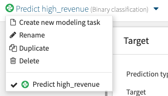
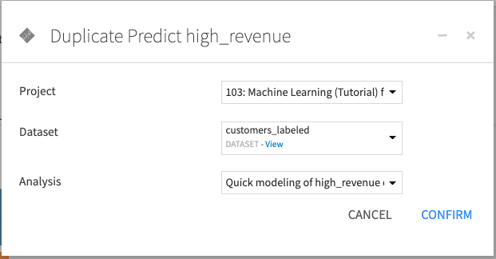
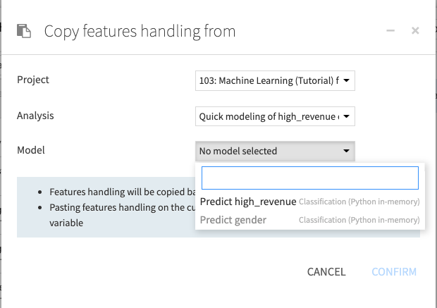

Model Settings Reusability
===========================

Dataiku provides several ways to reuse model settings. This allows you to create custom model settings to use as templates.

Duplicating a Modeling Task
-------------------------------------
Within the Visual ML tool, select **Duplicate** from a Modeling Task's dropdown.

You can duplicate an existing Modeling Task, and create the copy in any project, attached to an analysis on any dataset.

Retaining Settings When Changing the Target Settings
-----------------------------------------------------
In the :doc:`Target settings <supervised/settings>` of a predictive Modeling Task, you can change the target of the Modeling Task.  At that time, you can choose to keep the current model settings. This allows you to immediately reuse model settings between similar targets.  By contrast, re-detecting the settings returns all settings to their default values, based upon the type of target.

.. note::
  If you change the **Prediction type**, some model settings must be reset.

Copying Settings
-----------------
You can copy algorithms and feature handling settings from one Modeling Task to another.

In the :doc:`"Features handling" <features-handling/index>` or :doc:`"Algorithms" <algorithms/index>` settings of a Modeling Task, click **Copy To...** to copy the settings from the current Modeling Task to another, and click **Copy From...** to copy the settings from another Modeling Task to the current one.

