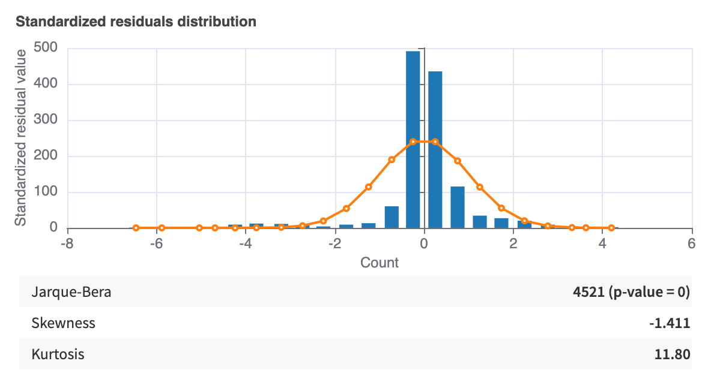
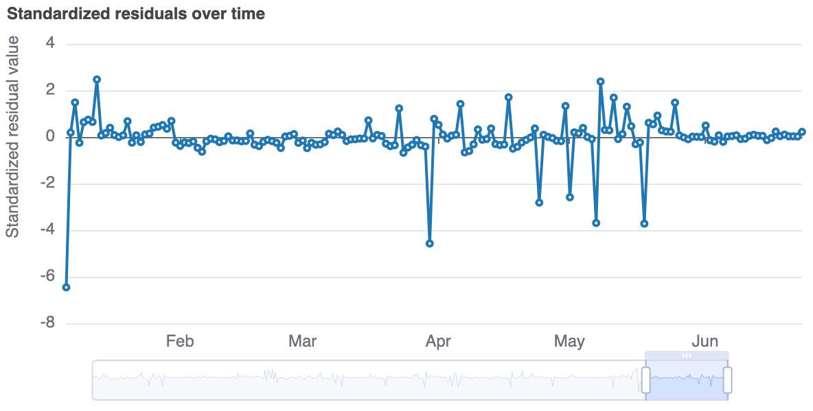
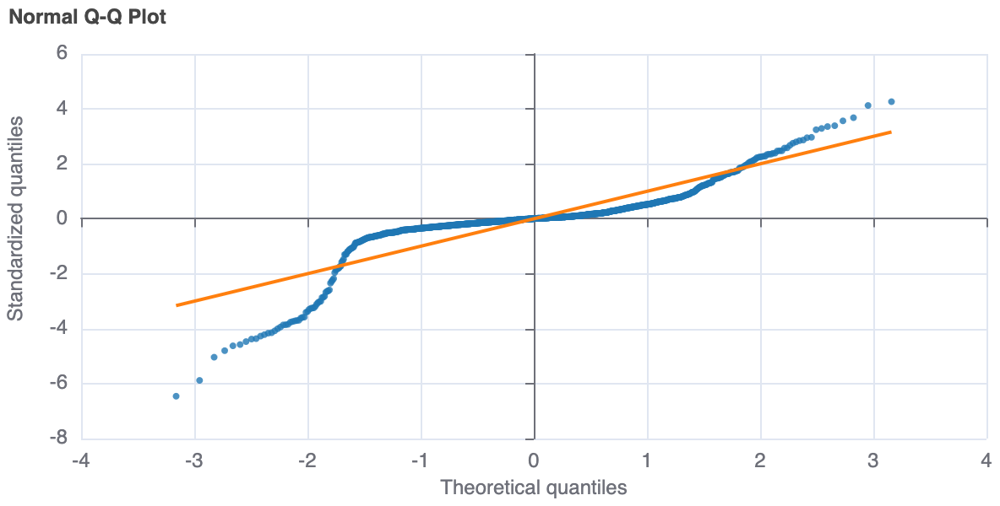
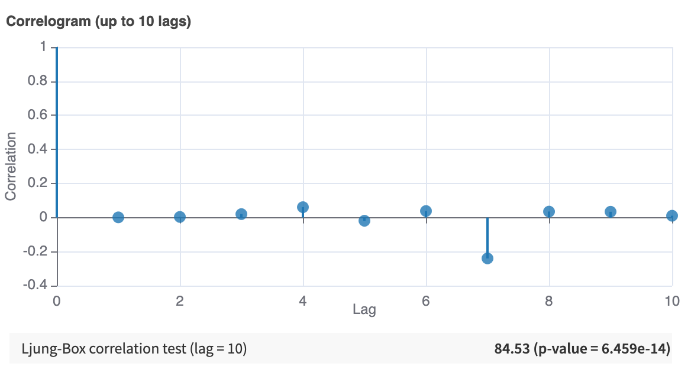

Time Series Forecasting Results
###############################

When a model finishes training, click on the model to see the results.

.. contents:: :depth: 1
    :local:

Forecast charts
===============

The model report contains a visualization of the time series forecast vs. the ground truth of the target variable. If quantiles were specified, this graph also contains the forecast intervals.

If K-Fold cross-test is used for evaluation, the forecast and forecast intervals are shown for every fold.

For multiple time series datasets, one visualization per time series is provided.

.. _forecasting-results-performance-metrics:

Performance: Metrics
====================

For multiple time series datasets, metrics are aggregated over all time series.

If at least one time series has an undefined metric, then the aggregated metric is also undefined. 

If K-Fold cross-test is used for evaluation, these aggregated metrics are then averaged over all folds, ignoring folds that yield undefined metric values.

.. list-table:: Time series aggregation methods by metric
   :widths: 40 60
   :header-rows: 1

   * - Metric
     - Aggregation method
   * - Mean Absolute Scaled Error (MASE)
     - Average across all time series
   * - Mean Absolute Percentage Error (MAPE)
     - Average across all time series
   * - Symmetric MAPE
     - Average across all time series
   * - Mean Absolute Error (MAE)
     - Average across all time series
   * - Mean Squared Error (MSE)
     - Average across all time series
   * - Mean Scaled Interval Score (MSIS)
     - Average across all time series
   * - Mean Absolute Quantile Loss (MAQL)
     - First compute the mean of each quantile loss across time series then compute the mean across all quantiles
   * - Mean Weighted Quantile Loss (MWQL)
     - First compute the mean of each quantile loss across time series then compute the mean across all quantiles. Finally divide by the sum of the absolute target value across all time series
   * - Root Mean Squared Error (RMSE)
     - Square-root of the aggregated Mean Squared Error (MSE)
   * - Normalized Deviation (ND)
     - Sum of the absolute error across all time series, divided by the sum of the absolute target value across all time series

Performance: Per time series metrics
====================================

For multiple time series datasets, DSS also shows the metrics of each individual time series.

If K-Fold cross-test is used for evaluation, per time series metrics are aggregated over each fold for each time series, ignoring folds that yield undefined metric values.

Model Information: Algorithm
============================

For multiple time series datasets, some models train one algorithm per time series under the hood (mainly ARIMA and Seasonal LOESS). The resulting per times series hyperparameters are shown in this tab, if any.

Model Information: Residuals
============================

Residuals are differences between observed data points and the values predicted by the model. Analysis of such residuals is useful to assess how a model behaves on the historical data it has been optimized on.
In Dataiku, those residuals can be visualized with 4 graphs.

.. note::
	Residuals are computed for every possible value of the historical data. Therefore their computation can take a long time. The computation can be manually skipped by checking "Skip expensive reports" before training the model (*Design > Runtime environment > Performance tuning*).

Standardized residuals histogram
--------------------------------

This graph represents the distribution of standardized residuals. Alongside the histogram is plotted a z-distribution.

Standardized residuals over time
--------------------------------

This plot is a representation of the standardized residuals over time. In simpler terms, this is a standardized representation of the error on the historical data.

Normal Q-Q Plot
----------------

A Q-Q plot is a plot of standardized residuals against what would be a theoretical z-distribution of residuals.

Correlogram
-----------

This is a plot of auto-correlation computed for different lag values (up to 10).