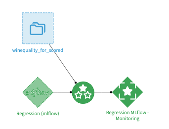
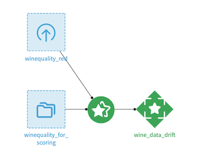
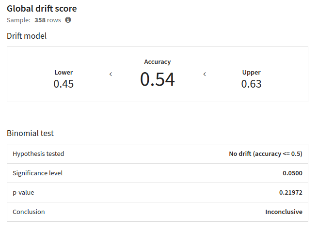
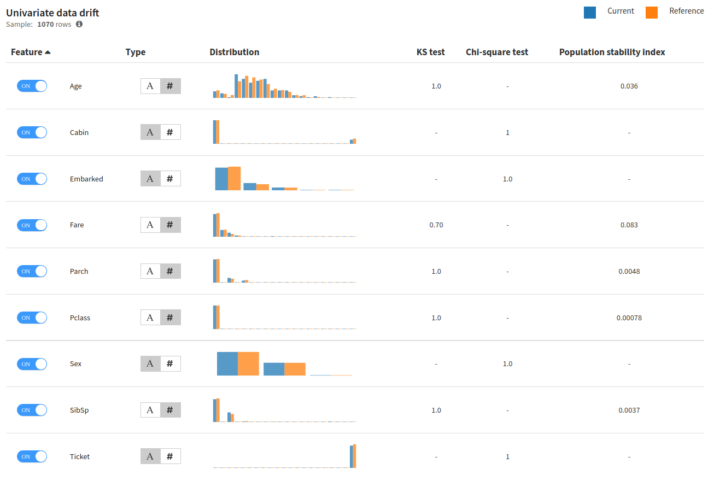
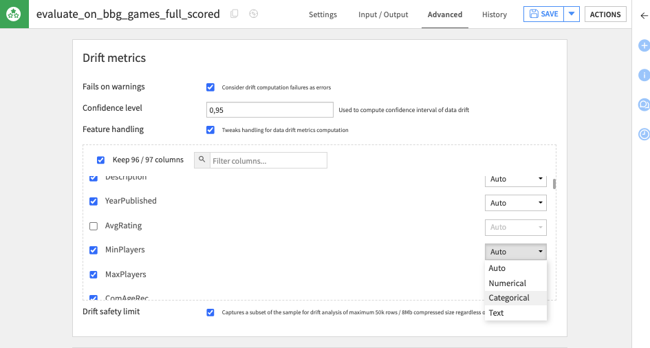
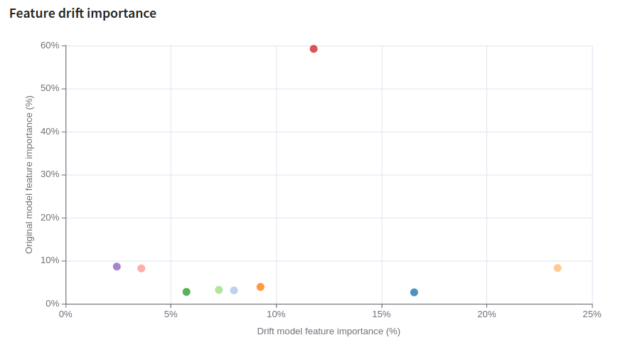
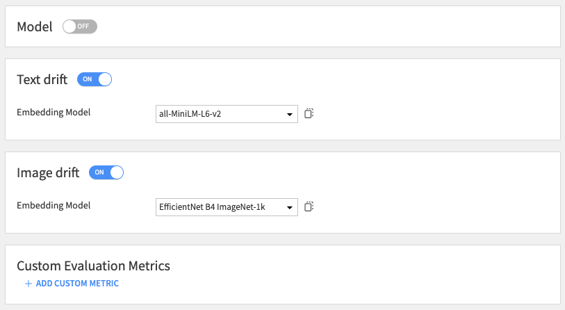
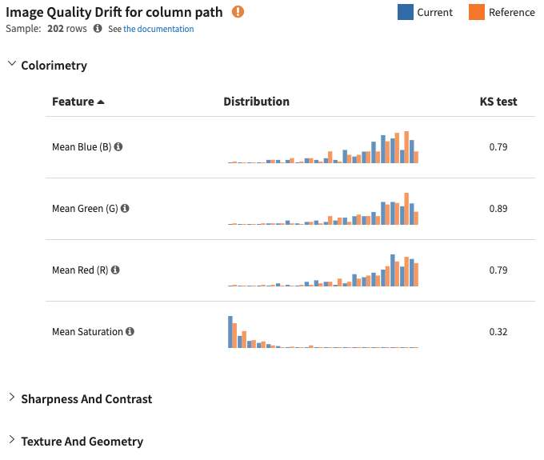

Input Data Drift
################

Input Data Drift analyzes the distribution of features in the evaluated data. If the distribution of features changes significantly, this likely indicates that the underlying data has significantly changed, which could signal a concept drift.

You do not need to have the ground truth / labels to compute Input Data Drift.

Generating Input Data Drift
---------------------------
Input Data drift is computed and stored in a Model Evaluation within a Model Evaluation Store.
In order to create this Model Evaluation, there are 2 options: using an Evaluate recipe or using a Standalone Evaluate recipe. The Evaluate recipe takes two inputs: a dataset containing the most recent data (also called Evaluation Dataset) and a Saved Model. The Standalone Evaluation recipe takes two datasets: an evaluation dataset, as the Evaluate recipe, and a Reference dataset.
The Evaluate recipe is the most commonly used for model monitoring. The Standalone Evaluate recipe is used to compute pure data drift, without model involved, or to perform drift analysis of models unknown to Dataiku.

In the case of the Evaluate Recipe, the drift is computed between the Evaluation dataset and the test set of the Saved Model Version indicated in the recipe configuration.
In the case of the Standalone Evaluate Recipe, the drift is computed between the Evaluation dataset and the Reference dataset.

You can learn more on the applicable sampling strategies in :doc:`Sampling strategies for drift analysis <sampling>`.

.. _global-drift-score:
Global Drift Score
------------------

Global drift score features the same drift model used to compute the "data drift" metric displayed in the "Evaluations" tab of an Evaluation store. In addition to the accuracy of the drift model are also available:

* a lower and upper bound
* a binomial test on drift detection

The drift model is trained on the concatenation of the samples from the related model version training and from the evaluated dataset. Those samples may be truncated to match the size of the other sample to obtain 50% of data from each dataset. The drift model predicts whether a row belongs to one or another sample. The higher the accuracy is, the better the drift model can recognize where a row comes from, and so the more likely has the data.

Univariate Data Drift
---------------------

Univariate data drift performs this operation per feature. Several standard feature drifting metrics are computed by Dataiku and added to the Model Evaluation Store metrics. Additionally, the Model Evaluation will show you the graphical distribution of data and help you spot the features that are subject to drifting.

When running, the recipe will automatically detect the type of drift to use. Dataiku natively supports three handlings: numerical, categorical or textual.

If you want to force a specific handling for a column, this can be done in the recipe configuration, in the 'Advanced' tab. In this tab, you can force a type or exclude a specific feature from the drift computation.

Feature Drift Importance
------------------------

The Feature drift importance scatter plot shows feature importance for the original model versus feature importance for the (data classifying) drift model.

Note on Unstructured Data Drift
-------------------------------

The recipe processes text and image columns separately from standard features.
Their computation requires explicit activation in the recipe configuration.
They need an Embedding Model.
The recipe excludes these columns from the `global drift score <global-drift-score_>`_.

Embedding Drift Metrics
~~~~~~~~~~~~~~~~~~~~~~~
The recipe computes embedding drift metrics using feature embeddings (for Text and Image).
The metrics use the `Euclidean distance`_, the `Cosine similarity`_, and a dedicated Classifier.

.. _Euclidean distance: https://www.kaggle.com/code/adityasingh3519/distance-measures-for-machine-learning#Euclidean-Distance
.. _Cosine similarity: https://www.sciencedirect.com/topics/computer-science/cosine-similarity

Image Quality Drift Metrics
~~~~~~~~~~~~~~~~~~~~~~~~~~~
The image drift analysis compares the distribution of image characteristics (e.g., ``Mean Red``) against the reference sample.
The analysis provides a Kolmogorov-Smirnov (KS) test score for each characteristic.
This metric helps identify characteristics that show significant drift from the reference sample.

Image Classifier Visualization
~~~~~~~~~~~~~~~~~~~~~~~~~~~~~~
The image drift analysis also displays the classifier confidence graph and visual examples of drifted images.

