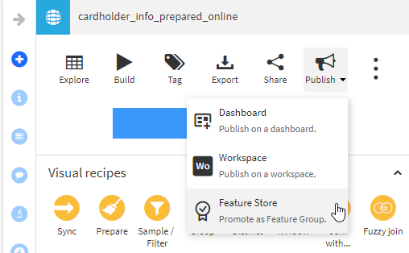
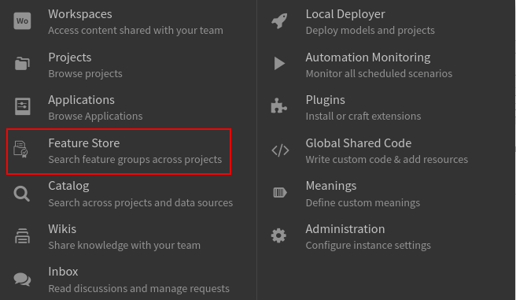
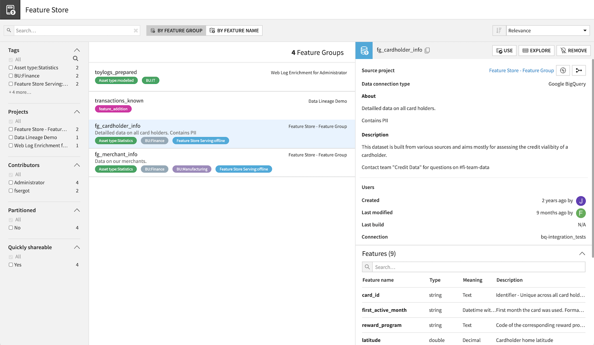

Feature Store
#############

A core expectation of MLOps is to accelerate the deployment of models. A key part of this acceleration is to build efficient models faster.
This can be achieved by using the most relevant data without heavy preparation, especially if this preparation is repeated.
Helping Data Scientists to build, find and use this relevant data is the core notion of a *Feature Store*.

In order to implement such an approach in DSS, there are many capabilities at hand:

* Feature Storage is handled by Dataiku extensive :doc:`Connections Library </connecting/connections>`
* Data Ingestion and Curation is performed using :doc:`Recipes in the Flow </flow/index>`
* Offline serving for batch processing is done using :doc:`Join Recipes </other_recipes/join>` in :doc:`projects deployed on an Automation node </deployment/index>`
* Online serving for realtime processing is done using :doc:`Dataset Lookups </apinode/endpoint-dataset-lookup>` in API services
* Data monitoring is implemented using :doc:`Metrics & Checks </metrics-check-data-quality/index>`
* Automated building and maintenance is managed by :doc:`Scenarios and Triggers </scenarios/index>`

In DSS, the *Feature Store* section is actually the central registry of all *Feature Groups*, a *Feature Group* being a curated and promoted Dataset containing valuable *Features*.

.. note::

    If you are interested in building a complete Feature Store solution within Dataiku, you can read `our hands-on article in our knowledge base <https://knowledge.dataiku.com/latest/kb/o16n/feature-store/features-store-overview.html>`_.

Creating a Feature Group
------------------------

A Feature Group is a curated DSS Dataset that is shared across your entire instance. In order to create Feature Groups:

* Create a dataset containing the features, either by direct definition or using recipes
* Set this dataset as a feature group

.. note::

    Defining Feature Groups requires the "Manage Feature Store" permission.

    In order to streamline the usage of Feature groups by other teams and projects, it is recommend to have as often as possible the underlying Datasets be either *Quickly Shareable* or with *Request access* activated (see :doc:`Shared Objects </security/shared-objects>`).

Feature Store
-------------

The Feature Store is available through the "nine dots" menu.

From this main screen, you can search and see information on the Feature Groups:

* The left panel allows to refine the search on various criteria
* The central panel shows the Feature Groups with the main data
* When clicking on a line in this central panel, the right panel shows details on the Feature Group such as its description, details on its content and its usage

.. note::

    You may experience a latency of a few seconds before a Feature Group appears in the Feature Store and is usable.

Using a Feature Group
---------------------

As a user of the Feature Store, you have a "Use" button in the right panel when the Feature Group is selected. This button allows to add this specific Feature Group into your project.

You will then be invited to select the target project(s) in which the Feature Group should be added as a dataset.
As explained above, leveraging the Request Access and Quick Share options makes this easier.

The Feature Group can then be used as any other dataset. It appears in the flow with a medal overlay in the lower right corner.

.. image:: img/feature_group_in_the_flow.png

Removing a Feature Group
------------------------

To remove a Feature Group, click on the "Remove" button. This action will not delete the underlying Dataset. Similarly, all existing sharings of the underlying dataset will remain fully working. Removing a Feature Group essentially means that it will not be available in the Feature Store for future users.

