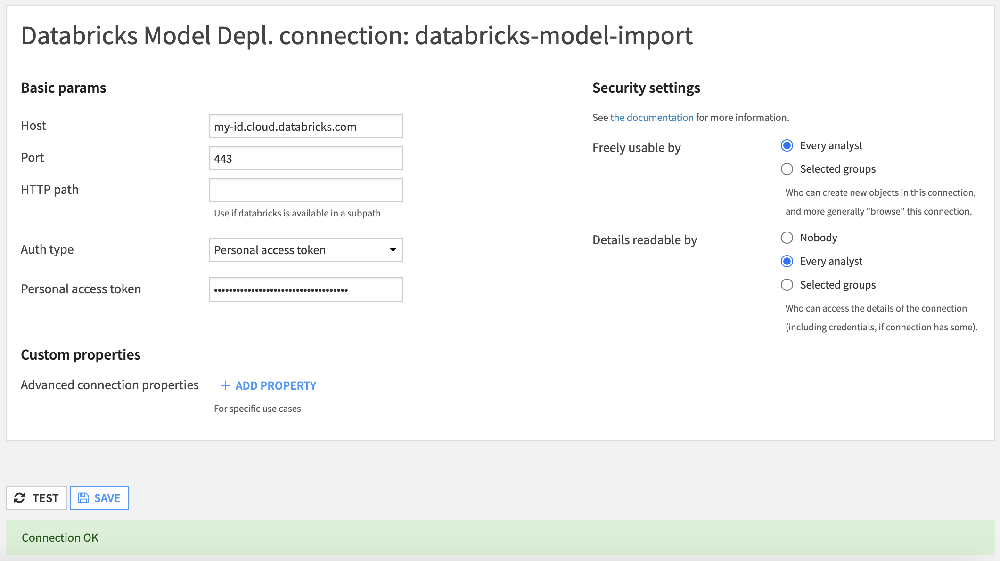
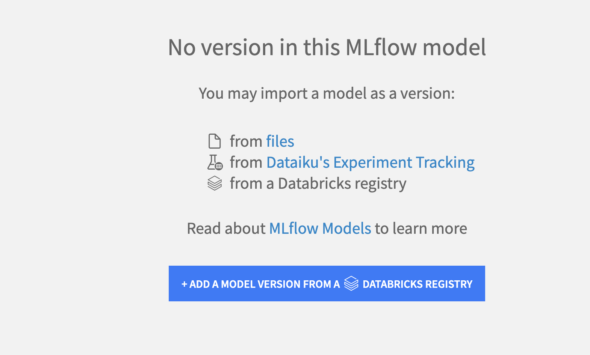
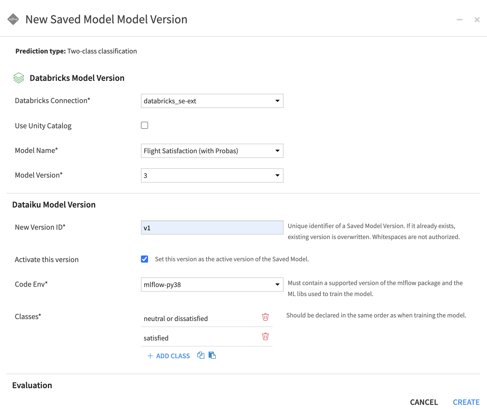
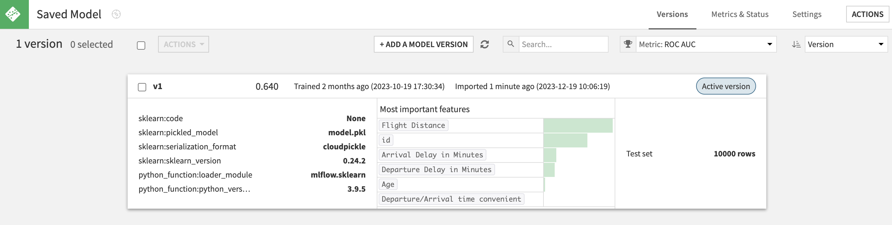

Importing MLflow models
########################

You can import an `MLflow Model <https://www.mlflow.org/docs/2.17.2/models.html>`_ into DSS as a Saved Model:

* through the Python API (see :meth:`dataikuapi.dss.project.DSSProject.create_mlflow_pyfunc_model`)
* using the "Deploy" action available for logged models in Experiment Tracking's runs (see :doc:`/mlops/experiment-tracking/deploying`)
* import an MLflow model from a Databricks registry ( `Workspace Registry <https://docs.databricks.com/en/mlflow/model-registry.html>`_ or `Unity Catalog <https://docs.databricks.com/en/data-governance/unity-catalog/index.html>`_ )

Importing an MLflow model through the Python API
================================================

This section focuses on the deployment through the API. It assumes that you already have a MLflow model in a *model_directory*, i.e. a local folder on the local filesystem, or a *Managed Folder*.

This section also assumes that you already have a :doc:`code environment </code-envs/index>` including core packages, MLflow, scikit-learn, statsmodels, as well as the Machine Learning package you used to train your model, in the version recommended by MLflow. The Python version of this code environment should be 3.7 or higher. Please refer to :doc:`limitations` for information on supported versions.

The steps are then:

1. Create a DSS Saved Model using :meth:`dataikuapi.dss.project.DSSProject.create_mlflow_pyfunc_model`
2. Import the MLflow model into the Saved Model using  :meth:`dataikuapi.dss.savedmodel.DSSSavedModel.import_mlflow_version_from_path` or :meth:`dataikuapi.dss.savedmodel.DSSSavedModel.import_mlflow_version_from_managed_folder`
3. Use the returned MLflow handler to set metadata and evaluate the DSS Saved Model: :meth:`dataikuapi.dss.savedmodel.MLFlowVersionHandler`

.. note::

    You may specify a code environment when importing a project. If not, the **current** code environment defined for the project will be resolved and used.

.. code-block:: python

    import dataiku

     # if using API from inside DSS
    client = dataiku.api_client()

    project = client.get_project("PROJECT_ID")

    # 1. Create DSS Saved Model
    saved_model = project.create_mlflow_pyfunc_model(name, prediction_type)

    # 2. Load the MLflow Model as a new version of DSS Saved Model
    ## either from DSS host local filesystem:
    mlflow_version = saved_model.import_mlflow_version_from_path('version_id', model_directory, 'code-environment-to-use')
    ## or from a DSS managed folder:
    mlflow_version = saved_model.import_mlflow_version_from_managed_folder('version_id', 'managed_folder_id', path_of_model, 'code-environment-to-use')

    # 3. Evaluate the saved model version
    # (Optional, only for regression or classification models with tabular input data, mandatory to have access to the saved model performance tab)
    mlflow_version.set_core_metadata(target_column, classes, evaluation_dataset_name)
    mlflow_version.evaluate(evaluation_dataset_name)

.. note::
   You may also use the API to import models trained in experiment runs, as any model stored in a managed folder.

.. note::
   **Features Handling:** For MLflow Models, string and boolean features will be considered **Categorical**.

Importing an MLflow model from a Databricks registry
====================================================
Another option to import an MLflow model is to select it directly in your Databricks registry from the Interface and ask Dataiku to import it for you.

Your first step is to ensure you have a valid connection to your Databricks workspace.
This is done by an administrator in the Administration > Connections, by creating a connection of type "Databricks Model Depl.".

Once this connection is created and working, you can go to any project, in the Saved Models section.
Click on the button '+NEW SAVED MODEL' and select the option to create a custom model.

Fill in the information and create the Saved Model.
At this point, you have an empty shell to add versions to. We are creating a version by importing it from Databricks, but you can mix any of the options mentioned at the top of this article (for example, the first version might be imported from Databricks but the next one might come from Dataiku Experiment Tracking).

Next, from the Saved Model screen, click on the button to create a Saved Model Version from a Databricks registry.

You will be presented with the window to enter information on where to load the MLflow model from:

* Select the Databricks connection that was created (this will trigger Dataiku to list all the models registered in the configured Databricks account)
* By default, models are fetched from Databricks Model Registry, check the option if you would rather import from Unity Catalog
* You can then select the model and the version you want to import

The rest of the creation process is standard to all MLflow import:

* Enter the details of the Saved Model Version you are going to create. Pay special attention to the Code Env used as it needs to contains all the packages required by your MLflow model
* The Evaluation section is optional, although we strongly recommend to use it with a relevant dataset to have all the Evaluation and Performances screens

Once validated, Dataiku will perform all the operations for you. At the end, you will have a fully working Dataiku Saved Model Version.

.. note::
	The lineage to actual Databricks model & version imported is stored and displayed in the Summary seciton of a Saved Model Version (this is also true when importing from Experiment Tracking).

Alternatively, you can also make a direct import from Databricks using Dataiku's Python API. The process is the same as explained at the top of this article except the actual import call is done using the method :meth:`dataikuapi.dss.savedmodel.DSSSavedModel.import_mlflow_version_from_databricks`. You still need to have a working Databricks connection beforehand.

.. code-block:: python

    import dataiku

     # if using API from inside DSS
    client = dataiku.api_client()

    project = client.get_project("PROJECT_ID")

    # 1. Create DSS Saved Model
    saved_model = project.create_mlflow_pyfunc_model(name, prediction_type)

    # 2. Load the MLflow Model as a new version of DSS Saved Model from Databricks
    mlflow_version = saved_model.import_mlflow_version_from_databricks('version_id', 'connection_name', 'use_unity_catalog', 'model_name', 'model_version', 'code_env_name')

    # 3. Evaluate the saved model version
    # (Optional, only for regression or classification models with tabular input data, mandatory to have access to the saved model performance tab)
    mlflow_version.set_core_metadata(target_column, classes, evaluation_dataset_name)
    mlflow_version.evaluate(evaluation_dataset_name)
