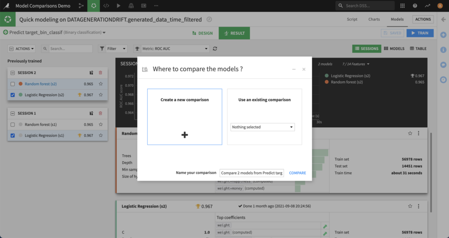
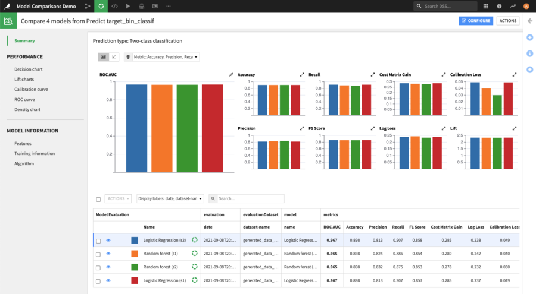
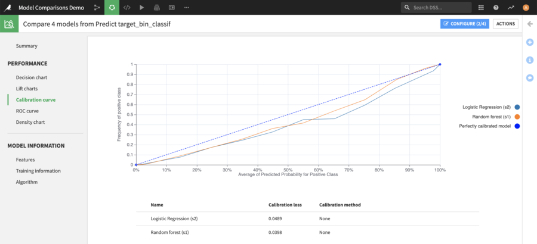
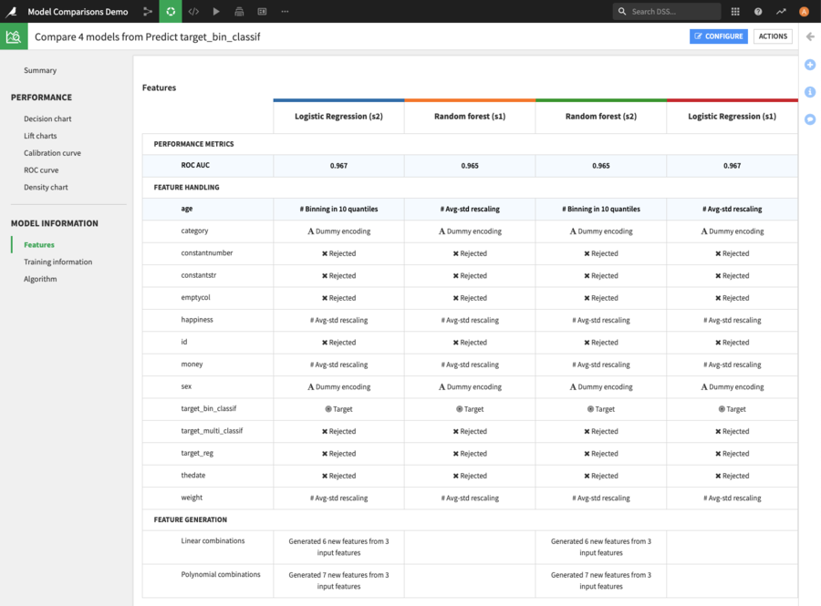
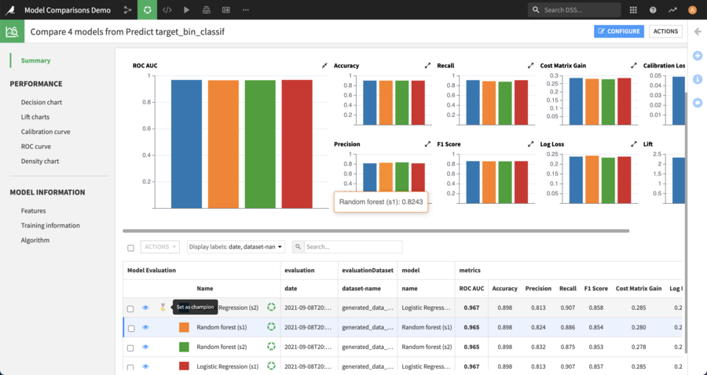
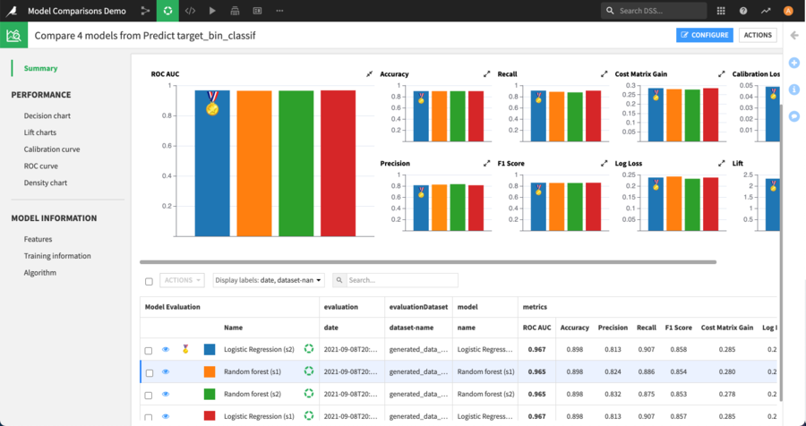
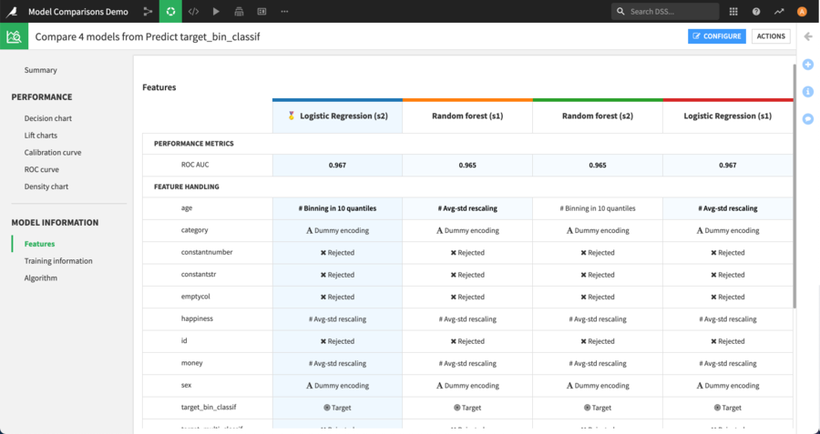

Model Comparisons
#################

.. contents::
    :local:

When designing a model, it is very common to successively build multiple models with different parameters to try to obtain the best possible model.

To understand if a model is better than another, models must be evaluated on some data for which the ground truth is known, so that one can compare the performance metrics they want to optimize across all the models. Therefore finding the best model requires comparing Model Evaluations.

Then, Models are deployed and used in "production". Over time, the conditions in real life may drift compared to what was the reality at train time and thus have a possibly negative impact on how the model behaves. This is known as Model Drift.

There can be data drift, i.e. change in the statistic distribution of features, or concept drift, which is due to a modification of the relationship between features and the target.

To monitor model drift, it is necessary to gather new data from the production environments and possibly have ground truth associated with it. See :doc:`/mlops/model-evaluations/automating` for more details.

Finally, one needs to dig into a statistical analysis of those production data.

To ease those processes, Data Scientists responsible for building and operating the models must be able to:

* Compare Model Evaluations with one another to understand which model performs the best on a given dataset and why
* Understand the settings that led to this model, to refine the training of the next model and continue their attempt to get a better one

Model Comparisons addresses these 2 needs by providing visual tools to compare the performance of several Model Evaluations, along with the initial parameters of their underlying model.

Creating a comparison
=====================

Model Comparisons can compare model evaluations from any of the following three kinds (and can be created directly from there).

A comparison can compare a mix of different items and, at any time, the user can add new items to an existing comparison.

Model Comparisons may also be created empty directly from the menu. In this case, prediction type must be set carefully, because it cannot be changed afterward.

Visual analysis model
----------------------

After training different models in a Visual Analysis (please refer to the `Machine Learning Basics <https://knowledge.dataiku.com/latest/ml-analytics/model-design/ml-basics/tutorial-index.html>`_ and to :doc:`/machine-learning/index` for more information), it's possible to select different models to compare across different sessions.

When models are selected, click on "Compare" in the mass action dropdown:

.. image:: img/compare.from.va.png

Then choose whether to create a new comparison or to add the selected models to an existing one:

Saved Model version
---------------------

Model Comparison can also include Saved Model Versions (i.e: versions from a model that is deployed in the Flow).

For example, this is useful to compare multiple versions of the same saved model, or when challenging a specific version of a saved model (champion) with newly created models in a visual analysis (challengers).

Evaluations from Evaluation Stores
-----------------------------------

When you have :doc:`Model Evaluations in Evaluation Stores </mlops/model-evaluations/index>`, you can add them to a Model Comparison.

This is available both for evaluations coming from DSS models or external models.

Comparing Model Evaluations
===========================

Several screens are provided to compare models along different characteristics.

In the summary page, charts show different performance metrics of the models. More details about each Model Evaluation is shown in the table below: train date, algorithm, train dataset name, evaluation dataset name, ... 

Besides the summary page, there are two sections available: Performance & Model Information.

Performance
-----------

This section provides additional charts depending on the type of prediction.

For classification models, calibration curve, ROC curve and density chart are available. For regression, a Scatter Plot is provided.

    Comparing the calibration curve between 2 Model Evaluations

Model Information
-----------------

The model information section enables one to compare the model settings, to help understand how differences in the settings used when training the model can lead to differences in performance.

    Comparing the feature handling between 4 models

Challenging the champion
========================

The Model Comparison provides a tool to facilitate the comparison of a specific model, the "Champion", against all others, the "Challengers". The champion may be the model currently deployed in production or simply the best performing at the moment.

From the summary page, one of the Model Evaluations can be configured as the “champion” by clicking on the corresponding button when hovering over it in the table.

Once a champion is defined, it is displayed with a specific icon on the performance charts, so that it can be quickly identified.

On the Model Information screens, instead of highlighting settings that are not the same for all models when there is no champion, the comparator will highlight the settings that differ from the ones used by the champion.

Customizing the comparison
==========================

The display of the comparison may be customized using the "configure" button located at the top right of all comparison screens.

From the configuration modal, one may rename the different items, temporarily hide some, reorder them or change an item's color.

.. note::
    Changes that are set in this modal will then apply to all the screens of the current comparison.

.. warning::
    Renaming an item will actually rename the underlying item.

Limitations
===========

All :doc:`prediction models </machine-learning/supervised/index>` trained in Dataiku may be used in a Model Comparison. This includes binary classification, multi-class classification and regression models.

It’s also possible to:

* add :doc:`MLflow models </mlops/mlflow-models/index>` imported as Saved Model Versions
* add :doc:`External models </mlops/external-models/index>`
* add Model Evaluations obtained by applying the Standalone Evaluation Recipe to the Evaluation dataset of a model

The following kinds of models are not supported for use in comparisons:

* :doc:`Partitioned models </machine-learning/partitioned>`
* :doc:`Ensemble models </machine-learning/ensembles>`
* :doc:`Clustering models </machine-learning/unsupervised/index>`
* Computer vision models
* Deep Learning models
* MLflow models that are not tabular

Only evaluations from the same prediction type - binary classification, multi-class classification or regression - can be added to the same model comparison.

For evaluations that are the result of a Standalone Evaluation Recipe, the prediction type is specified in the settings of the recipe.
