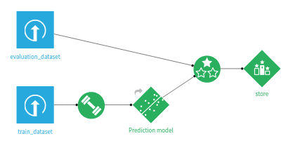
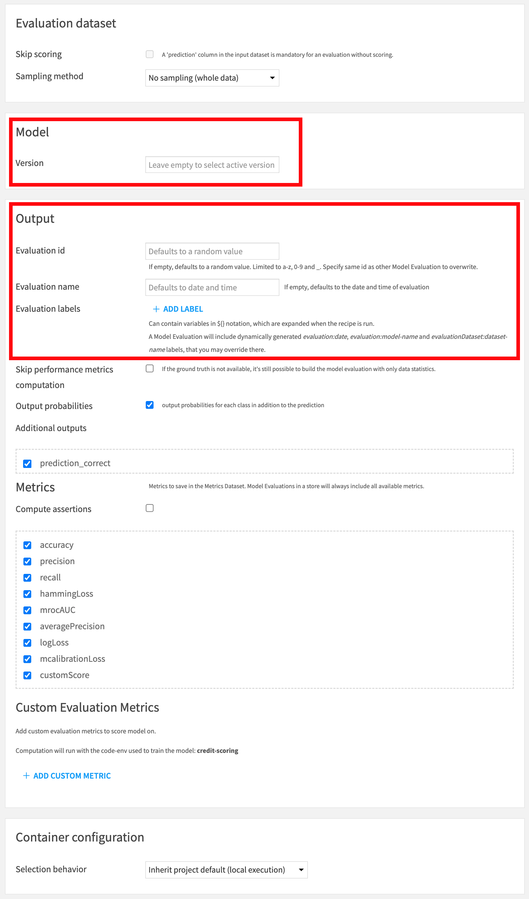

Evaluating Dataiku Prediction models
#######################################

.. contents::
    :local:

To evaluate a Dataiku Prediction model, you must create an Evaluation Recipe.

An Evaluation Recipe takes as inputs:

* an evaluation dataset
* a model

An Evaluation Recipe can have up to three outputs:

* an Evaluation Store, containing the main Model Evaluation and all associated result screens
* an output dataset, containing the input features, prediction and correctness of prediction for each record
* a metrics dataset, containing just the performance metrics for this evaluation (i.e. it's a subset of the Evaluation Store)

Any combination of those three outputs is valid. 

Each time the Evaluation Recipe runs, a new Model Evaluation is added into the Evaluation Store.

.. note::

    This applies both to models trained using :doc:`Dataiku visual machine learning </machine-learning/supervised/index>` and :doc:`imported MLflow models </mlops/mlflow-models/index>`

Configuration of the Evaluation Recipe
=======================================

In this screen, you can:

* Select the model version to evaluate. Default is the active version.
* Set the human readable name of the evaluation. Defaults to date and time.
* (Advanced) Override the unique identifier of the new Model Evaluation in the output Evaluation Store. Should only be used if you want to overwrite an evaluation. Default is a random string.

Other items in the Output block relate to the output dataset. The Metrics block controls what is output in the metrics dataset.

Labels
------

Both the Evaluation Recipe and Standalone Evaluation Recipe allow the definition of labels that will be added to the computed Model Evaluation. Those labels may be useful to implement your own semantics. See :doc:`analyzing-evaluations` for additional information.

Sampling
--------

Performance metrics are computed using a sample of the evaluation dataset. You can adjust the sampling parameters in the 'Sampling' section.

Note that the actual stored sample, used for drift analysis, uses additional sampling rules. See :doc:`../drift-analysis/sampling` for additional information.

Custom Evaluation Metrics
---------------------------

The Evaluation Recipe allows you to write your own metrics in Python.

For each Custom Evaluation Metric, you must define a 'score' function that returns a single float representing the metric.

In addition to the ground truth and predictions, if your Evaluation Recipe outputs an Evaluation Store, the 'score' function will receive a reference dataframe. This dataframe is a sample from the test set used during the training of the evaluated model. This enables you to define, for instance, custom data drift metrics.

Code samples are available to help you get started with custom metrics more easily.

Limitations
==============

* The model must be a non-partitioned Classification, Regression or :doc:`Time series Forecasting </mlops/model-evaluations/time-series-models>` model
* Non-tabular MLflow inputs are not supported
* Computer vision models are not supported
* Deep Learning models are not supported
* For :doc:`Time series Forecasting models </mlops/model-evaluations/time-series-models>`, Input Data Drift, Prediction Drift and Custom Evaluation Metrics are not supported
