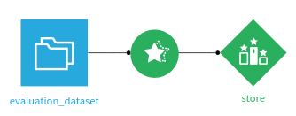
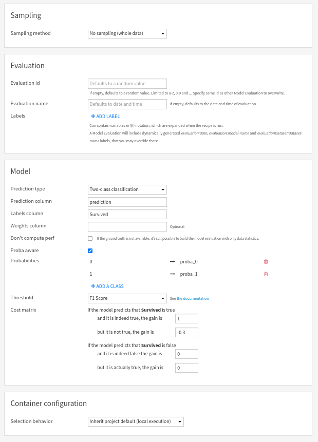

Evaluating other models
###########################

.. contents::
    :local:

.. note::

    This is a very advanced topic

It can happen that you have models that are completely custom, i.e. they are neither trained using :doc:`DSS Visual Machine Learning </machine-learning/supervised/index>` nor :doc:`imported from MLflow models </mlops/mlflow-models/index>`.

You can still benefit from the Model Evaluation framework of DSS for these models, and hence benefit from:

* Models results screens
* Drift analysis

Those models must be evaluated using a Standalone Evaluation Recipe (SER).

A SER has one input, the evaluation dataset, and one output, an Evaluation Store.

Each time the evaluation recipe runs, a new Model Evaluation is added into the Evaluation Store.

Since there is no model for a Standalone Evaluation Recipe, the evaluation dataset (input of the SER) must have a column containing the predicted values. In most cases, it also needs to have a column containing the "ground truth" (also known as the labels). However, even if you don't have the ground truth, you can still use the Standalone Evaluation Recipe. In this case, results screens will not be available (because there is no ground truth to compare to), but input data drift analysis and prediction drift analysis remain possible.

Configuration of the standalone evaluation recipe
==================================================

In this screen, you can:

* Set the human readable name of the evaluation. Defaults to date and time.
* (Advanced) Override the unique identifier of the new Model Evaluation in the output Evaluation Store. Should only be used if you want to overwrite an evaluation. Default is a random string.

You also have to provide information on the model:

* prediction type: binary, multiclass or regression
* name of the column containing the predictions (mandatory)
* name of the column containing labels (ground truth - not mandatory if "Don't compute perf" is checked)
* weights column (optional)

If the model is a classification, you need to specify the list of its classes. If it is also probabilistic, you need to specify the mapping from each class to the column of the evaluation dataset holding the probability for this class.

For binary classification models, you can also adjust the threshold and cost matrix settings.

Labels
------

Both the Evaluation Recipe and Standalone Evaluation Recipe allow the definition of labels that will be added to the computed Model Evaluation. Those labels may be useful to implement your own semantics. See :doc:`analyzing-evaluations` for additional information.

Sampling
--------

A Model Evaluation (ME) uses a sample of at most 20000 lines. By default, the 20000 first lines of the evaluation dataset will be used. You can adjust the sampling method, but the sample used by the ME will always have a maximal length of 20000 lines.
