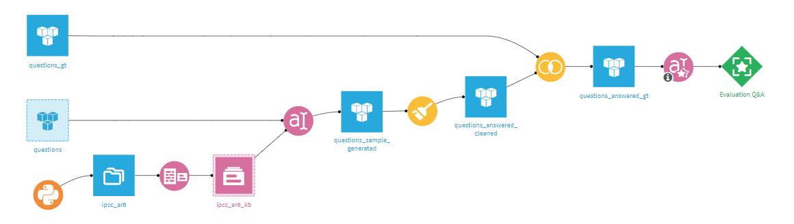
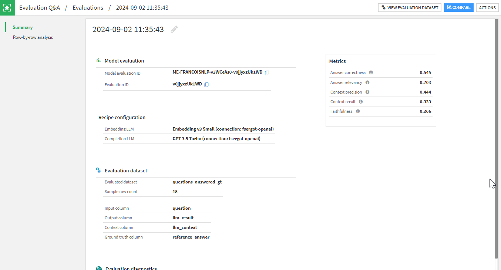
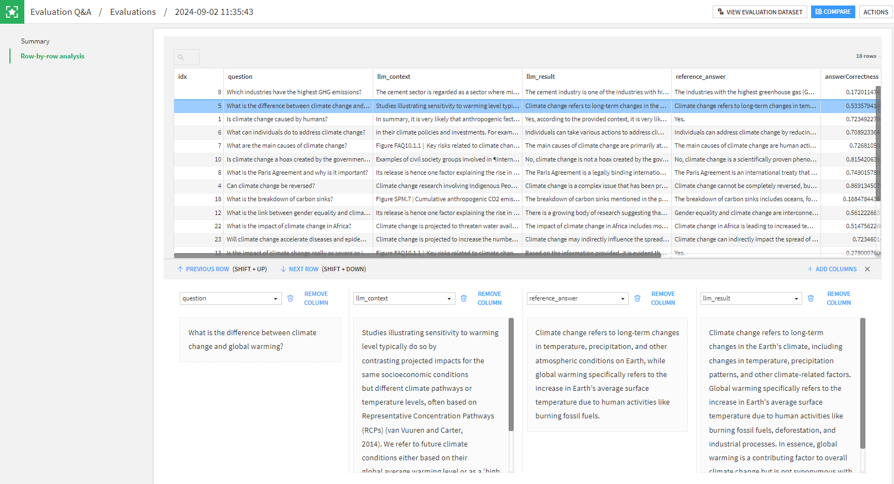
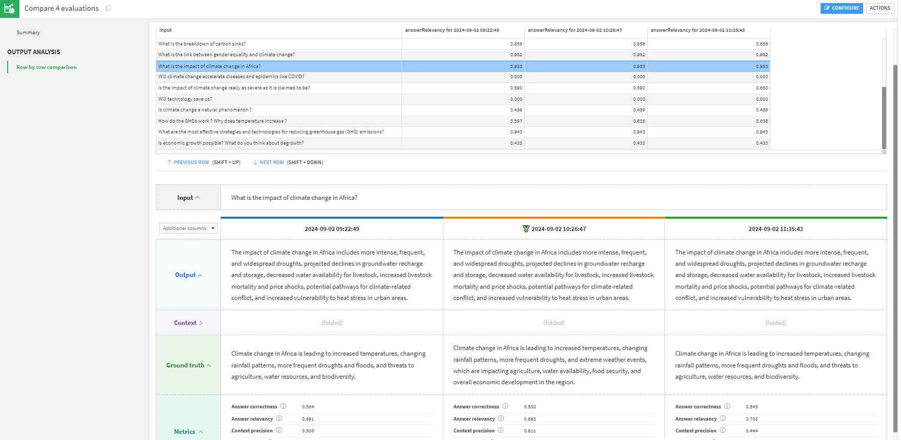

Evaluating Large Language Models
################################

.. contents::
    :local:

With the adoption of large language models (LLMs), which are able to use natural language as input or output, the topic of evaluating their performance is both important and not trivial.
Standard model evaluation techniques are not well-suited; evaluation of LLMs requires a specific treatment.

This is why Dataiku offers the "Evaluate LLM" recipe. This recipe generates various outputs, the most pivotal of which is a model evaluation stored in a :doc:`model evaluation store </mlops/model-evaluations/analyzing-evaluations>`. From this model evaluation store, you can then complete your LLMOps actions with alerting or automated actions.

.. note::

    The "Evaluate LLM" recipe is available to customers with the *Advanced LLM Mesh* add-on.

Overview
========

As LLMs and their usage can be quite diverse, the "Evaluate LLM" recipe is meant to be adaptive. Contrary to the standard :doc:`Evaluate recipe </mlops/model-evaluations/dss-models>`, it does not take a model as a direct input, but a single dataset --- the output of your pipeline containing all the required columns: input, output, context, ground truth, etc...

With this logic, the recipe can be used directly beyond a prompt recipe to evaluate an LLM, or a RAG, but it can also be used at the end of a more complex pipeline that uses several techniques, models, and recipes.

When run, the recipe will compute a set of metrics based on the content of the input dataset and create a single model evaluation.

.. note::

	Our `LLM Evaluation tutorial <https://knowledge.dataiku.com/latest/ml-analytics/gen-ai/tutorial-llm-evaluation.html>`_ provides a step-by-step explanation of how to create your first LLM Evaluation Flow. Do not hesitate to do it as a first experience.

There are some pre-requisites for having a working recipe. Those requirements are to be done once, but may require the assistance of your instance administrator.

- You need to have a :doc:`code environment </code-envs/index>` with the required preset installed (using Python 3.8+). Look for the preset called "Evaluation of LLMs".
- For most metrics, you will need an LLM to compute embeddings and an LLM for generic completion queries. These can be the same but it is not mandatory. These LLMs are to be selected from :doc:`Dataiku's LLM Mesh </generative-ai/llm-connections>`.

Recipe configuration
====================

You can create an "Evaluate LLM" recipe from any dataset.

If this is your first experience with the recipe, take a dataset out of a Prompt recipe and use the predefined setup:

- In the "Input dataset" section, set the Input Dataset Format to "Prompt Recipe" and the task to the relevant type (for example "Question answering").
- Ensure you have a proper code environment and LLMs for embedding and completion.
- Finally, click on the "SELECT COMPUTABLE METRICS" button. All relevant and computable metrics will be selected for you.

With that, you should be able to run your first LLM Evaluation. For the sake of understanding, let's dive a bit more into each section to explain it.

Input dataset
-------------

The Input Dataset Format allows the use of presets for some common tasks in DSS:

- Prompt Recipe: The Input Dataset is the output dataset of the Prompt Recipe.
- Dataiku Answers: The Input Dataset is the conversation history dataset of the solution.

The "Task" selection allows Dataiku to better guide you in setting up the recipe. If you are not satisfied with any option, you can always use the generic "Other LLM Evaluation Task". In addition to helpers on the expected columns, the choice of task will also influence the computable metrics.
                                                                                             
Metrics
-------

The "Metrics" section is where you will define the core of the recipe. If you have selected a Task, Dataiku will highlight recommended metrics, but you can always remove metrics you are not interested in.

Below this list, you will need to enter the LLM to use to compute embeddings and the LLM for LLM-as-a-judge metrics. Those fields are not mandatory, as some metrics do not require any LLM, such as BLEU or ROUGE, but most metrics will need those models.

The meaning of metrics and their requirements are indicated on screen. If you want more in-depth understanding, you can read the `RAGAS documentation <https://docs.ragas.io/en/latest/concepts/metrics/index.html>`_. Note that LLM-as-a-judge metrics are computed row-by-row, and the recipe will compute the average for all rows as its final value.

.. note::

	Your instance administrator can setup a default code environment and default LLMs for all "Evaluate LLM" recipes. Look in the section **Administration > Settings > LLM Mesh > Evaluation recipes**.

                                                                                                                                   
Custom metrics
--------------

As LLM evaluation is a quickly evolving topic, the recipe allows you to write your own metric in Python. This is done using a standard "evaluate" function and should return at least one float representing the metric.

Additionally, you can return an array of floats, each entry being the metric value for a single row. This will be used in the row-by-row analysis.

Code samples are available, which can make your first experience with custom metrics easier.

LLM Evaluations
===============

Each run of the "Evaluate LLM" recipe will create one model evaluation. This model evaluation will be visible in the output model evaluation store.

In the main view of a model evaluation, you see plotted metric graphics at the top and the list of model evaluations at the bottom, including metadata, labels, and metrics in a table.

When you open a model evaluation, the first section contains: run info, the recipe configuration at the time of the run, and all metrics. You also see the labels that were added during the execution of the recipe. You can add, update or delete labels if you want.

The second section of a model evaluation is a row-by-row detail. This aims at helping you understand specific values of metrics. As an example, if you have a particularly low faithfulness score, you can look at the context and the answer and assess it with your own judgement.

If you have defined custom metrics, they will be shown in the model evaluation summary along other metrics. If your custom metric returned the array with detailed values, you will also see it in the row-by-row analysis.

Comparisons
===========

This row-by-row view is very practical to analyze specific cases in a run. However, when building a complex GenAI pipeline, you will probably experiment with different LLMs, different prompts, different pre- or post- processing. In such a case, the goal is not to analyze , but to compare runs using potentially very different pipelines.

Comparing runs is using :doc:`model comparisons </mlops/model-comparisons/index>`. As a specific addition to the standard model comparison, the LLM Comparison has a section allowing you to perform side-by-side view for each row.

In this screen, you can select a row, and you will see outputs of each run. This allows you, for example, to spot a line where the answer relevancy is vastly different between two runs and analyze it in depth to make an informed decision about which version of your pipeline is best.
