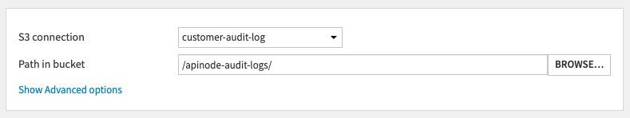
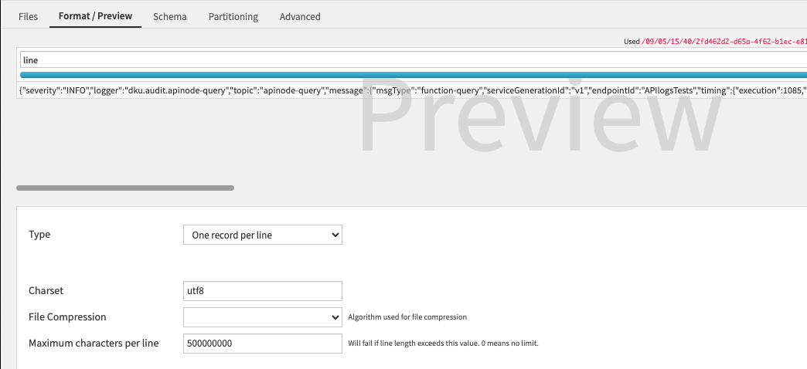
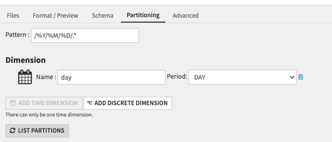
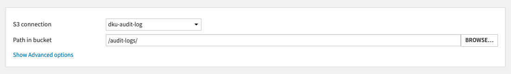
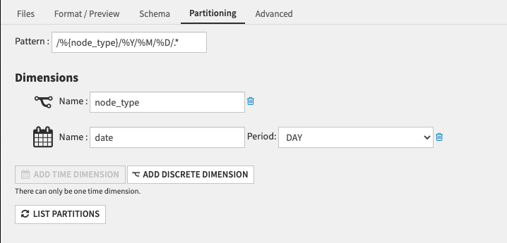

Audit trail on Dataiku Cloud
############################

.. contents::
	:local:

On Dataiku Cloud, audit logs will be automatically served through connections installed on your DSS, so you can leverage them directly in your instance.

Access API node queries
=======================

An Amazon S3 connection named "customer-audit-log" hosting your API Nodes logs queries is automatically added to your instance when you activate the API nodes. No further action is required.

To import your logs as a dataset in your Dataiku's instance:

1. Add a Dataset > Cloud storages & Social > Amazon S3
2. Select the corresponding S3 connection and the path in bucket

4. In the "Format / Preview" tab, select "One record per line" as Type and  "utf8" as Charset

5. In the "Partitioning" tab, activate the partitioning: add a time dimension corresponding to the period you want to partition on, in the example below we partition per day

6. Create the Dataset and access it in the Flow

Access instances' audit logs 
============================

This feature is only available for customers.

Activate the extension "dku-audit-log" in your Launchpad to add an Amazon S3 connection named "dku-audit-log" hosting your audit trail accessible from your Dataiku instance.

By default only space-administrators can access this connection, you can edit this behavior in the Launchpad's connections tab.

Once the connection is available, to import the logs as a dataset in your Dataiku's instance:

1. Add a Dataset > Cloud storages & Social > Amazon S3
2. Select the corresponding S3 connection and the path in bucket

4. In the "Format / Preview" tab, select "One record per line" as Type and  "utf8" as Charset

5. In the "Partitioning" tab, activate the partitioning: add a discreet dimension called "node_type",
and add a time dimension corresponding to the period you want to partition on, in the example below we partition per day

6. Create the Dataset and access it in the Flow
