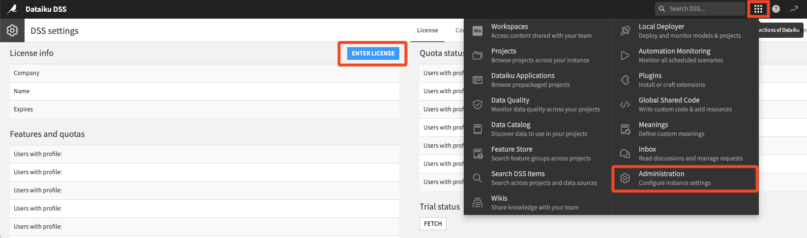

DSS license
##############

.. toctree::

Dataiku DSS requires an up-to-date license to work.

Free Edition
=============

If you use the `Free Edition <https://www.dataiku.com/dss/editions/>`_, the license is automatically generated when you fill out the form the first time you start the product, and never needs updating.

.. _license.enterprise:

Enterprise Edition
====================

If you use the `Enterprise Edition <https://www.dataiku.com/dss/editions/>`_, Dataiku provides you with a license file, used to install Dataiku DSS (see: :doc:`/installation/custom/initial-install`).

When renewing the license of an existing Dataiku DSS installation, Dataiku provides you with a new file. There are a few ways to update the license with the new file:

* Copy your new license file into DATA_DIR/config/license.json (needs restart of DSS)

* Log into Dataiku DSS, click the "Administration" gear, then click "Enter license" and enter the contents of the license file.

