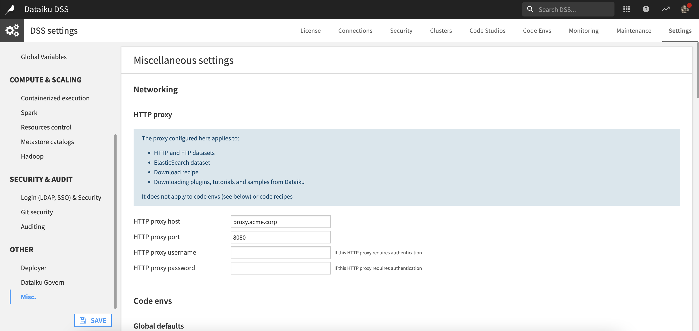

HTTP proxies
####################

.. contents::
    :local:

When to configure HTTP proxies
=================================

You may want to configure your DSS instance to work with HTTP proxies when either of the following scenarios applies:

* Your users need to go through a (direct) proxy to reach the DSS interface. In this scenario, your proxy **must** support the :ref:`WebSocket protocol <proxy.websockets>`, and allow long-lived WebSocket connections.

* DSS is installed on a server without direct outgoing Internet access and a proxy is required to reach external resources. For configuration steps, visit :ref:`proxy`.

.. note::

    This must not be confused with the ability to deploy DSS behind a reverse proxy. See :doc:`/installation/custom/reverse-proxy` for more details.

.. _proxy.websockets:

About WebSocket
======================

DSS uses the WebSocket protocol for parts of its user interface. The WebSocket protocol may not be supported by all HTTP proxies.

Ensure any direct or reverse proxy configured between DSS and its users correctly supports WebSocket, and is configured
accordingly.

At the time of writing, this includes:

* nginx version 1.3.13 and above (see `nginx websocket proxying <http://nginx.org/en/docs/http/websocket.html>`_)

* Apache 2.4.5 and above (with `mod_proxy_wstunnel <http://httpd.apache.org/docs/2.4/mod/mod_proxy_wstunnel.html>`_)

* Amazon Web Services `Application Load Balancer <https://aws.amazon.com/elasticloadbalancing/applicationloadbalancer/>`_

See :doc:`/troubleshooting/problems/websockets` for related details and troubleshooting advice.

.. _proxy:

Configuring a global proxy to allow DSS to access external resources
=====================================================================

Routing all requests initiated by the DSS backend through a proxy
------------------------------------------------------------------

To route all requests initiated by the DSS backend through the proxy, you'll need to configure the HTTP Proxy settings in the Administration menu. 

* Go to the **Administration** menu, select the **Settings** tab, and then open the **Misc.** panel.
* In **HTTP proxy**, supply the proxy host and port.
* Optional: If the HTTP proxy requires authentication, supply the username and password.

Adding the proxy settings here will route all requests initiated by the DSS backend through the proxy. 

Configuring a proxy for external HTTP-based or FTP-based network resources (for remote datasets)
-------------------------------------------------------------------------------------------------

If DSS runs inside your private network, you may need to configure an outgoing proxy to allow DSS to access external HTTP- or FTP-based network resources.

This applies in particular to HTTP, HTTPS and FTP remote datasets, and Amazon S3, Google Cloud Storage, Azure Blob, Snowflake, BigQuery and Elasticsearch datasets.

You can define a global proxy configuration for DSS in the **Setting** tab of the Administration page. Choose **Proxy**, fill in the fields, and save your changes.

Every HTTP(S)- and FTP-based connection will now have an additional "Use global proxy" checkbox. Clear the checkbox if the connection should not go through the proxy (e.g., for services that are inside your private network). This also applies to Amazon S3, GCS, Azure Blob, Snowflake, BigQuery, and Elasticsearch connections.

.. note::

  SOCKS proxies are not supported in DSS.

.. warning::

    **A note on FTP through HTTP Proxy**

    Connecting to a FTP server through an HTTP proxy requires passive mode, and requires
    the proxy to allow and support HTTP ``CONNECT`` method on ports 20, 21 and
    all unpriviledged ports (1024-65535).

    Below is a sample Apache 2.4 configuration for this:

    .. code-block:: apache

        Listen 3128
        <VirtualHost *:3128>
          ProxyRequests On
          ProxyVia On
          AllowConnect 20 21 443 1024-65535
          <Proxy *>
            Order deny,allow
            Deny from all
            # IP of internal network
            Allow from 1.2.3.4
          </Proxy>
        </VirtualHost>

Configuring a proxy for Python and R processes
-----------------------------------------------

Configuring access to external HTTP-based or FTP-based network resources only applies to native connections made from the Data Science Studio backend. 

If you need to go through a proxy for network connections done from Python or R code (from a recipe or a notebook), you should configure the proxy using standard configuration directives for these environments. This includes adding explicit proxy parameters to the network calls, e.g., for Python requests:

.. code-block:: python

  requests.get(URL, proxies={'http', 'http://MYPROXY:MYPROXYPORT'})

and/or globally configuring proxy directives through the standard ``http_proxy`` (``https_proxy``, ``ftp_proxy`` ...) environment variables, e.g.:

.. code-block:: bash

  # Add the following directive to DATADIR/bin/env-site.sh
  # or to the session initialization file of the DSS Unix user (.profile or equivalent)
  export http_proxy="http://MYPROXY:MYPROXYPORT"

Refer to Python or R reference manuals for details.

.. note::

  This also applies to network accesses needed to download and install additional Python or R packages.

Configuring DSS to trust a certificate authority
-----------------------------------------------------------

DSS may reside in a network that uses a cloud-based proxy as a man in the middle (MITM) proxy. In this case, DSS will need to trust the Certificate Authority of that proxy, as it will sign the communication that comes back to DSS.

The most efficient way to do this is via the system’s global trust store:

* As root, copy the certificates that need to be trusted to /etc/pki/ca-trust/source/anchors
* Again as root, run the **update-ca-trust** command
* Finally, as the user running DSS, restart the application using the **DATA_DIR/bin/dss restart** command

For Python or PIP processes that may need to trust the certificate of a MITM proxy, the REQUESTSCABUNDLE environment variable can be used.

.. code-block:: bash

 # Add the following directive to DATADIR/bin/env-site.sh
 # or to the session initialization file of the DSS Unix user (.profile or equivalent)
 export REQUESTSCABUNDLE=/path/to/CA_to_TRUST

