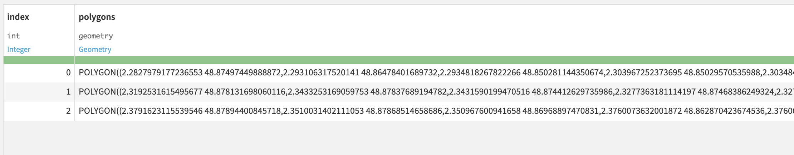
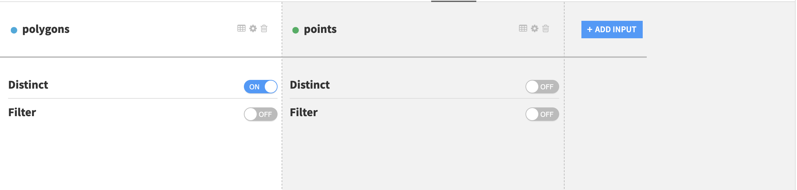
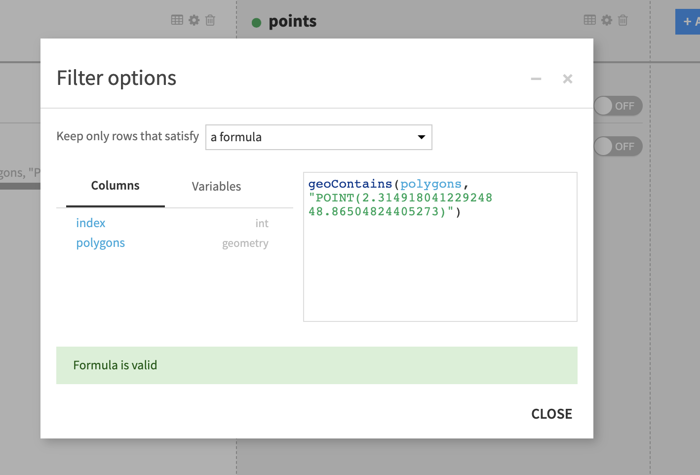
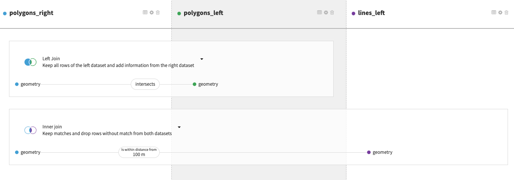
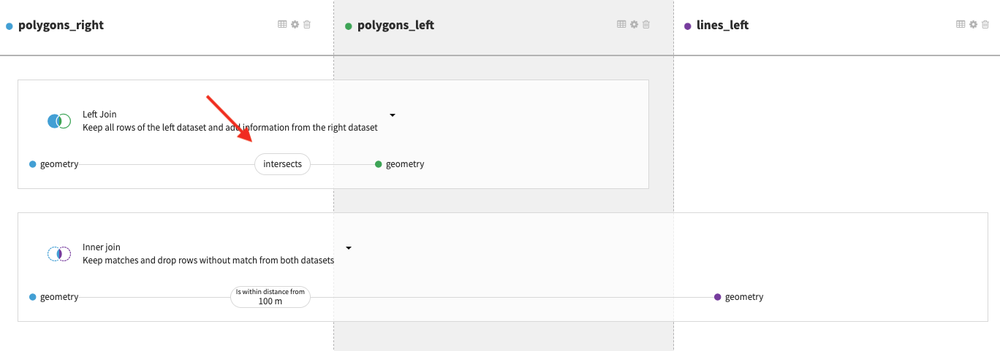
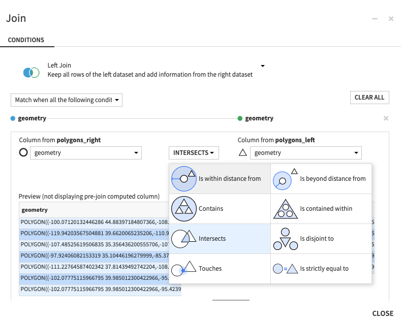
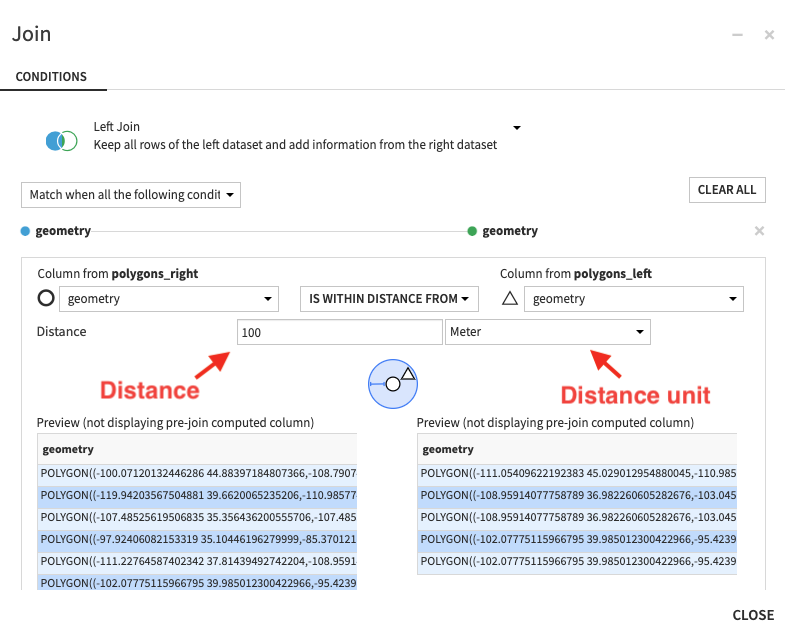
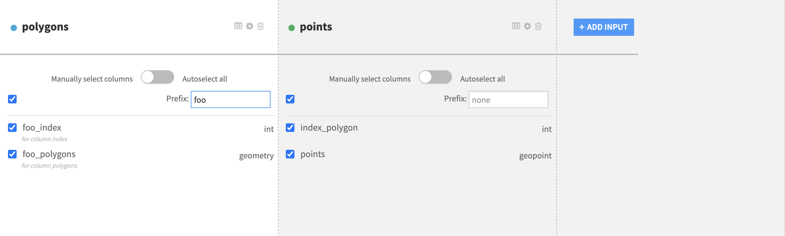
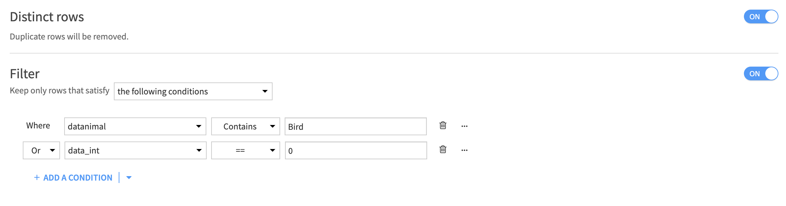

.. _visual-recipes-geojoin:

Geo join: joining datasets based on geospatial features
##########################################################

.. contents::
	:local:

The Geo join visual recipe allows you to perform a join between two (or more) datasets based on geospatial matching conditions.

This visual recipe offers multiple geospatial matching conditions. Join clauses can be chained together to perform join operations on many input datasets. Matching conditions can be combined to perform complex operations. Like other join recipes in DSS, join types (INNER, LEFT, RIGHT, FULL or CROSS) are defined for each individual join clause.

.. seealso::
    For more information, see also the following articles in the Knowledge Base:
    
    - `Concept | Geo join recipe <https://knowledge.dataiku.com/latest/data-preparation/visual-recipes/concept-geo-join-recipe.html>`_
    - `Tutorial | Geo join recipe <https://knowledge.dataiku.com/latest/data-preparation/visual-recipes/tutorial-geo-join-recipe.html>`_

Building a Geo join recipe in the flow
========================================

To create this recipe, either click on the Geo join icon in the right tab, or select several datasets from the flow and then click on the Geo join icon. All datasets involved in the join should have at least one geospatial column.

Geometry storage types in DSS
------------------------------

In DSS, geometries are stored as String using the following storage types: geometry and geopoints. These are the two only types that can be used to store geospatial values in DSS. The geometry is expressed through `WKT format <https://en.wikipedia.org/wiki/Well-known_text_representation_of_geometry>`_.

Note that, as for other features of DSS, all geometries are expressed in the SRID 4326. Therefore, before manipulating any geospatial data in DSS, it is mandatory to project in this SRID. No metadata is required and won’t be read.

Compose join through matching conditions
------------------------------------------

The main join condition menu displays several 1-to-1 join relationships between datasets, referred to as join clauses. Each join clause is a combination of individual (geospatial) matching conditions.

When the recipe is created, DSS will analyze the list of columns of joined datasets trying to find the best pairs of columns that can match. This will result in a list of default join conditions.

Matching conditions can be added using the “+” button, and removed by clicking on the “Remove” button. While specifying the matching conditions, the user may change joined columns. The dropdowns will show only geospatial columns (point or geometry types) corresponding to each dataset.

After setting the full set of join clauses and defining the join relationships between the input datasets, go to the “Selected Columns” section of the recipe (left panel), to select the columns of each dataset that will be kept in the single output dataset. The column names of the output dataset should not be duplicated. To de-duplicate the output column names in the output dataset, each dataset comes with an optional prefix input form that can be filled to associate a prefix with input datasets.

Detailed recipe configuration steps
=====================================

Pre-filters
---------------

A pre-filter can be configured for each dataset.

The filters documentation is available :doc:`here  <../other_recipes/sampling>`.

The distinct option will remove duplicated rows of the dataset in order to keep only distinct rows for the recipe to consider. This option can be useful to reduce computation time or get rid of unnecessary rows in the output dataset.

The filter option enables custom selection of the rows that will be considered for the join.

geoContains() formula
**********************

Sometimes it can be useful to only work with a certain part of the map, for example a dataset has a column called ``geom`` containing points and it's required that all of the points are within a given area. In this case one can use a ``geoContains`` formula in a prefilter:
``geoContains("POLYGON(...)", geom)`` where the first argument is a WKT representation of the polygon limiting the area of interest.

The dataset column name can equally be used as a first argument, for example the following filter will filter only the rows where the value of the column polygons is a polygon (WKT geometry) containing the geopoint POINT(2.32 48.86). In this context “containing” has a geospatial meaning. (See related definition of the `ST_Contains function in PostGIS <https://postgis.net/docs/ST_Contains.html>`_ )

.. note::

    The opposite to **geoContains** is the **geoWithin** operator.

Join clause selection and matching conditions
-----------------------------------------------

Each pair of input dataset can be joined on one or several matching conditions on geospatial features. The definition of the join clause and the matching conditions appears in the Join panel of the left tab of the recipe.

There can be multiple datasets in the join operation as long as all of the datasets contain at least one geospatial column on which the join is to be applied.

Click on the matching condition (displayed on the image below) to change or add a matching condition. For example here, we have one join clause between datasets polygons and polygons_copy where the matching condition is an equality of the geometries and one other join clause between datasets polygons and lines.

Clicking on one of the matching conditions of a join clause displays the join submenu. The selection of the join type and of the set of matching conditions will be done in this menu.

There are several ways to match geospatial features based on operators.

Geospatial matching operators
-------------------------------

Full list of available geospatial operators:

- `Contains <https://postgis.net/docs/ST_Contains.html>`_
    - Not symmetrical

- `Is contained <https://postgis.net/docs/ST_Within.html>`_
    - Not symmetrical

- `Within a distance <https://postgis.net/docs/ST_DWithin.html>`_
    - Symmetrical
    - Additional parameter for the distance

- Beyond a distance: Opposite of Within a distance
    - Symmetrical
    - Additional parameter for the distance

- `Intersects <https://postgis.net/docs/ST_Intersects.html>`_
    - Symmetrical

- `Touches <https://postgis.net/docs/ST_Touches.html>`_
    - Symmetrical

- `Disjoint <https://postgis.net/docs/ST_Disjoint.html>`_
    - Symmetrical

- `Strict Equality <https://postgis.net/docs/ST_Equals.html>`_
    - Symmetrical

Operators Within a distance and Beyond a distance require an additional distance parameter. The available units for this distance are: Meter, Kilometer, Foot, Yard, Mile, Nautical Mile.

Selected columns
-----------------

Redefine schema of the output dataset if needed, de-duplicate column names and select only the columns that need to be in the output dataset. If all columns of a dataset are to be in the output dataset, click the Autoselect all toggle.

Post-Filtering
-----------------

The post-filtering option provides the same options as in pre-filtering but this time applied only on the output dataset. The two types of processing remain the same: Distinct and Filter.

Selected engine
-----------------

The Geo join recipe can run either in a DSS engine or in SQL databases. Based on the input connections the available engines differ.
The supported databases include:

* `PostGIS <https://postgis.net/>`_ (PostgreSQL extension)
* Snowflake

Enabling PostGIS extension in DSS
---------------------------------

`PostGIS <https://postgis.net/>`_ database can be used when SQL engine is selected in the recipe settings. In this case the join will be done on the database side.

Refer to :ref:`PostGIS integration <postgis-integration>` for more information about PostGIS support in DSS.

Spatial indexes on SQL databases
--------------------------------

When running the GeoJoin recipe using a SQL engine like PostGIS, use of spatial indexes is strongly recommended to improve performance of the join. However, no index will be created by default when running the recipe.

In order to automate the creation of the spatial indexes, use a post-write statement.
Go to `Dataset > Advanced > Post-Write Statement` to create spatial indexes each time the target dataset is updated.

In order to improve performance of the geojoin recipe, a geospatial index on each column involved in the join operation must be created.
Such index can be created by executing the following SQL statement in the database hosting the datasets for every column involved in the join:

.. code-block:: sql

    CREATE INDEX "idx_name" ON "dataset_name" USING GIST ((ST_SETSRID("geometry_column", COALESCE(NULLIF(ST_SRID("geometry_column"), 0), 4326))));

Where:

- ``idx_name`` is the name of the index (must be unique)
- ``dataset_name`` is the name of the dataset
- ``geometry_column`` is the name of the dataset column containing the geometry used for the join operation

The SRID must be set to 4326.

Troubleshooting
===============

Side location conflict
----------------------

Errors like ``side location conflict [ (15.299400817384745, 37.08743007526999, NaN) ]``) occur when a MULTIPOLYGON geometry contains overlapping polygons.

.. note::
    
    According to the Open Geospatial Consortium documentation, *the interiors of 2 Polygons that are elements of a MultiPolygon may not intersect*.

DSS provides the `geoMakeValid formula function <https://doc.dataiku.com/dss/latest/formula/index.html#geometry-functions>`_ that can fix invalid geometries (for instance by merging two overlapping polygons into one). You can run a prepare recipe either on DSS engine or directly on a PostGIS database with a formula step in order to apply this function before the geojoin recipe.

