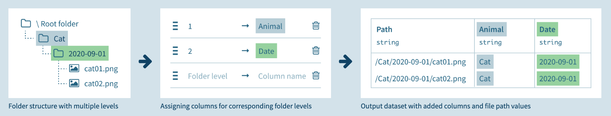

List Folder Contents
####################

The "List Folder Contents" recipe lets you list all the files contained in a folder into a dataset, along with some information about the file and possibly extracting parts of the path into extra columns.

This recipe is useful to create the input dataset for :doc:`/machine-learning/computer-vision/index` or :doc:`/machine-learning/labeling` from the input images folder.

Output columns
==============

You can select the information to retrieve about each file in the folder:

* *path* to the file in the folder
* *basename* filename without the extension
* *extension* of the file
* *last_modified* date
* *size* of the file in bytes

Folder level mapping
====================

Use this mapping to output extra columns containing the name of specific levels in the folder hierarchy.

Levels start at 1 and negative levels are relative to the end of the folder hierarchy.

For example:

