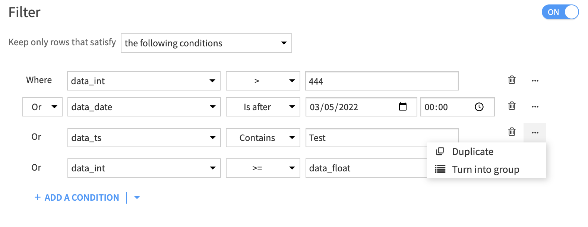
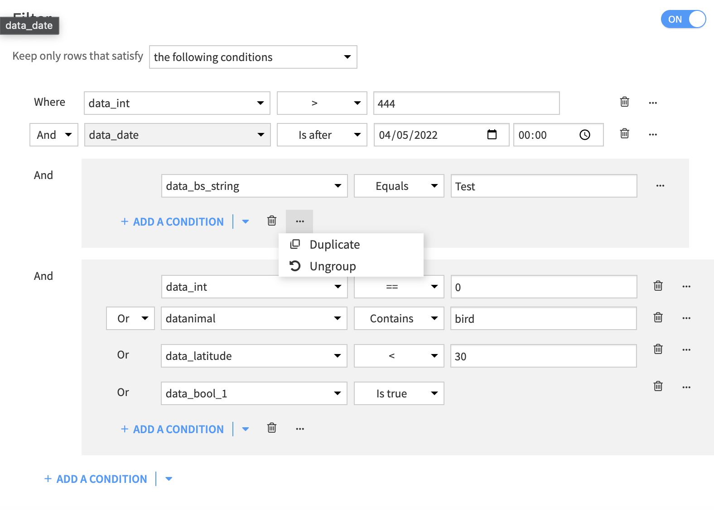
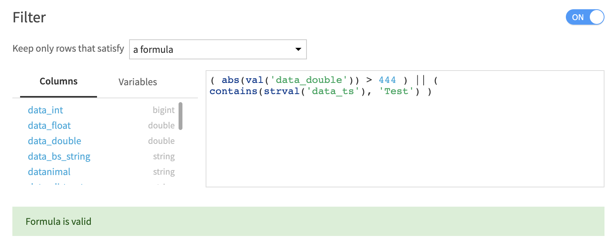
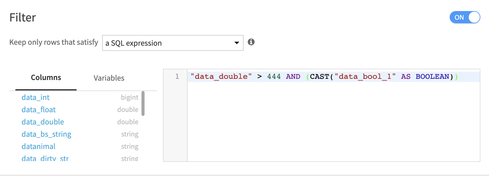

.. _visual-recipes-sampling:

Sampling datasets
#################

.. contents::
	:local:

The "sample/filter" recipe serves the dual purpose of sampling and/or filtering dataset.

.. seealso::
    For more information, see the `Concept | Sample/Filter recipe <https://knowledge.dataiku.com/latest/data-preparation/visual-recipes/concept-sample-filter-recipe.html>`_ article in the Knowledge Base.

=======

Filtering in DSS
========================================

4 types of filtering are available and can be selected using the top dropdown menu :

- Rules based
- Formula based
- SQL expression based
- Elasticsearch query string (only available when the input dataset is on Elasticsearch v7 and above or OpenSearch)

.. _rules-based-filters:

Rules based filters
**********************
A filter is defined by a list of possibly grouped conditions and the boolean operators that bind them.

Conditions
~~~~~~~~~~~~
A Condition is defined by an input column, an operator, and a value.

- Input column : choose any column from the dataset.
- operator : choose an operator from the dropdown menu. The available operators match the storage type of the column. (a string column will have string operators available, such as ``contains``, while a number column will have numerical operators available, such as ``<``).
- value : input a value or choose an existing column to apply the operator to.

Conditions can be added, deleted, duplicated, and turned into a group to create advanced conditions.

Groups
~~~~~~~~~~~~
Groups can be used to create advanced logic for conditional statements.
Groups can be nested to create sub-conditions ``(y AND z AND (t OR u)))`` or defined at the same level ``(y OR z) AND (t OR u)``.
Groups can be added using the +ADD > Add group button, deleted, duplicated, and ungrouped.

Boolean operators
~~~~~~~~~~~~~~~~~

Conditions and groups are bound using boolean operators, that can be either ``And`` or ``Or``.

Formula based filters
**********************

Formulas are manually defined using functions of the formula language, dataset column names, and project variables. Formulas are well suited for more complex filtering options or specific functions that do not appear in the rules based filter view.
The formula language documentation can be found `here <https://doc.dataiku.com/dss/latest/formula/index.html>`_.

SQL expression based filters
*****************************

When using an SQL based recipe engine, an SQL expression can directly be given to filter the dataset, using dataset columns and project variables.

Elasticsearch query string
***************************

When using an input dataset on Elasticsearch v7 and above or OpenSearch, you can use the `query_string syntax <https://www.elastic.co/guide/en/elasticsearch/reference/8.4/query-dsl-query-string-query.html>`_  to filter the dataset.

.. note::

  When using an Elasticsearch query string, sampling is disabled and filtering is performed on the whole dataset.
