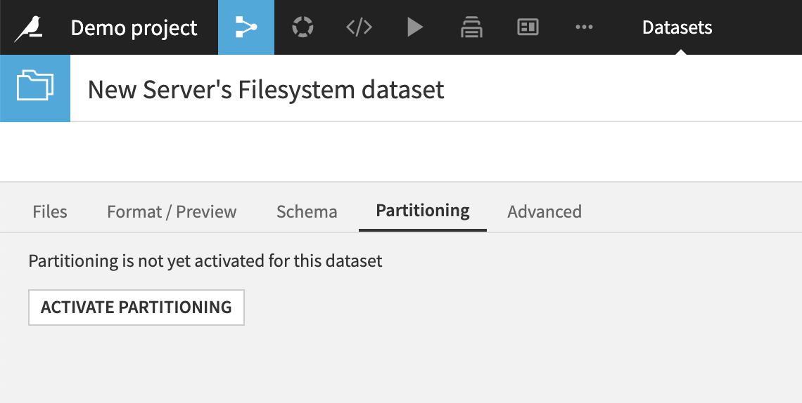
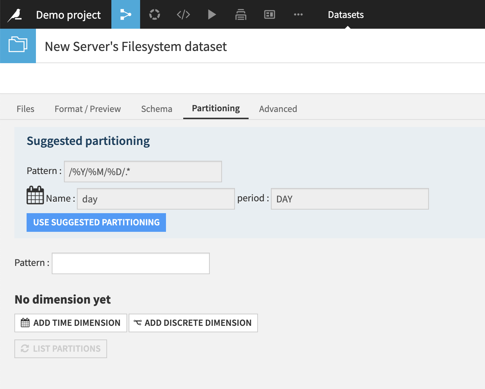
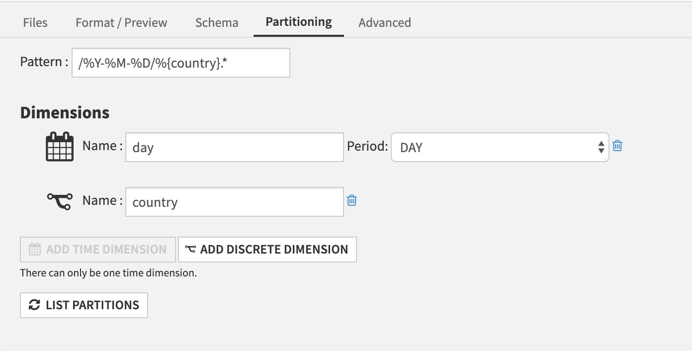
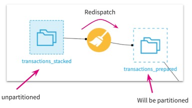

Partitioning files-based datasets
##################################

.. toctree::

All datasets based on files can be partitioned. This includes the following kinds of datasets:

* Filesystem
* HDFS
* Amazon S3
* Azure Blob Storage
* Google Cloud Storage
* Network

On files-based datasets, partitioning is defined by the *layout of the files on disk*.

.. warning::
   Partitioning a files-based dataset cannot be defined by the content of a column within this dataset

For example, if a filesystem is organized this way:

* ``/folder/2020/02/03/file0.csv``
* ``/folder/2020/02/03/file1.csv``
* ``/folder/2020/02/04/file0.csv``
* ``/folder/2020/02/04/file1.csv``

This folder can be partitioned at the day level, with one folder per partition.

Files-based partitioning is defined by a matching pattern that maps each file to a given partition identifier.

For example, the previous example would be represented by the pattern ``/%Y/%M/%D/.*``

Defining a partitioned dataset
------------------------------

You first need to have defined the connection and format params.
Once this is OK and you can see your data, go to the Partitioning tab, and click "Activate partitioning"

Dataiku DSS automatically tries to recognize the pattern.
If it succeeds, a partitioning pattern will be suggested.

To manually define partitioning, first define a time dimension and/or discrete dimensions.

* The time dimension period can be year, month, day or hour.
* You can add multiple discrete value dimensions, each dimension corresponding to a subdirectory in your file structure.

Then, define the pattern.

* The time dimension is referred in the pattern by the ``%Y`` (year, on 4 digits), ``%M`` (month, on 2 digits), ``%D`` (day, on 2 digits) and ``%H`` (hour, on 2 digits) specifiers.  The pattern for the time dimension must represent a valid time hierarchy for the chosen period. For example, if you choose "Day" as the period for the time dimension, then the pattern must include ``%Y``, ``%M``, and ``%D``.

* Each discrete value dimension is referred by the ``%{dimension_name}`` specifier.

The above example defines a partitioning scheme with two dimensions, which would match files:

* ``/2020-02-04/France/file0.csv``
* ``/2020-02-05/Italy/file1.csv``

.. note::
	The initial ``'/'`` is important, as all paths are anchored to the root of the dataset.
	The final ``.*`` is important: it catches all files with the given prefix.

The "List partitions" button inspects the folder and displays which partitions would be generated by the current pattern as well as the files that have not been matched by the pattern (and would then not be part of the dataset).

.. note::
   If 0 partitions are detected, it generally means that the pattern does not match your files.

   More information might be available in the backend log file. See :doc:`/troubleshooting/diagnosing` for more information.

Partition redispatch
--------------------

If you are using a filesystem connection and your files do not map directly to partitions, you can still partition your dataset using Partition Redispatch.

The partition redispatch option is available in the Sync recipe (Configuration tab) and in the Prepare recipe (Advanced tab).

For example, if you have a filesystem dataset made of a singular csv file, it cannot be partitioned as is. The redispatch partition feature solves this problem, as it allows you transform a non-partitioned dataset to a partitioned dataset. Each row of the csv file is assigned to a partition dynamically based on columns.

.. note::
    If you activate the redispatch option in the sync recipe, DSS will read and dispatch each row of the dataset depending on its value in the partitioning column, and will build one partition per distinct value in that column.
    
    Beware that with files-based partitioning, the partition column(s) are removed from the schema. Once the partitioning has been performed, the partitioning columns will no longer be accessible in the recipes.

    Possible workarounds:

    * Before partitioning: Duplicate the column before partitioning the dataset.
    * After partitioning: Add a column labeling the partition for each row via a prepare recipe. To do so, create a prepare recipe and add an “enrich records with files info” step, and fill in the “Output partition column” field.

    .. image:: img/enrich-partitions.jpg
       :align: center
