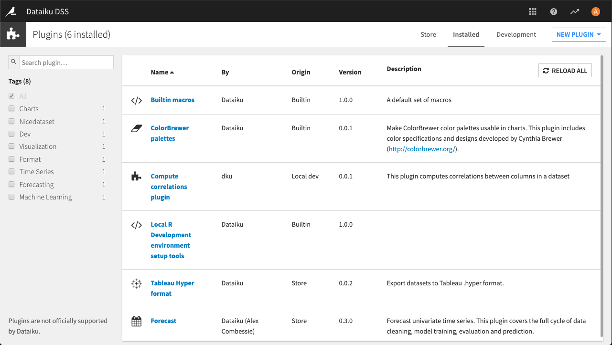
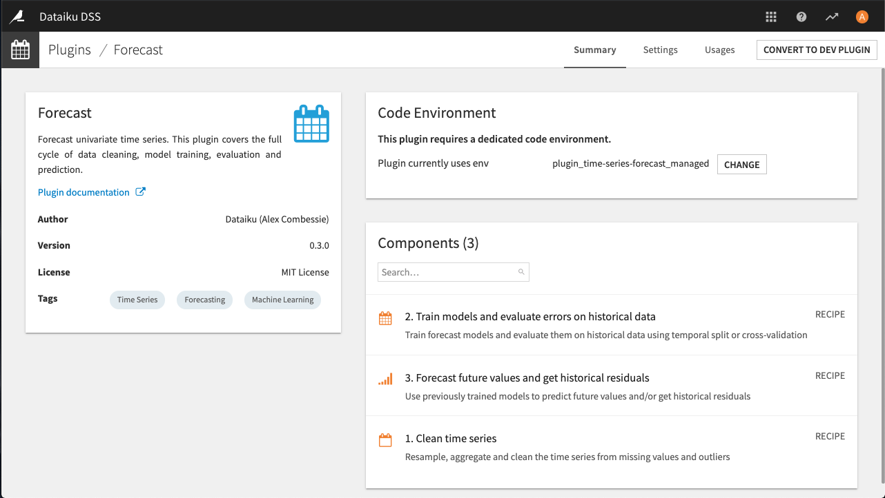

Managing installed plugins
############################

From the **Installed** tab you can browse or search all installed or development plugins.

Click on the name of a plugin to see its details.

- The **Summary** tab displays information about the plugin pulled from the descriptor file, whether it requires a dedicated code environment (and the ability to set that code environment), and a list of components in the plugin.
- The **Settings** tab allows you to specify pre-set parameters for the plugin, if they are used by the plugin.
- The **Usages** tab allows you find all projects that use the plugin, to help you determine whether it's safe to remove a plugin.

.. note::

  Plugins cannot be uninstalled without altering the data directory.  If you must uninstall a plugin, be sure that the plugin is no longer being used on the instance, then delete the ``DATA_DIR/plugins/installed/name-of-a-plugin`` directory.

If the plugin was installed from the store, and you need to modify it in order add or change some functionality that you need, you can convert it to a development plugin.  However, best practice is to `clone a plugin from a Git repository <https://knowledge.dataiku.com/latest/plugins/development/how-to-clone-from-remote-git-repo.html>`_ and share the changes so that the entire plugin developer community can benefit.  

Credential requests
===============================

Some plugins require per-user credentials to access a protected resource, for example an external API. If a plugin requires this type of credential, you must add at least one instance of pre-set parameters in the plugin's Settings tab mentioned above.

Credentials are one of several types:

* Single-field
* Basic (username and password)
* OAuth2

Once a pre-set parameter object has been created, each user will be able to go to their Profile -> Credentials and enter their personal credentials.

.. _plugins.installed.oauth2_credentials:

OAuth2 credentials
-------------------------------

OAuth2 credentials require more configuration than single-field or basic credentials. In order to access an external resource protected by an OAuth2 authorization server, a new client application will need to be registered on the OAuth2 authorization server. The steps for this will vary depending on your provider, however, there is some necessary information that should be consistent across all OAuth2 authorization servers.

When registering a client application, you will likely be required to register a redirect URL (can also be referred to as the callback or reply URL) for the OAuth2 authorization server to be able to redirect a user back to DSS upon a successful login. The DSS OAuth2 redirect URL is ``DSS_BASE_URL/dip/api/oauth2-callback``. For example if DSS is accessed at https://dss.mycompany.corp/, the OAuth2 redirect URL is https://dss.mycompany.corp/dip/api/oauth2-callback.

You will also need to some information from the OAuth2 authorization server when instantiating a preset for an OAuth2 credential request (located in the plugin's Settings). These fields should be found where you registered your client application:

* Client ID
* Client Secret (may be optional)
