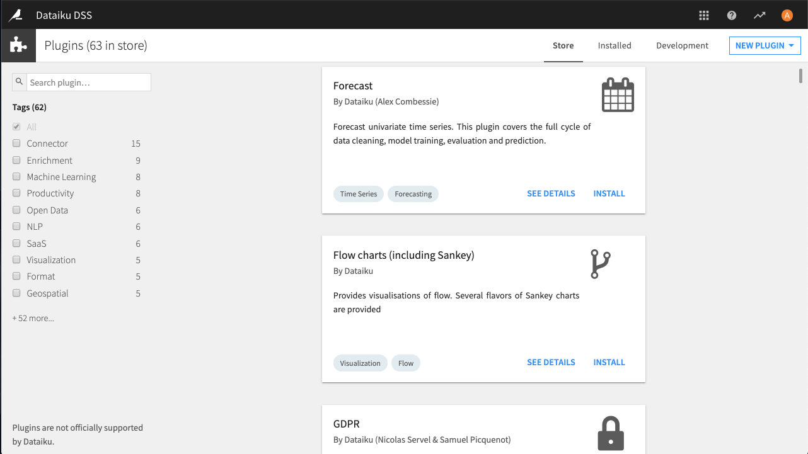

Installing plugins
####################

Users with administrative privileges can install plugins on a Dataiku DSS instance.

.. contents::
  :local:

Installing from the Store
=================================================

You can install published plugins from the store, if your Dataiku DSS instance has HTTPS connectivity to the Internet.

- From the Dataiku DSS Application menu, choose **Plugins**
- Select the **Store** tab
- Browse or Search for the plugin you're looking for
- Click **Install**
- Follow the directions to install the plugin.  If necessary, choose to build a code environment for the plugin
- Only users with :doc:`Admin </security/permissions>` permissions are allowed to install plugins. See :doc:`/collaboration/requests` for more details on how users without these permissions can request an installation instead.

Installing from a ZIP file
===========================

If your Dataiku DSS instance doesn't have Internet access, you need first to obtain the ZIP file of the plugin.

For published plugins, obtain the ZIP file from the `plugins gallery <https://www.dataiku.com/product/plugins/>`_.  Browse or search for the plugin you are looking for and click on the download link in the "Install In DSS" panel on the right side of the plugin's page.

Once you have the the ZIP file:

- From the Dataiku DSS Application menu, choose **Plugins**
- Select **Add plugin > Upload**
- Click **Choose file** and select the ZIP file containing your plugin
- Optionally specify whether this is an update for a plugin you have already installed
- Click **Upload**
- Follow the restart instructions, if any

From a Git repository
=====================================

You can also install a plugin from a Git repository.

When installing a plugin from a Git repository, you can choose between:

* Cloning an entire repository, which must thus contain a single plugin (you'll be able to choose the branch)
* Exporting a subpart of a repository (you'll be able to choose the branch and path)
* Installing it in "development" mode in order to modify it (and possibly push your changes back). See :doc:`reference/git-editor` for further details on the git integration with the plugin editor and :doc:`reference/index` for details on developing plugins

To install a plugin from Git:

- From the Dataiku DSS Application menu, choose **Plugins**
- Select **Add plugin > Fetch from Git repository**
- Enter the URL of the repository; choose whether to use development mode or not; optionally choose which branch to check out, and whether to check out the entire repository or a subdirectory (if the repository contains multiple plugins)

.. note::

  `The code for most publicly available Dataiku plugins <https://github.com/dataiku/>`_ is available in Github repositories. Most plugins are in their own ``dss-plugin-*`` repository and some are in subfolders of the ``dataiku-contrib`` repository.  Also have a look at the `template repository <https://github.com/dataiku/dss-plugin-template>`_ with examples of components and Python unit tests.
