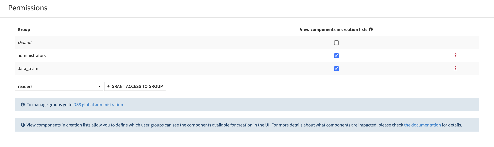

Permissions
###########

Users with administrative privileges can modify plugins permissions on a Dataiku DSS instance.

View components in creation lists
=================================

When checked, the permission named "View components in creation lists" will show all components in the Dataiku DSS UI and when unchecked, certain components will be hidden from creation menus.
As this is a UI setting that only impacts the visibility of items, users will still able to create the components through the Dataiku API.
The permission to see the plugin components can be given to all users (including those not belonging to any group) using the "Default" permission checkbox.
Otherwise, the permission can be given to user groups existing on the Dataiku DSS instance using the dropdown to select the group and then using "+ Grant access to group" button to confirm.

This permission currently impacts the following list of custom plugin components:

- Recipes
- Datasets
- Apps-as-recipes
- Webapp templates
- Sample Datasets
- Macros:

  - Clusters
  - Projects
  - Execute macro scenario step
  - Flow right side panel

- Prepare recipe jython processors
- Scenario triggers
- Scenario steps
- Markdown reports
- Clusters
- Probes
- Checks
- Exporters
- Formats
