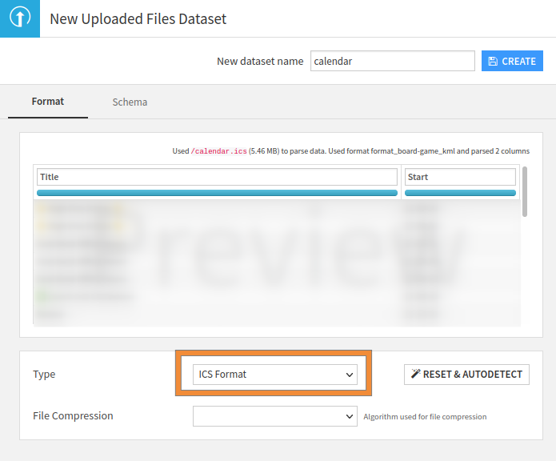
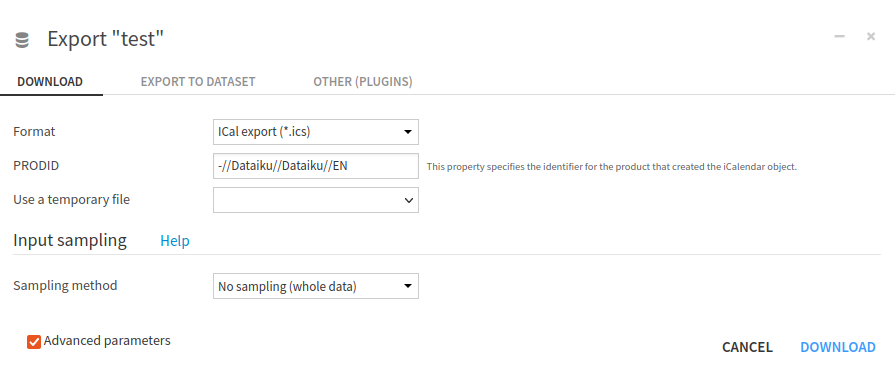

Component: File format
**********************

.. contents::
   :depth: 1
   :local:
   :backlinks: none

Description
###########
Dataiku DSS can read files in various formats.
In case you need to leverage files that are in a format not natively supported by Dataiku DSS, you can develop a
file format plugin. When a file format has been developed, it will be available in the "Upload Dataset" screen, in the
"Format" tab, as shown in the screenshot below, and everywhere you can configure the file format.

.. _refdoc_plugin_file_format_upload_screen:

    
    File format integration.
    
To process dynamic data, for example from an API, consider a dataset plugin instead.

.. comment
    as this documentation does not exist for now, let's just comment
    :doc:`see dataset plugin documentation <./dataset>`.

.. seealso::

    A tutorial on this plugin component is available in the Developer Guide: :doc:`devguide:tutorials/plugins/file-format/index`.

Creation
########

To be able to develop a new file format plugin, go to a development plugin page, click on "+New Component", then
choose "File Format" from the list of components. Choose a name for your component, and click on "Add".

.. note::
    Once this is done Dataiku DSS opens the code editor, allowing you to develop the python code. If your python code
    needs a specific library, do not forget to update your plugin code environment, please see
    :ref:`plugin_managing_dependencies`.

Configuration
######################

A file format plugin is configurable in the associated JSON file (automatically created by Dataiku DSS),
in the folder ``python-format/{<file-format-id>}/format.json``. This JSON configuration file comprises different
parts as shown in the code below.

.. code-block:: javascript
    :caption: Configuration file  of a file format plugin

    {
        // Metadata section.
        "meta": {
            // Metadata used for display purposes.
        },

        // Global configuration about the file format plugin.
        // See below for more information.
        "canRead": true,
        "canWrite": true,

        // Parameter section
        "params": [
            // Parameters definition
        ]
    }

Generic configuration
^^^^^^^^^^^^^^^^^^^^^
For the metadata section, please refer to :ref:`plugin_metadata_section`.

For the parameter section, please refer to :doc:`./params`

Global configuration
^^^^^^^^^^^^^^^^^^^^
For the global configuration, a file format has to define:

.. code-block:: javascript
    :caption: Global configuration of a file format

    /* whether the format can be selectable as a dataset format */
    "canBeDatasetFormat": true|false,

    /* whether the format can be used to read files. If true, the get_format_extractor() must return an extractor */
    "canRead": true|false,

    /* whether the format can be used to write files. If true, the get_output_formatter() must return a formatter */
    "canWrite": true|false,

    /* whether the format can provide the schema without reading the data. If true, the FormatExtractor must implement read_schema() */
    "canExtractSchema": true|false,

    /* to get additional options in the export dialogs, list them here */
    "exportOptions": [
        // options for export see below
    ],

    /* A mime type to use when exporting (if not set: the format is assumed to produce binary data) */
    "mime": {
        /* the mime-type sent to the browser */
        "mimeType": "text/plain",
        /* DSS creates file names by concatenating a unique identifier and this extension */
        "extension": ".txt"
    },

Focus on the export options
^^^^^^^^^^^^^^^^^^^^^^^^^^^
The ``"exportOptions"`` field is the place where you can specify if a dataset can be exported by using this file format.
It is not about exporting a particular dataset, but about providing a new file format exporter, for all datasets.
This obviously requires setting ``"canWrite": true``. Each object in this array will produce a new format available for
download. A generic definition of an ``exportOptions`` object is:

.. code-block:: javascript
    :caption: object of the ``exportOptions``.

    {
        /* Unique identifier for this option */
        "id": "option1",
        /* the label you want to see in the format section of the export */
        "label": "Raw text (*.txt)",
        "predefinedConfig": {
            /* Default values of the parameter (if needed), will overwrite the defaultValue from the parameter */
            "param_id": "value of the param id"
        },
        "compression": "None"
    }

If the ``param_id`` refers to an existing parameter name, then it will be editable in the "Advanced parameters" of the
export window, as shown below. As this export will be available for all existing datasets, the export functions should
be very generic.

    Exporting a Dataset using a File Format export.

Complete example
################

.. code-block:: javascript
    :caption: Complete example of the ``format.json``

    /* This file is the descriptor for the Custom python format ICS */
    {
        "meta": {
            "label": "ICS Format",
            "description": "Import Ical File into Dataiku DSS",
            "icon": "icon-calendar"
        },
        "canBeDatasetFormat": true,
        "canRead": true,
        "canWrite": false,
        "canExtractSchema": true
        "mime": {
            "mimeType": "text/plain",
            "extension": ".ics"
        },
        "exportOptions": [
            {
                "id": "option1",
                "label": "ICal export (*.ics)",
                "predefinedConfig": {
                    "prodid": "-//Dataiku//Dataiku//EN"
                },
                "compression": "None"
            }
        ],
        "params": [
            {
              "name": "prodid",
              "type": "STRING",
              "description": "This property specifies the identifier for the product that created the iCalendar object.",
              "label": "PRODID"
            }
        ]
    }

