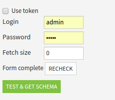

Other topics
#############

.. contents::
	:local:

.. _plugin_managing_dependencies:

Managing dependencies
======================

Packages
---------

Python and R dependencies (packages) are not managed by DSS: the user must ensure that the DSS Python or R environment has the necessary packages.

DSS can however inform the user about dependencies: to do so, add a ``requirements.json`` file at the root of the plugin (besides the ``plugin.json`` file). This file is simply a declaration of the required packages, which is presented to the administrator as soon as he installs the plugin.

A requirements.json file looks like this:

.. code-block:: javascript

	{
	    "python" : [
	        {"name":"pandas", "version":">=0.16.2"},
	        {"name":"sqlalchemy", "version":">=0.1"}
	    ],
	    "R" : [
	        {"name":"dplyr", "version":"1.0.0"}
	    ]
	}

.. _other_code_env:

Code environments
-----------------

A plugin can contain the definition of a code environment to hold the list of packages it requires for its execution. There is only one such definition in a plugin, either Python or R. For a Python code environment, one should setup the following hierarchy in the plugin (use "Add components" on the Definition tab of your development plugin):

.. code::

    plugin root
    +---code-env
        +---python
            |   desc.json
            +---spec
                |   environment.spec  (optional, Conda spec)
                |   requirements.txt
                |   resources_init.py  (optional, code environment resources)

* The ``environment.spec`` and ``requirements.txt`` contain the list of desired packages.
* The resources initialization script ``resources_init.py`` contains the python code to initialize the code environment resources directory. See :ref:`code-env-resources-directory` for more information. 
* The ``desc.json`` file contains the environment characteristics:

.. code-block:: json

    {
        "acceptedPythonInterpreters": ["PYTHON27"],
        "installCorePackages": false,
        "installJupyterSupport": false,
        "basePackagesInstallMethod": "PRE_BUILT",
        "conda": false
    }

Shared code
------------

requirements.json work for "standard" packages that are available in repositories. However, you also often want to share some code between multiple datasets and recipes of the same plugin.

For these files, you can create a ``python-lib/`` folder at the root of the plugin. This folder is automatically added to the PYTHONPATH of all custom recipes and datasets of this plugin. For an example of that, you can have a look at the code of our `Pipedrive connector <https://github.com/dataiku/dataiku-contrib/tree/master/pipedrive-import>`_ .

Code from this folder can also be imported from regular python recipes or notebooks using the following functions. This makes it possible to package python module inside plugins.

.. autofunction:: dataiku.use_plugin_libs

.. autofunction:: dataiku.import_from_plugin

Resource files
-----------------

You may also create a ``resource`` folder at the root of your plugin (besides the plugin.json file) to hold resource files of your plugin (for example, data files).

This resource folder is meant to be read-only. To get the path of the resource folder:

* Python datasets call the :py:meth:`dataiku.connector.Connector.get_connector_resource()` method on ``self``
* Python recipes call the :py:meth:`dataiku.customrecipe.get_recipe_resource` function
* R recipes call the ``dataiku.dkuCustomRecipeResource()`` function

Categorizing recipes and datasets
=================================

You can group your custom recipes and datasets in categories, so that they appear in folders in the recipe and dataset menus.

Add this category in the meta field of your ``plugin.json`` file:

.. code-block:: javascript

    "meta": {
        "label": "Geocoder - internal API",
        "author": "admin",
        "icon": "icon-globe",
        "licenseInfo": "Apache Software License",
        "category": "Geospatial"
    }

.. _custom-settings-ui:

Custom settings UI
==================

By default, DSS will present a form with a field for each parameter defined in the .json of the custom recipe/dataset, but it is possible to have a more elaborate and interactive interface.

Fully custom forms
------------------

The more advanced option is to have a completely custom form by providing 2 parameters in the custom recipe/dataset JSON descriptor :

* in `paramsTemplate` : a .html file in the `resource/` folder at the plugin root
* in `paramsModule` : an optional Angular module, defined in a .js file in the `js/` folder at the plugin root (the name of the file doesn't matter)

The html is loaded with Angular, and the parameter values should be set in the object `config`.

For example, the form from the previous section could be done in a fully custom way with

.. code-block:: html

	

	    <input name="useToken" type="checkbox" ng-model="config.useToken">Use token</input>
	    <label for="login" ng-if="!config.useToken">
	        
Login

	        <input name="login" type="text" ng-model="config.login" style="width: 80px;" />
	    </label>
	    <label for="password" ng-if="!config.useToken">
	        
Password

	        <input name="password" type="password" ng-model="config.password" style="width: 80px;"/>
	    </label>
	    <label for="token" ng-if="config.useToken">
	        
Token

	        <input name="token" type="text" ng-model="config.token" style="width: 80px;"/>
	    </label>
	    <label for="fetchSize" >
	        
Fetch size

	        <input name="fetchSize" type="number" ng-model="config.fetchSize" style="width: 80px;"/>
	    </label>
	    

	        {{checkResult.hasAuthentication == null ? 'Not checked' : (checkResult.hasAuthentication ? 'Form complete' : 'Fill credentials')}}
	        <button ng-click="check()" class="btn btn-default">Recheck</button>
	    

	

and

.. code-block:: javascript

	var app = angular.module('myplugin.module', []);

	app.controller('MyCustomFormController', function($scope) {
	    $scope.checkResult = {};
	    $scope.check = function() {
	        var hasAuthentication = function(config) {
	            return config.useToken ? config.token : (config.login && config.password);
	        };
	        $scope.checkResult = {
	            hasAuthentication : hasAuthentication($scope.config)
	        };
	    };
	    $scope.check();
	});

where the setup in the custom dataset JSON is

.. code-block:: javascript

    "paramsTemplate" : "form.html",
    "paramsModule" : "myplugin.module",

and these parameters can be retrieved in the Python file as usual:

.. code-block:: python

    recipe_config = get_recipe_config()
    use_token = recipe_config.get('useToken', False)
    login = recipe_config.get('login', None)
    password = recipe_config.get('password', None)
    token = recipe_config.get('token', None)
    fetch_size = recipe_config.get('fetchSize', 0)

This produces a form like :

.. warning::

	When using this method, your custom code is loaded in the same frontend namespace as the rest of the DSS UI.

		* Erroneous code may lead to making the DSS UI unusable, which may require administrator intervention.
		* Compatibility between DSS versions is not guaranteed as Dataiku regularly updates its libraries.
		* Importing in your custom code your own versions of some core libraries (AngularJS, jQuery, bootstrap, ...) may
		  lead to making the DSS UI unusable, which may require administrator intervention.

Including additional files
~~~~~~~~~~~~~~~~~~~~~~~~~~

Additional files from the plugin's `resource` folder can be accessed by referencing them with ``/plugins/__plugin_name__/resource/__file_to_get__``.

This is useful to load CSS stylesheets, images, or  html files to use as Angular templates. Typically, one can add a ``<link />`` element to load some CSS rules, like :

.. code-block:: html

	<link href="/plugins/my_plugin/resource/my_form.css" rel="stylesheet" type="text/css">

Fetching data for custom forms
------------------------------

A fully custom form will often need to fetch data to be presented. A simple example would be a way to select one of the values of a given column in the input dataset of a recipe. For this example, code able to read the dataset and compute the list of distinct values is needed.

A custom form can call a ``do()`` method defined in a python file that will get executed on the backend's machine, and will thus have access to the project's data. This ``do()`` method is called from the javascript running in the browser by using the ``callPythonDo()`` method on the Angular scope of the form. The Python file containing the code for the ``do()`` method needs to be in the plugin's `resource` folder, and referenced from the .json in a `paramsPythonSetup` field.

For example, a form asking to choose a column and a value from this column could be done with:

.. code-block:: html

	

	    

	        <label class="control-label">Column</label>
	        
 <!-- basic text field with typeahead for the column selection, as you would get for a COLUMN parameter in a generated form -->
	            <input type="text" ng-model="config.filterColumn" ng-required="true" bs-typeahead="columnsPerInputRole['input_role']"/>
	            Column to filter on
	        

	    

	    

	        <label class="control-label">Value</label>
	        

	            <select dku-bs-select="{liveSearch:true}" ng-model="config.filterValue" ng-options="v for v in choices" />
	            Value to keep
	        

	    

	

.. code-block:: javascript

	var app = angular.module('foobar', []);

	app.controller('FoobarController', function($scope) {
	    var updateChoices = function() {
	    	// the parameter to callPythonDo() is passed to the do() method as the payload
	    	// the return value of the do() method comes back as the data parameter of the fist function()
	        $scope.callPythonDo({}).then(function(data) {
	            // success
	            $scope.choices = data.choices;
	        }, function(data) {
	            // failure
	            $scope.choices = [];
	        });
	    };
	    updateChoices();
	    $scope.$watch('config.filterColumn', updateChoices);
	});

and a Python callback

.. code-block:: python

	from dataiku import Dataset
	from sets import Set

	# payload is sent from the javascript's callPythonDo()
	# config and plugin_config are the recipe/dataset and plugin configured values
	# inputs is the list of input roles (in case of a recipe)
	def do(payload, config, plugin_config, inputs):
	    role_name = 'input_role'
	    # get dataset name then dataset handle
	    dataset_full_names = [i['fullName'] for i in inputs if i['role'] == role_name]
	    if len(dataset_full_names) == 0:
	        return {'choices' : []}
	    dataset = Dataset(dataset_full_names[0])
	    # get name of column providing the choices
	    column_name = config.get('filterColumn', '')
	    if len(column_name) == 0:
	        return {'choices' : []}
	    # check that the column is in the schema
	    schema = dataset.read_schema()
	    schema_columns = [col for col in schema if col['name'] == column_name]
	    if len(schema_columns) != 1:
	        return {'choices' : []}
	    schema_column = schema_columns[0]
	    # get the data and build the set of values
	    choices = Set()
	    for row in dataset.iter_tuples(sampling='head', limit=10000, columns=[column_name]):
	        choices.add(row[0])
	    return {'choices' : list(choices)}
